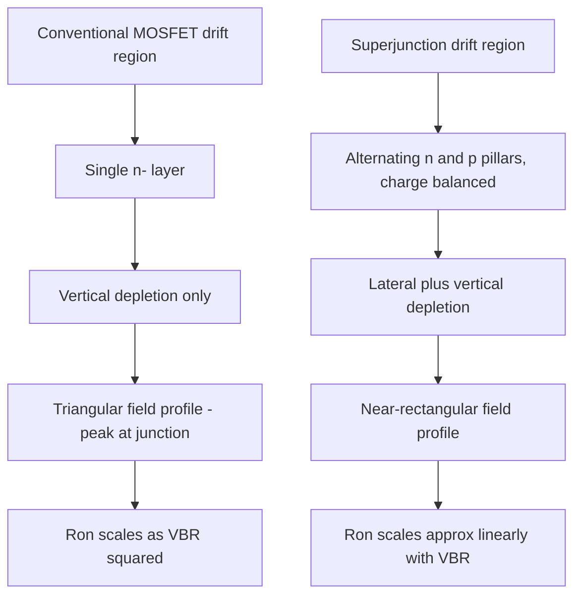

## Superjunction Device Structures

### Overview

Superjunction (SJ) technology is a drift-region engineering technique for power MOSFETs that breaks the conventional silicon trade-off between breakdown voltage and specific on-resistance. Rather than relying on a single lightly doped drift layer to support the blocking voltage, superjunction devices interleave alternating vertical p-type and n-type pillars within the drift region. Under reverse bias, these pillars mutually deplete each other laterally, allowing the vertical drift region to use significantly higher doping concentration than a conventional device at the same breakdown voltage — dramatically reducing on-resistance without sacrificing voltage capability.

### The Conventional Silicon Limit

In a standard vertical power MOSFET, the drift region is a single uniformly doped n- layer. Its doping concentration and thickness must simultaneously satisfy two competing requirements: low doping (for high breakdown voltage, since a more lightly doped region supports a wider depletion width before reaching the critical electric field) and high doping (for low resistance). This trade-off is captured by the classical unipolar limit:

$$R_{on,sp} = \frac{4 V_{BR}^2}{\varepsilon_s \mu_n E_{crit}^3}$$

Because $R_{on,sp}$ scales with $V_{BR}^{2}$, conventional MOSFETs suffer a steep on-resistance penalty as voltage rating increases — this is often called the "silicon limit" and is the central motivation for superjunction architecture at voltages above roughly 500–600V.

### Superjunction Structure

**Basic Geometry**



```
       Source                Gate
|                    |
     [n+]   [n+]          [Gate Oxide]
    -------------------------------------
|  p-body                            |
    -------------------------------------
|  n  | p  | n  | p  | n  | p  | n   |  <-- alternating vertical pillars
|pillar|pillar|pillar|pillar|pillar| |     (charge-balanced drift region)
|     |     |     |     |     |     |
    -------------------------------------
|          n+ substrate              |
    -------------------------------------
                Drain
```

The p-pillars are typically connected to the source/body potential (directly or through the p-body), while the n-pillars carry the on-state drain current. Under reverse bias, depletion regions expand *laterally* from each p-n pillar junction (in addition to the conventional vertical depletion from the body/drift junction), so the entire drift region can be fully depleted at a much lower average net field than in a conventional single-layer drift region.

### Charge Balance Principle

The defining design requirement of superjunction technology is **charge balance**: the total ionized dopant charge in each n-pillar must closely match the total ionized dopant charge in each adjacent p-pillar.

$$Q_n = N_D \cdot W_n \cdot t \approx Q_p = N_A \cdot W_p \cdot t = Q_{balance}$$

where $N_D$, $N_A$ are the n- and p-pillar doping concentrations, $W_n$, $W_p$ are pillar widths, and $t$ is pillar depth (thickness of the drift region). When charge balance is achieved, the pillars mutually deplete each other laterally before either reaches its own critical field vertically, allowing the *entire* drift region to be depleted at a nominal, nearly uniform electric field close to $E_{crit}$ across almost its full length — rather than the triangular field profile of a conventional device, whose peak occurs only at the body/drift junction.

**Resulting Field Profile**

A conventional device has a triangular (linearly decreasing) vertical field profile peaking at the junction. A well-balanced superjunction device achieves a much more rectangular (near-uniform) field profile along the pillar depth, allowing the drift region to be made thinner and more highly doped for the same peak field constraint — this is the fundamental mechanism by which SJ devices decouple $R_{on,sp}$ from the steep $V_{BR}^2$ dependence, achieving instead an approximately linear relationship:

$$R_{on,sp} \propto V_{BR}^{1.0 \text{ to } 1.3}$$

[Inference: the exact exponent depends on specific device generation, pillar aspect ratio, and charge imbalance tolerance — commonly cited industry figures describe superjunction on-resistance improving roughly an order of magnitude over conventional planar MOSFETs at 600V class ratings]

### Charge Imbalance Sensitivity

Superjunction performance is highly sensitive to deviations from perfect charge balance, since manufacturing tolerances (implant dose variation, epitaxial doping non-uniformity, trench-fill density gradients) inevitably introduce some mismatch between $Q_n$ and $Q_p$.

$$\Delta Q = Q_n - Q_p$$

A nonzero $\Delta Q$ leaves residual uncompensated charge that must be depleted vertically in the conventional manner, re-introducing a localized field peak and reducing breakdown voltage below the ideal charge-balanced value. Because of this sensitivity, superjunction breakdown voltage exhibits a characteristic "bell curve" or "M-shaped" dependence on charge imbalance — peak $V_{BR}$ occurs very near perfect balance and falls off sharply on either side. This makes **doping and geometric process control** the central manufacturing challenge for superjunction devices, arguably more critical than for any other mainstream power device architecture.

### Fabrication Approaches

**1. Multi-Epitaxial Growth and Implantation (Multi-Epi)**

The classical and historically first-commercialized method (used in early Infineon CoolMOS generations):

1. Grow a thin n-type epitaxial layer.
2. Implant p-type dopant (typically boron) into the layer at defined pillar locations.
3. Repeat epitaxial growth + implant steps multiple times (often 6–10+ cycles) to build up the full drift region depth.
4. A final high-temperature drive-in diffusion step merges the individual implanted layers into continuous vertical p-pillars.

This method offers precise doping control but is process-intensive and costly due to the repeated epitaxy/implant/anneal cycles.

**2. Deep Trench Etch and Epitaxial Refill**

A more manufacturing-efficient approach adopted by most modern superjunction processes:

1. Grow a single n-type epitaxial drift layer at the target final thickness.
2. Etch deep, narrow trenches (high aspect ratio, often >20:1) into the n-layer at the pillar pitch.
3. Epitaxially regrow p-type silicon to fill the trenches, forming the p-pillars in a single deposition step.
4. Planarize (CMP or etch-back) the surface before proceeding with standard planar or trench-gate MOSFET cell fabrication on top.

This method significantly reduces the number of high-temperature cycles, improving throughput and enabling finer pillar pitch (increasing cell density and thus reducing $R_{on,sp}$ further), but requires advanced high-aspect-ratio trench etch and defect-free epitaxial refill capability.

**3. Trench Sidewall/Angled Implantation**

Dopant is implanted at an angle into the sidewalls of an etched trench (rather than via epitaxial refill), forming the p-pillar directly on the trench wall. This method can reduce process complexity further but faces challenges in achieving deep, uniform doping profiles at aggressive aspect ratios.

### Superjunction Device Types

**SJ Power MOSFET**

The predominant commercial application — planar or trench-gate MOSFET cells built atop a superjunction drift region. Commercial families include Infineon CoolMOS, ON Semi/Fairchild SuperFET, Toshiba DTMOS, and STMicroelectronics MDmesh, generally targeting the 500V–900V range for AC-DC power supplies, PFC stages, and solar/EV charging converters.

**SJ IGBT**

Superjunction concepts have been extended to IGBT drift regions in research and select commercial devices, aiming to combine the conductivity-modulation benefit of bipolar IGBT conduction with the charge-balance drift-region efficiency of superjunction structure, though this combination is less commercially mainstream than SJ MOSFETs. [Unverified: commercial availability and specific performance figures for SJ-IGBT products vary by vendor and are less standardized than SJ-MOSFET offerings]

**SJ Schottky/Merged PiN Schottky (MPS) Diodes**

Superjunction pillar structures applied to diode drift regions to reduce forward voltage drop at a given reverse blocking voltage, analogous in principle to the MOSFET case.

### Switching Behavior Trade-offs

**Output Capacitance ($C_{oss}$) Nonlinearity**

Superjunction MOSFETs exhibit a highly nonlinear $C_{oss}(V_{DS})$ characteristic: capacitance is very high at low drain voltage (pillars not yet fully depleted, behaving like a large-area parallel-plate capacitor between adjacent pillars) and drops sharply once the pillars fully deplete and charge-balance. This nonlinearity:

- Complicates soft-switching (ZVS) converter design, since stored $C_{oss}$ energy at low voltage can be substantial.
- Contributes to a characteristic voltage "ringing" or plateau during turn-off if the resonant tank energy is insufficient to fully discharge $C_{oss}$.

**Reverse Recovery of the Intrinsic Body Diode**

The p-pillar/n-pillar/body structure creates a body diode with a larger effective PN junction area than a conventional planar MOSFET, generally leading to higher reverse recovery charge ($Q_{rr}$) — a known limitation of first/second-generation SJ MOSFETs in hard-switched bridge topologies, driving continued refinement of pillar and body-diode engineering in later generations (e.g., fast-body-diode CoolMOS variants).

### Simplified Depletion Behavior Comparison



### Design Parameters Summary

| Parameter | Effect |
| --- | --- |
| Pillar width ($W_n$, $W_p$) | Narrower pillars → finer charge balance control, higher cell density, lower $R_{on,sp}$, but tighter process tolerance requirements |
| Pillar doping ($N_D$, $N_A$) | Higher doping (with matched charge balance) → lower on-resistance for given pillar width |
| Pillar aspect ratio (depth:width) | Higher aspect ratio → thinner/higher-voltage-capable drift region with same $R_{on,sp}$, but harder to fabricate (trench etch/refill difficulty) |
| Charge imbalance $\Delta Q$ | Must be minimized; determines the achievable peak breakdown voltage and its process-window sensitivity |

### Key Points

- Superjunction technology replaces a single-doping drift region with charge-balanced alternating p/n pillars, enabling lateral depletion that decouples on-resistance from the conventional $V_{BR}^2$ silicon limit.
- The technique reduces the $R_{on,sp}$–$V_{BR}$ relationship from quadratic to approximately linear, delivering roughly an order-of-magnitude on-resistance improvement at 600V-class ratings versus conventional planar MOSFETs.
- Precise charge balance between n- and p-pillars is the single most critical fabrication requirement; imbalance sharply degrades breakdown voltage.
- Deep trench etch with epitaxial refill has become the dominant modern fabrication method, superseding the original multi-epitaxy/multi-implant approach for cost and throughput reasons.
- Trade-offs include a strongly nonlinear $C_{oss}$ characteristic and typically higher body-diode reverse recovery charge compared to conventional MOSFETs.

### Related Topics

- Power MOSFET fundamentals and conventional $R_{DS(on)}$ scaling
- SiC and GaN wide-bandgap devices as complementary/competing high-voltage technologies
- Soft-switching (ZVS/ZCS) converter topologies and their interaction with nonlinear $C_{oss}$
- Deep trench etch and epitaxial refill process technology
- Power factor correction (PFC) converter design using superjunction MOSFETs
- Avalanche ruggedness and unclamped inductive switching (UIS) testing

### Next Steps

- Next-generation superjunction pillar geometries (finer pitch, higher aspect ratio trench processes)
- Superjunction integration with SiC substrates for further performance gains
- Body-diode reverse-recovery optimization techniques in modern SJ MOSFET generations