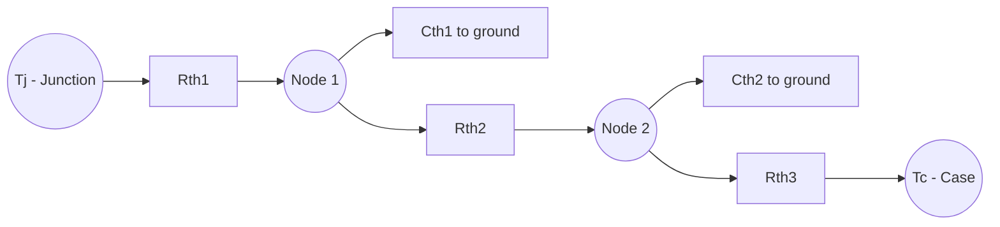

## Thermal Management and Packaging for Power Devices


### Overview

Power semiconductor devices dissipate substantial heat during both conduction (I²R and forward-voltage losses) and switching (transition-region V-I overlap losses), and their electrical performance, reliability, and lifetime are all tightly coupled to junction temperature. Thermal management and packaging design determine how efficiently this heat is extracted from the die and conducted to an ambient heat sink or coolant, while the package itself must simultaneously provide electrical isolation, mechanical support, and interconnection with acceptably low parasitic inductance for fast switching devices. This domain spans die-attach materials, substrate technology, package architectures, and system-level cooling strategies.

### Sources of Heat Generation in Power Devices

**Conduction Losses**

$$P_{cond} = I_{RMS}^2 \cdot R_{on} \quad \text{(MOSFET/superjunction)}$$


$$P_{cond} = V_{CE(sat)} \cdot I_C \quad \text{(IGBT/BJT, approximate)}$$

**Switching Losses**

$$P_{sw} = f_{sw} \cdot (E_{on} + E_{off})$$

where $E_{on}$ and $E_{off}$ are the energy dissipated during each turn-on and turn-off transition (the V-I overlap integral), and $f_{sw}$ is switching frequency. Total device power dissipation is the sum:

$$P_{total} = P_{cond} + P_{sw} + P_{gate}$$

with $P_{gate}$ (gate drive loss, $\approx Q_G \cdot V_{GS} \cdot f_{sw}$) typically negligible for large power devices but non-trivial for high-frequency WBG designs.

### Thermal Resistance Network Model

Heat flow from junction to ambient is modeled analogously to an electrical resistance (and often capacitance) network, using the electrical-thermal analogy: temperature ↔ voltage, heat flow (power) ↔ current, thermal resistance ↔ electrical resistance.

$$T_j = T_a + P_{total} \cdot R_{th(j-a)}$$


$$R_{th(j-a)} = R_{th(j-c)} + R_{th(c-s)} + R_{th(s-a)}$$

where:

- $R_{th(j-c)}$ — junction-to-case resistance (intrinsic to die + package)
- $R_{th(c-s)}$ — case-to-sink resistance (thermal interface material, TIM)
- $R_{th(s-a)}$ — sink-to-ambient resistance (heat sink/cooling system)

**Cauer and Foster Thermal Network Models**

For transient thermal analysis (e.g., during pulsed or short-circuit operation), the single steady-state resistance is replaced by an RC ladder network:



- **Cauer network**: physically meaningful layer-by-layer model (each R-C pair corresponds to an actual physical layer — die, solder, substrate, baseplate); used for detailed multi-layer thermal simulation.
- **Foster network**: mathematically equivalent curve-fit model (no direct physical correspondence per stage) commonly provided in datasheets as $Z_{th(j-c)}(t)$ transient thermal impedance curves, convenient for superposition-based pulse power calculations.

**Transient Thermal Impedance**

$$Z_{th}(t) = \sum_{i} R_i \left(1 - e^{-t/\tau_i}\right), \quad \tau_i = R_i C_i$$

This allows designers to calculate peak junction temperature rise for pulsed loads (e.g., motor starting current, short-circuit events) shorter than the thermal time constant of the package, which would otherwise be overly conservative if only steady-state $R_{th(j-a)}$ were used.

### Package Architecture Layers (Vertical Stack)

**Discrete Through-Hole/Surface-Mount Packages (e.g., TO-220, TO-247, D2PAK)**



```
   Die (Si / SiC / GaN)
   ----------------------
   Die-attach solder/sinter
   ----------------------
   Lead frame / DBC substrate
   ----------------------
   (Isolation layer, if present)
   ----------------------
   Mounting tab / baseplate
   ----------------------
   Case-to-sink TIM
   ----------------------
   Heat sink
```

**Power Module Packages (IGBT/SiC modules — e.g., industrial/automotive modules)**



```
   Die (bonded via solder or sintering)
   ----------------------
   Direct Bonded Copper (DBC) top copper layer
   ----------------------
   DBC ceramic layer (Al2O3 or AlN or Si3N4)
   ----------------------
   DBC bottom copper layer
   ----------------------
   Baseplate solder layer
   ----------------------
   Copper or AlSiC baseplate
   ----------------------
   Thermal interface material (grease/pad/sintered layer)
   ----------------------
   Heat sink / cold plate
```

### Die-Attach Technologies

**Soldering**

The traditional die-attach method using tin-based solder alloys (e.g., SAC — Sn-Ag-Cu). Adequate for moderate junction temperatures (~150°C class) but subject to fatigue cracking under thermal cycling due to CTE (coefficient of thermal expansion) mismatch between die and substrate, and limited by solder's relatively modest melting point and thermal conductivity.

**Silver (Ag) Sintering**

A increasingly dominant die-attach method for high-reliability and high-temperature power modules (especially SiC and GaN, which operate at higher junction temperatures than silicon). A silver nanoparticle or micron-particle paste is pressure- and temperature-sintered (well below silver's bulk melting point) to form a porous but highly conductive and mechanically robust bond.

| Property | Sn-based Solder | Ag Sintering |
| --- | --- | --- |
| Melting/service temp | ~220°C (melting) | >960°C (bulk Ag melting; layer stable well beyond typical device Tj) |
| Thermal conductivity | ~50–60 W/m·K | ~150–250 W/m·K (process-dependent) |
| Thermal cycling fatigue resistance | Moderate | High |
| Process complexity/cost | Lower | Higher (requires pressure, precise process control) |

### Substrate Technologies

**Direct Bonded Copper (DBC)**

A copper layer is directly bonded (via high-temperature eutectic bonding) to both sides of a ceramic insulator, providing electrical isolation between the die/circuit and the (often grounded) baseplate/heat sink while maintaining a low thermal resistance path.

**Ceramic Material Options**

| Ceramic | Thermal Conductivity (W/m·K) | Typical Use Case |
| --- | --- | --- |
| Al₂O₃ (Alumina) | ~24–28 | Cost-sensitive, lower-power modules |
| AlN (Aluminum Nitride) | ~170–180 | High-power modules requiring low thermal resistance |
| Si₃N₄ (Silicon Nitride) | ~70–90 | High mechanical toughness + good thermal conductivity; favored for high thermal-cycling reliability (e.g., automotive traction inverters) |

[Unverified: exact thermal conductivity values vary by grade, purity, and manufacturer specification]

**Active Metal Brazing (AMB) Substrates**

An alternative to DBC using a brazing alloy (typically containing a small amount of active metal like titanium) to bond copper to ceramic, often preferred for Si₃N₄ substrates due to superior bonding reliability and reduced susceptibility to delamination under thermal cycling compared to standard DBC processes on that ceramic.

### Interconnection Technologies

**Wire Bonding**

The traditional interconnection method — aluminum (or increasingly copper) wire bonded from the die top-side metallization to the substrate/leads. Wire bonds are a well-known reliability bottleneck: repeated thermal/power cycling induces bond-wire fatigue and lift-off due to CTE mismatch between the wire material and the die surface, compounded by current-induced Joule heating at the bond foot.

**Advanced Interconnects (replacing/supplementing wire bonds in modern designs)**

- **Copper Clip/Ribbon Bonding**: Flat copper clips or wide ribbons replace round wires, reducing parasitic inductance, lowering resistance, and distributing current more evenly to reduce localized heating.
- **Pressure Contact (Press-Pack) Technology**: Used in very high-power modules (e.g., HVDC, traction); dies are clamped under mechanical pressure between contact plates rather than soldered/wire-bonded, providing double-sided cooling and a fail-short (rather than fail-open) failure mode desirable for series-connected high-voltage stacks.
- **Embedded/Chip-Scale Packaging (common in GaN)**: GaN power ICs increasingly use flip-chip or embedded-die packaging (e.g., QFN-based, LGA) with solder bumps or copper pillars directly connecting die pads to the PCB, eliminating wire bonds entirely to minimize parasitic inductance — critical given GaN's very fast switching edges.

### Cooling Methods

**Air Cooling**

- Natural or forced convection through finned aluminum/copper heat sinks; suitable for lower power density applications.

**Liquid Cooling**

- **Cold plate**: Coolant channels machined or bonded to a metal plate in contact with the module baseplate (indirect cooling).
- **Direct/pin-fin liquid cooling**: The module baseplate itself incorporates pin-fins or micro-channels directly wetted by coolant, eliminating an interface layer and its associated thermal resistance — common in modern automotive traction inverter modules.

**Double-Sided Cooling**

Emerging power module architectures (particularly for EV traction) remove heat from both the top and bottom of the die simultaneously (rather than only through the baseplate), roughly halving the effective thermal resistance path per side and enabling higher power density for a given junction temperature rise.

### Thermal Interface Materials (TIM)

The TIM fills microscopic air gaps between mating surfaces (case-to-heatsink or baseplate-to-coldplate) that would otherwise dominate thermal resistance due to air's very poor thermal conductivity (~0.026 W/m·K).

| TIM Type | Thermal Conductivity (W/m·K) | Notes |
| --- | --- | --- |
| Thermal grease | ~1–8 | Low cost, can pump out/dry over time |
| Phase-change material | ~1–5 | Solid at room temp, liquefies at operating temp for improved wetting |
| Thermal pad (silicone/graphite-filled) | ~1–15 | Easier assembly, more consistent bond line thickness |
| Sintered silver interface | ~150+ | Highest performance, used in advanced module baseplate bonding |

### Reliability Failure Mechanisms Linked to Thermal Design

- **Bond Wire Fatigue/Lift-off**: CTE mismatch-induced fatigue cracking at the wire-to-die bond foot under repeated thermal (power) cycling.
- **Solder Layer Fatigue/Voiding**: Progressive crack propagation through die-attach or baseplate solder layers under thermal cycling, increasing $R_{th}$ over device lifetime.
- **Delamination**: Separation at material interfaces (DBC ceramic-copper, baseplate-substrate) due to CTE mismatch stress, sharply increasing local thermal resistance.
- **Thermal Runaway**: A positive feedback loop where rising junction temperature increases leakage current or (in bipolar devices) reduces forward voltage drop margin, further increasing power dissipation and temperature — most concerning in parallel-connected devices with negative temperature coefficient behavior in the relevant operating region.

**Power Cycling vs Thermal Cycling Distinction**

- **Power cycling**: Rapid, localized junction temperature swings from device switching/load current changes (seconds to minutes timescale) — primarily stresses die-level bonds (wire bonds, die-attach).
- **Thermal cycling**: Slow, whole-module temperature swings from ambient/environmental changes (hours timescale, e.g., day-night or seasonal) — primarily stresses larger-scale interfaces (baseplate-substrate solder, substrate-ceramic bonds).

### WBG-Specific Thermal Packaging Considerations

SiC and GaN devices, owing to their higher achievable junction temperatures and higher switching frequencies, place distinct demands on packaging:

- **SiC**: Can theoretically operate at junction temperatures exceeding 200°C, but the package (die-attach, wire bonds, encapsulant) often becomes the limiting factor rather than the die itself — driving adoption of sintered silver die-attach and high-temperature-rated encapsulants/substrates to fully exploit SiC's thermal headroom.
- **GaN**: Typically packaged in low-inductance, wire-bond-free chip-scale formats; because GaN-on-Si devices have a thermally resistive silicon/buffer stack beneath the active 2DEG region, thermal design must account for lateral heat spreading limitations distinct from the vertical heat flow assumed in conventional discrete/module thermal models.

### Key Points

- Junction temperature is governed by a thermal resistance (or transient RC) network from junction through case, TIM, and heat sink to ambient; transient thermal impedance ($Z_{th}$) curves are essential for pulsed/short-circuit thermal design.
- Die-attach technology is shifting from tin-based solder toward silver sintering for higher thermal conductivity and thermal-cycling reliability, particularly for SiC/GaN devices operating at higher temperatures.
- DBC (and AMB for Si₃N₄) substrates provide the electrical isolation and thermal conduction path between die and baseplate; ceramic choice (Al₂O₃, AlN, Si₃N₄) trades cost, thermal conductivity, and mechanical robustness.
- Wire bonding remains dominant but is being supplemented or replaced by copper clips, press-pack, and chip-scale/embedded packaging to reduce parasitic inductance and improve reliability, especially for fast-switching WBG devices.
- Power cycling and thermal cycling stress different physical interfaces within the package and require distinct reliability qualification approaches.

### Related Topics

- IGBT and power MOSFET switching loss physics (source of the heat being managed)
- SiC and GaN device design (drivers of advanced packaging requirements)
- Power module reliability testing standards (e.g., AQG 324, JEDEC JESD)
- PCB and busbar layout for parasitic inductance minimization in fast-switching converters
- Double-sided cooling architectures for EV traction inverter modules
- Thermal simulation methodologies (FEA, compact RC modeling)

### Next Steps

- Detailed reliability qualification standards and accelerated life testing methodologies for power modules
- Emerging embedded/3D packaging architectures for ultra-high-power-density converters
- System-level cooling architecture design (cold plate sizing, coolant flow rate calculations)