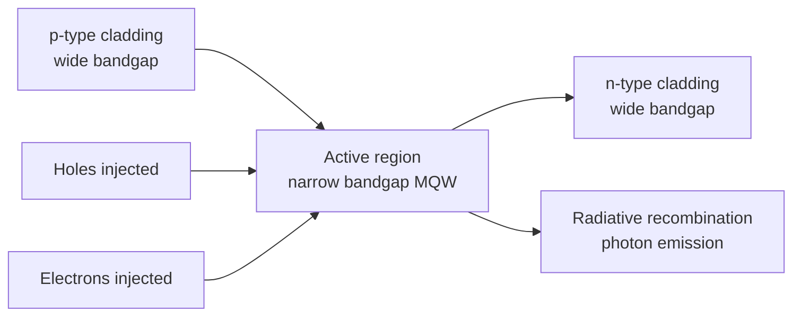

## Light Emitting Diode Physics

### Fundamental Operating Principle

A light emitting diode (LED) is a p-n junction semiconductor device that emits incoherent light through spontaneous radiative recombination of electrons and holes under forward bias. When forward-biased, the built-in potential barrier is reduced, allowing majority carriers to be injected across the junction as minority carriers into the opposite region, where they recombine with the local majority carriers.

The fundamental process is **electroluminescence**: the direct conversion of electrical energy into photon emission via carrier recombination, as opposed to thermal (incandescent) or discharge-based (fluorescent) light generation.

### Direct vs. Indirect Bandgap Requirement

**Key Points**

- LEDs require **direct bandgap** semiconductors, where the conduction band minimum and valence band maximum occur at the same crystal momentum ($k$) value.
- In direct bandgap materials, an electron can recombine with a hole and emit a photon while conserving both energy and momentum, since the photon carries negligible momentum.
- In indirect bandgap materials (e.g., Si, Ge), recombination requires a phonon to conserve momentum, making radiative recombination a much lower-probability, higher-order process. This is why silicon does not function as an efficient LED material.

Common direct-bandgap LED materials include GaAs, GaN, InGaN, AlGaInP, and GaP-based alloys, chosen according to the target emission wavelength.

### Emission Wavelength and Bandgap Energy

The emitted photon energy corresponds approximately to the semiconductor bandgap energy $E_g$:

$$E_{photon} \approx E_g = h\nu = \frac{hc}{\lambda}$$

Rearranged for practical use, wavelength in nanometers relates to bandgap in eV as:

$$\lambda(nm)=\frac{1240}{E_g(eV)}$$

This relation allows direct engineering of emission color through bandgap selection or alloy composition tuning (e.g., varying In content in $In_xGa_{1-x}N$ shifts emission from UV through green).

| Material System | Typical $E_g$ (eV) | Emission Range |
| --- | --- | --- |
| GaAs | ~1.42 | Infrared (~870 nm) |
| AlGaAs | 1.4–2.2 | Red to IR |
| GaAsP | 1.8–2.2 | Red to yellow |
| GaP:N | ~2.26 | Green |
| InGaN | 2.0–3.4 | Blue to green |
| AlGaInP | 1.9–2.3 | Red to yellow |
| AlGaN/GaN | 3.4–6.2 | UV |

### Carrier Injection and Recombination Mechanisms

Under forward bias $V_F$, the quasi-Fermi levels split, and minority carrier concentrations at the junction edges increase exponentially:

$$n_p(0) = n_{p0}e^{qV_F/kT}$$

Recombination within the depletion region and adjacent diffusion lengths occurs through several competing channels:

- **Radiative recombination**: direct band-to-band recombination emitting a photon; the desired process, with rate $R_{rad} = Bnp$, where $B$ is the radiative recombination coefficient.
- **Shockley-Read-Hall (SRH) recombination**: non-radiative recombination via deep-level trap/defect states in the bandgap; dominant at low injection and in defective material.
- **Auger recombination**: non-radiative three-carrier process where recombination energy is transferred to a third carrier as kinetic energy; becomes significant at high carrier densities, contributing to **efficiency droop** in high-power LEDs (notably InGaN blue LEDs).

### Internal Quantum Efficiency

The internal quantum efficiency (IQE) quantifies the fraction of injected carriers that recombine radiatively:

$$\eta_{IQE} = \frac{R_{rad}}{R_{rad}+R_{SRH}+R_{Auger}} = \frac{Bn^2}{An+Bn^2+Cn^3}$$

where $A$, $B$, $C$ are the SRH, radiative, and Auger coefficients respectively (the "ABC model"). This model explains **efficiency droop**: at low current density, SRH recombination ($An$) dominates losses; at high current density, Auger recombination ($Cn^3$) dominates, producing a peak IQE at intermediate injection levels.

### Double Heterostructure and Quantum Well Design

Modern high-efficiency LEDs do not rely on a simple homojunction. Instead, they use **double heterostructures (DH)** or **multiple quantum wells (MQWs)**:

- A narrower-bandgap **active layer** is sandwiched between two wider-bandgap **cladding/barrier layers**.
- This creates a potential well that confines both electrons and holes spatially within the active region, dramatically increasing carrier density overlap and radiative recombination probability.
- The bandgap discontinuity also provides **optical confinement**, since the refractive index is typically higher in the lower-bandgap active layer, aiding waveguiding of generated light.
- In MQW structures (e.g., InGaN/GaN wells for blue LEDs), quantum confinement effects shift and narrow the emission spectrum and improve carrier confinement against leakage/overflow into cladding layers, which otherwise reduces droop-related efficiency loss.

### Light Extraction Efficiency

Even with high IQE, **external quantum efficiency (EQE)** is limited by light extraction:

$$\eta_{EQE} = \eta_{IQE} \times \eta_{extraction}$$

Extraction is limited primarily by **total internal reflection (TIR)** at the semiconductor-air interface, governed by the critical angle:

$$\theta_c = \sin^{-1}\left(\frac{n_{air}}{n_{semi}}\right)$$

Since semiconductor refractive indices (e.g., $n \approx 2.5$ for GaN) are much higher than air ($n=1$), only a narrow escape cone permits direct transmission; the rest undergoes TIR and is reabsorbed or lost. Common mitigation techniques:

- **Surface texturing/roughening**: randomizes reflection angles to increase escape probability across multiple bounces.
- **Chip-scale packaging with encapsulants**: index-matching epoxy/silicone domes reduce the refractive index mismatch and increase the escape cone.
- **Flip-chip and vertical-chip geometries**: redirect emission away from absorbing substrates (e.g., removing/reflecting off the opaque original growth substrate in GaN-on-sapphire designs).
- **Photonic crystal structures**: periodic surface patterning to suppress waveguided modes and redirect light vertically.

### I-V Characteristics and Forward Voltage

LEDs follow the standard diode equation with a bandgap-dependent turn-on voltage:

$$I = I_0\left(e^{qV/nkT}-1\right)$$

The forward voltage $V_F$ at rated current scales approximately with $E_g/q$, meaning wider-bandgap LEDs (blue, UV) require higher forward voltages (~3.0–3.5 V) than narrower-bandgap LEDs (red, IR, ~1.6–2.0 V). The ideality factor $n$ is typically higher than 1 (often 1.5–2.5) due to recombination-dominated (rather than pure diffusion) current in the depletion region.

### Spectral Characteristics

Unlike laser diodes, LED emission is **spontaneous** (not stimulated) and therefore spectrally broad and spatially incoherent. Linewidth is approximately:

$$\Delta E \approx 1.8kT$$

giving a typical spectral FWHM of 20–30 nm in the visible range at room temperature, arising from the thermal distribution of carrier energies in the conduction and valence bands (Boltzmann tail of occupied states).

### White Light Generation

Since no direct-bandgap material emits broadband white light, two dominant approaches are used:

1. **Phosphor conversion**: a blue InGaN LED chip pumps a yellow-emitting phosphor (commonly Ce:YAG), and the combination of unconverted blue and down-converted yellow light appears white to the eye. This is the dominant commercial approach due to simplicity and cost.
2. **RGB multi-chip mixing**: separate red, green, and blue LED dies are combined and their outputs optically mixed, allowing tunable color temperature and higher color rendering index (CRI) control, at higher system complexity and cost.

**Example**

For a blue InGaN LED with $E_g \approx 2.7$ eV:

$$\lambda = \frac{1240}{2.7} \approx 459\text{ nm}$$

This falls in the blue region, consistent with commercial phosphor-converted white LED pump wavelengths (450–460 nm).

### Thermal Considerations

- Non-radiative recombination pathways and series resistance $I^2R$ losses generate heat within the active region.
- Increasing junction temperature $T_j$ reduces IQE (increased SRH/Auger rates, increased carrier leakage over heterostructure barriers) and redshifts the emission wavelength slightly due to bandgap narrowing ($E_g$ decreases with $T$ per the Varshni equation).
- Thermal management (substrate thermal conductivity, submount design, heat sinking) is therefore a first-order design constraint in high-power LED packages, directly limiting achievable drive current and lumen output. [Inference: exact thermal derating curves are highly package- and vendor-specific and should be verified against manufacturer datasheets.]

### Comparison: LED vs. Laser Diode

| Property | LED | Laser Diode |
| --- | --- | --- |
| Recombination | Spontaneous emission | Stimulated emission (with optical cavity/gain) |
| Coherence | Incoherent | Coherent |
| Spectral width | Broad (~20–30 nm) | Narrow (<1 nm typical) |
| Threshold behavior | None (linear I–L below saturation) | Distinct lasing threshold current |
| Beam directionality | Diffuse, wide angle | Highly directional |

**Next Topics**

- Quantum well and quantum dot active region engineering
- Efficiency droop mechanisms in III-nitride LEDs
- OLED physics and exciton-based emission
- Laser diode physics and optical cavity design
- Photodetector and photodiode operation (reverse process)
- Semiconductor alloy bandgap engineering (Vegard's law, bowing parameters)
- Solid-state lighting system design and driver electronics