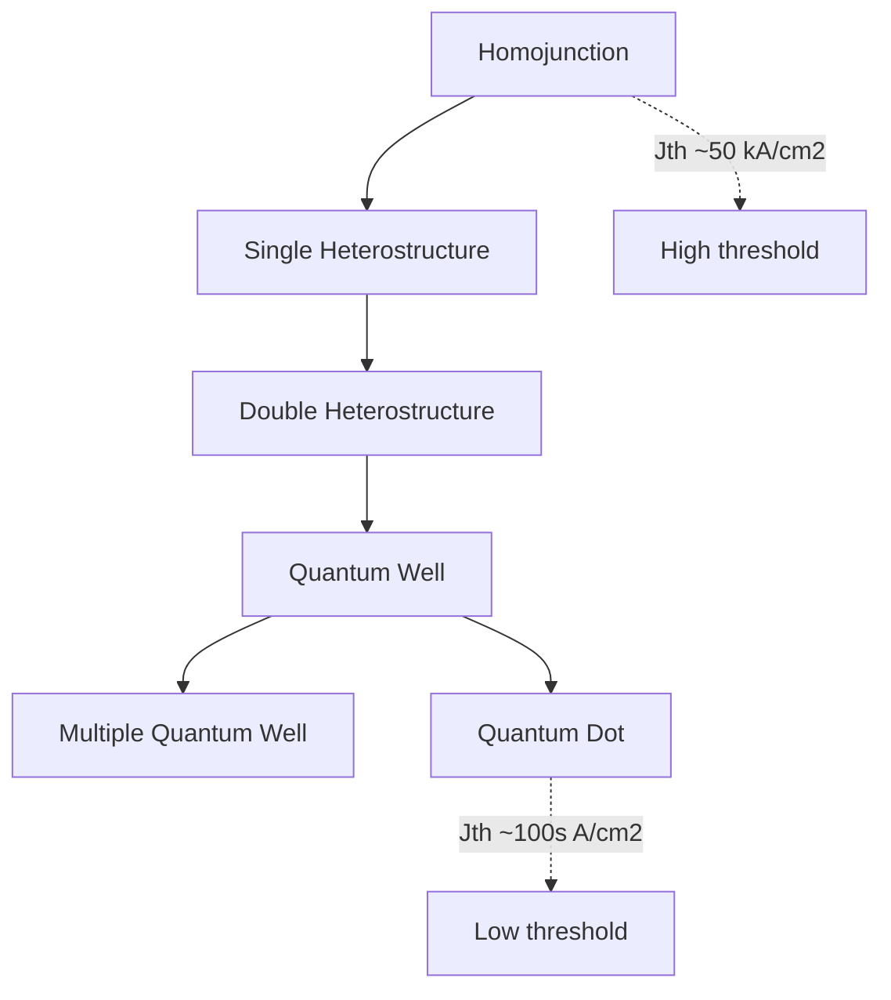
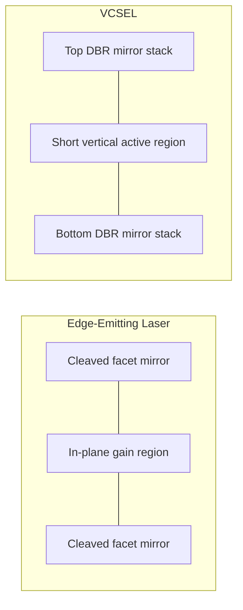

## Laser Diode Operation and Structures

### Fundamental Operating Principle

A laser diode (LD) is a semiconductor device that produces coherent, monochromatic light through **stimulated emission** within an optical cavity, in contrast to the spontaneous emission that governs LED operation. Three conditions must be simultaneously satisfied for lasing: population inversion, optical gain exceeding total losses, and optical feedback via a resonant cavity.

### Stimulated Emission and Population Inversion

In a semiconductor under forward bias, three photon-carrier interaction processes compete:

- **Absorption**: a photon is absorbed, promoting an electron from valence to conduction band.
- **Spontaneous emission**: an electron-hole pair recombines randomly in phase and direction, emitting a photon (the LED mechanism).
- **Stimulated emission**: an incident photon induces recombination of an electron-hole pair, emitting a second photon that is coherent with the original — identical in phase, frequency, direction, and polarization.

For stimulated emission to dominate over absorption, **population inversion** must be achieved: the quasi-Fermi level separation must exceed the photon energy,

$$E_{Fc} - E_{Fv} > h\nu > E_g$$

This is the **Bernard-Duraffourg condition**, the semiconductor analog of population inversion in conventional gas/solid-state lasers. It requires high injected carrier densities, achieved through heavy doping and strong carrier confinement in the active region.

### Optical Gain

Net modal gain $g(\lambda)$ must overcome internal losses (free-carrier absorption, scattering) and mirror/output losses for lasing to initiate. The threshold condition is:

$$\Gamma g_{th} = \alpha_i + \frac{1}{L}\ln\left(\frac{1}{R_1R_2}\right)$$

where:

- $\Gamma$ = optical confinement factor (fraction of the optical mode overlapping the gain region)
- $\alpha_i$ = internal (non-mirror) optical loss per unit length
- $L$ = cavity length
- $R_1, R_2$ = facet (mirror) reflectivities

The second term represents the **mirror loss**, required to sustain a photon population despite loss out of the cavity through the facets (which is also the useful output beam).

### Cavity Formation: Fabry-Pérot Resonator

The simplest laser diode cavity is formed by cleaving the semiconductor crystal along natural crystallographic planes, producing two parallel, partially reflective facets that act as a **Fabry-Pérot resonator**. The refractive index discontinuity at the semiconductor-air interface (n≈3.5 vs. n=1) provides ~30% facet reflectivity without additional coatings, sufficient for feedback in many designs.

Longitudinal cavity modes are supported at wavelengths satisfying:

$$L = m\frac{\lambda}{2n_{eff}}, \quad m = 1,2,3,...$$

giving a longitudinal mode spacing:

$$\Delta\lambda = \frac{\lambda^2}{2n_{eff}L}$$

Fabry-Pérot lasers typically exhibit **multi-longitudinal-mode** output, since the gain bandwidth spans several cavity modes simultaneously.

### Threshold Current

Below threshold current $I_{th}$, the device behaves as a spontaneous-emission-dominated LED with broad, low-power output. Above threshold, stimulated emission dominates and output power increases sharply and near-linearly with current:

$$P_{out} = \eta_d \frac{h\nu}{q}(I - I_{th}) \quad \text{for } I>I_{th}$$

where $\eta_d$ is the differential (slope) quantum efficiency. Threshold current density $J_{th}$ is a key figure of merit and depends strongly on active region design, temperature, and material quality:

$$J_{th} = \frac{qd}{\eta_i\tau_r}n_{tr} + \text{(loss-dependent terms)}$$

where $d$ is active layer thickness, $\eta_i$ internal quantum efficiency, $\tau_r$ radiative lifetime, and $n_{tr}$ the transparency carrier density (the density at which gain equals zero, i.e., the material becomes transparent rather than absorbing).

**Key Points**

- $J_{th}$ decreases with better carrier confinement (heterostructures, quantum wells).
- $J_{th}$ increases with temperature, characterized by the empirical characteristic temperature $T_0$: $J_{th}(T) = J_{th}(T_0)e^{T/T_0}$; higher $T_0$ indicates better temperature stability. [Inference: exact $T_0$ values are material- and design-specific and should be confirmed against datasheets for a given device.]

### Heterostructure Evolution

Laser diode active region design has evolved to progressively tighten carrier and optical confinement:

1. **Homojunction lasers**: single-material p-n junction; extremely high $J_{th}$ (~50 kA/cm²), impractical for CW room-temperature operation.
2. **Single heterostructure (SH)**: one heterojunction interface providing partial carrier confinement.
3. **Double heterostructure (DH)**: active layer sandwiched between two wider-bandgap cladding layers, providing both carrier confinement (potential well) and optical confinement (index-guided waveguide, since cladding layers have lower refractive index). This was the structure that first enabled practical room-temperature CW operation.
4. **Quantum well (QW) lasers**: active region thickness reduced to few-nanometer scale, comparable to the de Broglie wavelength, producing quantized energy sub-bands. This reduces the density of states needed to reach transparency/inversion, lowering $J_{th}$ substantially and enabling **strained-layer** designs (e.g., compressive strain in the QW to modify the valence band structure and reduce effective hole mass, further reducing threshold).
5. **Multiple quantum well (MQW) lasers**: several QWs separated by barrier layers, increasing total modal gain while retaining low-threshold-per-well characteristics.
6. **Quantum dot (QD) lasers**: zero-dimensional confinement producing delta-function-like density of states; offers further threshold reduction and improved temperature stability (high $T_0$). [Inference: QD laser commercial maturity and performance advantages vary significantly by material system and application.]

### Waveguiding and Transverse Mode Control

**Index guiding** and **gain guiding** are the two mechanisms for confining light laterally within the cavity:

- **Gain-guided lasers**: current is confined via a stripe contact, and optical confinement arises indirectly from the resulting carrier-induced gain/index profile. Simpler to fabricate but produces poorer beam quality and higher threshold.
- **Index-guided lasers**: a deliberate lateral refractive index step (via ridge waveguide or buried heterostructure) provides strong, stable transverse mode confinement, producing a well-defined, stable fundamental transverse mode ($TE_{00}$) output beam. Preferred for telecom and high-performance applications.

Common structural implementations include the **ridge waveguide laser** (etched ridge confines current and provides weak index guiding) and **buried heterostructure laser** (active stripe fully surrounded by higher-bandgap, lower-index material, providing strong 2D confinement).

### Distributed Feedback (DFB) and DBR Lasers

For applications requiring single-longitudinal-mode operation (notably optical communications, where spectral purity minimizes chromatic dispersion penalty), Fabry-Pérot cavities are replaced with **wavelength-selective feedback structures**:

- **Distributed Feedback (DFB) lasers**: a periodic corrugation (Bragg grating) is etched along the waveguide, distributed over the gain region itself. This provides continuous, wavelength-selective feedback satisfying the Bragg condition:

$$\lambda_B = 2n_{eff}\Lambda/m$$

where $\Lambda$ is the grating period. Only the wavelength satisfying the Bragg condition (and its immediate vicinity) experiences strong feedback, suppressing side modes and yielding single-mode output with high side-mode suppression ratio (SMSR).

- **Distributed Bragg Reflector (DBR) lasers**: the grating is located outside the active gain region, at one or both cavity ends, acting as a wavelength-selective mirror rather than distributed feedback throughout the gain medium.

### Vertical-Cavity Surface-Emitting Lasers (VCSELs)

VCSELs represent a structurally distinct class where the optical cavity is oriented **perpendicular** to the wafer surface, rather than in-plane as in edge-emitting lasers:

- The cavity is formed between two **Distributed Bragg Reflector (DBR) mirror stacks** (alternating quarter-wave layers of differing refractive index) grown epitaxially above and below a very short active region (a few QWs).
- Because the gain length is extremely short (microns vs. hundreds of microns in edge emitters), mirror reflectivities must be very high (>99.5%) to reach threshold, requiring many DBR periods (20-40+).
- VCSELs emit normal to the wafer surface, enabling **wafer-scale testing**, circular low-divergence beam output (unlike the elliptical astigmatic beam of edge emitters), and dense 2D array integration.
- Widely used in short-reach optical interconnects, consumer 3D sensing/structured light, and optical mice.

**Example**

Comparison of edge-emitting vs. VCSEL geometry:

### Output Characteristics: L-I and I-V Curves

The **light-current (L-I) curve** is the primary characterization tool for laser diodes, showing the characteristic kink at $I_{th}$ separating spontaneous-emission-dominated (sub-threshold) and stimulated-emission-dominated (lasing) regimes. Key extracted parameters:

- Threshold current $I_{th}$
- Slope efficiency $\eta_d = \Delta P/\Delta I$ (above threshold)
- Rollover/saturation at high current due to junction heating (thermal rollover)

The **I-V curve** follows standard diode behavior with series resistance; forward voltage roughly tracks $E_g/q$ as in LEDs, though laser diodes typically operate at higher current densities than LEDs.

### Temperature Sensitivity and Packaging

Laser diode performance (threshold current, slope efficiency, emission wavelength) is more temperature-sensitive than LED performance due to the exponential dependence of gain on carrier density near threshold. Consequently, precision applications (telecom DFB lasers) typically require:

- **Thermoelectric cooler (TEC)** integration for wavelength/temperature stabilization
- **Monitor photodiode** for automatic power control (APC) feedback loops
- Hermetic packaging (e.g., TO-can with window, or butterfly package) for reliability

[Inference: specific TEC and monitor photodiode requirements vary by application tier — e.g., uncooled directly-modulated lasers are common in short-reach datacom where wavelength drift tolerance is higher.]

### Comparison Summary

| Property | Fabry-Pérot | DFB/DBR | VCSEL |
| --- | --- | --- | --- |
| Spectral output | Multi-mode | Single-mode, narrow linewidth | Single/few-mode |
| Cavity orientation | In-plane (edge) | In-plane (edge) | Vertical (surface) |
| Beam profile | Elliptical, astigmatic | Elliptical, astigmatic | Circular, low divergence |
| Typical application | General purpose, low-cost | Telecom (DWDM), sensing | Short-reach datacom, 3D sensing |
| Wafer-level test | No (requires cleaving) | No (requires cleaving) | Yes |

**Related Topics**

- Semiconductor optical gain theory and density of states engineering
- Quantum well/quantum dot active region physics
- Optical waveguide design and modal confinement factor
- DFB/DBR grating fabrication (e-beam lithography, holographic exposure)
- VCSEL DBR mirror design and oxide-confined aperture structures
- Laser diode reliability, facet coating, and catastrophic optical damage (COD)
- Optical modulation techniques (direct vs. external modulation)