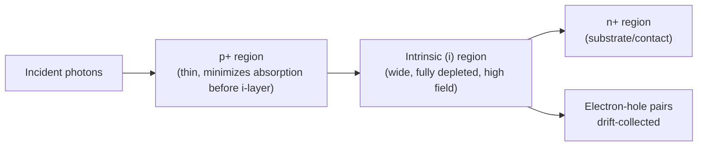

## Photodetector and Photodiode Design

### Fundamental Operating Principle

A photodetector converts incident optical photons into an electrical signal (current or voltage) through the **photoelectric effect** within a semiconductor. In photodiodes specifically, this occurs via the **internal photoelectric effect**: an absorbed photon with energy exceeding the bandgap generates an electron-hole pair, which is then separated and collected by an internal electric field, producing photocurrent. This is the inverse process to LED/laser diode operation.

### Photon Absorption and the Absorption Coefficient

For photogeneration to occur, photon energy must satisfy:

$$h\nu \geq E_g$$

The absorption coefficient $\alpha(\lambda)$ governs how rapidly light intensity decays with depth into the material:

$$I(x) = I_0e^{-\alpha x}$$

$\alpha$ is strongly material- and wavelength-dependent, and determines the optimal **active layer thickness**: too thin and photons pass through unabsorbed (low quantum efficiency); too thick and generated carriers born far from the junction recombine before collection, or transit time increases excessively. Direct-bandgap materials (GaAs, InGaAs) exhibit sharp absorption edges and high $\alpha$, giving strong absorption in thin layers; indirect-bandgap materials (Si, Ge) have more gradual absorption edges requiring thicker active regions.

### Material Selection by Wavelength

| Material | Bandgap (eV) | Detection Range | Common Application |
| --- | --- | --- | --- |
| Si | 1.12 | 400–1100 nm | Visible, near-IR (cheap, mature) |
| Ge | 0.67 | 800–1800 nm | Early telecom, higher dark current |
| InGaAs (lattice-matched to InP) | 0.75 | 900–1700 nm | Telecom (1310/1550 nm windows) |
| GaN | 3.4 | UV (<365 nm) | UV/solar-blind detection |
| HgCdTe (MCT) | Tunable (0–1.5) | MWIR/LWIR | Thermal imaging [Inference: exact bandgap depends on Cd fraction] |

### Basic p-n Junction Photodiode

In its simplest form, a photodiode is a reverse-biased p-n junction. Operation regions on the I-V curve:

- **Photoconductive mode (reverse bias)**: the device is operated with applied reverse bias, widening the depletion region and increasing the internal field. Photocurrent is nearly independent of bias voltage (current-source-like behavior) and response is fast, but dark current is present and scales with reverse bias and temperature.
- **Photovoltaic mode (zero bias)**: the device operates as a current source at $V=0$, generating a photovoltage/photocurrent with essentially zero dark current, but with a nonlinear response and typically slower speed (larger junction capacitance) — this is the solar cell operating regime.

### PIN Photodiode Structure

The dominant structure for high-speed, high-efficiency photodetection is the **PIN photodiode**, which inserts a lightly-doped (nominally "intrinsic") layer between the p and n regions:

**Key Points**

- The intrinsic region is fully depleted under modest reverse bias, creating a wide, uniform high-field drift region.
- Widening the depletion/absorption region increases quantum efficiency (more photons absorbed within the field region rather than the slower diffusion-dominated neutral regions).
- The full depletion of the i-region minimizes the diffusion-current component, which is slow (limited by minority carrier diffusion) — most collected carriers instead undergo fast **drift** transport under the strong field.
- Junction capacitance $C_j \propto 1/W$ decreases as intrinsic layer width $W$ increases, improving bandwidth — but wider $W$ also increases transit time, creating a fundamental **bandwidth-efficiency-transit-time tradeoff** that governs PIN diode design.

### Key Performance Parameters

**Responsivity** ($R$), the ratio of output photocurrent to incident optical power:

$$R = \frac{I_{ph}}{P_{opt}} = \frac{\eta q}{h\nu} = \eta \frac{\lambda(\mu m)}{1.24} \quad [A/W]$$

**External Quantum Efficiency** ($\eta$), the fraction of incident photons producing collected carriers:

$$\eta = (1-R_{refl})(1-e^{-\alpha d})\eta_{internal}$$

accounting for surface reflection losses, incomplete absorption over active thickness $d$, and internal collection efficiency.

**Response speed / bandwidth**, limited by three time constants:

1. **Transit time** $\tau_{tr} = W/v_{sat}$ (carrier drift time across depletion width $W$ at saturation velocity $v_{sat}$)
2. **RC time constant** $\tau_{RC} = R_LC_j$ (load resistance and junction capacitance)
3. **Diffusion time** (from carriers generated outside the depletion region — ideally minimized by design)

Overall bandwidth is approximately:

$$f_{3dB} \approx \frac{1}{2\pi\sqrt{\tau_{tr}^2+\tau_{RC}^2}}$$

**Dark current**, the current flowing under reverse bias with no illumination, arising from thermal generation (SRH, diffusion, and at high reverse bias, tunneling/avalanche multiplication of thermally generated carriers). Dark current sets the fundamental noise floor and directly limits minimum detectable signal.

### Noise Sources

- **Shot noise**: arises from the discrete nature of photocurrent and dark current; $\overline{i_n^2} = 2q(I_{ph}+I_d)B$, where $B$ is bandwidth.
- **Thermal (Johnson) noise**: from the load/feedback resistor in the receiver circuit; $\overline{i_n^2} = 4kTB/R_L$.
- **Flicker (1/f) noise**: significant at low frequencies, from surface states and trap-related fluctuations.

The **Noise Equivalent Power (NEP)** — the optical power producing SNR = 1 in 1 Hz bandwidth — is the standard figure of merit for detector sensitivity comparison.

### Avalanche Photodiodes (APDs)

APDs incorporate an additional high-field **multiplication region** where photogenerated carriers undergo **impact ionization**, triggering avalanche multiplication and providing internal current gain before the signal reaches the amplifier — analogous to a built-in, low-noise pre-amplification stage.

$$I_{APD} = M \cdot I_{ph,primary}$$

where $M$ is the multiplication (gain) factor, controlled by reverse bias voltage (typically tens of volts, near breakdown).

**Key Points**

- Gain-bandwidth tradeoff: increasing $M$ increases avalanche buildup time, reducing bandwidth.
- Excess noise factor $F(M)$ increases with $M$ due to the statistical randomness of the multiplication process; materials/structures with a large disparity between electron and hole ionization coefficients ($k = \beta_h/\beta_e$) exhibit lower excess noise (Si APDs, with low $k$, are noted for particularly favorable noise performance compared to InGaAs/InP APDs).
- **SAM (Separate Absorption and Multiplication) structure**: commonly used in InGaAs APDs, decoupling the narrow-bandgap absorption region (InGaAs, for IR sensitivity) from a separate wide-bandgap multiplication region (InP, chosen for favorable ionization ratio and high breakdown field) via a charge/grading layer — since InGaAs itself has unfavorable (high $k$) ionization properties and poor tunneling breakdown behavior if used directly as the multiplication layer.

### Metal-Semiconductor (Schottky) Photodiodes

An alternative to p-n/PIN structures uses a **Schottky barrier** (metal-semiconductor junction) as the collecting junction:

- Advantages: no minority carrier storage/diffusion (majority-carrier device), enabling very high speed; simpler fabrication (single semiconductor type, no diffusion/implant junction needed); useful for UV detection where a thin, semi-transparent metal contact allows shallow absorption near the surface.
- Disadvantages: generally higher dark current than well-optimized p-n/PIN devices due to lower effective barrier height; metal layer introduces some optical loss/reflection.

### Metal-Semiconductor-Metal (MSM) Photodetectors

Interdigitated finger electrode structures forming back-to-back Schottky diodes on a semi-insulating substrate:

- Very low capacitance due to the planar, back-to-back diode geometry, enabling extremely high bandwidth.
- Compatible with planar processing and straightforward monolithic integration with FET-based receiver circuitry (same substrate/process family) — advantageous for OEIC (optoelectronic integrated circuit) receivers.
- Tradeoff: finger geometry and dark-current characteristics generally give somewhat lower responsivity/quantum efficiency compared to vertical PIN structures of comparable footprint. [Inference: precise responsivity gap depends heavily on specific finger pitch/width design and passivation quality.]

### Comparison Summary

| Structure | Speed | Gain | Dark Current | Typical Use |
| --- | --- | --- | --- | --- |
| p-n photodiode | Moderate | 1 | Low-moderate | General purpose, low-cost |
| PIN photodiode | High | 1 | Low | Telecom, high-speed links |
| APD | High (gain-BW tradeoff) | >1 (internal gain) | Higher (bias-dependent) | Long-haul telecom, low-light sensing |
| Schottky photodiode | Very high | 1 | Higher | UV detection, high-speed niche |
| MSM photodetector | Very high | 1 | Moderate | Integrated OEIC receivers |

### Photodiode Receiver Circuit Considerations

In practical systems, photodiodes are paired with a **transimpedance amplifier (TIA)** to convert photocurrent to a voltage signal while managing the bandwidth/noise tradeoffs from junction capacitance and load resistance. TIA feedback resistance directly trades off bandwidth against thermal noise-limited sensitivity — a core system-level design consideration beyond the photodiode itself. [Inference: specific TIA topology choice (shunt-feedback vs. common-gate front-end, etc.) is application- and speed-tier dependent.]

**Related Topics**

- Solar cell physics and photovoltaic energy conversion
- Optical receiver design and transimpedance amplifiers
- Impact ionization and avalanche breakdown physics
- Charge-coupled devices (CCDs) and CMOS image sensors
- Optical communication link budget analysis
- Noise analysis in optoelectronic receiver systems
- Heterojunction band engineering for SAM-APD structures