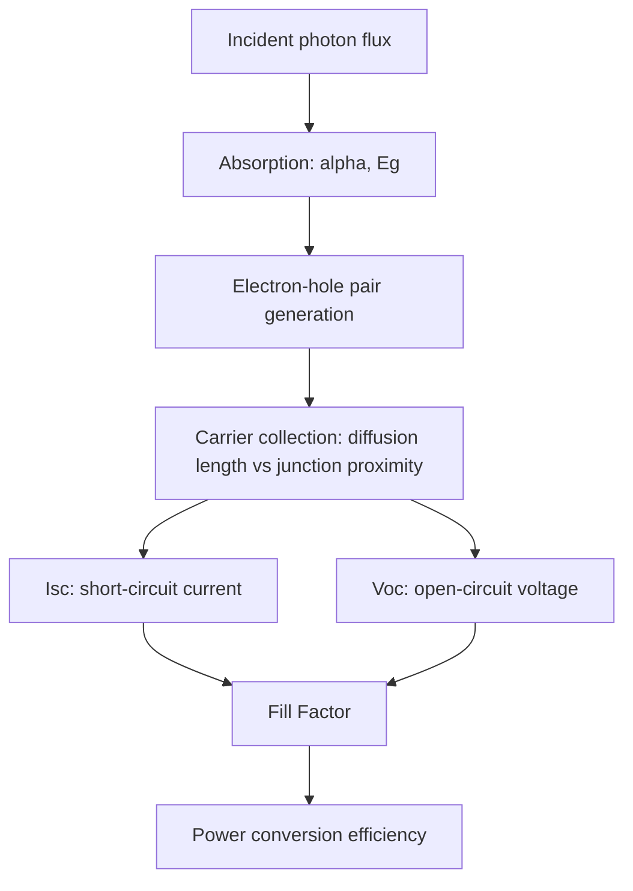
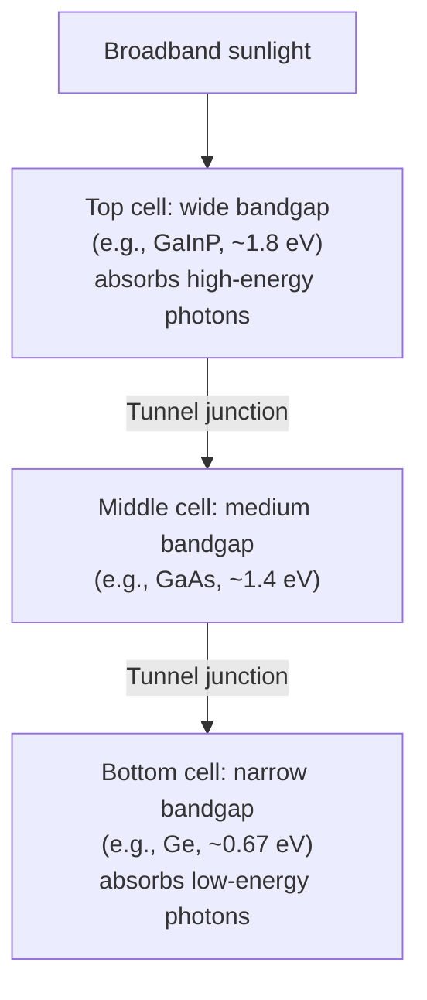

## Solar Cell Physics and Photovoltaic Efficiency

### Fundamental Operating Principle

A solar cell is a p-n junction photodiode operated in **photovoltaic mode** (zero or forward bias, unlike the reverse-biased photoconductive mode of photodetectors) to convert incident solar radiation directly into electrical power. Photogenerated electron-hole pairs are separated by the built-in junction field and collected as usable current at an external load, without requiring an applied bias to drive operation.

### Photogeneration and Carrier Collection

Absorbed photons with $h\nu \geq E_g$ generate electron-hole pairs throughout the absorbing region, following the same absorption relation as photodetectors:

$$G(x) = \alpha\Phi_0(1-R_{refl})e^{-\alpha x}$$

where $\Phi_0$ is the incident photon flux and $R_{refl}$ the surface reflection loss. Carriers generated within or near the depletion region are efficiently swept to their respective contacts by the built-in field; carriers generated in the quasi-neutral bulk regions must diffuse to the junction before recombining, making **minority carrier diffusion length** $L_D = \sqrt{D\tau}$ a critical design parameter — it must substantially exceed the absorber thickness for good collection efficiency.

### The Solar Cell I-V Equation

Under illumination, the diode equation is modified by a photogenerated current source term:

$$I = I_0\left(e^{qV/nkT}-1\right) - I_{ph}$$

This shifts the standard diode I-V curve into the fourth quadrant, where the device can deliver power to an external load ($V>0$, $I<0$ in the generator sign convention, or equivalently positive power extraction).

### Key Performance Parameters

**Short-circuit current** ($I_{sc}$): current at $V=0$, essentially equal to $I_{ph}$, proportional to incident photon flux and quantum efficiency.

**Open-circuit voltage** ($V_{oc}$): voltage at $I=0$, obtained by setting the net current to zero:

$$V_{oc} = \frac{nkT}{q}\ln\left(\frac{I_{ph}}{I_0}+1\right)$$

$V_{oc}$ is fundamentally limited by $E_g/q$ and degrades with increasing $I_0$ (i.e., with increasing recombination — $V_{oc}$ is highly sensitive to material quality and defect density).

**Fill Factor (FF)**: the ratio of maximum power rectangle to the $I_{sc} \times V_{oc}$ product:

$$FF = \frac{I_{mp}V_{mp}}{I_{sc}V_{oc}}$$

$FF$ quantifies how "square" the I-V curve is; it is degraded by series resistance $R_s$ (contact/bulk resistance) and improved by high shunt resistance $R_{sh}$ (minimizing leakage paths). Typical high-quality silicon cells achieve FF ≈ 0.80–0.85.

**Power Conversion Efficiency** ($\eta$):

$$\eta = \frac{P_{max}}{P_{in}} = \frac{I_{sc}V_{oc}\cdot FF}{P_{in}}$$

measured under standardized **AM1.5G** spectral conditions (1000 W/m², 25°C), the standard reference spectrum approximating sunlight after passing through 1.5 atmospheres of air mass.

### The Shockley-Queisser Limit

For a single-junction solar cell under unconcentrated AM1.5 illumination, the **Shockley-Queisser (S-Q) limit** defines the theoretical maximum efficiency as a function of bandgap, arising from fundamental, unavoidable loss mechanisms:

- **Thermalization loss**: photons with $h\nu > E_g$ generate carriers with excess kinetic energy above the band edge, which is rapidly lost as heat via phonon emission (carrier relaxation to band edges) rather than contributing to output voltage.
- **Non-absorption loss**: photons with $h\nu < E_g$ are not absorbed at all and pass through/are lost.
- **Radiative recombination loss**: the detailed-balance requirement that a cell in thermal equilibrium must also re-emit photons (as it would as an LED) sets a fundamental minimum $I_0$, capping $V_{oc}$ below $E_g/q$.

The S-Q analysis yields a peak theoretical efficiency of approximately 33.7% for a single-junction cell with bandgap near 1.34 eV, closely matched by GaAs (~1.42 eV, S-Q limit ~33%) and reasonably close for silicon (~1.12 eV). This fundamental tradeoff — wider bandgap raises $V_{oc}$ but reduces the fraction of the solar spectrum absorbed ($I_{sc}$), while narrower bandgap does the reverse — explains why no single-junction material can approach 100% efficiency regardless of engineering refinement.

### Dominant Photovoltaic Technologies

**Key Points**

| Technology | Typical Efficiency (lab record) | Notes |
| --- | --- | --- |
| Crystalline Si (mono/multi) | ~26–27% (mono, lab) | Dominant commercial technology; mature, abundant, indirect bandgap requires thicker wafers (~150-180 μm) |
| CdTe (thin-film) | ~22% | Direct bandgap allows thin absorbers (~microns); lower material usage |
| CIGS (Cu(In,Ga)Se2) | ~23% | Direct bandgap, tunable via Ga content, flexible substrate compatible |
| GaAs (single junction) | ~29% | Near-ideal S-Q bandgap; high cost limits use to space/concentrator applications |
| Multi-junction III-V | >39% (concentrator) | Stacked sub-cells of decreasing bandgap; exceeds single-junction S-Q limit |
| Perovskite (lab) | >26% (single-junction) | Rapidly improving; [Inference: long-term stability and commercial-scale manufacturability remain active research areas as of available data] |

[Inference: exact record efficiency figures shift frequently as new certified results are published; treat the values above as approximate benchmarks rather than current-day records.]

### Multi-Junction (Tandem) Solar Cells

To exceed the single-junction S-Q limit, **multi-junction cells** stack multiple sub-cells with decreasing bandgap from top to bottom (e.g., a common III-V stack: GaInP/GaAs/Ge), so each sub-cell efficiently absorbs a different portion of the solar spectrum near its own bandgap, minimizing both thermalization and non-absorption losses simultaneously.

- Sub-cells are typically connected in series via **tunnel junctions** (heavily doped, thin p++/n++ junctions enabling low-resistance interband tunneling transport between sub-cells without forming a parasitic opposing diode).
- Series connection constrains total current output to the **minimum** of the sub-cell photocurrents (current-matching requirement), making spectral splitting and bandgap selection a critical co-design problem.
- Theoretical efficiency limit increases with the number of junctions (approaching ~68% for infinite junctions under maximum concentration); practical 3-junction concentrator cells have demonstrated >39% efficiency, and research multi-junction stacks have exceeded 47% under concentrated sunlight. [Inference: specific record values are time-sensitive; verify against current NREL efficiency chart for up-to-date figures.]

### Loss Mechanisms and Mitigation Strategies

- **Optical (reflection) loss**: mitigated via anti-reflection coatings (quarter-wave dielectric layers) and surface texturing (pyramidal texturing in Si to increase path length and reduce reflectance).
- **Series resistance loss**: from contact resistance, bulk resistance, and finger-grid metallization; mitigated by optimized grid design (balancing shading loss against resistive loss) and heavily doped contact regions.
- **Shunt resistance loss**: from junction defects, edge leakage, or process-induced shorting paths; mitigated by improved junction quality and edge isolation.
- **Recombination loss (bulk, surface, and Auger)**: mitigated by high-purity material, surface passivation (e.g., $SiO_2$ or $Al_2O_3$ passivation layers on Si), and back-surface field (BSF) or PERC (Passivated Emitter and Rear Cell) structures that reduce rear-surface recombination.
- **Temperature-related loss**: $V_{oc}$ decreases with increasing cell temperature (due to increasing $I_0$), giving typical Si cell temperature coefficients around $-0.3$ to $-0.5\%/°C$ for power output. [Inference: exact coefficient is technology- and manufacturer-specific.]

### PERC and Advanced Silicon Cell Architectures

Modern high-efficiency silicon cells extend the basic p-n structure with:

- **PERC (Passivated Emitter and Rear Cell)**: adds a rear-side dielectric passivation layer with localized point contacts, reducing rear surface recombination and adding a rear reflective effect (increasing effective optical path length for weakly absorbed long-wavelength light) — now the dominant mainstream commercial Si cell architecture.
- **HJT (Heterojunction Technology)**: combines crystalline Si with thin amorphous Si (a-Si:H) passivation/emitter layers, achieving very high $V_{oc}$ through excellent surface passivation.
- **TOPCon (Tunnel Oxide Passivated Contact)**: uses an ultrathin tunneling oxide plus doped polysilicon layer to passivate contacts while allowing carrier transport, reducing rear-contact recombination.
- **IBC (Interdigitated Back Contact)**: moves both polarity contacts to the rear surface, eliminating front-grid shading loss entirely and improving $I_{sc}$, at higher fabrication complexity.

### Solar Cell vs. Photodetector: Operational Distinction

| Aspect | Photodetector | Solar Cell |
| --- | --- | --- |
| Bias | Reverse-biased (photoconductive) | Zero/forward bias (photovoltaic) |
| Goal | Signal fidelity, speed, low noise | Maximum power extraction |
| Key metrics | Responsivity, bandwidth, NEP | $\eta$, $V_{oc}$, $I_{sc}$, FF |
| Area | Typically small (fast RC) | Large (maximize light capture) |
| Spectral operation | Narrowband (specific $\lambda$) | Broadband (full solar spectrum) |

**Related Topics**

- Photodetector and photodiode design (reverse-biased operation)
- Semiconductor recombination mechanisms (SRH, Auger, radiative)
- Surface passivation techniques in silicon processing
- Tunnel junction physics in multi-junction devices
- Perovskite and emerging thin-film photovoltaic materials
- Concentrator photovoltaics (CPV) system design
- Anti-reflection coating and light-trapping optical design