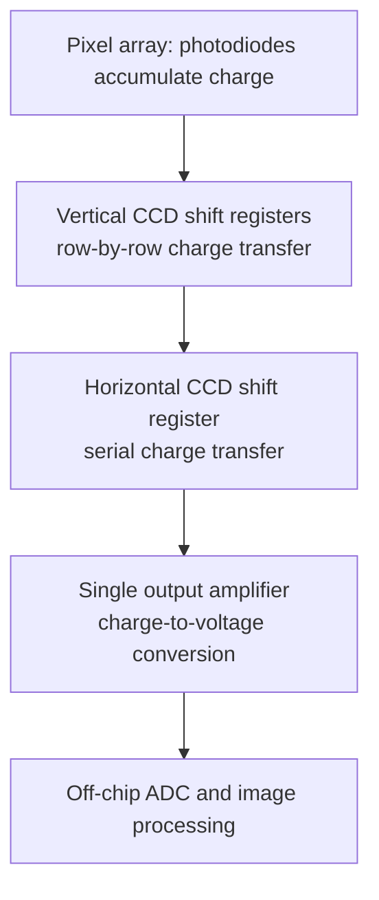
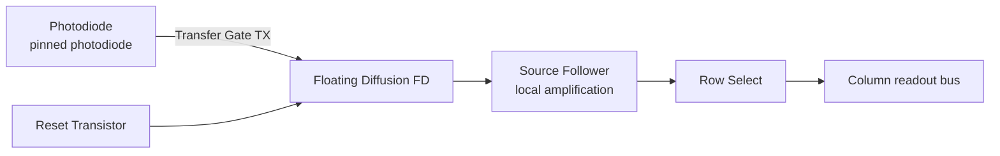

## CMOS and CCD Image Sensors

### Fundamental Operating Principle

Both CMOS and CCD image sensors convert spatially distributed incident light into an electronic image by (1) generating photocarriers via the photoelectric effect at each picture element (**pixel**), (2) accumulating/integrating this photocharge over an exposure period, and (3) reading out the accumulated charge or resulting voltage to reconstruct a 2D image. The fundamental distinction between the two technologies lies entirely in **how the accumulated charge is read out and converted to a signal**, not in the photodetection mechanism itself, which in both cases relies on photodiode-like charge generation.

### The Photodiode Pixel: Shared Foundation

Each pixel typically contains a **photodiode** (or photogate, in older CCD designs) that operates similarly to the photovoltaic-mode devices covered in solar cell/photodetector physics:

$$Q_{ph} = \eta q A \Phi t_{int}$$

where $\eta$ is quantum efficiency, $A$ pixel area, $\Phi$ incident photon flux, and $t_{int}$ integration (exposure) time. The photodiode is typically operated in a form of charge-integration mode rather than continuous current readout: it is reset to a reverse-biased state, then allowed to discharge (accumulate photogenerated charge) proportionally to incident light over the exposure interval — a fundamentally different operating regime from the continuous-current photoreceivers used in optical communications.

### CCD (Charge-Coupled Device) Architecture

**Key Points**

- Charge is generated at each pixel location but is **not read out locally**; instead, it is physically **shifted/transferred** across the chip through a series of adjacent potential wells using clocked voltages applied to overlapping polysilicon gate electrodes.
- This charge-transfer process (analogous to a "bucket brigade") moves each row of charge packets sequentially toward a single (or few) output amplifier/sense node, where charge is converted to voltage via a floating diffusion and on-chip amplifier — typically the **only** amplifier on the entire chip.
- Because there is one shared, highly optimized output amplifier, CCDs traditionally achieve very high **charge-transfer efficiency**, low fixed-pattern noise, and excellent pixel-to-pixel uniformity, since all pixels are read through identical downstream electronics.
- Tradeoffs: charge-domain serial transfer is inherently slower (readout time scales with total pixel count) and requires specialized, often higher-voltage clock driver circuitry not compatible with standard CMOS logic processes, historically requiring a dedicated fabrication process.

### CMOS (Active Pixel Sensor) Architecture

In contrast, a **CMOS Active Pixel Sensor (APS)** integrates a small amplifier circuit **within each pixel**, converting photocharge to voltage locally rather than physically transferring charge across the chip.

**Standard 3T (three-transistor) pixel** components:

1. **Photodiode**: charge generation/integration element
2. **Reset transistor (RST)**: resets the photodiode to a reference voltage before each integration period
3. **Source-follower transistor (SF)**: buffers the photodiode voltage, providing local charge-to-voltage conversion without depleting the signal
4. **Row-select transistor (RS)**: connects the pixel output to the shared column readout bus when addressed

The **4T pixel** (dominant in modern designs) adds a **transfer gate (TX)** and separate **floating diffusion (FD)** node, enabling **Correlated Double Sampling (CDS)**:

- The photodiode integrates charge in a pinned-photodiode structure (fully depleting at reset, reducing dark current/lag).
- The transfer gate moves accumulated charge to the floating diffusion only at readout time, allowing the reset-level ("dark") signal and the signal-level to both be sampled and subtracted (CDS), effectively canceling kTC (reset) noise and fixed pattern offset — a major noise-reduction technique unavailable in simple 3T designs.

Because each pixel (or column) has independent readout circuitry, CMOS sensors support **random access** (arbitrary pixel/region readout), **rolling or global shutter modes**, and massively **parallel column-level readout**, giving substantially higher achievable frame rates than serial charge-domain CCD readout.

### Rolling Shutter vs. Global Shutter

**Key Points**

- **Rolling shutter** (most common in CMOS): rows are reset and read out sequentially, with a small time offset between rows. This is simpler and more area-efficient but produces **motion artifacts** (skew/wobble) for fast-moving subjects or during camera motion, since different rows capture different time instants.
- **Global shutter**: all pixels are exposed and their photocharge transferred to a light-shielded storage node **simultaneously**, then read out sequentially, eliminating motion skew at the cost of additional in-pixel transistors/storage capacitance (larger pixel area, generally requiring 5T+ designs with an extra storage node) and typically higher noise.
- CCDs inherently provide global shutter-like operation via full-frame or frame-transfer charge shifting, historically a key advantage for scientific/machine-vision applications requiring motion-artifact-free capture.

### Color Imaging: Bayer Filter Arrays

Since photodiodes are inherently monochromatic (responding to photon flux regardless of wavelength within their spectral response), color imaging requires a **Color Filter Array (CFA)** deposited above the pixel array. The dominant pattern is the **Bayer filter**: a repeating 2×2 mosaic of Red, Green, Green, Blue filters (double-weighted green reflecting peak human luminance sensitivity), with full-color images reconstructed via **demosaicing** (interpolation) algorithms in downstream image signal processing.

### Key Performance Parameters

**Quantum Efficiency (QE)**: fraction of incident photons generating collected electrons, wavelength-dependent, degraded by CFA absorption, metal interconnect shadowing (front-side illumination), and surface reflection.

**Full Well Capacity**: the maximum charge a pixel's photodiode/storage node can hold before saturation, directly setting the upper bound of the sensor's dynamic range.

**Dynamic Range**:

$$DR = 20\log_{10}\left(\frac{Q_{full-well}}{\sigma_{read-noise}}\right) \text{ [dB]}$​

**Read noise**: the noise floor set by reset (kTC) noise, source-follower thermal/flicker noise, and downstream ADC quantization — CDS substantially suppresses this in modern 4T CMOS designs.

**Dark current**: thermally generated charge accumulating even without illumination, arising from SRH generation at interface/defect states; scales exponentially with temperature and integration time, and is a primary driver of **fixed pattern noise (FPN)** if not corrected (dark-frame subtraction) or suppressed via pinned-photodiode design.

**Conversion gain**: the voltage produced per collected electron at the floating diffusion node ($\mu V/e^-$), set by the FD capacitance — smaller FD capacitance gives higher conversion gain (better sensitivity to single electrons) at the cost of reduced full-well capacity.

### Front-Side vs. Back-Side Illumination (BSI)

- **Front-Side Illuminated (FSI)**: light passes through the metal interconnect/wiring layers stacked above the photodiode before reaching the active silicon, causing partial shadowing/vignetting from metal traces and reduced QE, particularly for pixels at high chief-ray angles.
- **Back-Side Illuminated (BSI)**: the silicon wafer is thinned and flipped so light enters from the back side directly onto the photodiode, with wiring layers relocated behind the light path. This substantially improves QE and reduces crosstalk, especially critical as pixel pitch scales down into the sub-2-micron regime, at the cost of more complex wafer-thinning and bonding fabrication steps. BSI is now standard in most modern smartphone and high-performance CMOS sensors.

### Pixel Scaling and Crosstalk

As pixel pitch shrinks (driven by demand for higher resolution at fixed sensor area), several effects become increasingly limiting:

- **Optical crosstalk**: photons entering one pixel's aperture but absorbed/scattered into a neighboring pixel's photodiode, degrading color fidelity and effective resolution; mitigated via microlens arrays (focusing incident light onto the active photodiode area) and deep trench isolation (DTI) between pixels.
- **Electrical crosstalk**: photogenerated carriers diffusing laterally into neighboring pixel collection regions before being swept to their "own" photodiode; mitigated by DTI and optimized doping profiles.
- **Reduced full-well capacity**: smaller photodiode area directly reduces maximum charge storage, degrading dynamic range and low-light SNR — a fundamental physical constraint of pixel miniaturization, partially offset by pixel-binning readout modes in modern sensors. [Inference: exact binning implementation and resulting effective pixel performance is sensor-architecture-specific.]

### Comparison Summary

| Property | CCD | CMOS (APS) |
| --- | --- | --- |
| Charge readout | Serial charge-domain transfer | Local in-pixel voltage conversion |
| Amplifier count | One (shared, off-array) | One per pixel (or per column) |
| Readout speed | Slower (serial) | Fast (parallel/random access) |
| Power consumption | Higher (high-voltage clock drivers) | Lower |
| Uniformity/fixed pattern noise | Very low (traditionally) | Higher, but reduced via CDS in 4T designs |
| Shutter type | Naturally global | Rolling (standard); global requires extra transistors |
| Integration | Dedicated process, harder to integrate logic | Standard CMOS process — integrates ADC, timing, ISP on-chip |
| Dominant modern use | Scientific/legacy applications | Consumer, mobile, most modern imaging |

### On-Chip Integration Advantage

A key driver of CMOS's dominance is its compatibility with standard CMOS logic fabrication, enabling **System-on-Chip (SoC)** integration of the pixel array alongside column-parallel ADCs, timing/control logic, and even image signal processing (ISP) functions on the same die — substantially reducing system power, cost, and board area compared to CCD sensors, which traditionally require a separate dedicated analog front-end and off-chip ADC/processing chain.

**Related Topics**

- Photodetector and photodiode design (pixel-level physics foundation)
- Correlated double sampling and analog noise reduction techniques
- Color science and demosaicing algorithms
- Deep trench isolation and pixel crosstalk mitigation
- High dynamic range (HDR) sensor architectures
- ADC design for column-parallel readout systems
- Semiconductor wafer thinning and 3D stacking for BSI sensors