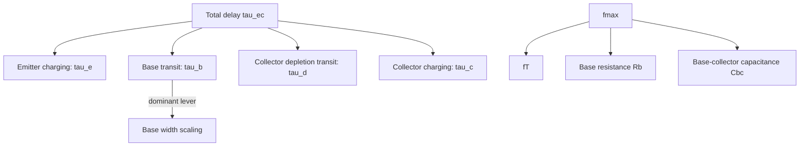
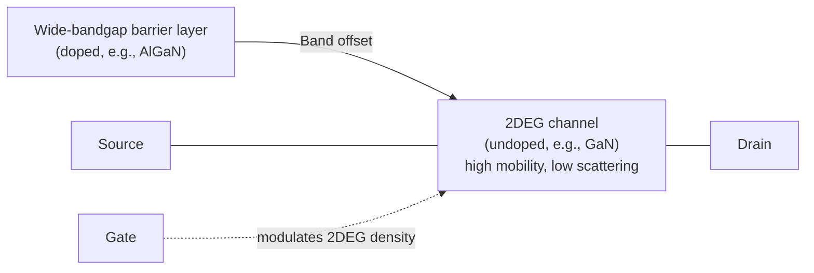

## High Frequency Transistor Design Considerations

### Fundamental Frequency Limitations

Transistor high-frequency performance is fundamentally limited by two competing physical mechanisms: the **time carriers take to traverse the device** (transit time) and the **time required to charge parasitic capacitances** (RC delay) through associated resistances. Nearly all high-frequency design techniques reduce to minimizing one or both of these delay contributions while managing the tradeoffs each introduces.

### Cutoff Frequency ($f_T$)

The **unity current-gain cutoff frequency** $f_T$ is the frequency at which short-circuit current gain drops to unity, and is the primary figure of merit for intrinsic transistor speed:

$$f_T = \frac{1}{2\pi\tau_{ec}}$$

where $\tau_{ec}$ is the total emitter-to-collector delay, itself a sum of several physical delay components:

$$\tau_{ec} = \tau_e + \tau_b + \tau_d + \tau_c$$

- $\tau_e$: emitter charging time (charging the emitter-base junction capacitance through emitter/differential resistance)
- $\tau_b$: base transit time (time for carriers to diffuse/drift across the neutral base)
- $\tau_d$: collector depletion region transit time (drift across the base-collector space-charge region)
- $\tau_c$: collector charging time (collector resistance charging collector-substrate capacitance)

**Key Points**

- $\tau_b \propto W_B^2/D_n$ for a diffusion-dominated base — this quadratic dependence on base width is why **base width reduction** is one of the single most impactful levers for increasing $f_T$, motivating the move to thin, heavily doped or graded bases.
- Introducing a built-in drift field in the base (via graded doping or graded bandgap, as in SiGe HBTs) converts transport from pure diffusion toward drift-assisted transport, reducing $\tau_b$ further since drift transit time scales linearly (not quadratically) with width.
- $\tau_d$ is minimized by keeping the collector depletion width as thin as practically possible without excessively raising collector-base capacitance or reducing breakdown voltage — a direct **speed-vs-breakdown-voltage tradeoff**.

### Maximum Oscillation Frequency ($f_{max}$)

While $f_T$ characterizes current-gain rolloff, **$f_{max}$** — the frequency at which unilateral power gain drops to unity — better reflects a device's usefulness as a practical power amplifier or oscillator, since it incorporates parasitic resistance effects that $f_T$ does not:

$$f_{max} \approx \sqrt{\frac{f_T}{8\pi R_bC_{bc}}}$$

**Key Points**

- $f_{max}$ depends critically on **base resistance** $R_b$ and **base-collector (feedback) capacitance** $C_{bc}$ — parameters largely absent from the $f_T$ formula but dominant in real RF power/gain performance.
- A device can have very high $f_T$ but poor $f_{max}$ if base resistance is not simultaneously minimized — this decoupling is why both figures of merit must be reported and optimized together, and why base contact/geometry design is as important as base width scaling.
- Reducing $R_b$ typically requires increasing base doping (tradeoff: increased base doping raises base-emitter capacitance and can degrade emitter injection efficiency/current gain $\beta$) or optimizing base contact geometry (multiple base fingers, self-aligned contacts) to reduce the distributed lateral resistance carriers must traverse to reach the base contact.

### Base Width and Punch-Through Considerations

Aggressive base-width scaling to boost $f_T$ is bounded by **punch-through**: if the base-collector depletion region under reverse bias extends across the entire neutral base width and merges with the base-emitter depletion region, the transistor loses normal bipolar action entirely. This sets a practical lower bound on achievable base width for a given base doping concentration and target breakdown voltage, requiring careful co-design of base doping profile alongside width.

### Heterojunction Approaches: HBTs

**Heterojunction Bipolar Transistors (HBTs)** address a core tradeoff in conventional BJTs — that increasing base doping to reduce $R_b$ degrades emitter injection efficiency — by using a **wider-bandgap emitter** (e.g., AlGaAs emitter on a GaAs base, or SiGe base within a Si emitter/collector) rather than a homojunction:

- The bandgap discontinuity at the emitter-base heterojunction suppresses hole back-injection into the emitter (in an npn device) nearly independent of base doping level, since the valence-band offset creates a large energy barrier for holes while presenting little or no additional barrier to electron injection into the base.
- This decouples the injection-efficiency/doping-level tradeoff that constrains homojunction BJTs, allowing the base to be doped heavily (minimizing $R_b$) **without** sacrificing current gain $\beta$ — directly benefiting $f_{max}$ without penalizing $\beta$.
- **SiGe HBTs** additionally use a graded Ge profile across the base to create a built-in quasi-electric field, further reducing base transit time via drift-assisted transport, and are widely used in mainstream high-speed digital and RF ICs due to compatibility with standard Si-based BiCMOS processing.

### HEMT (High Electron Mobility Transistor) Structures

For the highest-frequency FET applications (mm-wave, THz), **HEMTs** replace the doped-channel MOSFET/MESFET architecture with a **two-dimensional electron gas (2DEG)** formed at a heterojunction interface between two different-bandgap III-V materials (commonly AlGaAs/GaAs or AlGaN/GaN):

**Key Points**

- Electrons transfer from the wider-bandgap, doped donor layer (e.g., AlGaAs) into the narrower-bandgap, **undoped** channel layer (e.g., GaAs), where they are confined in a narrow quantum well at the heterointerface, forming the 2DEG.
- Because the 2DEG channel itself is undoped, carriers experience minimal **ionized impurity scattering**, yielding electron mobility far exceeding that achievable in a doped MOSFET channel — directly boosting both saturation velocity-limited current drive and $f_T$.
- Modulation doping (spatial separation of dopants from the conducting channel) is the key physical innovation distinguishing HEMTs from conventional MESFETs, where the channel itself must be doped and therefore suffers impurity scattering.
- GaN HEMTs additionally benefit from strong spontaneous and piezoelectric polarization fields at the AlGaN/GaN interface, which help form a very high-density 2DEG without requiring explicit donor doping in the barrier layer, alongside GaN's high breakdown field — making GaN HEMTs attractive for combined high-frequency **and** high-power RF applications (a combination difficult to achieve simultaneously in Si or GaAs devices).

### Parasitic Reduction Techniques

Beyond intrinsic material/structure choices, several layout- and process-level techniques directly target parasitic RC reduction:

- **Self-aligned contacts/processes**: minimize spacing (and therefore series resistance and parasitic capacitance) between active device regions and their metal contacts by using the gate/emitter structure itself as an alignment mask for subsequent implants or contact formation.
- **T-gate or mushroom-gate structures** (common in HEMTs): a narrow gate "foot" contacting the channel (minimizing gate capacitance and channel length) combined with a wider gate "head" (minimizing gate resistance) — directly addressing the $f_{max}$ dependence on gate/base resistance without sacrificing the short channel length needed for high $f_T$.
- **Multi-finger/interdigitated layouts**: for both BJTs/HBTs and FETs, splitting a wide device into many narrower parallel fingers reduces the effective distributed base/gate resistance path length, improving $f_{max}$ at a given total device periphery/current-handling capability.
- **Reduced parasitic capacitance layout**: minimizing overlap areas between gate/base and source/drain or collector regions, often via recessed or self-aligned structures.

### Substrate and Packaging Considerations

- **Substrate resistivity**: for monolithic RF ICs, low-resistivity Si substrates introduce substrate coupling loss and parasitic capacitance to ground; high-resistivity substrates or SOI (silicon-on-insulator) are commonly used to reduce substrate-related parasitics in RF CMOS/BiCMOS design.
- **Interconnect parasitics**: at mm-wave frequencies, even on-chip interconnect lines behave as transmission lines rather than lumped elements, requiring electromagnetic (EM) co-simulation alongside device-level design — a shift from simpler lumped RC parasitic extraction used at lower frequencies. [Inference: the frequency threshold at which transmission-line effects become dominant depends on specific interconnect geometry and dielectric stack.]

### Device Comparison for High-Frequency Applications

| Device Type | Typical $f_T$ Range | Typical Application |
| --- | --- | --- |
| Si BJT | Tens of GHz | Legacy RF, low-cost analog |
| SiGe HBT | 200–300+ GHz | RF/mmWave ICs, BiCMOS integration |
| GaAs HBT | 100s of GHz | Power amplifiers (handset PAs) |
| GaAs pHEMT | 100s of GHz | Low-noise amplifiers (LNAs) |
| GaN HEMT | 10s–100s of GHz | High-power RF (base stations, radar) |
| InP HEMT | >500 GHz (research) | THz/ultra-high-speed instrumentation |

[Inference: specific $f_T$/$f_{max}$ values are highly process-node- and vendor-dependent; ranges above reflect broad technology-class positioning rather than any single datasheet figure.]

### Design Tradeoff Summary

**Key Points**

- **Speed vs. breakdown voltage**: thinner base/collector regions raise $f_T$/$f_{max}$ but lower avalanche breakdown voltage, constraining maximum operating voltage/power handling.
- **Speed vs. gain/noise**: aggressive scaling to raise $f_T$ can increase gate/base leakage and degrade minimum noise figure if not carefully co-optimized with parasitic capacitance reduction.
- **$f_T$ vs. $f_{max}$**: optimizing purely for vertical transit-time reduction (raising $f_T$) does not guarantee improved $f_{max}$ unless base/gate resistance and feedback capacitance are addressed in parallel — real RF design requires balancing both figures of merit against the target application (digital switching speed favors $f_T$; power-gain/oscillator applications favor $f_{max}$).

**Related Topics**

- Heterojunction bipolar transistor (HBT) physics and design
- HEMT structures and two-dimensional electron gas physics
- RF power amplifier design and load-pull matching
- Noise figure and low-noise amplifier (LNA) design
- Transmission line effects and on-chip interconnect modeling
- GaN power device physics and breakdown engineering
- SiGe BiCMOS process integration