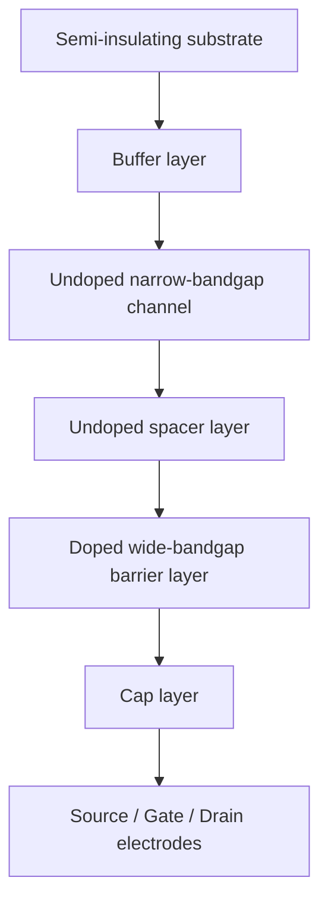
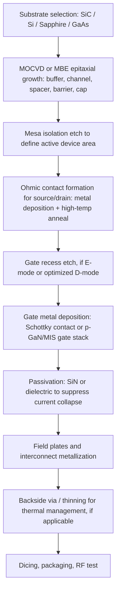

## High Electron Mobility Transistors

### Overview

High Electron Mobility Transistors (HEMTs) are field-effect devices that exploit a heterojunction between two semiconductors with different bandgaps to confine a high-mobility electron gas in an undoped channel. This device is also known as a Modulation-Doped FET (MODFET), Heterostructure FET (HFET), or Two-Dimensional Electron Gas FET (TEGFET). By spatially separating the ionized dopants from the conducting electrons, HEMTs achieve carrier mobilities far exceeding those of conventional MOSFETs or MESFETs, making them the device of choice for low-noise and high-power RF/microwave amplification, from cellular base stations through satellite communications and radar.

### Physical Structure

A typical HEMT is grown epitaxially, layer by layer, on a semi-insulating substrate:

- **Substrate**: semi-insulating GaAs, SiC, or Si, chosen for thermal and lattice properties
- **Buffer layer**: thick, high-purity layer that absorbs substrate defects and isolates the active region
- **Channel layer**: undoped, narrow-bandgap material (e.g., GaAs, InGaAs, GaN) where the two-dimensional electron gas (2DEG) forms
- **Spacer layer**: thin undoped wide-bandgap layer (a few nm) separating the channel from the doped donor layer, reducing Coulomb scattering from ionized dopants
- **Donor (barrier) layer**: doped, wide-bandgap material (e.g., AlGaAs, AlGaN) that supplies electrons to the channel via modulation doping
- **Schottky/cap layer**: thin heavily doped layer under the gate to form a low-resistance ohmic contact region and protect the barrier
- **Gate, source, drain electrodes**: gate forms a Schottky contact on the barrier; source/drain are ohmic contacts reaching down to the 2DEG

### Cross-Sectional Device Diagram (svg_diagram)

<svg xmlns="http://www.w3.org/2000/svg" viewBox="0 0 700 380" font-family="Arial, sans-serif">
<text x="350" y="22" font-size="16" text-anchor="middle" font-weight="bold">HEMT Cross-Section (svg_diagram)</text>

<rect x="80" y="300" width="540" height="50" fill="#cfd8dc" stroke="#37474f" />
<text x="350" y="330" font-size="13" text-anchor="middle">Semi-insulating Substrate (e.g., SiC, GaAs)</text>

<rect x="80" y="270" width="540" height="30" fill="#b0bec5" stroke="#37474f" />
<text x="350" y="290" font-size="12" text-anchor="middle">Buffer Layer</text>

<rect x="80" y="245" width="540" height="25" fill="#90caf9" stroke="#1565c0" />
<text x="350" y="262" font-size="12" text-anchor="middle">Channel (narrow-bandgap, undoped)</text>

<line x1="80" y1="245" x2="620" y2="245" stroke="#d32f2f" stroke-width="2" stroke-dasharray="4,2" />
<text x="350" y="240" font-size="11" fill="#d32f2f" text-anchor="middle">2DEG channel at heterointerface</text>

<rect x="80" y="225" width="540" height="20" fill="#e1f5fe" stroke="#1565c0" />
<text x="350" y="239" font-size="10" text-anchor="middle">Undoped spacer</text>

<rect x="80" y="185" width="540" height="40" fill="#ffcc80" stroke="#e65100" />
<text x="350" y="209" font-size="12" text-anchor="middle">Doped wide-bandgap barrier (e.g., AlGaN, AlGaAs)</text>

<rect x="80" y="165" width="540" height="20" fill="#ffe0b2" stroke="#e65100" />
<text x="350" y="179" font-size="10" text-anchor="middle">Cap layer</text>

<rect x="110" y="130" width="70" height="35" fill="#616161" />
<text x="145" y="152" font-size="12" fill="white" text-anchor="middle">Source</text>

<rect x="315" y="120" width="70" height="45" fill="#212121" />
<text x="350" y="147" font-size="12" fill="white" text-anchor="middle">Gate</text>

<rect x="520" y="130" width="70" height="35" fill="#616161" />
<text x="555" y="152" font-size="12" fill="white" text-anchor="middle">Drain</text>

<line x1="185" y1="257" x2="515" y2="257" stroke="#2e7d32" stroke-width="2" marker-end="url(#arrow)" />
<text x="350" y="272" font-size="10" fill="#2e7d32" text-anchor="middle">Electron transport (high mobility)</text>
</svg>

### Operating Principle: The Two-Dimensional Electron Gas

The defining physics of a HEMT is **modulation doping**. In conventional doped semiconductors, the free carriers and their parent donor atoms occupy the same region, so electrons are continually scattered by ionized impurity potentials, degrading mobility. In a HEMT:

1. Donor atoms are placed only in the wide-bandgap barrier layer.
2. Electrons from these donors, being energetically favorable to occupy the lower conduction-band minimum, diffuse across the heterojunction into the adjacent undoped narrow-bandgap channel.
3. This charge transfer bends the energy bands and creates a roughly triangular quantum well at the heterointerface, confining the transferred electrons into a quasi-two-dimensional sheet: the 2DEG.
4. Because the 2DEG resides in undoped material, ionized impurity scattering is drastically reduced (further reduced by the spacer layer), yielding electron mobilities that can exceed 8,000–9,000 cm²/(V·s) at room temperature in GaAs-based systems, and remain very high even at cryogenic temperatures where phonon scattering also drops out.

The **sheet carrier density** $n_s$ of the 2DEG is set by the conduction-band discontinuity $\Delta E_c$, the barrier doping/thickness, and the gate bias. A simplified charge-control model treats the structure as a parallel-plate capacitor between gate and channel:

$$n_s(V_{GS}) = \frac{\varepsilon}{q\,d}\left(V_{GS} - V_{th}\right)$$

where $\varepsilon$ is the barrier permittivity, $d$ is the effective gate-to-channel distance (barrier + spacer thickness), $q$ is the electron charge, and $V_{th}$ is the threshold voltage. Applying a negative gate voltage (for a depletion-mode, normally-on device) depletes the 2DEG, pinching off conduction, analogous to a MESFET but with the channel free of dopant scattering.

### Band Diagram Concept (svg_diagram)

<svg xmlns="http://www.w3.org/2000/svg" viewBox="0 0 600 280" font-family="Arial, sans-serif">
<text x="300" y="20" font-size="15" text-anchor="middle" font-weight="bold">Conduction Band Bending at Heterojunction (svg_diagram)</text>
<line x1="50" y1="250" x2="550" y2="250" stroke="#000" stroke-width="1" />
<text x="300" y="270" font-size="11" text-anchor="middle">Position across heterostructure</text>

<path d="M50,90 L250,90" stroke="#1565c0" stroke-width="2" fill="none" />

<path d="M250,90 Q290,90 300,190" stroke="#1565c0" stroke-width="2" fill="none" />

<path d="M300,190 Q310,230 330,190" stroke="#1565c0" stroke-width="2" fill="none" />

<path d="M330,190 L550,190" stroke="#1565c0" stroke-width="2" fill="none" />

<text x="150" y="80" font-size="11" text-anchor="middle">Doped barrier (AlGaN/AlGaAs)</text>

<text x="440" y="180" font-size="11" text-anchor="middle">Undoped channel (GaN/GaAs)</text>

<line x1="50" y1="210" x2="550" y2="210" stroke="#d32f2f" stroke-width="1.5" stroke-dasharray="6,3" />
<text x="500" y="205" font-size="10" fill="#d32f2f">E_F</text>

<circle cx="315" cy="215" r="3" fill="#2e7d32" />
<circle cx="322" cy="218" r="3" fill="#2e7d32" />
<circle cx="328" cy="214" r="3" fill="#2e7d32" />
<text x="320" y="240" font-size="10" fill="#2e7d32" text-anchor="middle">2DEG</text>

<text x="150" y="60" font-size="10" text-anchor="middle">E_c (barrier)</text>

<text x="330" y="165" font-size="10" text-anchor="middle">ΔE_c</text>

</svg>

### Key Material Systems

**Key Points**

- **GaAs/AlGaAs HEMT**: the original system (Mimura, Fujitsu, 1980); excellent for low-noise applications up to tens of GHz; mature, low-defect epitaxy on GaAs substrates.
- **InGaAs/InAlAs on InP HEMT (pHEMT/mHEMT variants)**: pseudomorphic or metamorphic layers with higher indium content increase conduction-band offset and electron mobility/velocity, enabling operation into the mm-wave range (>100 GHz), used in satellite LNAs and radio astronomy receivers.
- **GaN/AlGaN HEMT**: wide bandgap (~3.4 eV for GaN) gives very high breakdown field (~3.3 MV/cm) and strong spontaneous plus piezoelectric polarization at the heterointerface, which alone can induce a high-density 2DEG (>10¹³ cm⁻²) without intentional doping. This combination of high $n_s$, high breakdown voltage, and high saturation velocity makes GaN HEMTs dominant in high-power RF and power-switching applications.
- **AlN/GaN, ScAlN/GaN**: emerging barrier materials researched for even higher polarization charge and higher critical field; considered [Speculation] to be candidates for next-generation mm-wave GaN power devices, though commercial maturity varies.

### GaN HEMT Polarization Effects

Unlike GaAs-based HEMTs where the 2DEG arises mainly from modulation doping, GaN-based HEMTs derive most of their 2DEG charge from **spontaneous and piezoelectric polarization** discontinuities at the AlGaN/GaN interface, a consequence of the wurtzite crystal structure's lack of inversion symmetry and the strain from lattice-mismatched AlGaN grown on GaN. This allows undoped AlGaN/GaN structures to still produce very high sheet carrier densities, which is a major reason GaN HEMTs sustain high current density alongside high breakdown voltage — a combination especially valuable for power amplifiers and power switching.

### Device Operation Regimes

**Example**

Consider an AlGaN/GaN HEMT biased as a depletion-mode (normally-on) device:

- At $V_{GS} = 0$ V, the 2DEG is fully populated and the channel conducts (drain current flows for any $V_{DS} > 0$).
- As $V_{GS}$ becomes increasingly negative, the depletion region under the gate extends downward, progressively removing electrons from the 2DEG.
- At $V_{GS} = V_{th}$ (a negative voltage, e.g., −3 V), the channel is fully pinched off and $I_D \approx 0$.
- For $V_{DS}$ small relative to $(V_{GS} - V_{th})$, the device operates in the linear (triode) region; as $V_{DS}$ increases, the channel pinches off near the drain and the device enters saturation, where $I_D$ becomes largely independent of $V_{DS}$ (subject to short-channel effects).

A simplified square-law saturation current (long-channel approximation, analogous to a MESFET/MOSFET) is:

$$I_{D,sat} = \frac{W}{2L}\mu_n C_g \left(V_{GS} - V_{th}\right)^2$$

where $W$ and $L$ are gate width and length, $\mu_n$ is the 2DEG electron mobility, and $C_g$ is the gate capacitance per unit area. In practice, short-gate-length RF HEMTs are velocity-saturated rather than mobility-limited, so current is better modeled using the saturation drift velocity $v_{sat}$:

$$I_{D,sat} \approx q\, n_s\, W\, v_{sat}$$

### Enhancement-Mode vs. Depletion-Mode HEMTs

- **Depletion-mode (D-mode)**: the 2DEG exists at $V_{GS} = 0$; device is normally on. This is the natural, easier-to-fabricate configuration, especially for GaN HEMTs given strong polarization-induced charge.
- **Enhancement-mode (E-mode)**: the 2DEG is absent at $V_{GS} = 0$; a positive gate voltage is required to induce conduction. E-mode is preferred in power-switching and digital-compatible circuits for fail-safe operation (no current flows if gate drive is lost). Common techniques to achieve E-mode GaN HEMTs include:
  - **Recessed gate**: etching away part of the AlGaN barrier under the gate to locally reduce polarization charge below threshold
  - **Fluorine ion implantation**: introducing negative fluorine ions beneath the gate to deplete the 2DEG at zero bias
  - **p-GaN gate**: a p-type GaN cap layer under the gate that depletes the underlying 2DEG via built-in junction potential, widely used commercially [Unverified: exact structural parameters vary by manufacturer]

### Why HEMTs Outperform Conventional FETs at RF

**Key Points**

- **High electron mobility** from undoped-channel transport translates into higher transconductance ($g_m$) and higher cutoff frequency $f_T$ for a given gate length.
- **High saturation velocity**, especially in InGaAs and GaN channels, supports operation well into the millimeter-wave band.
- **Low channel resistance and low parasitic capacitance** (with proper layout) support high power-added efficiency (PAE).
- **Wide bandgap (GaN, SiC-substrate GaN)** enables high breakdown voltage, so devices can be operated at higher drain bias, increasing output power density (W/mm of gate width) — a key metric where GaN HEMTs substantially exceed GaAs and Si LDMOS devices.
- Cutoff frequency is approximated as:

$$f_T \approx \frac{v_{sat}}{2\pi L_g}$$

showing why aggressive gate-length scaling ($L_g$) combined with high $v_{sat}$ pushes $f_T$ into the hundreds of GHz for advanced InP HEMTs.

### Key Figures of Merit

| Parameter | Symbol | Significance |
| --- | --- | --- |
| Sheet carrier density | $n_s$ | Sets maximum channel current |
| 2DEG electron mobility | $\mu_n$ | Governs low-field transconductance and noise |
| Threshold voltage | $V_{th}$ | Defines D-mode vs. E-mode operation |
| Transconductance | $g_m$ | Gain capability |
| Cutoff frequency | $f_T$ | Frequency where current gain = 1 |
| Maximum oscillation frequency | $f_{max}$ | Frequency where power gain = 1 |
| Breakdown voltage | $BV_{DS}$ | Maximum safe drain bias, critical for power HEMTs |
| Power density | — | Output RF power per mm of gate width (W/mm) |

### Fabrication Process Flow

**Key Points on Fabrication**

- **Epitaxial growth** (MOCVD or MBE) must achieve atomically abrupt heterointerfaces; interface roughness directly degrades 2DEG mobility.
- **Ohmic contacts** (commonly Ti/Al/Ni/Au stacks for GaN) require high-temperature rapid thermal annealing to achieve low contact resistance down to the buried 2DEG.
- **Gate recess** etching for E-mode devices must be tightly controlled since barrier thickness directly sets threshold voltage; nanometer-scale etch non-uniformity causes $V_{th}$ spread across a wafer.
- **Surface passivation** (typically SiN) is essential to suppress "current collapse," a trapping-related phenomenon where surface states capture electrons during high-voltage RF operation, transiently reducing drain current.
- **Field plates** (gate-connected or source-connected metal extensions) spread the peak electric field near the drain-side gate edge, raising breakdown voltage at the cost of added gate-drain capacitance.

### Reliability and Non-Ideal Effects

- **Current collapse / dynamic $R_{on}$**: trapping of electrons at surface or buffer defect states under high-voltage switching transiently increases on-resistance; mitigated via passivation, field plates, and buffer engineering.
- **Self-heating**: GaN-on-SiC benefits from SiC's high thermal conductivity; GaN-on-Si is more thermally constrained, requiring careful thermal design.
- **Hot-electron and inverse-piezoelectric effects**: high electric fields at the drain-side gate edge can cause strain-induced defect generation over time, a key long-term reliability concern in GaN power HEMTs. [Inference: exact degradation mechanisms and lifetimes are device- and process-dependent and continue to be studied]
- **Gate leakage**: Schottky gates exhibit reverse leakage current that increases with drain bias and temperature; MIS-gate (metal-insulator-semiconductor) structures are used to suppress this at the cost of some transconductance.

### Applications

**Key Points**

- **Low-noise amplifiers (LNAs)**: satellite receivers, radio astronomy, radar front-ends — leveraging low-noise-figure InGaAs/InAlAs and GaAs pHEMTs
- **Power amplifiers**: cellular base stations, radar transmitters, electronic warfare systems — dominated by GaN-on-SiC HEMTs due to high power density and efficiency
- **Power switching converters**: E-mode GaN HEMTs in DC-DC converters, fast chargers, and motor drives, competing with and replacing silicon MOSFETs/IGBTs at high frequency
- **5G/mm-wave infrastructure**: GaN HEMTs increasingly used in massive MIMO base station power amplifiers due to high efficiency and bandwidth
- **Cryogenic and quantum instrumentation**: ultra-low-noise HEMT amplifiers used in front-ends for quantum computing readout and deep-space communication, exploiting extremely high mobility at cryogenic temperatures

### Comparison with Related Devices

| Device | Channel | Key Advantage | Key Limitation |
| --- | --- | --- | --- |
| MESFET | Doped bulk semiconductor | Simpler structure | Ionized impurity scattering limits mobility |
| MOSFET (Si) | Inversion layer at oxide interface | Mature, low cost, high integration | Lower mobility, lower breakdown for power RF |
| HEMT | Undoped 2DEG at heterointerface | High mobility, high $f_T$/$f_{max}$, high power density (GaN) | Complex epitaxy, reliability (trapping, self-heating) |

### Related Topics

- MESFET operation and comparison
- GaN power electronics and E-mode device design
- MOCVD and MBE epitaxial growth techniques
- Quantum well and 2DEG transport physics
- Schottky and MIS gate contact engineering
- RF small-signal and large-signal transistor models (e.g., Angelov, EEHEMT)
- Noise figure theory in microwave transistors
- Thermal management in wide-bandgap power devices (GaN-on-SiC, diamond substrates)
- III-V compound semiconductor material systems
- Power amplifier classes (Class A/AB/E/F) for RF design