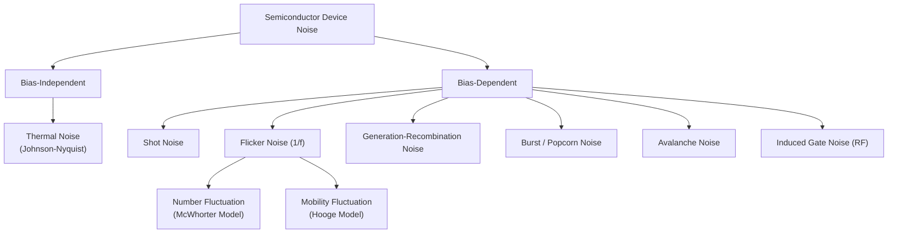

## Noise Sources in Semiconductor Devices

### Overview

Electronic noise in semiconductor devices refers to spontaneous, random fluctuations in current or voltage that arise from the discrete nature of charge carriers and the microscopic physical processes governing their transport. Noise sets the fundamental lower limit on the smallest signal a device or circuit can detect or amplify, making it a central concern in RF front-ends, low-noise amplifiers (LNAs), mixers, oscillators, and precision analog circuits.

Noise is generally categorized by its physical origin and its frequency dependence. The dominant mechanisms are thermal noise, shot noise, flicker (1/f) noise, generation-recombination (G-R) noise, burst (popcorn) noise, and avalanche noise, along with noise arising in specific device structures such as diffusion noise and induced gate noise.

---

### Thermal Noise (Johnson–Nyquist Noise)

**Physical Origin**

Thermal noise arises from the random thermal motion of charge carriers (electrons/holes) in a resistive medium, independent of any applied DC bias. It exists in any component with real resistance, including the parasitic resistances of semiconductor devices (base resistance, gate resistance, channel resistance, contact resistance).

**Key Points**

- Discovered experimentally by J. B. Johnson (1928) and explained theoretically by Harry Nyquist (1928)
- Present even at zero current flow — purely a function of temperature and resistance
- White noise: power spectral density is flat (frequency-independent) up to very high frequencies (into the THz range, where quantum corrections become relevant)

**Governing Equation**

The mean-square thermal noise voltage generated by a resistor $R$ over bandwidth $\Delta f$ at temperature $T$ is:

$$\overline{v_n^2} = 4kTR\,\Delta f$$

The equivalent mean-square noise current (Norton equivalent) is:

$$\overline{i_n^2} = \frac{4kT\,\Delta f}{R}$$

where:

- $k$ = Boltzmann's constant ($1.38 \times 10^{-23}\ \text{J/K}$)
- $T$ = absolute temperature (K)
- $R$ = resistance ($\Omega$)
- $\Delta f$ = noise bandwidth (Hz)

**Example**

A $1\ \text{k}\Omega$ resistor at $T = 300\ \text{K}$ over a $1\ \text{MHz}$ bandwidth:

$$\overline{v_n^2} = 4(1.38\times10^{-23})(300)(1000)(10^6) \approx 1.66\times10^{-11}\ \text{V}^2$$

$$v_{n,\text{rms}} \approx 4.07\ \mu\text{V}$$

**Relevance in Devices**

In MOSFETs, thermal noise from the channel resistance is the dominant broadband noise source, historically modeled as a drain current noise source:

$$\overline{i_{d}^2} = 4kT\gamma g_{m}\,\Delta f$$

where $g_m$ is the transconductance and $\gamma$ is a bias-dependent coefficient (ideally $2/3$ for long-channel devices in saturation; higher, up to 2–3, in short-channel devices due to hot-carrier effects) [Inference — the exact value of $\gamma$ for a specific short-channel process node depends on the technology and bias, and should be confirmed against foundry models].

In BJTs, thermal noise arises from the base spreading resistance $r_{bb'}$:

$$\overline{v_n^2} = 4kT\,r_{bb'}\,\Delta f$$

---

### Shot Noise

**Physical Origin**

Shot noise results from the discreteness of charge carriers crossing a potential barrier (e.g., a p-n junction depletion region) independently and randomly in time. Unlike thermal noise, shot noise requires a DC current to flow — it is associated with carriers overcoming a barrier via a Poisson-distributed emission process.

**Key Points**

- First described by Walter Schottky (1918) in the context of vacuum tube emission
- Also white noise (flat PSD) up to frequencies related to the transit time across the barrier
- Requires DC bias current; does not exist at zero current

**Governing Equation**

$$\overline{i_n^2} = 2qI_{DC}\,\Delta f$$

where:

- $q$ = elementary charge ($1.6 \times 10^{-19}\ \text{C}$)
- $I_{DC}$ = DC current through the junction (A)
- $\Delta f$ = bandwidth (Hz)

**Example**

For a diode carrying $I_{DC} = 1\ \text{mA}$ over $\Delta f = 1\ \text{MHz}$:

$$\overline{i_n^2} = 2(1.6\times10^{-19})(10^{-3})(10^6) = 3.2\times10^{-16}\ \text{A}^2$$

$$i_{n,\text{rms}} \approx 17.9\ \text{nA}$$

**Relevance in Devices**

- **BJTs**: Shot noise appears in both the base current ($2qI_B$) and collector current ($2qI_C$), since both cross the base-emitter junction barrier.
- **Diodes**: Dominant noise mechanism in forward- and reverse-biased p-n junctions.
- **MOSFETs**: Shot noise is generally *not* a dominant term because current flow in the channel is drift-dominated rather than barrier-crossing, though gate leakage current in ultra-thin-oxide devices does contribute shot noise.

---

### Flicker Noise (1/f Noise)

**Physical Origin**

Flicker noise dominates at low frequencies and arises primarily from two competing physical models:

1. **Number fluctuation (McWhorter model)**: Carriers randomly trapped and released by interface/oxide traps (e.g., at the Si–SiO₂ interface in a MOSFET) fluctuate the number of free carriers.
2. **Mobility fluctuation (Hooge model)**: Fluctuations in carrier mobility due to phonon scattering, characterized empirically by the Hooge parameter $\alpha_H$.

**Key Points**

- Power spectral density scales approximately as $1/f^{\alpha}$, with $\alpha$ typically close to 1 (commonly $0.8$–$1.2$)
- Also called "pink noise" or "flicker noise"
- Dominant at low frequencies; the frequency at which it equals the thermal/shot noise floor is called the **corner frequency** ($f_c$)
- MOSFETs generally exhibit significantly higher 1/f noise than BJTs, because conduction occurs at the oxide-semiconductor interface (rich in traps), whereas BJT conduction is a bulk phenomenon

**Governing Equation (MOSFET, number-fluctuation model)**

$$\overline{v_n^2} = \frac{K_f}{C_{ox}^2 W L f}\,\Delta f$$

where:

- $K_f$ = process-dependent flicker noise coefficient
- $C_{ox}$ = gate oxide capacitance per unit area
- $W, L$ = transistor width and length
- $f$ = frequency

**Design Implications**

- Larger gate area ($WL$) reduces flicker noise — a key reason large-area input devices are used in precision analog and low-frequency instrumentation amplifiers
- PMOS devices often show lower 1/f noise than NMOS in many CMOS processes, because holes are less likely to be trapped near the interface (buried-channel effects) [Inference — this trend is process-dependent and not universal across all foundries/technologies]
- Techniques like **chopper stabilization** and **correlated double sampling (CDS)** are used to mitigate 1/f noise in precision circuits by modulating the signal away from DC before amplification

---

### Generation-Recombination (G-R) Noise

**Physical Origin**

G-R noise arises from random fluctuations in the number of free carriers due to statistical generation and recombination processes, often mediated by trap/defect energy levels within the bandgap (Shockley-Read-Hall centers).

**Key Points**

- Produces a Lorentzian-shaped power spectral density (flat at low frequencies, rolling off at $-20\ \text{dB/decade}$ above a characteristic corner frequency related to the trap's time constant)
- Common in bulk semiconductor materials, photodetectors, and devices with significant defect densities
- A single dominant trap produces one Lorentzian; multiple traps with a distribution of time constants can sum to approximate a $1/f$-like spectrum over a range of frequencies

**Governing Equation**

$$S(f) = \frac{4\,\Delta N^2 \,\tau}{N^2\,(1 + (2\pi f \tau)^2)}$$

where $\Delta N^2$ is the variance in carrier number, $N$ is the mean carrier number, and $\tau$ is the trap time constant.

---

### Burst Noise (Popcorn Noise)

**Physical Origin**

Burst noise manifests as discrete, random step-like transitions in current between two (or more) levels, resembling a random telegraph signal (RTS). It is attributed to individual defect sites (typically heavy-metal ion contamination or specific oxide traps) that randomly capture and emit a single charge carrier near the junction or interface.

**Key Points**

- Named "popcorn noise" for the popping sound it produces when played through a speaker
- Amplitude is typically constant (fixed step height) regardless of bias, unlike other noise types
- Time between transitions can range from microseconds to seconds
- Strongly linked to fabrication defects/contamination — a quality indicator flagged during process control
- Frequency spectrum is Lorentzian, similar in shape to single-trap G-R noise, but usually with much larger amplitude relative to the DC level

---

### Avalanche Noise

**Physical Origin**

Occurs in reverse-biased p-n junctions operating near or in avalanche breakdown, where carriers gain sufficient kinetic energy from the electric field to generate electron-hole pairs via impact ionization. The resulting carrier multiplication is a highly random, non-uniform process.

**Key Points**

- Much larger in magnitude than shot noise
- Relevant in avalanche photodiodes (APDs), Zener/avalanche diodes used as noise or reference sources, and any RF device pushed into breakdown
- Sometimes deliberately exploited: avalanche diodes are used as **wideband white-noise generators** for noise figure test equipment

---

### Induced Gate Noise (MOSFET-Specific, High-Frequency)

**Physical Origin**

At RF frequencies, thermal noise generated in the channel capacitively couples through the gate oxide, inducing a noise current in the gate terminal. This becomes significant as operating frequency approaches or exceeds $f_T/5$ or so [Inference — the exact frequency threshold depends on device geometry and technology node].

**Key Points**

- Correlated with the channel (drain) thermal noise, characterized by a correlation coefficient $c$ (theoretically $c \approx j0.395$ for long-channel devices)
- Becomes a critical design consideration for LNA noise-matching in RF CMOS design above a few GHz
- Requires careful modeling in noise-matching network design since the correlated component affects optimum source impedance for minimum noise figure

---

### Diffusion Noise

**Physical Origin**

Related to shot noise but specifically associated with the random diffusion of minority carriers in the quasi-neutral regions of a bipolar junction (base region of a BJT, or bulk region of a diode). Because diffusion is itself a random walk process, it contributes an additional noise term beyond simple junction shot noise, particularly relevant at frequencies comparable to the inverse of the minority carrier transit time.

---

### Comparative Summary Table

| Noise Type | Requires DC Bias? | Spectral Shape | Dominant Frequency Range | Primary Physical Cause |
| --- | --- | --- | --- | --- |
| Thermal | No | White (flat) | All frequencies (up to THz) | Random thermal motion of carriers in resistance |
| Shot | Yes | White (flat) | All frequencies (up to transit-time limit) | Discrete carriers crossing a potential barrier |
| Flicker (1/f) | Yes | $1/f^\alpha$ | Low frequencies | Carrier trapping/detrapping, mobility fluctuation |
| Generation-Recombination | Yes | Lorentzian | Mid-to-low, trap-dependent | Trap-assisted carrier generation/recombination |
| Burst (Popcorn) | Yes | Lorentzian | Low frequencies | Single defect/trap capture-emission (RTS) |
| Avalanche | Yes (breakdown) | Broadband, non-white | Wideband | Impact ionization carrier multiplication |
| Induced Gate | Yes | Rises with $f^2$ | RF/high frequency | Capacitive coupling of channel noise to gate |

---

### Noise Figure and System-Level Impact

Device-level noise sources combine to determine a circuit's **noise figure (NF)**, a critical RF specification:

$$F = \frac{\text{SNR}_{in}}{\text{SNR}_{out}}$$

$$NF\ (\text{dB}) = 10\log_{10}(F)$$

For a cascade of stages, the **Friis noise formula** shows why the first stage (typically the LNA) dominates overall system noise:

$$F_{total} = F_1 + \frac{F_2 - 1}{G_1} + \frac{F_3 - 1}{G_1 G_2} + \cdots$$

where $F_n$ and $G_n$ are the noise factor and available power gain of stage $n$. This is why LNA design prioritizes minimizing intrinsic thermal, shot, and induced gate noise contributions above all else — subsequent stage noise is attenuated by the preceding gain.

---

### Mermaid Diagram — Noise Source Classification

---

### SVG Diagram — Noise Power Spectral Density vs. Frequency (svg_diagram)

<svg xmlns="http://www.w3.org/2000/svg" viewBox="0 0 640 380" font-family="sans-serif">
<text x="320" y="20" text-anchor="middle" font-size="14" font-weight="bold">Composite Noise Spectrum (svg_diagram)</text>
<line x1="70" y1="330" x2="600" y2="330" stroke="black" stroke-width="1.5" />
<line x1="70" y1="330" x2="70" y2="40" stroke="black" stroke-width="1.5" />
<text x="335" y="365" text-anchor="middle" font-size="12">Frequency (log scale) →</text>
<text x="25" y="190" text-anchor="middle" font-size="12" transform="rotate(-90 25 190)">PSD (log scale)</text>
<path d="M 90 100 Q 150 200 220 260 T 350 300 L 600 300" stroke="#c0392b" stroke-width="2.5" fill="none" />
<text x="120" y="95" font-size="11" fill="#c0392b">1/f (flicker) region</text>
<line x1="350" y1="300" x2="600" y2="300" stroke="#2980b9" stroke-width="2.5" />
<text x="450" y="290" font-size="11" fill="#2980b9">Thermal / Shot noise floor</text>
<line x1="350" y1="330" x2="350" y2="300" stroke="#7f8c8d" stroke-width="1" stroke-dasharray="4,3" />
<text x="350" y="345" text-anchor="middle" font-size="11" fill="#7f8c8d">f_c (corner freq.)</text>
<ellipse cx="480" cy="270" rx="10" ry="8" fill="none" stroke="#27ae60" stroke-width="2" />
<text x="500" y="255" font-size="11" fill="#27ae60">G-R bump (Lorentzian)</text>
</svg>

---

### Practical Design Implications

- **RF LNA design**: Minimize thermal noise (small channel resistance, optimal device sizing), account for induced gate noise at high frequency, and select bias current to trade off shot noise against gain and linearity.
- **Precision/DC-coupled analog design**: Flicker noise dominates; use larger devices, chopper stabilization, auto-zeroing, or correlated double sampling.
- **Reliability screening**: Burst noise and excess low-frequency noise (elevated $K_f$) are used as indicators of oxide defect density and reliability risk during wafer-level testing.
- **Avalanche photodiodes / breakdown devices**: Excess avalanche noise (characterized by the excess noise factor $F(M)$) must be included in receiver sensitivity calculations.

**Related Topics**

- Noise figure and noise factor cascading (Friis equation) in RF receiver chains
- Low-noise amplifier (LNA) topology design and input-referred noise matching
- MOSFET small-signal noise models ($\gamma$, $\delta$, correlation coefficient $c$)
- Phase noise in oscillators and its relation to 1/f upconversion
- Chopper stabilization and correlated double sampling circuit techniques
- Trap-assisted generation-recombination and Shockley-Read-Hall statistics
- Avalanche photodiode excess noise factor modeling