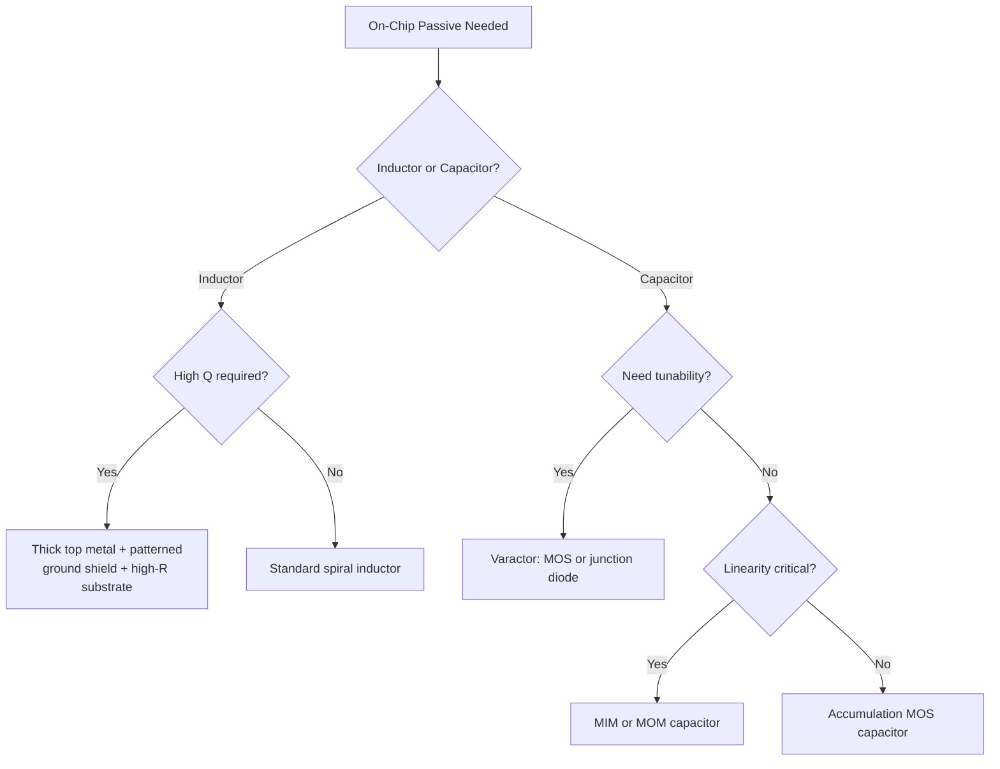

## Passive Device Integration: Inductors and Capacitors

### Overview

On-chip passive devices — inductors and capacitors — are essential building blocks for RF and analog integrated circuits, used in impedance matching networks, LC-tank oscillators, filters, baluns, and decoupling. Unlike active devices, passives are constrained primarily by the metal stack and substrate properties provided by the fabrication process rather than by doping profiles, making their integration a distinct co-design challenge between circuit designer and process/backend-of-line (BEOL) engineer.

The central difficulty in monolithic passive integration is that silicon substrates are lossy and moderately conductive compared to III-V or ceramic substrates, introducing parasitic coupling, eddy currents, and dielectric loss that degrade quality factor ($Q$) and self-resonant frequency (SRF) — the two dominant figures of merit for any integrated passive.

---

### On-Chip Spiral Inductors

**Physical Structure**

Integrated inductors are most commonly realized as planar spiral structures in the top (thickest, lowest-resistance) metal layers of the BEOL stack, typically square, octagonal, or circular in shape. A center-tap "underpass" routed in a lower metal layer connects the innermost turn back out.

**Key Parameters**

- **Inductance ($L$)**: determined by number of turns $n$, outer diameter, turn spacing, and metal width; approximated by empirical models such as the modified Wheeler formula:

$$L \approx K_1 \mu_0 \frac{n^2 d_{avg}}{1 + K_2\rho}$$

where $d_{avg}$ is the average diameter, $\rho = (d_{out}-d_{in})/(d_{out}+d_{in})$ is the fill ratio, and $K_1, K_2$ are shape-dependent constants (for square spirals, $K_1 \approx 2.34$, $K_2 \approx 2.75$).

- **Quality Factor ($Q$)**: ratio of stored energy to energy dissipated per cycle:

$$Q = \frac{\omega L}{R_s}$$

where $R_s$ is the effective series resistance, including DC metal resistance and frequency-dependent skin-effect and substrate-loss contributions.

- **Self-Resonant Frequency (SRF)**: the frequency at which the inductor's parasitic capacitance (turn-to-turn, turn-to-substrate) resonates with $L$, above which the structure behaves capacitively rather than inductively:

$$f_{SRF} = \frac{1}{2\pi\sqrt{LC_p}}$$

**Loss Mechanisms**

1. **Series metal resistance**: Ohmic loss in the spiral trace, worsened at high frequency by the **skin effect** (current crowds to the conductor surface) and **proximity effect** (current crowding due to adjacent turns' magnetic fields)
2. **Substrate loss (eddy currents)**: Time-varying magnetic flux from the spiral induces eddy currents in the conductive silicon substrate beneath it, which oppose the original field (per Lenz's law) and dissipate energy resistively
3. **Substrate loss (capacitive/dielectric)**: Displacement current through the oxide into the lossy substrate, particularly significant on standard (low-resistivity) CMOS substrates

**Design/Process Techniques to Improve Q**

| Technique | Mechanism |
| --- | --- |
| Thick top metal (e.g., "RDL" or thick Cu redistribution layer) | Reduces DC and skin-effect series resistance |
| Patterned ground shield (PGS) | Slotted metal shield between inductor and substrate; slots break eddy current loops while grounding displacement current, but must be slotted perpendicular to current flow or it re-introduces loss |
| High-resistivity substrate | Reduces substrate eddy current and dielectric loss (common in RF-SOI and SiGe BiCMOS processes) |
| Differential (symmetric) inductor layout | Doubles effective inductance for a given area and improves $Q$ by ~30–40% versus two single-ended inductors, since mutual coupling between the two halves is constructive [Inference — exact improvement is layout- and technology-dependent] |
| Deep trench isolation beneath inductor | Increases effective substrate resistivity locally |
| Through-silicon substrate removal / suspended inductors (MEMS post-processing) | Removes substrate loss almost entirely; used in high-Q custom RF-MEMS flows |

**Typical Performance**

Standard bulk CMOS on-chip spiral inductors typically achieve $Q$ in the range of 5–15 at a few GHz; RF-SOI, SiGe BiCMOS with thick top metal, or GaAs/III-V processes can reach $Q > 20$–30 [Inference — actual achievable $Q$ is strongly process- and layout-dependent and should be verified against the specific PDK].

---

### Alternative Inductor Topologies

- **Symmetric/differential spiral inductors**: Used directly in differential LC-tank VCOs; center-tapped for bias injection
- **Stacked (multi-metal) inductors**: Series-connect spirals across multiple metal layers to increase inductance density at the cost of higher parasitic capacitance and lower SRF — useful when die area is at a premium
- **Transformers (integrated)**: Two magnetically coupled spirals (primary/secondary), used for impedance transformation, baluns, and inter-stage coupling in RF PAs and LNAs
- **Bond-wire inductors**: Package bond wires exploited as high-$Q$ inductors (since they are suspended in air, avoiding substrate loss entirely) — common in older/cost-sensitive RF designs, though less reproducible than on-chip structures
- **3D solenoid / through-silicon-via (TSV) inductors**: Advanced integration option in some SiP/interposer flows for higher inductance density [Inference — availability is limited to specific advanced packaging processes]

---

### On-Chip Capacitors

Integrated capacitors are used for decoupling, filtering, LC-tank tuning, and AC coupling. Several distinct structures trade off capacitance density, linearity, $Q$, voltage coefficient, and process compatibility.

#### 1. Metal-Insulator-Metal (MIM) Capacitors

**Structure**: A thin dielectric (e.g., $\text{SiO}_2$, $\text{Si}_3\text{N}_4$, or high-$k$ dielectric) sandwiched between two dedicated metal plates, added as an extra BEOL module.

**Key Points**

- High linearity (very low voltage coefficient of capacitance, VCC) because both plates are metal (no depletion effects)
- Good matching between capacitors on the same die, important for filter/DAC applications
- Typical capacitance density: ~1–5 $\text{fF}/\mu\text{m}^2$ depending on dielectric thickness/material [Inference — exact density is process-node specific]
- Governing equation: parallel-plate capacitance

$$C = \frac{\varepsilon_0 \varepsilon_r A}{d}$$

where $A$ is plate overlap area and $d$ is dielectric thickness.

#### 2. Metal-Oxide-Metal (MOM) / Interdigitated Finger Capacitors

**Structure**: Uses lateral (fringing) capacitance between interdigitated comb-like metal fingers within a single or multiple standard interconnect metal layers — no extra mask/process step required.

**Key Points**

- Fully compatible with standard digital CMOS BEOL (no added mask), making it the lowest-cost option
- Capacitance density scales with the number of stacked metal layers and minimum lateral spacing allowed by the design rules — smaller process nodes (finer metal pitch) directly increase MOM density
- Lower $Q$ than MIM at a given frequency due to longer, thinner conduction paths (higher series resistance)
- Commonly used for high-density digital-adjacent decoupling and where an extra MIM mask is not available or economical

#### 3. MOS Capacitors (Accumulation-Mode / Inversion-Mode)

**Structure**: Uses the gate oxide of a MOSFET-like structure as the dielectric, with the channel/well acting as the bottom plate.

**Key Points**

- Highest capacitance density of common on-chip options (gate oxide is extremely thin) — but:
- Strongly **voltage-dependent** capacitance (nonlinear $C$-$V$ curve), since the bottom "plate" charge (inversion or accumulation layer) depends on applied bias
- **Accumulation-mode MOS capacitors** (built in an n-well with n+ source/drain, avoiding a true inversion layer) offer better linearity and lower series resistance than classic inversion-mode MOS caps, and are the preferred variant for analog/RF varactor-adjacent uses
- Used deliberately as **varactors** (voltage-variable capacitors) in VCO tuning applications, where the nonlinearity is the desired feature rather than a defect

#### 4. Junction (Varactor) Capacitors

**Structure**: Reverse-biased p-n junction, where capacitance arises from the voltage-dependent depletion width.

$$C_j(V_R) = \frac{C_{j0}}{\left(1 + \frac{V_R}{V_{bi}}\right)^m}$$

where $C_{j0}$ is zero-bias capacitance, $V_{bi}$ is built-in potential, $V_R$ is reverse bias, and $m$ is the grading coefficient (½ for abrupt junctions, ⅓ for linearly graded junctions).

**Key Points**

- Used specifically as tunable capacitors (varactor diodes) in VCOs and tunable filters
- Lower $Q$ than MIM/MOM at high frequency due to series resistance of the lightly doped side of the junction
- Hyperabrupt junction profiles are engineered to linearize the tuning characteristic ($C$ vs. $V$) for wider, more linear VCO tuning range

#### 5. Deep Trench Capacitors (DTC)

**Structure**: Capacitor formed in a high-aspect-ratio trench etched into the silicon substrate, lined with dielectric and filled with conductive material — dramatically increases effective plate area within a small footprint.

**Key Points**

- Very high capacitance density (used heavily in eDRAM and some RF decoupling applications)
- Requires dedicated trench-etch process module (added cost/complexity)
- Common in high-density decoupling for SoCs and specialized RF SOI processes

---

### Comparative Summary: Capacitor Options

| Type | Linearity | Density | Q (RF) | Extra Mask? | Typical Use |
| --- | --- | --- | --- | --- | --- |
| MIM | Excellent | Medium | High | Yes | Filters, matched pairs, RF tanks |
| MOM | Excellent | Medium (scales w/ node) | Medium | No | Decoupling, general digital-adjacent |
| Accumulation MOS | Poor–moderate (bias-dependent) | Highest | Medium | No | Bulk decoupling, coarse tuning |
| Junction (Varactor) | Deliberately nonlinear | Low–medium | Low–medium | No | VCO tuning |
| Deep Trench | Excellent | Very high | Medium | Yes | High-density decoupling, eDRAM |

---

### Substrate and Packaging Considerations

- **Substrate resistivity** is the single largest lever over passive performance in silicon-based processes: standard bulk CMOS (~10 Ω·cm) suffers significant substrate loss, while RF-SOI or high-resistivity substrates (~1–10 kΩ·cm) markedly improve inductor $Q$ and reduce substrate-coupled noise/crosstalk.
- **Parasitic coupling** between adjacent passives and to substrate-borne digital switching noise necessitates guard rings, ground shielding, and physical separation in mixed-signal SoCs.
- **Package-level passives** (e.g., IPD — Integrated Passive Devices — on a separate glass/ceramic/GaAs substrate, or embedded in advanced packaging/interposers) are increasingly used to offload high-$Q$ inductors and precision capacitors from the main die, especially in RF front-end modules (FEMs) where die area and substrate loss are at a premium.

---

### Mermaid Diagram — Passive Integration Decision Flow

---

### SVG Diagram — Spiral Inductor Cross-Section (svg_diagram)

<svg xmlns="http://www.w3.org/2000/svg" viewBox="0 0 640 340" font-family="sans-serif">
<text x="320" y="20" text-anchor="middle" font-size="14" font-weight="bold">Spiral Inductor Cross-Section (svg_diagram)</text>
<rect x="60" y="260" width="520" height="50" fill="#95a5a6" />
<text x="320" y="290" text-anchor="middle" font-size="12">Silicon Substrate (lossy, eddy currents)</text>
<rect x="60" y="230" width="520" height="30" fill="#ecf0f1" stroke="#bdc3c7" />
<text x="320" y="250" text-anchor="middle" font-size="10">Inter-metal Dielectric / Field Oxide</text>
<rect x="140" y="205" width="60" height="12" fill="#7f8c8d" />
<rect x="440" y="205" width="60" height="12" fill="#7f8c8d" />
<text x="320" y="215" text-anchor="middle" font-size="9" fill="#7f8c8d">Patterned Ground Shield (slotted)</text>
<rect x="110" y="80" width="30" height="14" fill="#d35400" />
<rect x="180" y="80" width="30" height="14" fill="#d35400" />
<rect x="250" y="80" width="30" height="14" fill="#d35400" />
<rect x="360" y="80" width="30" height="14" fill="#d35400" />
<rect x="430" y="80" width="30" height="14" fill="#d35400" />
<rect x="500" y="80" width="30" height="14" fill="#d35400" />
<text x="320" y="70" text-anchor="middle" font-size="11" fill="#d35400">Top Thick Metal Spiral Turns (cross-section)</text>
<path d="M 140 94 Q 320 130 500 94" stroke="#2980b9" stroke-width="1" fill="none" stroke-dasharray="3,3" />
<text x="320 " y="140" text-anchor="middle" font-size="9" fill="#2980b9">Magnetic flux loops</text>
<path d="M 100 260 Q 320 240 540 260" stroke="#c0392b" stroke-width="1.2" fill="none" stroke-dasharray="2,2" />
<text x="320" y="235" text-anchor="middle" font-size="9" fill="#c0392b">Induced eddy currents in substrate</text>
</svg>

---

### Practical Design Implications

- Choose inductor topology and shielding strategy based on target $Q$, area budget, and substrate options available in the PDK — patterned ground shields and differential layouts are the most common low-cost improvements
- Select capacitor type based on the dominant requirement: MIM/MOM for linearity and matching, accumulation-mode MOS for raw density, junction/MOS varactors when tunability is the goal
- Always verify $L$, $C$, $Q$, and SRF against EM-simulated (not just schematic-level) models before tape-out, since parasitic coupling in passives is highly layout-dependent
- Consider off-chip or in-package IPDs when on-die $Q$ or area constraints cannot meet RF front-end specifications

**Related Topics**

- LC-tank VCO design and phase noise trade-offs with inductor/varactor Q
- Electromagnetic (EM) simulation methodologies for passive extraction (e.g., method-of-moments solvers)
- RF-SOI and high-resistivity substrate technology
- Integrated passive devices (IPD) and advanced packaging/interposer integration
- Impedance matching network synthesis using on-chip L/C
- Skin effect and proximity effect in high-frequency conductors