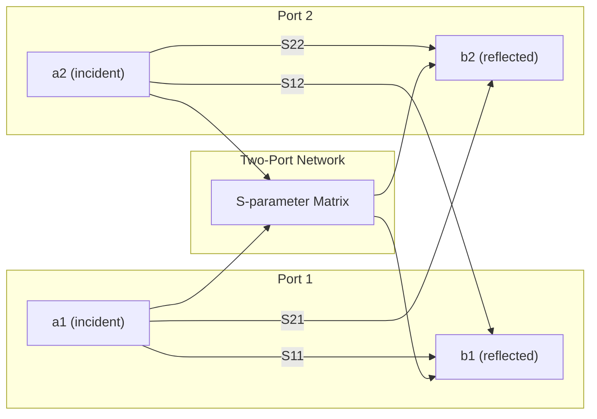

## S-Parameters and Impedance Matching

### Overview

At RF and microwave frequencies, wavelengths become comparable to or smaller than device and interconnect dimensions, making conventional lumped voltage/current-based network descriptions (Z, Y, H parameters) impractical to measure directly — they require open- or short-circuit terminations that are difficult to realize accurately at high frequency and can cause active devices to oscillate or become unstable. **Scattering parameters (S-parameters)** solve this by characterizing a network in terms of traveling power waves referenced to a known impedance (almost universally $50\ \Omega$), measured under matched-load conditions that are both stable and physically realizable.

Impedance matching is the complementary design discipline: shaping the source and load impedances seen by a device (transistor, antenna, filter) to maximize power transfer, minimize reflections, and/or achieve a specific noise or gain performance target — decisions that are made directly from S-parameter data.

---

### S-Parameter Fundamentals

**Traveling Wave Definitions**

For a two-port network, incident and reflected power waves are defined at each port $i$ as:

$$a_i = \frac{V_i + Z_0 I_i}{2\sqrt{Z_0}}, \qquad b_i = \frac{V_i - Z_0 I_i}{2\sqrt{Z_0}}$$

where $Z_0$ is the reference (system) impedance, typically $50\ \Omega$. $a_i$ represents the wave incident into port $i$; $b_i$ represents the wave reflected/emerging from port $i$.

**S-Parameter Matrix (Two-Port)**

$$\begin{bmatrix} b_1 \\ b_2 \end{bmatrix} = \begin{bmatrix} S_{11} & S_{12} \\ S_{21} & S_{22} \end{bmatrix}\begin{bmatrix} a_1 \\ a_2 \end{bmatrix}$$

**Key Points — Physical Meaning**

| Parameter | Definition | Meaning |
| --- | --- | --- |
| $S_{11}$ | $b_1/a_1$ (with $a_2 = 0$) | Input reflection coefficient (output matched) |
| $S_{21}$ | $b_2/a_1$ (with $a_2 = 0$) | Forward transmission (gain) |
| $S_{12}$ | $b_1/a_2$ (with $a_1 = 0$) | Reverse transmission (isolation/feedback) |
| $S_{22}$ | $b_2/a_2$ (with $a_1 = 0$) | Output reflection coefficient (input matched) |

The condition $a_2 = 0$ (or $a_1 = 0$) means the *opposite* port is terminated in exactly $Z_0$ — a matched load absorbs all incident power with no reflection, which is a condition far easier to realize precisely at high frequency than a true open or short circuit.

**Why S-Parameters Instead of Z/Y/H**

- Measurable at RF/microwave frequencies using a **Vector Network Analyzer (VNA)** with simple matched-load terminations
- Avoid stability problems — active devices can oscillate under the open/short conditions required for Z/Y-parameter extraction, but remain stable under matched-load conditions
- Directly relate to physically meaningful quantities: reflection (return loss), gain, isolation

**Common Derived Quantities**

- **Return Loss (RL)**: $RL = -20\log_{10}|S_{11}|$ (dB) — higher RL indicates better match
- **Voltage Standing Wave Ratio (VSWR)**:

$$VSWR = \frac{1+|\Gamma|}{1-|\Gamma|}$$

- **Insertion Loss/Gain**: $|S_{21}|$ expressed in dB
- **Reverse Isolation**: $|S_{12}|$ in dB (ideally very negative/large isolation for unilateral amplifier assumptions to hold)

---

### Stability Analysis from S-Parameters

Before any matching network is designed, the device must be checked for **unconditional stability** — i.e., that it will not oscillate for any passive source or load impedance.

**Rollett Stability Factor ($K$)**

$$K = \frac{1 - |S_{11}|^2 - |S_{22}|^2 + |\Delta|^2}{2|S_{12}S_{21}|}$$

where $\Delta = S_{11}S_{22} - S_{12}S_{21}$.

**Unconditional Stability Criterion**: The device is unconditionally stable if and only if:

$$K > 1 \quad \text{AND} \quad |\Delta| < 1$$

(An equivalent single-parameter test, the $\mu$-factor, is often preferred since it directly gives a figure of merit without needing a second inequality check.)

If $K < 1$, the device is **potentially unstable**, and there exist passive source/load impedances that will cause oscillation — these regions are mapped graphically using **stability circles** on the Smith chart, and the matching network must be designed to keep source/load reflection coefficients ($\Gamma_S$, $\Gamma_L$) outside the unstable regions.

---

### Impedance Matching: Purpose and Types

Impedance matching networks are lossless (ideally) reactive networks (inductors, capacitors, transmission line stubs) inserted between a source and load to transform impedance and achieve one of several design goals:

**Key Points — Matching Objectives**

1. **Maximum Power Transfer (Conjugate Match)**: Load impedance is set to the complex conjugate of the source impedance, $Z_L = Z_S^*$, so all available source power is delivered to the load
2. **Minimum Reflection / Return Loss**: Matching to the reference impedance $Z_0$ (e.g., $50\ \Omega$) to minimize $|S_{11}|$ or $|S_{22}|$, critical at filter/antenna interfaces and along transmission lines to avoid standing waves
3. **Maximum Gain Match**: For an amplifier, simultaneously conjugate-matching both input ($\Gamma_S = \Gamma_{in}^*$) and output ($\Gamma_L = \Gamma_{out}^*$) achieves **Maximum Available Gain (MAG)** — valid only when the device is unconditionally stable
4. **Minimum Noise Figure Match**: The source impedance that minimizes noise figure ($\Gamma_{opt}$, derived from the device's noise parameters $F_{min}$, $R_n$, $\Gamma_{opt}$) generally does **not** coincide with the conjugate-match impedance for maximum gain — LNA design requires an explicit trade-off between these two, often illustrated using **noise circles** and **gain circles** plotted together on a Smith chart

**Design Trade-off in LNAs**

$$F = F_{min} + \frac{4R_n|\Gamma_S - \Gamma_{opt}|^2}{Z_0\left(1-|\Gamma_S|^2\right)|1+\Gamma_{opt}|^2}$$

This equation shows that any deviation of the actual source reflection coefficient $\Gamma_S$ from the optimum noise match point $\Gamma_{opt}$ increases noise figure — the LNA designer must choose a $\Gamma_S$ that balances an acceptable NF degradation against sufficient gain, since $\Gamma_{opt}$ and the conjugate-match point for peak gain are generally different locations on the Smith chart.

---

### The Smith Chart

The **Smith chart** is a graphical tool mapping the reflection coefficient plane ($\Gamma$, a unit circle) onto normalized impedance (or admittance) coordinates, allowing matching network design to be performed visually rather than through direct complex-algebra calculation.

**Key Points**

- Normalized impedance $z = Z/Z_0$ maps to a specific point inside (or on) the unit $\Gamma$-circle via $\Gamma = (z-1)/(z+1)$
- Constant-resistance and constant-reactance circles/arcs are drawn on the chart; adding a series element moves the operating point along a constant-resistance (Z-chart) or constant-conductance (Y-chart, when overlaid) circle
- Adding a shunt element requires switching to the admittance (Y) representation — a combined Z-Y (immittance) Smith chart is commonly used so series and shunt elements can both be plotted without manual conversion
- Moving clockwise along a constant-VSWR circle corresponds to moving toward the generator (source) along a transmission line

---

### Common Matching Network Topologies

#### 1. L-Network (Two-Element)

The simplest matching network, using one series and one shunt reactive element to transform any impedance to any other on the same side of a specific resistance boundary.

**Key Points**

- Only one unique solution exists for a given pair of impedances (for a given topology orientation) — no additional degrees of freedom
- Bandwidth is set entirely by the required impedance transformation ratio (larger ratio → narrower bandwidth, higher effective $Q$)
- Two possible configurations (shunt-first vs. series-first) depending on whether the target impedance is inside or outside the unit resistance/conductance circle on the Smith chart

#### 2. Pi-Network and T-Network (Three-Element)

Add a third reactive element, providing an extra degree of freedom to independently set the network's loaded $Q$ (and hence bandwidth), decoupling the matching ratio from the bandwidth constraint of a simple L-network.

**Key Points**

- Pi-network: shunt-series-shunt; commonly used in power amplifier output matching where harmonic filtering is also needed
- T-network: series-shunt-series; useful when both terminations are low impedance
- Designer chooses loaded $Q$ (bandwidth) as an independent design parameter, then solves for the two sub-network L-sections that realize it

#### 3. Quarter-Wave Transformer

A transmission line segment of length $\lambda/4$ at the design frequency transforms a real load impedance $Z_L$ to:

$$Z_{in} = \frac{Z_0'^2}{Z_L}$$

where $Z_0'$ is the transformer line's characteristic impedance, chosen as $Z_0' = \sqrt{Z_0 Z_L}$ to match $Z_L$ to system impedance $Z_0$.

**Key Points**

- Only matches real (resistive) impedances directly; a complex load must first be transformed to a real impedance (e.g., via a short line length or added reactive element)
- Inherently narrowband (exact match only at the design frequency and odd multiples); bandwidth can be extended using multi-section (Chebyshev/binomial) transformers
- Common in distributed (microstrip/stripline) RF designs where lumped inductors would have excessive loss or self-resonance issues at the operating frequency

#### 4. Stub Matching (Single-Stub / Double-Stub)

Uses a short-circuited or open-circuited transmission line segment ("stub"), placed in shunt or series, whose length and position are chosen to cancel the reactive part of a load's impedance and transform its real part to $Z_0$.

**Key Points**

- Single-stub matching requires choosing both the stub's position along the main line (to make the real part of $Y$ or $Z$ equal to $Y_0$/$Z_0$) and its length (to cancel the resulting reactance) — solved graphically via the Smith chart
- Double-stub matching fixes the stub positions in advance (more practical for tunable/adjustable designs) and solves for the two stub lengths, at the cost of a "forbidden region" of loads that cannot be matched for a given stub spacing
- Preferred in microstrip/PCB and MMIC layouts where lumped inductors are lossy or impractical at the frequency of interest

---

### Bandwidth Limitations: The Bode-Fano Criterion

A fundamental physical limit — independent of the specific matching network topology chosen — constrains how well a *complex* load (e.g., one with parallel parasitic capacitance $C$ and resistance $R$) can be matched over a finite bandwidth using a lossless matching network:

$$\int_0^\infty \ln\left(\frac{1}{|\Gamma(\omega)|}\right)d\omega \leq \frac{\pi}{RC}$$

**Key Points**

- Establishes an unavoidable trade-off between matching bandwidth and matching quality (how low $|\Gamma|$ can be made) — better return loss over a wider band is not achievable beyond this bound no matter how many matching elements are used [Inference — the Bode-Fano bound is a theoretical limit; real designs typically fall short of it due to practical component non-idealities]
- Directly relevant to wideband LNA and PA matching network design, where designers must decide upfront how to allocate a finite "matching budget" across the required bandwidth

---

### Measurement Practice: Vector Network Analyzers and Calibration

- A **VNA** injects a known incident signal and measures the resulting reflected and transmitted waves at each port to compute S-parameters directly as complex (magnitude and phase) quantities across frequency
- **Calibration** (e.g., SOLT: Short-Open-Load-Thru, or TRL: Thru-Reflect-Line) removes systematic errors from cables, connectors, and fixtures by characterizing known standards before measuring the device under test (DUT), moving the reference "measurement plane" to the DUT's actual terminals
- **De-embedding** further removes parasitic effects of on-wafer test structures (pads, feed lines) for accurate device-level S-parameter extraction in RF IC characterization — behavior of de-embedding structures may vary depending on process and layout, so results should be cross-checked against simulation

---

### Mermaid Diagram — Two-Port S-Parameter Signal Flow

---

### SVG Diagram — L-Network Matching Topologies (svg_diagram)

<svg xmlns="http://www.w3.org/2000/svg" viewBox="0 0 640 300" font-family="sans-serif">
<text x="320" y="20" text-anchor="middle" font-size="14" font-weight="bold">L-Network Matching Configurations (svg_diagram)</text>
<text x="150" y="45" text-anchor="middle" font-size="12">Shunt-first (low-to-high Z)</text>
<line x1="40" y1="90" x2="90" y2="90" stroke="black" stroke-width="1.5" />
<rect x="90" y="70" width="14" height="40" fill="none" stroke="black" stroke-width="1.5" />
<line x1="97" y1="110" x2="97" y2="140" stroke="black" stroke-width="1.5" />
<line x1="80" y1="140" x2="115" y2="140" stroke="black" stroke-width="1.5" />
<line x1="104" y1="90" x2="180" y2="90" stroke="black" stroke-width="1.5" />
<path d="M180 90 q6 -10 12 0 t12 0 t12 0 t12 0" stroke="black" stroke-width="1.5" fill="none" />
<line x1="228" y1="90" x2="260" y2="90" stroke="black" stroke-width="1.5" />
<rect x="245" y="105" width="30" height="45" fill="none" stroke="#2980b9" stroke-width="1.5" />
<text x="260" y="130" text-anchor="middle" font-size="9" fill="#2980b9">ZL</text>
<text x="97" y="60" text-anchor="middle" font-size="10">Shunt C</text>
<text x="204" y="75" text-anchor="middle" font-size="10">Series L</text>
<text x="480" y="45" text-anchor="middle" font-size="12">Series-first (high-to-low Z)</text>
<line x1="370" y1="90" x2="440" y2="90" stroke="black" stroke-width="1.5" />
<path d="M440 90 q6 -10 12 0 t12 0 t12 0 t12 0" stroke="black" stroke-width="1.5" fill="none" />
<line x1="488" y1="90" x2="520" y2="90" stroke="black" stroke-width="1.5" />
<rect x="520" y="70" width="14" height="40" fill="none" stroke="black" stroke-width="1.5" />
<line x1="527" y1="110" x2="527" y2="140" stroke="black" stroke-width="1.5" />
<line x1="510" y1="140" x2="545" y2="140" stroke="black" stroke-width="1.5" />
<line x1="534" y1="90" x2="580" y2="90" stroke="black" stroke-width="1.5" />
<rect x="580" y="105" width="30" height="45" fill="none" stroke="#2980b9" stroke-width="1.5" />
<text x="595" y="130" text-anchor="middle" font-size="9" fill="#2980b9">ZL</text>
<text x="464" y="75" text-anchor="middle" font-size="10">Series L</text>
<text x="527" y="60" text-anchor="middle" font-size="10">Shunt C</text>
</svg>

---

### Practical Design Implications

- Always run stability analysis ($K$, $\Delta$, or $\mu$-factor) from measured/simulated S-parameters *before* designing a matching network — an unstable device can oscillate regardless of how well the match is designed
- For LNAs, treat gain match and noise match as competing objectives and use overlaid gain/noise circles on the Smith chart to select a practical compromise $\Gamma_S$
- Use quarter-wave transformers or stub matching in distributed (microstrip/MMIC) designs above a few GHz, where lumped inductor $Q$ and self-resonance become limiting; prefer lumped L/Pi/T networks below that range where component size remains electrically small
- Respect the Bode-Fano bandwidth-vs-match-quality trade-off when specifying wideband matching requirements — don't over-specify return loss across bandwidth beyond what is physically achievable for the given load reactance/resistance ratio
- Always de-embed test-fixture parasitics before extracting device-level S-parameters for model validation or matching network synthesis

**Related Topics**

- Smith chart construction and graphical matching network synthesis techniques
- Noise parameters and noise circle derivation for LNA design
- Multi-section (Chebyshev/binomial) broadband matching transformers
- Vector Network Analyzer calibration methods (SOLT, TRL, LRM)
- Power amplifier load-pull matching and harmonic termination
- Mixed-mode (differential) S-parameters for balanced circuit characterization