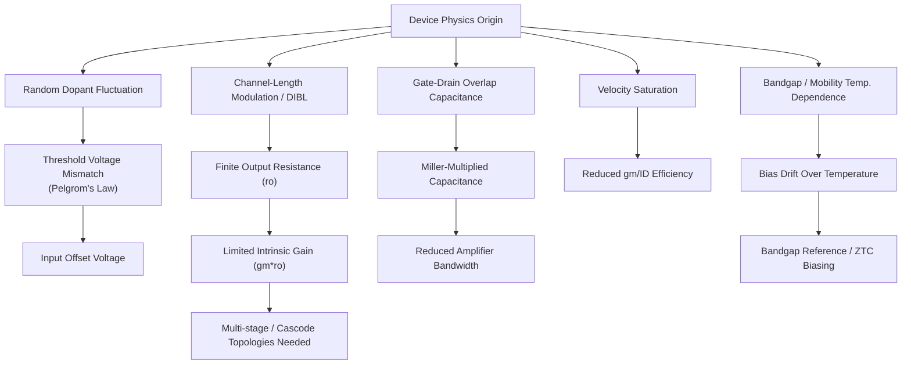

## Analog IC Design Constraints from Device Physics

### Overview

Analog integrated circuit design is fundamentally bounded by the physical behavior of the transistors, resistors, and capacitors from which circuits are built — unlike digital design, where devices are abstracted into logical switches, analog circuits directly depend on continuous, second-order device characteristics such as mismatch, output impedance, noise, and nonlinearity. Understanding how device physics translates into circuit-level limitations (gain, bandwidth, offset, linearity, noise, power) is essential for making informed sizing, biasing, and topology decisions.

This topic surveys the principal device-physics-derived constraints that shape analog IC design: transistor mismatch, finite output resistance and intrinsic gain, parasitic capacitances and their bandwidth impact, velocity saturation and short-channel effects, temperature dependence, and process variation.

---

### Transistor Mismatch

**Physical Origin**

No two "identical" transistors on a die are perfectly identical — random dopant fluctuation (RDF), line-edge roughness, and oxide thickness variation cause statistical differences between devices, even those drawn with the same layout dimensions and placed adjacent to each other.

**Pelgrom's Law**

Mismatch in threshold voltage ($\Delta V_{TH}$) between two identical devices decreases with increasing gate area, following the empirical **Pelgrom model**:

$$\sigma(\Delta V_{TH}) = \frac{A_{VT}}{\sqrt{WL}}$$

where $A_{VT}$ is a process-dependent matching coefficient (units of $\text{mV}\cdot\mu\text{m}$), and $W$, $L$ are transistor width and length.

**Key Points**

- Mismatch in current-factor ($\beta = \mu C_{ox}W/L$) follows an analogous inverse-square-root-of-area law with its own coefficient $A_\beta$
- Directly determines the **input-referred offset voltage** of differential pairs, current mirrors, and comparators
- Trade-off: larger devices reduce mismatch (better matching, lower offset) but increase parasitic capacitance (worse bandwidth) and area — a core analog sizing trade-off with no free physical resolution
- Layout techniques (common-centroid, interdigitation, dummy devices) mitigate *systematic* mismatch (gradients in process parameters across the die) but cannot reduce the *random* (statistical) mismatch component described by Pelgrom's law — only increasing $WL$ can

**Example**

For a process with $A_{VT} = 5\ \text{mV}\cdot\mu\text{m}$, a device with $W = L = 10\ \mu\text{m}$ (area $= 100\ \mu\text{m}^2$):

$$\sigma(\Delta V_{TH}) = \frac{5}{\sqrt{100}} = 0.5\ \text{mV}$$

Quadrupling the area (e.g., $W=L=20\ \mu\text{m}$) reduces mismatch by only $2\times$ — illustrating the diminishing area-efficiency of brute-force area scaling for matching.

---

### Finite Output Resistance and Intrinsic Gain

**Physical Origin**

An ideal MOSFET in saturation would have infinite output resistance (current independent of $V_{DS}$). In reality, **channel-length modulation** causes the effective channel length to shorten as $V_{DS}$ increases beyond $V_{DSAT}$, increasing $I_D$ slightly with $V_{DS}$ and yielding a finite output resistance:

$$r_o = \frac{1}{\lambda I_D} \approx \frac{V_A}{I_D}$$

where $\lambda$ is the channel-length modulation parameter (inversely proportional to $L$) and $V_A = 1/\lambda$ is the Early voltage analog (borrowed terminology from BJT theory).

**Intrinsic Gain**

The maximum voltage gain a single transistor can provide (gain of a simple common-source stage with an ideal current-source load) is the **intrinsic gain**:

$$A_0 = g_m r_o = \frac{2}{V_{OV}}\cdot\frac{1}{\lambda} \quad \text{(square-law approximation)}$$

where $V_{OV} = V_{GS}-V_{TH}$ is the overdrive voltage.

**Key Points**

- Intrinsic gain has been steadily decreasing across process node generations, because $r_o$ degrades faster than $g_m$ improves as channel length shrinks — a major driver behind the adoption of cascoding, gain-boosting, and multi-stage amplifier topologies in modern deep-submicron analog design [Inference — the precise magnitude of this trend is node- and foundry-specific]
- In BJTs, the analogous parameter is the Early voltage $V_A$, with intrinsic gain $g_m r_o = V_A/V_T$ (where $V_T = kT/q$ is the thermal voltage, ~26 mV at room temperature) — BJTs typically offer substantially higher intrinsic gain than MOSFETs of comparable size due to their exponential (rather than square-law) $I$-$V$ characteristic and generally higher $V_A$
- Directly constrains how much gain a single amplifying stage can deliver, forcing multi-stage topologies (with associated stability/compensation challenges) when high DC gain is required (e.g., in op-amps for precision ADC front-ends)

---

### Parasitic Capacitances and Bandwidth Limits

**Physical Origin**

Every terminal of a MOSFET has associated parasitic capacitance arising from the physical device structure: gate-oxide capacitance ($C_{gs}$, $C_{gd}$), junction (depletion) capacitance at source/drain-to-body junctions ($C_{sb}$, $C_{db}$), and overlap capacitance from lateral diffusion under the gate.

**Key Points**

- $C_{gd}$ (gate-drain overlap/Miller capacitance) is disproportionately impactful in amplifier stages due to the **Miller effect**: in an inverting gain stage with gain $-A_v$, $C_{gd}$ appears at the input multiplied by $(1+A_v)$, often becoming the dominant bandwidth-limiting capacitance
- Junction capacitances are voltage-dependent (following the same $C_j(V)$ relationship as diode/varactor capacitance), introducing signal-dependent nonlinearity in high-swing nodes
- Total parasitic capacitance at a node combined with the resistance driving that node sets the node's **dominant pole**, directly constraining the achievable gain-bandwidth product (GBW) of an amplifier
- Scaling to shorter channel lengths reduces intrinsic device capacitance per device but increases current density and typically requires wider devices for the same drive strength, partially offsetting the capacitance benefit — the net effect on analog bandwidth is technology-dependent [Inference — actual GBW scaling trends require checking specific PDK device models]

---

### Velocity Saturation and Short-Channel Effects

**Physical Origin**

In long-channel MOSFETs, carrier drift velocity is proportional to the lateral electric field ($v = \mu E$). In short-channel devices, the electric field becomes strong enough that carrier velocity saturates at a maximum value ($v_{sat}$) well below what the simple linear mobility model predicts, fundamentally altering the transistor's $I$-$V$ characteristics.

**Key Points**

- Velocity-saturated devices exhibit a more **linear** (rather than square-law) relationship between $I_D$ and $V_{OV}$ at high overdrive, reducing the transconductance efficiency ($g_m/I_D$) benefit that would otherwise be gained by increasing overdrive voltage
- Reduces the effective **transconductance ($g_m$)** achievable for a given bias current compared to long-channel square-law predictions, directly impacting achievable gain and noise performance
- **Drain-induced barrier lowering (DIBL)**: In short-channel devices, the drain electric field increasingly influences the source-side potential barrier, causing threshold voltage to decrease with increasing $V_{DS}$ — this behaves as an *additional* output-resistance-degrading mechanism beyond classical channel-length modulation, is a primary contributor to why short-channel $r_o$ (and thus intrinsic gain) is worse than long-channel predictions suggest [Inference — DIBL magnitude is strongly process- and bias-dependent]
- Practical implication: analog designers frequently choose channel lengths longer than the process minimum (sometimes several multiples of $L_{min}$) specifically to recover output resistance and reduce short-channel-effect-driven mismatch and gain degradation, at the cost of area and speed

---

### Temperature Dependence

**Key Points**

- **Threshold voltage** decreases with increasing temperature (typically by a few mV/°C), while **carrier mobility** also decreases with temperature — these two effects act in opposing directions on drain current, and a specific bias point (the **zero-temperature-coefficient, ZTC, point**) exists where they cancel
- **BJT base-emitter voltage** ($V_{BE}$) decreases with temperature at a well-characterized rate (~$-2\ \text{mV/°C}$ near room temperature for typical bias currents), forming the physical basis for **bandgap reference** circuits, which combine a $V_{BE}$-based (complementary-to-absolute-temperature, CTAT) term with a $\Delta V_{BE}$-based (proportional-to-absolute-temperature, PTAT) term to produce a temperature-stable reference voltage
- Resistor temperature coefficients (TCR) vary significantly by material (poly-silicon vs. diffused vs. metal resistors), requiring careful resistor-type selection or ratio-based design techniques to minimize temperature sensitivity in precision analog blocks

---

### Process, Voltage, and Temperature (PVT) Variation

**Key Points**

- Beyond random mismatch, absolute device parameters (threshold voltage, mobility, oxide thickness, resistor sheet resistance) vary from lot to lot and wafer to wafer due to manufacturing tolerances — characterized via **process corners** (e.g., fast-fast, slow-slow, fast-slow, typical) used in simulation to bound worst-case performance
- Robust analog design typically requires verifying key specifications (gain, bandwidth, offset, power) across all relevant PVT corners, not just the typical/nominal case, since a design that works only at nominal conditions is generally considered non-manufacturable
- **Process-independent (ratio-based) design techniques** — where a specification depends only on a ratio of matched device parameters rather than an absolute value — are heavily favored in analog design specifically because ratios of adjacent, identically-processed devices are far less sensitive to global process variation than any single absolute parameter

---

### Comparative Summary: Device-Physics Constraint → Circuit-Level Impact

| Physical Effect | Root Cause | Circuit-Level Consequence |
| --- | --- | --- |
| Random mismatch (Pelgrom) | Dopant fluctuation, line-edge roughness | Input offset voltage, current mirror inaccuracy |
| Channel-length modulation / DIBL | Short-channel $V_{DS}$-dependence | Finite $r_o$, reduced intrinsic gain, multi-stage topology need |
| Miller-multiplied $C_{gd}$ | Gate-drain overlap capacitance | Bandwidth reduction in inverting gain stages |
| Velocity saturation | High lateral E-field in short channels | Reduced $g_m/I_D$, linear (not square-law) $I$-$V_{OV}$ |
| $V_{TH}$/mobility temperature dependence | Semiconductor band structure, phonon scattering | Bias drift over temperature, ZTC biasing need |
| Junction capacitance voltage dependence | Depletion width vs. reverse bias | Signal-dependent nonlinearity/distortion |
| Global PVT variation | Manufacturing tolerance across lots/wafers | Corner-dependent performance spread, need for ratio-based design |

---

### Mermaid Diagram — Device Physics to Circuit Constraint Chain

---

### SVG Diagram — Intrinsic Gain vs. Channel Length Trend (svg_diagram)

<svg xmlns="http://www.w3.org/2000/svg" viewBox="0 0 620 340" font-family="sans-serif">
<text x="310" y="20" text-anchor="middle" font-size="14" font-weight="bold">Intrinsic Gain (gm·ro) vs. Channel Length (svg_diagram)</text>
<line x1="70" y1="290" x2="580" y2="290" stroke="black" stroke-width="1.5" />
<line x1="70" y1="290" x2="70" y2="50" stroke="black" stroke-width="1.5" />
<text x="325" y="320" text-anchor="middle" font-size="12">Channel Length L (log scale) →</text>
<text x="30" y="170" text-anchor="middle" font-size="12" transform="rotate(-90 30 170)">Intrinsic Gain (dB)</text>
<path d="M 100 260 Q 250 150 400 90 T 560 65" stroke="#2980b9" stroke-width="2.5" fill="none" />
<text x="450" y="55" font-size="10" fill="#2980b9">Long-channel (square-law) trend</text>
<path d="M 100 275 Q 250 220 400 170 T 560 140" stroke="#c0392b" stroke-width="2.5" stroke-dasharray="5,3" fill="none" />
<text x="420" y="185" font-size="10" fill="#c0392b">With DIBL / short-channel effects</text>
<line x1="200" y1="290" x2="200" y2="50" stroke="#7f8c8d" stroke-width="1" stroke-dasharray="3,3" />
<text x="200" y="305" text-anchor="middle" font-size="10" fill="#7f8c8d">Lmin</text>
</svg>

---

### Practical Design Implications

- Size critical matching-sensitive devices (differential pair inputs, current mirror transistors) based on required offset/mismatch specification via Pelgrom's law, not just for drive strength or bandwidth
- Use channel lengths above the process minimum for gain stages requiring high $r_o$/intrinsic gain (e.g., op-amp first stages), accepting the bandwidth/area penalty
- Explicitly budget for Miller-multiplied $C_{gd}$ when estimating bandwidth of inverting gain stages; consider cascode topologies to suppress the Miller effect
- Favor ratio-based (rather than absolute-value-dependent) circuit techniques — current mirrors, bandgap references, switched-capacitor ratios — to achieve process-, voltage-, and temperature-robust performance
- Simulate across all relevant PVT corners and Monte Carlo mismatch runs before considering an analog block design-complete

**Related Topics**

- Bandgap voltage reference circuit design (PTAT/CTAT combination)
- Cascode and gain-boosting amplifier topologies
- Common-centroid and interdigitated layout techniques for matching
- Multi-stage amplifier frequency compensation (Miller compensation, nested Miller)
- Monte Carlo and corner-based analog verification methodology
- $g_m/I_D$-based analog design methodology