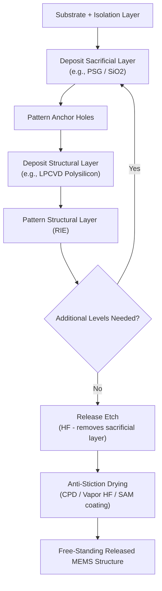

## Surface Micromachining Techniques

### Overview

Surface micromachining is a MEMS (Micro-Electro-Mechanical Systems) fabrication approach in which mechanical structures are built up from thin films deposited and patterned on the surface of a substrate, using alternating **structural** and **sacrificial** layers. Unlike bulk micromachining (which sculpts three-dimensional structures directly out of the substrate wafer itself), surface micromachining constructs free-standing, movable structures — cantilevers, bridges, gears, mirrors, resonators — by depositing thin films on top of the wafer and later dissolving sacrificial layers to release the mechanical elements.

This approach is process-compatible with standard IC fabrication equipment and, in several process flows, can be integrated with (or sequenced alongside) CMOS circuitry, making it the dominant technique for high-volume, low-cost MEMS devices such as accelerometers, gyroscopes, and micromirror arrays.

---

### Core Process Concept: Sacrificial Layer Technology

**Key Points**

- A **sacrificial layer** (commonly a sacrificial oxide such as $\text{SiO}_2$ or phosphosilicate glass, PSG) is deposited first and patterned to define anchor points
- A **structural layer** (commonly polycrystalline silicon, "polysilicon," or in some processes silicon nitride or metal) is deposited on top and patterned into the desired mechanical shape (beam, plate, gear, comb finger, etc.)
- The sacrificial layer is then selectively etched away (the "release" step) using an etchant that attacks the sacrificial material but not the structural material, leaving the structural layer suspended and mechanically free to move
- This deposit-pattern-release sequence can be repeated multiple times to build multi-level, complex 3D mechanical structures — a strategy standardized in the widely referenced **MUMPs (Multi-User MEMS Processes)** and **SUMMiT (Sandia Ultra-planar Multi-level MEMS Technology)** foundry process families

---

### Typical Process Flow

1. **Substrate preparation**: Start with a silicon wafer, typically coated with an insulating layer (e.g., thermal $\text{SiO}_2$ or LPCVD silicon nitride) to electrically isolate mechanical structures from the substrate
2. **First sacrificial layer deposition**: Deposit sacrificial oxide (e.g., LPCVD or PECVD $\text{SiO}_2$/PSG)
3. **Anchor patterning**: Photolithographically pattern and etch anchor holes through the sacrificial layer down to the substrate/isolation layer, defining where the structural layer will mechanically attach
4. **Structural layer deposition**: Deposit the structural material (commonly LPCVD polysilicon, doped in-situ or via subsequent implant/diffusion for conductivity)
5. **Structural layer patterning**: Photolithographically pattern and etch (typically via reactive-ion etching, RIE) the structural film into the desired mechanical geometry
6. **Repeat for additional levels**: Deposit additional sacrificial and structural layers as needed for multi-level mechanisms (e.g., separate layers for a fixed electrode, a movable proof mass, and interconnect routing)
7. **Release etch**: Immerse the wafer in a sacrificial-layer-selective etchant (commonly **hydrofluoric acid, HF**, in liquid or vapor form) to dissolve the sacrificial oxide, freeing the structural layers
8. **Drying / stiction mitigation**: Dry the released structures using techniques that avoid capillary forces pulling movable structures down onto the substrate (see Stiction section below)

---

### Common Material Systems

| Layer Role | Common Materials | Notes |
| --- | --- | --- |
| Structural | Polysilicon (LPCVD) | Most common; good mechanical properties, CMOS-compatible deposition |
| Structural (alternative) | Silicon nitride, silicon carbide, electroplated Ni/Au/Cu | Used for higher stiffness, specific optical, or RF properties |
| Sacrificial | Silicon dioxide (thermal, LPCVD, PECVD), PSG | Selectively etched by HF while polysilicon/nitride remain largely unattacked |
| Sacrificial (alternative) | Photoresist, polyimide | Used with $\text{O}_2$ plasma release for certain low-temperature or metal-structural processes |
| Isolation | Silicon nitride, thermal oxide | Electrically isolates structures from the conductive silicon substrate |

**Key Points**

- Polysilicon-on-oxide (poly/oxide) is the dominant material pairing due to excellent etch selectivity (HF etches $\text{SiO}_2$ far faster than polysilicon), well-characterized mechanical properties, and full compatibility with standard IC deposition/etch tooling
- Residual stress and stress gradients in deposited polysilicon films (arising from deposition temperature, doping, and grain structure) must be carefully controlled via anneal steps, since stress gradients cause released cantilevers/bridges to curl upon release — an important process-control parameter, not merely a design consideration

---

### The Release Step and Stiction

**Physical Challenge**

When the sacrificial layer is wet-etched (typically in HF-based solution) and the wafer is subsequently rinsed and dried, capillary forces from the evaporating liquid meniscus beneath the released structure can pull thin, compliant structural elements down into permanent contact with the substrate — a failure mode known as **stiction** (a portmanteau of "static friction," though the dominant force is capillary rather than frictional in most cases).

**Mitigation Techniques**

| Technique | Mechanism |
| --- | --- |
| Critical point drying (CPD) | Uses supercritical $\text{CO}_2$ to transition from liquid to gas without crossing a liquid-vapor interface, eliminating capillary force entirely |
| Freeze-drying (sublimation) | Freezes the rinse liquid, then sublimates it directly to vapor, avoiding a liquid meniscus |
| Vapor-phase HF (VHF) release | Etches the sacrificial oxide using HF vapor rather than liquid, avoiding a liquid-drying step altogether |
| Self-assembled monolayer (SAM) coatings | Hydrophobic surface coatings reduce the surface energy driving capillary attraction and reduce in-use stiction after release |
| Dimples / anti-stiction bumps | Small raised bumps patterned into the structural layer reduce the contact area (and thus adhesion force) if contact does occur |
| Sublimating polymer sacrificial layers | Certain polymer sacrificial materials can be removed via direct sublimation, sidestepping wet processing entirely [Inference — this approach is process-specific and less broadly adopted than HF-based release] |

---

### Multi-Level Foundry Process Examples

- **MUMPs (PolyMUMPs)**: A widely used multi-project-wafer (MPW) surface micromachining process offering multiple structural polysilicon layers plus a metal layer, historically operated as an accessible foundry service for MEMS prototyping and education
- **SUMMiT V (Sandia)**: A more advanced multi-level surface micromachining process (developed at Sandia National Laboratories) offering multiple structural polysilicon layers with chemical-mechanical polishing (CMP) between levels for improved planarity, enabling more complex multi-level mechanisms (e.g., micro-engines, geared mechanisms)
- **Epi-poly / thick polysilicon processes**: Some commercial processes (e.g., certain accelerometer/gyroscope foundry flows) use thick epitaxially-grown polysilicon structural layers to achieve larger proof masses and higher sensitivity than thin LPCVD polysilicon alone can provide [Inference — specific commercial process details vary by foundry and are often proprietary]

---

### Surface vs. Bulk Micromachining: Comparison

| Aspect | Surface Micromachining | Bulk Micromachining |
| --- | --- | --- |
| Structure origin | Deposited thin films on substrate surface | Substrate material itself, etched away |
| Typical structure thickness | Sub-micron to a few microns | Tens to hundreds of microns |
| Achievable aspect ratio | Generally lower (thin-film based) | Can be very high (e.g., DRIE-based) |
| CMOS integration | Often more compatible (surface-level process) | Can be more disruptive to co-located circuitry |
| Substrate consumption | Minimal — builds "up" from surface | Significant — etches "into" or through the wafer |
| Common applications | Accelerometers, comb-drive resonators, micromirrors | Pressure sensors, microfluidic channels, deep cavities |

---

### Common Device Structures Enabled by Surface Micromachining

- **Cantilever beams and bridges**: Fundamental mechanical elements for resonators, switches, and force/pressure sensing
- **Comb-drive actuators/sensors**: Interdigitated finger structures used for electrostatic actuation or capacitive sensing, foundational to many surface-micromachined accelerometers and gyroscopes
- **Micromirrors**: Used in optical MEMS (e.g., DLP-style projection systems, optical switching), where a released polysilicon or metal plate rotates/tilts under electrostatic actuation
- **Microresonators**: Released beams or plates driven at resonance for timing references, gas/mass sensing, or gyroscopic rate sensing (via Coriolis-induced secondary-mode excitation)

---

### Mermaid Diagram — Surface Micromachining Process Flow

---

### SVG Diagram — Surface Micromachined Cantilever Cross-Section (svg_diagram)

<svg xmlns="http://www.w3.org/2000/svg" viewBox="0 0 640 320" font-family="sans-serif">
<text x="320" y="20" text-anchor="middle" font-size="14" font-weight="bold">Cantilever Before/After Release (svg_diagram)</text>
<text x="150" y="45" text-anchor="middle" font-size="12">Before Release</text>
<rect x="40" y="220" width="240" height="40" fill="#95a5a6" />
<text x="160" y="245" text-anchor="middle" font-size="10">Silicon Substrate</text>
<rect x="40" y="190" width="240" height="30" fill="#f39c12" />
<text x="160" y="209" text-anchor="middle" font-size="9">Sacrificial Layer (PSG)</text>
<rect x="60" y="165" width="160" height="20" fill="#c0392b" />
<text x="140" y="179" text-anchor="middle" font-size="9" fill="white">Structural Polysilicon</text>
<rect x="220" y="165" width="30" height="55" fill="#7f8c8d" />
<text x="235" y="145" text-anchor="middle" font-size="8">Anchor</text>
<text x="470" y="45" text-anchor="middle" font-size="12">After Release</text>
<rect x="360" y="220" width="240" height="40" fill="#95a5a6" />
<text x="480" y="245" text-anchor="middle" font-size="10">Silicon Substrate</text>
<rect x="540" y="190" width="30" height="30" fill="#f39c12" />
<path d="M 380 185 L 540 185 L 540 205 L 380 195 Z" fill="#c0392b" />
<text x="450" y="175" text-anchor="middle" font-size="9" fill="#c0392b">Free-standing cantilever (air gap beneath)</text>
<text x="550" y="185" text-anchor="middle" font-size="8">Anchor</text>
</svg>

---

### Practical Design Implications

- Control residual stress and stress gradients in structural polysilicon deposition/anneal steps to prevent curling of released cantilevers/bridges — a critical process parameter, not just a layout concern
- Select release and drying method (CPD, vapor HF, freeze-drying) based on structure compliance and gap size — more compliant, longer, or narrower-gap structures are more stiction-prone and require more aggressive mitigation
- Use multi-level foundry processes (e.g., SUMMiT-style) when a device requires independently patterned fixed and movable electrode layers, or complex kinematic mechanisms (gears, linkages)
- Account for etch-hole placement and density needed to allow the release etchant to fully access and undercut large-area structural plates within a practical process time
- Add anti-stiction dimples on structures likely to experience in-use shock or overtravel contact with the substrate, in addition to release-time stiction mitigation

**Related Topics**

- Bulk micromachining and deep reactive-ion etching (DRIE / Bosch process)
- MEMS accelerometer and gyroscope transduction principles (capacitive comb-drive sensing)
- Wafer bonding and MEMS packaging (anodic bonding, eutectic bonding, wafer-level capping)
- Residual stress characterization in thin films (wafer curvature, cantilever test structures)
- Electrostatic comb-drive actuator design equations
- CMOS-MEMS integration strategies (pre-CMOS, post-CMOS, monolithic)