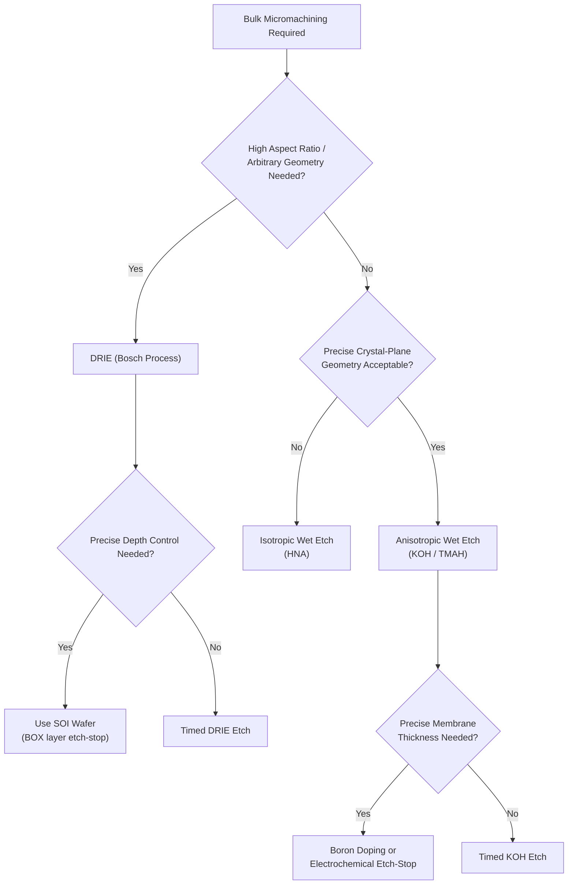

## Bulk Micromachining Techniques

### Overview

Bulk micromachining is a MEMS fabrication approach in which three-dimensional mechanical structures are formed by selectively removing (etching) material directly from the bulk of the substrate wafer itself, rather than building structures up from deposited thin films on the surface (as in surface micromachining). Because the substrate — typically single-crystal silicon — is sculpted directly, bulk micromachining is well suited to producing relatively thick, mechanically robust structures with large mass or deep cavities: membranes, cantilevers, pressure sensor diaphragms, microfluidic channels, and deep trenches.

The technique predates surface micromachining historically and remains the dominant approach wherever large structural thickness, high mechanical robustness, or deep three-dimensional cavities are required.

---

### Core Classification: Wet vs. Dry Etching

Bulk micromachining processes divide fundamentally by etch mechanism, each offering distinct geometric capabilities.

#### 1. Anisotropic Wet Etching

**Physical Origin**

Certain wet chemical etchants attack different crystallographic planes of single-crystal silicon at markedly different rates, because atomic bonding density and etch-reaction kinetics vary by crystal orientation. This **anisotropy** allows precise, self-limiting geometric shapes to form based purely on the crystal lattice, independent of mask edge roughness.

**Common Anisotropic Etchants**

| Etchant | Notes |
| --- | --- |
| KOH (potassium hydroxide) | Most widely used; strongly anisotropic, etches (100) planes much faster than (111) planes |
| TMAH (tetramethylammonium hydroxide) | CMOS-compatible (no alkali metal ion contamination risk), slightly lower etch-rate anisotropy than KOH but preferred for post-CMOS or mixed processes |
| EDP (ethylenediamine pyrocatechol) | Historically used; largely phased out due to toxicity/handling hazards |

**Key Points**

- On a standard (100)-oriented silicon wafer, KOH etching produces characteristic **trapezoidal cross-section cavities** bounded by slow-etching (111) planes, at a fixed angle of $54.74°$ from the wafer surface — a direct consequence of the tetrahedral geometry of the silicon crystal lattice
- This fixed 54.74° sidewall angle means cavity/membrane dimensions are geometrically coupled to etch depth: to reach a target depth $d$, the surface opening must be wider than the desired bottom feature by $2d/\tan(54.74°)$ — an inescapable trade-off that must be accounted for in mask layout
- Etch rate and anisotropy ratio depend on etchant concentration and temperature, and are significantly affected by **doping**: heavily boron-doped silicon (>$10^{19}-10^{20}\ \text{cm}^{-3}$) etches far more slowly in KOH, providing a widely used **etch-stop** technique for defining precise membrane thickness
- Etch-stop can also be achieved electrochemically (applying a bias to a p-n junction so the etch self-terminates at the junction) — the **electrochemical etch-stop (ECE)** technique, offering more precise thickness control than boron-doping alone in some processes [Inference — precision achievable depends on junction quality and process control]

**Governing Relationship — Undercut/Depth Geometry**

For a mask opening width $W_{mask}$ etched to depth $d$ on a (100) wafer:

$$W_{bottom} = W_{mask} - \frac{2d}{\tan(54.74°)}$$

If $W_{bottom}$ reaches zero before the target depth is achieved, the etch self-terminates as a V-groove, a structure exploited deliberately for V-groove fiber-optic alignment channels.

#### 2. Isotropic Wet Etching

**Key Points**

- Etchants such as HNA (hydrofluoric acid/nitric acid/acetic acid mixtures) etch silicon at approximately equal rates in all crystallographic directions, producing rounded, undercut cavity profiles rather than the crystal-plane-bounded shapes of anisotropic etching
- Useful when crystal-plane-independent, isotropic rounding is desired (e.g., for certain fluidic channel or release applications), but offers far less dimensional precision and predictability than anisotropic KOH/TMAH etching for well-defined structural geometry

#### 3. Deep Reactive-Ion Etching (DRIE) — the Bosch Process

**Physical Mechanism**

DRIE is a dry, plasma-based etching technique capable of producing very deep, near-vertical (high aspect-ratio) trenches in silicon, independent of crystal orientation. The dominant industrial implementation is the **Bosch process**, which alternates rapidly between two plasma steps:

1. **Etch step**: A fluorine-based plasma (typically $\text{SF}_6$) isotropically etches exposed silicon
2. **Passivation step**: A fluorocarbon-based plasma (typically $\text{C}_4\text{F}_8$) deposits a thin Teflon-like polymer passivation layer on all exposed surfaces (sidewalls and trench bottom)

On the next etch cycle, physical ion bombardment (directional, due to the plasma sheath electric field) preferentially removes the passivation layer from the horizontal trench bottom (but not the vertical sidewalls), allowing the etch step to proceed only downward while the sidewalls remain protected — repeating this cycle produces deep, nearly vertical trenches.

**Key Points**

- Produces the characteristic **"scalloped" sidewall profile** — small periodic ripples corresponding to each etch/passivation cycle — a recognizable DRIE signature visible under SEM inspection; scallop size can be reduced (smoother sidewalls) by shortening cycle times at the cost of overall etch rate
- Achieves high **aspect ratios** (depth-to-width ratios well over 20:1, and considerably higher in optimized recipes) [Inference — maximum achievable aspect ratio is strongly tool- and recipe-dependent], enabling deep, narrow trench isolation, through-wafer vias, and deep comb-drive structures not achievable via wet anisotropic etching
- Not crystal-orientation-dependent — unlike KOH/TMAH, DRIE can produce arbitrary (mask-defined) lateral geometry, including curved features, at the cost of more complex/expensive tooling (specialized ICP-RIE systems) versus a simple wet-etch bath
- **Aspect-ratio-dependent etching (ARDE, also called "RIE lag")**: narrower trenches etch more slowly than wider trenches in the same process run, due to reduced reactant/ion transport into high-aspect-ratio features — an important layout consideration when a design mixes trench widths on the same mask

---

### Comparison: Anisotropic Wet Etch vs. DRIE

| Aspect | KOH/TMAH (Anisotropic Wet) | DRIE (Bosch Process) |
| --- | --- | --- |
| Sidewall profile | Fixed 54.74° (crystal-plane-determined) | Near-vertical (~90°), scalloped |
| Geometric flexibility | Constrained by crystal orientation | Arbitrary mask-defined shapes |
| Aspect ratio | Low-to-moderate | High (>20:1 achievable) |
| Equipment cost/complexity | Low (wet bench) | High (ICP-RIE plasma tool) |
| Throughput | Batch wet processing, moderate | Slower per-wafer, but tool-dependent |
| Etch-stop options | Boron doping, electrochemical | Timed etch, buried oxide (SOI) etch-stop |
| Typical applications | Pressure sensor diaphragms, V-grooves | Through-wafer vias, deep isolation trenches, high-aspect comb drives |

---

### Wafer-Level Integration: Bonding and Etch-Stop Strategies

Bulk micromachining frequently requires combining multiple wafers or using specialized substrates to achieve precise thickness control or sealed cavities:

- **Silicon-on-Insulator (SOI) wafers**: The buried oxide (BOX) layer acts as a highly reproducible, well-defined DRIE etch-stop, enabling precise device-layer thickness control independent of etch-time variation — widely used in high-precision bulk-micromachined MEMS (e.g., high-performance gyroscopes)
- **Anodic bonding**: Bonds silicon to glass (typically borosilicate/Pyrex) using an applied electric field and elevated temperature, forming a strong, hermetic bond — commonly used to cap bulk-micromachined cavities (e.g., sealed pressure-reference cavities in absolute pressure sensors)
- **Fusion (direct) bonding**: Bonds two silicon wafers directly (via surface activation and high-temperature anneal) without an intermediate adhesive layer, used in more demanding hermeticity/purity applications
- **Eutectic bonding**: Uses a metal alloy (e.g., Au-Si) melted at a eutectic composition to bond wafers at relatively low temperature while providing electrical continuity across the bond, useful when the device requires an electrical path through the bonded interface

---

### Common Device Structures Enabled by Bulk Micromachining

- **Pressure sensor diaphragms**: KOH-etched thin silicon membranes with piezoresistive or capacitive sensing elements, exploiting precise thickness control via boron etch-stop
- **Accelerometer proof masses**: Bulk silicon proof masses (often DRIE-defined) offer significantly larger mass than thin-film surface-micromachined equivalents, improving sensitivity for certain accelerometer designs
- **Microfluidic channels**: KOH or DRIE-etched channels, often sealed via anodic or fusion bonding to a capping wafer
- **Through-silicon vias (TSVs)**: DRIE-etched, later metal-filled vertical interconnects for 3D IC/MEMS stacking
- **Optical bench structures**: KOH-etched V-grooves for passive fiber-to-waveguide alignment in photonic packaging

---

### Mermaid Diagram — Bulk Micromachining Process Decision Flow

---

### SVG Diagram — KOH Anisotropic Etch Profile vs. DRIE Profile (svg_diagram)

<svg xmlns="http://www.w3.org/2000/svg" viewBox="0 0 640 320" font-family="sans-serif">
<text x="320" y="20" text-anchor="middle" font-size="14" font-weight="bold">KOH vs. DRIE Etch Profiles (svg_diagram)</text>
<text x="150" y="45" text-anchor="middle" font-size="12">KOH Anisotropic (54.74°)</text>
<path d="M 40 80 L 280 80 L 280 260 L 40 260 Z" fill="none" stroke="black" stroke-width="1" />
<path d="M 60 80 L 110 200 L 210 200 L 260 80 Z" fill="#ecf0f1" stroke="black" stroke-width="1.5" />
<line x1="60" y1="80" x2="110" y2="200" stroke="#c0392b" stroke-width="2" />
<text x="75" y="140" font-size="9" fill="#c0392b" transform="rotate(66 75 140)">54.74°</text>
<text x="160" y="220" text-anchor="middle" font-size="9">Membrane (111) planes</text>
<text x="470" y="45" text-anchor="middle" font-size="12">DRIE (Near-vertical, scalloped)</text>
<path d="M 360 80 L 600 80 L 600 260 L 360 260 Z" fill="none" stroke="black" stroke-width="1" />
<path d="M 400 80 Q 396 100 400 110 Q 396 130 400 140 Q 396 160 400 170 Q 396 190 400 200 L 400 220 L 560 220 L 560 200 Q 564 190 560 170 Q 564 160 560 140 Q 564 130 560 110 Q 564 100 560 80 Z" fill="#ecf0f1" stroke="black" stroke-width="1.5" />
<text x="480" y="240" text-anchor="middle" font-size="9">Scalloped sidewalls (Bosch cycling)</text>
</svg>

---

### Practical Design Implications

- Account for the fixed 54.74° KOH sidewall angle in mask layout from the start — top-side opening dimensions must be calculated backward from the required bottom-of-cavity dimension and target etch depth
- Use boron-doped or SOI-based etch-stop layers whenever precise, repeatable membrane/structure thickness is a critical specification (e.g., pressure sensor diaphragms), rather than relying on timed etching alone
- Choose DRIE over wet anisotropic etching when arbitrary lateral geometry or high aspect ratio is required, accepting higher tooling cost and the need to manage ARDE (RIE lag) across mixed trench widths on the same mask
- Select wafer bonding method (anodic, fusion, eutectic) based on required hermeticity, electrical continuity needs, and thermal budget constraints of the overall process flow
- Consider bulk micromachining specifically when large proof mass, deep cavities, or high mechanical robustness are needed beyond what thin-film surface micromachining structures can provide

**Related Topics**

- Surface micromachining and sacrificial-layer release processes
- Silicon-on-insulator (SOI) wafer technology and its MEMS/etch-stop applications
- Wafer bonding techniques (anodic, fusion, eutectic) and hermetic packaging
- Piezoresistive and capacitive pressure sensor design
- MEMS accelerometer and gyroscope architectures (bulk vs. surface trade-offs)
- Aspect-ratio-dependent etching (ARDE/RIE lag) and DRIE recipe optimization