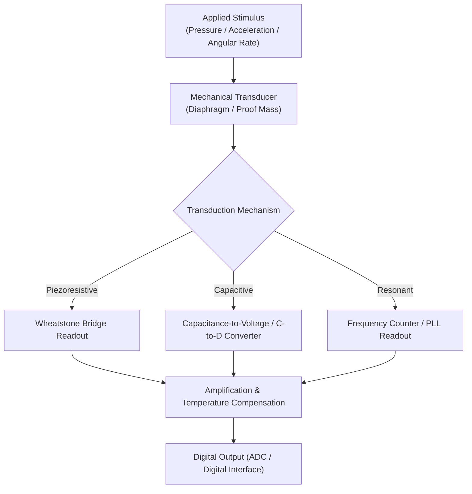

## Pressure and Inertial Sensor Design

### Overview

Pressure and inertial sensors are among the highest-volume MEMS device categories, converting a mechanical stimulus — applied pressure, linear acceleration, or angular rate — into an electrical signal via a micromachined mechanical structure whose deformation or displacement is transduced by one of a small number of standard sensing principles. Despite widely differing target applications (automotive tire pressure monitoring, smartphone motion sensing, industrial process control, navigation-grade guidance), these sensors share a common design framework: a compliant mechanical element (diaphragm, proof mass, or vibrating structure) coupled to a transduction mechanism (piezoresistive, capacitive, or resonant) and read out through dedicated interface electronics.

---

### Pressure Sensor Design

#### Mechanical Structure

A pressure sensor's core mechanical element is a thin, compliant **diaphragm** (membrane) fabricated by bulk micromachining (typically KOH- or DRIE-etched from the backside of a silicon wafer) or, less commonly, surface micromachining. Applied pressure differential across the diaphragm causes it to deflect, and this deflection (or the resulting mechanical stress) is transduced into an electrical signal.

**Key Points**

- **Absolute pressure sensors**: Diaphragm seals a reference vacuum (or fixed reference pressure) cavity on one side, typically formed via anodic or fusion bonding of a capping wafer during fabrication
- **Gauge/differential pressure sensors**: Both sides of the diaphragm are exposed to ambient/process pressure and a reference pressure respectively, allowing direct measurement of pressure difference
- Diaphragm thickness, together with its lateral dimensions, sets both sensitivity (thinner/larger diaphragms deflect more per unit pressure) and mechanical robustness/burst pressure (thinner diaphragms are more fragile and have lower overpressure tolerance) — a direct design trade-off

**Diaphragm Deflection (Simplified Plate Theory)**

For a thin, clamped circular diaphragm of radius $a$ and thickness $h$ under uniform pressure $P$, the maximum center deflection is approximately:

$$w_{max} = \frac{3P a^4 (1-\nu^2)}{16 E h^3}$$

where $E$ is Young's modulus and $\nu$ is Poisson's ratio of the diaphragm material. This shows the strong ($h^{-3}$) dependence of sensitivity on diaphragm thickness — a small thickness variation (a common byproduct of process/etch-stop tolerance) produces a disproportionately large sensitivity variation across a wafer or lot, making precise etch-stop control (boron doping, electrochemical etch-stop, SOI) a critical process requirement.

#### Transduction Mechanisms

**1. Piezoresistive Sensing**

Piezoresistors (typically diffused or ion-implanted boron regions) are placed at locations of maximum mechanical stress on the diaphragm edge, where stress is highest for a clamped diaphragm. Applied stress changes the resistors' resistivity via the **piezoresistive effect**, converting mechanical deformation directly into a resistance change.

$$\frac{\Delta R}{R} = \pi \sigma$$

where $\pi$ is the piezoresistive coefficient (dependent on crystal orientation and doping) and $\sigma$ is applied mechanical stress.

**Key Points**

- Four piezoresistors are typically arranged in a **Wheatstone bridge** configuration, oriented so that two resistors experience tensile stress and two experience compressive stress under diaphragm deflection, maximizing bridge output and providing first-order cancellation of common-mode effects (including some temperature dependence)
- Piezoresistive sensors exhibit significant **temperature sensitivity** in both offset and sensitivity (gain), because piezoresistive coefficients and resistor sheet resistance are themselves temperature-dependent, generally requiring on-chip or system-level temperature compensation for precision applications
- Simple, low-cost, and well-established; widely used in automotive (e.g., manifold absolute pressure, tire pressure monitoring) and industrial pressure sensing

**2. Capacitive Sensing**

The diaphragm (or a plate attached to it) forms one electrode of a parallel-plate capacitor, with a fixed counter-electrode on the substrate or a capping wafer. Diaphragm deflection changes the plate separation gap, changing capacitance:

$$C = \frac{\varepsilon_0 A}{d - w(P)}$$

where $d$ is the nominal (undeflected) gap and $w(P)$ is pressure-dependent deflection.

**Key Points**

- Offers lower temperature sensitivity than piezoresistive sensing (capacitance depends primarily on geometry, not on a temperature-sensitive material property like resistivity), and lower power consumption (no continuous bias current through resistors)
- Capacitance-vs-deflection relationship is inherently **nonlinear** (inverse relationship with gap), requiring linearization in the readout circuit (e.g., charge-balancing or switched-capacitor techniques) for wide dynamic range applications
- Generally requires more complex, lower-noise readout electronics (capacitance-to-voltage or capacitance-to-digital converters) than the comparatively simple resistive-bridge readout of piezoresistive sensors

**3. Resonant Sensing**

A micromechanical resonant structure (often a beam or bridge) is mechanically coupled to the diaphragm such that applied pressure axially stresses the resonator, shifting its resonant frequency. Pressure is then measured as a frequency shift rather than an amplitude/voltage signal.

**Key Points**

- Provides inherently digital/quasi-digital output (frequency), offering excellent long-term stability and immunity to many analog readout error sources (gain drift, offset drift)
- Higher fabrication and drive/sense circuit complexity than piezoresistive or capacitive approaches, generally reserved for precision/reference-grade pressure sensing applications

---

### Inertial Sensor Design: Accelerometers

**Core Principle**

An accelerometer consists of a **proof mass** suspended by compliant flexures (springs) anchored to the substrate. Under applied acceleration, inertial force displaces the proof mass relative to the fixed frame; this displacement (or the restoring force required to null it) is transduced electrically.

**Governing Second-Order Mechanical Model**

The proof mass–spring–damper system behaves as a classical second-order mechanical system:

$$m\ddot{x} + b\dot{x} + kx = -ma$$

where $m$ is proof mass, $b$ is damping coefficient, $k$ is spring constant, $x$ is proof-mass displacement, and $a$ is applied acceleration. At low frequency (below resonance), the steady-state displacement is:

$$x = -\frac{ma}{k}$$

i.e., displacement is directly proportional to acceleration, with sensitivity set by the mass-to-spring-constant ratio $m/k$.

**Resonant Frequency and Bandwidth**

$$\omega_n = \sqrt{\frac{k}{m}}, \qquad Q = \frac{\sqrt{km}}{b}$$

**Key Points — Fundamental Trade-offs**

- Increasing proof mass $m$ or decreasing spring stiffness $k$ increases sensitivity but decreases resonant frequency $\omega_n$, directly trading sensitivity against usable measurement bandwidth
- Mechanical quality factor $Q$ (set by damping, dominated in most MEMS accelerometers by **squeeze-film air damping** between the proof mass and nearby fixed surfaces) must generally be controlled to a moderate value: too high a $Q$ causes excessive resonant peaking and ringing in the response near $\omega_n$; too low a $Q$ (heavy overdamping) can reduce bandwidth and increase noise
- Package cavity pressure is a common design lever for tuning squeeze-film damping and thus $Q$, since damping coefficient scales with the surrounding gas pressure and viscosity

**Transduction: Capacitive Comb-Drive Sensing**

The dominant transduction method in surface-micromachined accelerometers uses **interdigitated comb-finger** capacitive structures: fixed comb fingers anchored to the substrate interleave with movable comb fingers attached to the proof mass, forming differential capacitors whose values change oppositely as the proof mass displaces.

$$\Delta C \propto \frac{n \varepsilon_0 h}{g} x$$

where $n$ is the number of comb finger pairs, $h$ is finger overlap height, and $g$ is the nominal finger gap. Differential (push-pull) capacitor pairs allow common-mode rejection of parasitic capacitance and improve linearity compared to a single-ended capacitive sense.

**Closed-Loop (Force-Feedback) Operation**

High-performance accelerometers often operate **closed-loop**: an electrostatic force-feedback voltage is applied to null proof-mass displacement back to zero, and the feedback voltage/force itself (rather than raw displacement) becomes the sensor output.

**Key Points**

- Improves linearity (the proof mass operates near its zero-displacement, most-linear capacitive sensing point) and bandwidth (electrical feedback bandwidth typically exceeds the open-loop mechanical bandwidth) compared to open-loop displacement sensing
- Increases readout circuit complexity (requires feedback amplifier, force actuation electrodes, and loop compensation) relative to simple open-loop capacitive sensing

---

### Inertial Sensor Design: Gyroscopes

**Core Principle: Coriolis Effect**

MEMS gyroscopes measure angular rate by exploiting the **Coriolis force**, which appears on a mass moving with velocity $\vec{v}$ within a rotating reference frame rotating at angular rate $\vec{\Omega}$:

$$\vec{F}_{Coriolis} = -2m(\vec{\Omega} \times \vec{v})$$

A MEMS gyroscope drives a proof mass into continuous oscillation along a "drive" axis; when the device rotates about the sensitive axis, the Coriolis force couples energy into a perpendicular "sense" axis, producing a secondary oscillation whose amplitude is proportional to applied angular rate.

**Key Points — Two-Mode (Drive/Sense) Architecture**

- The **drive mode** is typically resonantly actuated (often electrostatically, via comb drives) and maintained at constant oscillation amplitude via an automatic gain control (AGC) loop
- The **sense mode** detects the Coriolis-induced displacement, typically via capacitive sensing analogous to accelerometer sensing
- **Mode-matched vs. mode-mismatched design**: designing the drive and sense resonant frequencies to be equal ("mode-matched") maximizes mechanical sensitivity (gain amplification at resonance) but increases sensitivity to fabrication-induced frequency-matching errors and requires active frequency-tuning electronics; deliberately offsetting the two modes ("mode-mismatched") sacrifices some sensitivity for improved bandwidth and robustness to process variation
- **Quadrature error**: fabrication imperfections (non-orthogonal drive/sense axes due to etch anisotropy or mask misalignment) couple a component of the drive motion directly into the sense axis, 90° out of phase with the true Coriolis signal — this quadrature signal does not represent real rotation and must be suppressed via phase-sensitive (synchronous) demodulation and/or active quadrature-nulling electrostatic forces
- **Zero-rate output (ZRO) / bias stability**: a critical gyroscope performance metric describing residual sense-axis signal at zero true rotation rate, driven by quadrature leakage, mechanical/thermal asymmetries, and electronic offsets — dominant limiter of gyroscope performance in navigation-grade applications

---

### Comparative Summary: Sensor Type vs. Transduction Trade-offs

| Sensor Type | Common Transduction | Key Design Trade-off |
| --- | --- | --- |
| Pressure (general) | Piezoresistive, capacitive, resonant | Diaphragm thickness vs. sensitivity vs. burst pressure |
| Piezoresistive pressure | Wheatstone bridge, diffused resistors | Simplicity vs. temperature sensitivity |
| Capacitive pressure | Parallel-plate gap sensing | Linearity/temp. stability vs. readout complexity |
| Accelerometer (open-loop) | Comb-drive differential capacitance | Sensitivity ($m/k$) vs. bandwidth ($\omega_n$) |
| Accelerometer (closed-loop) | Force-feedback nulling | Linearity/bandwidth vs. circuit complexity |
| Gyroscope | Coriolis-coupled drive/sense modes | Mode-matched sensitivity vs. robustness/bandwidth |

---

### Mermaid Diagram — Inertial Sensor Signal Chain

---

### SVG Diagram — Capacitive Accelerometer Comb-Drive Structure (svg_diagram)

<svg xmlns="http://www.w3.org/2000/svg" viewBox="0 0 640 320" font-family="sans-serif">
<text x="320" y="20" text-anchor="middle" font-size="14" font-weight="bold">Differential Comb-Drive Accelerometer (svg_diagram)</text>
<rect x="260" y="60" width="120" height="180" fill="#ecf0f1" stroke="#2c3e50" stroke-width="1.5" />
<text x="320" y="150" text-anchor="middle" font-size="10">Proof Mass</text>
<line x1="120" y1="150" x2="260" y2="150" stroke="#7f8c8d" stroke-width="3" />
<text x="190" y="140" text-anchor="middle" font-size="9">Spring flexure</text>
<rect x="40" y="145" width="20" height="10" fill="#2c3e50" />
<g stroke="#c0392b" stroke-width="2.5">
<line x1="380" y1="75" x2="460" y2="75" />
<line x1="380" y1="95" x2="460" y2="95" />
<line x1="380" y1="115" x2="460" y2="115" />
<line x1="380" y1="135" x2="460" y2="135" />
</g>
<g stroke="#2980b9" stroke-width="2.5">
<line x1="420" y1="85" x2="500" y2="85" />
<line x1="420" y1="105" x2="500" y2="105" />
<line x1="420" y1="125" x2="500" y2="125" />
</g>
<rect x="500" y="70" width="14" height="75" fill="#2980b9" />
<text x="500" y="60" text-anchor="middle" font-size="9" fill="#2980b9">Fixed comb (C1)</text>
<text x="420" y="160" text-anchor="middle" font-size="9" fill="#c0392b">Movable comb (proof mass)</text>
<path d="M 320 240 L 320 280" stroke="black" stroke-width="1.5" marker-end="url(#arrow)" />
<text x="320" y="295" text-anchor="middle" font-size="10">Acceleration (a)</text>
</svg>

---

### Practical Design Implications

- Select diaphragm thickness for pressure sensors by balancing the $h^{-3}$ sensitivity dependence against required burst-pressure margin and manufacturing thickness tolerance
- Choose piezoresistive sensing for low-cost, simple-readout pressure applications tolerant of moderate temperature drift; choose capacitive sensing when higher stability and lower power are priorities and added readout complexity is acceptable
- Size proof mass and spring stiffness jointly against the required sensitivity-bandwidth product for accelerometers, and tune package cavity pressure to set squeeze-film damping ($Q$) appropriately for the application
- Use closed-loop force-feedback accelerometer architectures when linearity and bandwidth requirements exceed what open-loop capacitive sensing can provide
- Budget for active quadrature-error cancellation and drive/sense mode-frequency control in gyroscope designs, since these—not raw mechanical sensitivity—are typically the dominant limiters of achievable bias stability

**Related Topics**

- Surface and bulk micromachining process selection for sensor structural layers
- Wheatstone bridge and instrumentation amplifier readout circuit design
- Switched-capacitor and sigma-delta capacitance-to-digital converter architectures
- Squeeze-film damping modeling in MEMS resonant structures
- MEMS packaging and wafer-level vacuum/cavity sealing
- Sensor fusion and calibration (accelerometer/gyroscope/magnetometer, e.g., in IMUs)