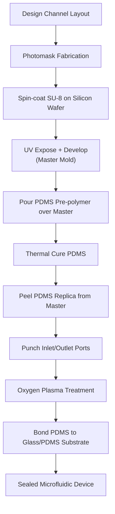

## Microfluidic Device Fabrication

### Overview

Microfluidic devices manipulate small volumes of fluid (typically nanoliters to microliters) through networks of channels, chambers, valves, and mixers fabricated at the micrometer scale. While closely related to MEMS in fabrication toolset, microfluidics diverges in dominant materials — polymer-based fabrication (particularly PDMS soft lithography) is far more prevalent than in silicon-centric MEMS, driven by lower cost, optical transparency, biocompatibility, and rapid prototyping needs for applications in lab-on-a-chip diagnostics, point-of-care testing, organ-on-chip systems, and DNA/protein analysis.

This topic covers the principal fabrication approaches — soft lithography, silicon/glass bulk micromachining, and emerging additive methods — along with the physical scaling laws that distinguish microfluidic flow behavior from macroscale fluidics.

---

### Physical Regime: Why Microfluidics Behaves Differently

**Key Points**

- At microfluidic length scales, the **Reynolds number** ($Re = \rho v L/\mu$) is typically very low (often $Re \ll 1$–100), placing flow firmly in the **laminar regime** — turbulent mixing is essentially absent, and fluid streams flowing side-by-side in a channel mix only by diffusion unless deliberately disrupted by channel geometry
- Surface-area-to-volume ratio scales as $1/L$, becoming very large at micro-scale — surface effects (surface tension, capillary forces, surface chemistry, electroosmotic effects) dominate over bulk/inertial effects that govern macroscale fluid behavior
- These scaling effects are exploited deliberately in device design: laminar co-flow enables precise diffusion-based mixing/reagent gradients, and high surface-to-volume ratio enables fast thermal equilibration (useful in PCR/thermal cycling microdevices) and efficient surface-based biochemical assays

---

### Soft Lithography (PDMS-Based Fabrication)

**Overview**

Soft lithography is the dominant rapid-prototyping and low-to-moderate-volume fabrication method for polymer microfluidics, centered on replica molding of **polydimethylsiloxane (PDMS)**, a transparent, biocompatible, gas-permeable silicone elastomer.

**Process Flow**

1. **Master mold fabrication**: A photoresist (commonly SU-8, a thick, high-aspect-ratio negative photoresist) is spin-coated onto a silicon wafer, exposed through a photomask defining the channel pattern, and developed — leaving a raised positive relief structure (the "master") of the desired channel geometry
2. **PDMS casting**: Liquid PDMS pre-polymer (base + curing agent, commonly mixed at a 10:1 ratio) is poured over the master mold and thermally cured (typically 65–100°C for 1–2 hours, though room-temperature curing over a longer period is also possible)
3. **Demolding**: The cured PDMS replica is peeled off the master, now containing a negative (channel) relief of the master pattern
4. **Access hole punching**: Inlet/outlet ports are punched or drilled through the PDMS slab to allow fluidic connections
5. **Bonding/sealing**: The channel-side of the PDMS is bonded to a flat substrate (commonly a glass slide, or a second flat PDMS layer) to enclose the channels, most commonly via **oxygen plasma treatment** of both surfaces immediately before contact, which activates silanol groups that form covalent Si-O-Si bonds upon contact, yielding a permanent, high-strength seal

**Key Points**

- SU-8 masters can be reused many times to cast multiple PDMS replicas, making soft lithography highly cost-effective for iterative prototyping and moderate-volume production
- PDMS is optically transparent from UV to near-IR, enabling direct optical/fluorescence microscopy observation of on-chip fluid behavior and cell/biological samples — a major reason for its dominance in lab-on-a-chip biological applications
- PDMS is inherently gas-permeable, which is advantageous for applications requiring gas exchange (e.g., organ-on-chip oxygenation) but can be a liability for applications requiring hermetic sealing or preventing evaporation of small sample volumes over extended experiments
- PDMS can absorb small hydrophobic molecules from solution ("PDMS absorption"), a known limitation for certain drug-screening and small-molecule assay applications, sometimes requiring surface treatment or alternative materials
- Multi-layer soft lithography (bonding multiple patterned PDMS layers) enables integrated on-chip pneumatic valves and pumps (e.g., the widely referenced Quake valve architecture), where a thin PDMS membrane deflects under pneumatic pressure from a control channel to pinch closed an underlying flow channel

---

### Silicon and Glass Bulk Micromachining for Microfluidics

**Key Points**

- Silicon-based microfluidic channels are fabricated using the same bulk micromachining techniques used elsewhere in MEMS — anisotropic KOH/TMAH wet etching (yielding trapezoidal channel cross-sections bounded by 54.74° (111) planes) or DRIE (yielding near-vertical, high-aspect-ratio channels)
- Glass channels are commonly fabricated via **wet etching with HF-based solutions** (isotropic, yielding rounded channel profiles) or via powder blasting/laser machining for coarser features
- Channels are typically sealed by bonding a capping wafer (glass-to-glass via fusion bonding, or silicon-to-glass via anodic bonding), forming fully enclosed, chemically robust, high-pressure-tolerant channels
- Silicon/glass microfluidics offers superior chemical resistance, thermal stability, and dimensional precision compared to PDMS, making it preferred for applications involving aggressive solvents, high pressure/temperature (e.g., some chemical synthesis-on-chip applications), or where long-term dimensional stability is critical, at the cost of significantly higher fabrication cost and complexity than soft lithography

---

### Additional Fabrication Approaches

**Thermoplastic Micromachining (Injection Molding, Hot Embossing)**

For high-volume commercial production (e.g., disposable diagnostic cartridges), thermoplastics such as PMMA, polycarbonate, or cyclic olefin copolymer (COC) are patterned via:

- **Hot embossing**: A heated master mold (metal or silicon) is pressed into a softened thermoplastic sheet, imprinting the channel pattern, then cooled and demolded
- **Injection molding**: Molten thermoplastic is injected into a mold cavity under pressure — the standard high-volume manufacturing method once a design is finalized, offering very low per-unit cost at scale but requiring expensive mold tooling upfront

**Key Points**

- Thermoplastics generally offer better chemical resistance and lower cost at high volume than PDMS, but require more expensive tooling and are less suited to rapid iteration during the design/prototyping phase
- Channel sealing for thermoplastics is typically achieved via thermal bonding, solvent bonding, adhesive lamination, or ultrasonic welding

**Paper-Based Microfluidics**

- Patterned hydrophobic barriers (e.g., wax printing) define hydrophilic channels within porous paper substrates, wicking fluid via capillary action without requiring external pumping
- Extremely low-cost, disposable, and well suited to point-of-care diagnostics in resource-limited settings, at the cost of less precise flow control compared to closed-channel microfluidics

**3D Printing**

- Additive manufacturing (stereolithography, digital light processing, or two-photon polymerization for sub-micron features) is an increasingly used approach for rapid microfluidic prototyping, particularly for complex 3D channel geometries difficult to achieve with planar lithographic methods
- Resolution, surface finish, and material biocompatibility vary considerably by 3D printing technology and are generally still inferior to soft lithography or silicon micromachining for the finest feature sizes [Inference — 3D printing capability for microfluidics is an actively evolving area, and specific resolution/material claims should be checked against current printer and resin specifications]

---

### Comparative Summary: Fabrication Method Trade-offs

| Method | Cost (Prototype) | Cost (Volume) | Optical Clarity | Chemical Resistance | Typical Application |
| --- | --- | --- | --- | --- | --- |
| PDMS soft lithography | Low | Moderate–high | Excellent | Limited (absorbs small molecules) | Lab-on-chip, cell biology, rapid prototyping |
| Silicon/glass bulk micromachining | High | High | Good (glass) | Excellent | Chemical synthesis, harsh-environment sensing |
| Thermoplastic (injection/embossing) | Moderate–high (tooling) | Very low | Good | Good | Disposable diagnostic cartridges (high volume) |
| Paper-based | Very low | Very low | N/A | Poor | Point-of-care, resource-limited diagnostics |
| 3D printing | Low–moderate | Low (per-unit, no tooling) | Variable | Resin-dependent | Complex 3D geometries, rapid iteration |

---

### Functional Elements in Microfluidic Devices

- **Passive micromixers**: Exploit channel geometry (herringbone grooves, serpentine channels) to fold and stretch laminar fluid streams, increasing interfacial area for diffusion-based mixing without moving parts
- **Integrated valves**: Pneumatically actuated PDMS membrane valves (multi-layer soft lithography), or phase-change/thermal valves in some thermoplastic/paper systems
- **Micropumps**: Peristaltic PDMS pumps (sequential valve actuation), electroosmotic pumping (using an applied electric field to drive ionic double-layer-mediated bulk flow), or external syringe/pressure-driven pumping
- **Droplet generators**: T-junction or flow-focusing geometries that pinch a dispersed-phase fluid into discrete droplets within a continuous carrier phase, foundational to droplet-based digital microfluidics (single-cell/single-molecule encapsulation)
- **Electrodes for electrokinetic manipulation**: Patterned metal electrodes (e.g., for electrophoresis, dielectrophoresis, or electrowetting-on-dielectric digital microfluidics) integrated into the channel substrate

---

### Mermaid Diagram — Soft Lithography (PDMS) Fabrication Flow

---

### SVG Diagram — PDMS Replica Molding Cross-Section (svg_diagram)

<svg xmlns="http://www.w3.org/2000/svg" viewBox="0 0 640 300" font-family="sans-serif">
<text x="320" y="20" text-anchor="middle" font-size="14" font-weight="bold">PDMS Soft Lithography Replica Molding (svg_diagram)</text>
<text x="140" y="45" text-anchor="middle" font-size="12">SU-8 Master Mold</text>
<rect x="40" y="150" width="200" height="40" fill="#95a5a6" />
<rect x="90" y="120" width="30" height="30" fill="#f39c12" />
<rect x="160" y="120" width="30" height="30" fill="#f39c12" />
<text x="140" y="200" text-anchor="middle" font-size="9">Silicon wafer + SU-8 relief</text>
<path d="M 260 150 L 320 150" stroke="black" stroke-width="1.5" marker-end="url(#arrow2)" />
<text x="290" y="140" text-anchor="middle" font-size="9">Cast PDMS</text>
<text x="460" y="45" text-anchor="middle" font-size="12">Cured PDMS + Bonded Glass</text>
<rect x="360" y="100" width="200" height="60" fill="#ecf0f1" stroke="#2c3e50" stroke-width="1" />
<rect x="410" y="130" width="30" height="30" fill="white" stroke="#2c3e50" />
<rect x="480" y="130" width="30" height="30" fill="white" stroke="#2c3e50" />
<text x="460" y="180" text-anchor="middle" font-size="9">PDMS with channel cavities</text>
<rect x="360" y="160" width="200" height="20" fill="#5dade2" />
<text x="460" y="196" text-anchor="middle" font-size="9" fill="#2980b9">Glass substrate (plasma-bonded)</text>
</svg>

---

### Practical Design Implications

- Choose PDMS soft lithography for rapid prototyping, optical-observation-dependent biological assays, and low-to-moderate production volumes; reserve silicon/glass or thermoplastic fabrication for chemically aggressive, high-pressure, or high-volume commercial applications
- Design channel geometry around the laminar-flow regime — rely on diffusion-based mixing/co-flow behavior rather than assuming turbulent mixing, and add passive mixer geometries (herringbone grooves, serpentine paths) when faster mixing is required
- Account for PDMS-specific limitations (small-molecule absorption, gas permeability, limited solvent compatibility) early when the application involves hydrophobic drug compounds or requires hermetic, evaporation-free sealing
- Plan bonding strategy (plasma-activated PDMS-glass, thermal/solvent bonding for thermoplastics, anodic/fusion bonding for silicon/glass) as part of the fabrication flow, not as an afterthought, since bond strength directly limits achievable operating pressure
- Select injection molding or hot embossing only once a design is finalized and production volume justifies the upfront tooling cost; use PDMS or 3D printing for all earlier iteration stages

**Related Topics**

- Bulk micromachining techniques (KOH/TMAH, DRIE) shared with silicon microfluidics
- Electrokinetic phenomena: electroosmosis, electrophoresis, dielectrophoresis
- Droplet microfluidics and digital microfluidics (electrowetting-on-dielectric)
- Lab-on-a-chip integration with on-chip sensing (optical, electrochemical)
- Organ-on-chip and cell culture microfluidic device design
- Multi-layer soft lithography and PDMS pneumatic valve/pump architectures