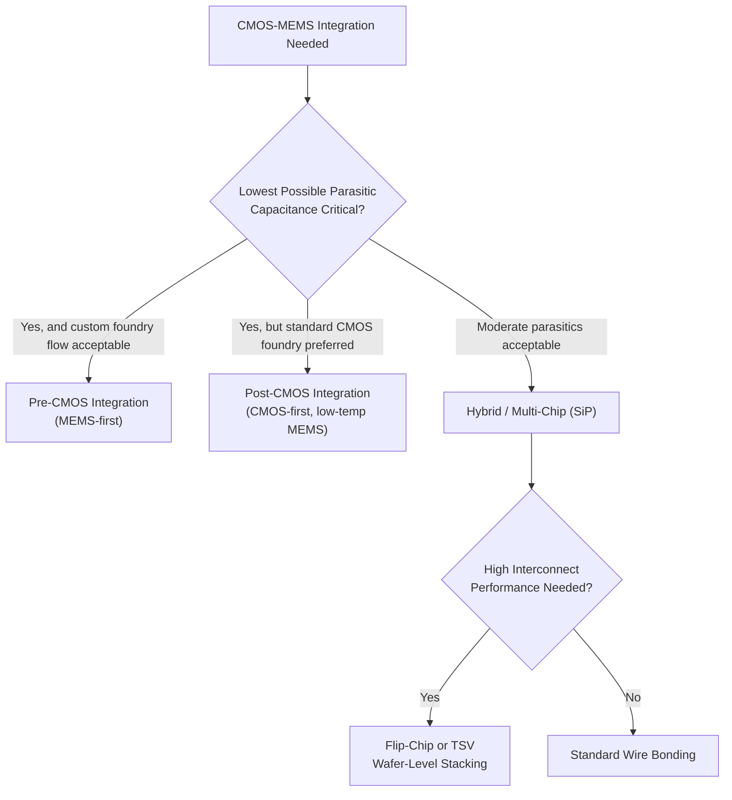

## CMOS MEMS Integration

### Overview

CMOS-MEMS integration combines micromechanical structures with CMOS readout/control circuitry on the same die or in the same package, aiming to reduce parasitic capacitance and interconnect length between the sensitive MEMS transducer and its first-stage amplification electronics, reduce overall system size and cost, and simplify assembly. Because MEMS structures often require process steps (thick film deposition, high-temperature anneals, aggressive wet/dry release etches) that are incompatible with, or damaging to, standard CMOS transistors and interconnect, integration strategy is a central architectural decision — not merely a packaging detail — with direct consequences for achievable performance, yield, and cost.

Three broad integration strategies dominate: **pre-CMOS**, **post-CMOS**, and **hybrid/multi-chip (SiP)** integration, each with a distinct set of process-compatibility trade-offs.

---

### Why Integration Matters: The Parasitic Capacitance Motivation

**Key Points**

- Capacitive MEMS sensors (accelerometers, gyroscopes, microphones) typically produce very small capacitance changes (often in the sub-femtofarad to few-femtofarad range) in response to the physical stimulus being measured
- Any parasitic capacitance in the signal path between the MEMS sense electrode and the first amplification stage — bond pads, wire bonds, PCB traces, package interconnect — directly degrades the achievable signal-to-noise ratio, since the parasitic capacitance forms a capacitive divider with the (small) sense capacitance
- Co-locating the MEMS structure and its first-stage transimpedance/charge amplifier minimizes this parasitic path length, which is the primary technical motivation for CMOS-MEMS integration over simple multi-chip packaging with long bond-wire interconnects

---

### Strategy 1: Pre-CMOS Integration (MEMS-First)

**Process Concept**

The MEMS structure is fabricated first, directly into or onto the silicon substrate, and the wafer is then processed through a standard (or lightly modified) CMOS flow to add the transistors and interconnect.

**Key Points**

- Advantage: The MEMS structure can use high-temperature process steps (e.g., high-temperature anneals for stress relief in structural polysilicon, or thermal oxidation) without concern for damaging CMOS transistors, since the CMOS active devices have not yet been formed
- Disadvantage: The MEMS structure (and any topography or trenches it introduces) must survive the subsequent CMOS thermal budget and, critically, must be planarized or otherwise made compatible with CMOS lithography, which requires very tight surface flatness tolerances — any residual MEMS-induced topography can compromise CMOS feature resolution in later lithography steps
- Requires the foundry to accept a substantially non-standard starting wafer for the CMOS portion of the flow, generally requiring a dedicated or heavily customized CMOS process line rather than a standard merchant foundry offering [Inference — foundry willingness to accept custom pre-patterned wafers is highly foundry- and relationship-specific]

---

### Strategy 2: Post-CMOS Integration (CMOS-First)

**Process Concept**

Standard CMOS circuitry is fabricated first (in an unmodified or minimally modified standard CMOS process), and MEMS structural layers are added afterward, either using additional deposition/patterning steps directly on top of the finished CMOS wafer, or by modifying/etching the existing CMOS interconnect stack itself to form mechanical structures.

**Two Common Sub-Approaches**

1. **Modified interconnect (CMOS-metal) MEMS**: The standard CMOS metal and inter-level dielectric layers are used directly as the MEMS structural material, then released via post-processing etch (e.g., anisotropic RIE plus a final undercut etch) to free the metal layers as movable structures — used in some early Sandia and academic "CMOS-MEMS" processes leveraging aluminum interconnect as the structural layer
2. **Added structural layers**: One or more dedicated MEMS structural/sacrificial layers are deposited and patterned on top of the finished CMOS wafer, followed by a release step

**Key Points**

- Major advantage: standard, unmodified (or only lightly modified) CMOS processing can be used, allowing access to mainstream merchant CMOS foundries and design flows, and largely decoupling MEMS process development risk from CMOS process risk
- The dominant constraint is the CMOS **thermal budget**: once CMOS transistors and (especially) aluminum/copper interconnect exist on the wafer, subsequent MEMS process steps are limited to relatively low temperatures (typically below ~400–450°C for aluminum interconnect, and copper interconnect imposes its own distinct thermal/diffusion-barrier constraints) to avoid degrading transistor characteristics (dopant diffusion, contact/silicide integrity) or interconnect reliability (electromigration, via/metal reflow)
- This thermal constraint generally rules out high-temperature LPCVD polysilicon deposition/anneal (a preferred surface-micromachining structural material) directly on top of finished CMOS, pushing post-CMOS MEMS toward lower-temperature-compatible structural materials such as electroplated metals (Ni, Cu) or PECVD-deposited films
- Release etch chemistry must also be selected to avoid attacking exposed CMOS metal/dielectric layers — a non-trivial materials-compatibility constraint distinct from the pure mechanical-release requirements of a standalone MEMS process

---

### Strategy 3: Hybrid / Multi-Chip (System-in-Package) Integration

**Process Concept**

The MEMS device and CMOS ASIC (Application-Specific Integrated Circuit) are fabricated as separate dies, using their own independently optimized processes, and then combined at the package level — via wire bonding, flip-chip bonding, or wafer-level 3D stacking (through-silicon vias, TSVs).

**Key Points**

- Advantage: Each process (MEMS and CMOS) can be independently optimized without cross-compatibility constraints, generally offering the highest achievable performance for each individually, the fastest time-to-market for a given MEMS design (since it can use a mature, dedicated MEMS foundry process), and lower combined process development risk than true monolithic integration
- Disadvantage: Introduces additional parasitic capacitance/inductance from the die-to-die interconnect (bond wires or flip-chip bumps), which — for the most parasitic-sensitive sensor types — can meaningfully degrade achievable SNR compared to true monolithic (pre- or post-CMOS) integration
- **Wafer-level packaging (WLP)** and **through-silicon via (TSV)** 3D stacking substantially reduce this interconnect penalty relative to traditional wire bonding by shortening and paralleling the electrical path between the MEMS and CMOS dies, and are increasingly used in high-volume consumer MEMS (e.g., smartphone microphones, accelerometers) to approach monolithic-integration-level performance while retaining independent process optimization
- This is the dominant strategy in high-volume commercial MEMS today, precisely because it decouples MEMS foundry development from CMOS foundry development and allows each to use a best-in-class, independently qualified process [Inference — the balance of monolithic vs. multi-chip integration in any specific commercial product line is proprietary and foundry-specific]

---

### Comparative Summary: Integration Strategy Trade-offs

| Strategy | Parasitic Capacitance | Thermal Budget Constraint | Process Complexity/Risk | Foundry Flexibility |
| --- | --- | --- | --- | --- |
| Pre-CMOS (MEMS-first) | Lowest | MEMS unconstrained; CMOS must tolerate topography | High (custom flow) | Low (requires dedicated/custom line) |
| Post-CMOS (CMOS-first) | Low | MEMS constrained by CMOS (~400–450°C limit) | High (materials compatibility) | Moderate |
| Hybrid / Multi-chip (SiP) | Moderate (wire bond) to Low (TSV/flip-chip) | None (independent processes) | Lowest (independent optimization) | Highest (standard foundries for both) |

---

### Circuit-Level Design Considerations for CMOS-MEMS Interfaces

- **Charge/transimpedance amplifiers**: First-stage readout circuits for capacitive MEMS sensors are typically charge amplifiers or transimpedance amplifiers specifically designed for very high input impedance and low input-referred noise, since the MEMS sense capacitance is small and the signal current correspondingly tiny
- **Chopper stabilization and correlated double sampling**: Frequently employed in the readout ASIC to suppress the CMOS amplifier's own 1/f (flicker) noise, which would otherwise dominate at the low signal frequencies typical of many MEMS sensing applications (see the related flicker-noise mechanisms discussed under RF/analog noise sources)
- **Electrostatic actuation drive circuits**: For resonant MEMS devices (gyroscopes, resonators) or force-feedback accelerometers, the CMOS ASIC must also provide precision drive/feedback voltage generation, often requiring careful attention to voltage reference stability and low-noise high-voltage generation (charge pumps) when actuation voltages exceed the core CMOS supply rail
- **ESD and overvoltage protection**: MEMS sense/actuation nodes are directly exposed at the package level in many designs and require ESD protection circuitry compatible with the sensitive, high-impedance nature of the MEMS interface — standard digital I/O ESD structures are often unsuitable due to their added parasitic capacitance

---

### Mermaid Diagram — CMOS-MEMS Integration Strategy Decision Flow

---

### SVG Diagram — Integration Strategy Cross-Sections (svg_diagram)

<svg xmlns="http://www.w3.org/2000/svg" viewBox="0 0 640 340" font-family="sans-serif">
<text x="320" y="20" text-anchor="middle" font-size="14" font-weight="bold">CMOS-MEMS Integration Approaches (svg_diagram)</text>
<text x="110" y="45" text-anchor="middle" font-size="11">Post-CMOS (Monolithic)</text>
<rect x="30" y="230" width="160" height="50" fill="#95a5a6" />
<text x="110" y="260" text-anchor="middle" font-size="9">Silicon Substrate</text>
<rect x="30" y="190" width="160" height="40" fill="#3498db" />
<text x="110" y="214" text-anchor="middle" font-size="9" fill="white">CMOS Transistors + Interconnect</text>
<rect x="60" y="160" width="100" height="25" fill="#c0392b" />
<text x="110" y="177" text-anchor="middle" font-size="8" fill="white">MEMS Structure (low-temp)</text>
<text x="320" y="45" text-anchor="middle" font-size="11">Hybrid / Multi-Chip (SiP)</text>
<rect x="240" y="230" width="160" height="50" fill="#95a5a6" />
<text x="320" y="260" text-anchor="middle" font-size="9">Package Substrate</text>
<rect x="250" y="190" width="60" height="35" fill="#3498db" />
<text x="280" y="210" text-anchor="middle" font-size="8" fill="white">CMOS ASIC</text>
<rect x="330" y="185" width="60" height="40" fill="#c0392b" />
<text x="360" y="207" text-anchor="middle" font-size="8" fill="white">MEMS Die</text>
<path d="M 310 195 L 330 195" stroke="black" stroke-width="1.5" />
<text x="530" y="45" text-anchor="middle" font-size="11">TSV / Flip-Chip Stack</text>
<rect x="460" y="240" width="160" height="40" fill="#95a5a6" />
<text x="540" y="264" text-anchor="middle" font-size="9">Package Substrate</text>
<rect x="470" y="195" width="140" height="40" fill="#3498db" />
<text x="540" y="218" text-anchor="middle" font-size="8" fill="white">CMOS ASIC (with TSVs)</text>
<rect x="490" y="155" width="100" height="35" fill="#c0392b" />
<text x="540" y="176" text-anchor="middle" font-size="8" fill="white">MEMS Die (flip-chip bonded)</text>
<line x1="510" y1="190" x2="510" y2="235" stroke="#f1c40f" stroke-width="3" />
<line x1="570" y1="190" x2="570" y2="235" stroke="#f1c40f" stroke-width="3" />
</svg>

---

### Practical Design Implications

- Select integration strategy based on the actual performance requirement driving co-location: if the target application's SNR is not fundamentally limited by parasitic capacitance, hybrid/multi-chip integration is generally preferable for its lower process risk and access to independently optimized, standard foundry processes
- When post-CMOS integration is required, select MEMS structural materials (electroplated metals, PECVD films) compatible with the CMOS thermal budget from the outset — do not assume standard high-temperature LPCVD polysilicon recipes can be transferred directly onto a finished CMOS wafer
- Design first-stage readout amplifiers (charge/transimpedance amplifiers) with chopper stabilization or correlated double sampling when the target MEMS sensor's signal band overlaps the CMOS amplifier's flicker-noise-dominated low-frequency region
- Include MEMS-interface-appropriate ESD protection early in the ASIC design, since standard digital I/O ESD structures often introduce unacceptable parasitic capacitance at sensitive analog MEMS sense nodes
- For high-volume consumer MEMS, favor wafer-level packaging and TSV/flip-chip stacking over wire bonding when interconnect parasitics meaningfully affect target sensor performance

**Related Topics**

- Surface and post-CMOS-compatible low-temperature structural materials (electroplated Ni/Cu)
- Charge amplifier and transimpedance amplifier design for capacitive sensing
- Wafer-level packaging and through-silicon via (TSV) 3D integration
- Chopper stabilization and correlated double sampling for low-frequency noise suppression
- MEMS wafer bonding techniques (anodic, fusion, eutectic) in packaging context
- ESD protection design for high-impedance analog sensor interfaces