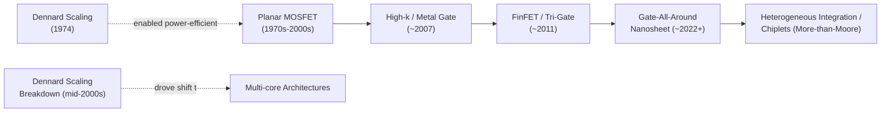

## Historical Moore's Law Scaling Trends

### Overview

Moore's Law describes the empirical observation, first articulated by Gordon Moore (co-founder of Intel) in 1965 and revised in 1975, that the number of transistors economically manufacturable on an integrated circuit doubles at a roughly regular interval. Although frequently mischaracterized as a physical law, Moore's Law is fundamentally an economic and engineering observation about the industry's sustained ability to shrink feature sizes while maintaining or improving cost-per-transistor and yield — a trend sustained for over five decades through a sequence of distinct technical eras, each requiring new physics-driven and materials-driven solutions as previous scaling approaches reached their limits.

---

### Origins: Moore's 1965 and 1975 Papers

**Key Points**

- In his original 1965 paper ("Cramming More Components onto Integrated Circuits"), Moore observed that the number of components per integrated circuit had been doubling approximately every year since 1958, and projected this trend would continue for at least a decade
- In a 1975 revision, Moore adjusted the doubling period to approximately every two years, reflecting the increasing difficulty of maintaining the original one-year cadence as circuit complexity grew
- The commonly cited "18-month doubling period" is often attributed to then-Intel executive David House, who combined the doubling of transistor count with the simultaneous increase in transistor speed to estimate an effective 18-month doubling in overall chip *performance* — a distinct (and somewhat conflated) claim from Moore's original transistor-count observation

---

### Dennard Scaling: The Companion Rule (1974)

**Key Points**

- Proposed by Robert Dennard and colleagues at IBM in 1974, **Dennard scaling** described how transistor dimensions, voltage, and current could all be scaled by the same factor $\kappa$ (with $\kappa < 1$) such that power density remained approximately constant even as transistor count increased — this was the critical companion principle that made Moore's Law-driven transistor scaling *practically usable*, since it implied that shrinking transistors could run faster and be packed more densely without a proportional increase in power dissipation per unit area
- Under classical Dennard scaling: if dimensions scale by $\kappa$, then voltage scales by $\kappa$, capacitance scales by $\kappa$, delay scales by $\kappa$, and power per transistor scales by $\kappa^2$ — while transistor density scales by $1/\kappa^2$, keeping power *density* constant
- **Dennard scaling breakdown (mid-2000s)**: As threshold voltage and supply voltage scaling slowed (limited by subthreshold leakage current and the need to maintain adequate noise margin and on/off current ratio), power density began to *increase* with each new node rather than remaining constant — this breakdown, rather than any failure of Moore's Law transistor-count scaling itself, is the direct physical cause of the industry's mid-2000s shift away from aggressively increasing single-core clock frequency and toward **multi-core architectures** as the primary means of translating additional transistor budget into usable performance

---

### Scaling Eras and Key Technology Inflection Points

**1. Planar Scaling Era (1970s–early 2000s)**

Transistors were simple planar MOSFETs, with each new node shrinking gate length, oxide thickness, and junction depths roughly proportionally (classical "constant-field" Dennard scaling). Gate oxide thickness scaled down to just a few nanometers, at which point **gate oxide tunneling leakage** (quantum-mechanical direct tunneling of carriers through the thin oxide) began imposing a hard physical limit on further oxide thinning using conventional $\text{SiO}_2$.

**2. High-κ/Metal Gate Era (~2007, Intel 45nm)**

**Key Points**

- To continue scaling effective oxide thickness without further increasing tunneling leakage, the industry transitioned from $\text{SiO}_2$ gate dielectric to **high-κ dielectric materials** (commonly hafnium-based, e.g., $\text{HfO}_2$), which provide the same effective gate capacitance at a physically thicker (lower-tunneling-leakage) film
- High-κ dielectrics required a corresponding shift from polysilicon to **metal gate electrodes**, since polysilicon gates suffer from Fermi-level pinning and threshold-voltage instability when paired directly with most high-κ dielectrics
- This transition (pioneered industrially by Intel at the 45nm node, with other foundries following at subsequent nodes) is widely regarded as one of the most significant materials-level inflection points in the history of CMOS scaling

**3. FinFET / Tri-Gate Era (~2011, Intel 22nm)**

**Key Points**

- As planar MOSFET channel lengths shrank further, **short-channel effects** (drain-induced barrier lowering, subthreshold leakage, threshold-voltage roll-off) became increasingly severe because a single planar gate has progressively less electrostatic control over the channel as gate length shrinks relative to channel depth/width
- The **FinFET** (fin field-effect transistor), in which the channel is formed as a thin vertical silicon "fin" wrapped on three sides by the gate, dramatically improves electrostatic gate control over the channel compared to planar structures, suppressing short-channel effects and enabling continued threshold-voltage and leakage scaling
- Introduced industrially at Intel's 22nm node (marketed as "Tri-Gate" transistors) and subsequently adopted industry-wide by other major foundries at broadly comparable technology generations

**4. Gate-All-Around (GAA) / Nanosheet Era (~2022 onward)**

**Key Points**

- As FinFET fin width and pitch continued scaling, further improving electrostatic control while managing fin-to-fin process variation and parasitic capacitance became increasingly difficult, motivating the transition to **gate-all-around (GAA)** transistor architectures, in which the gate fully surrounds the channel on all sides (rather than three sides, as in a FinFET)
- The leading industrial implementation is the **nanosheet** (or "nanoribbon") transistor, in which multiple stacked horizontal silicon sheets form the channel, each fully wrapped by the gate — offering an additional design degree of freedom (nanosheet width can be tuned per-device to trade off drive current against area, unlike a FinFET's quantized fin count) alongside improved electrostatic control
- Adopted industrially beginning around the "3nm"-class nodes at Samsung (branded MBCFET) and subsequently at other leading foundries at their comparable generations [Note: node names such as "3nm" and "2nm" have not corresponded to any literal physical transistor dimension for many node generations; they function primarily as marketing/generational labels rather than direct measurements of transistor gate length or pitch]

---

### The "More Than Moore" and "More Moore" Divergence

**Key Points**

- **"More Moore"** refers to continuing traditional geometric/density scaling — smaller transistors, higher density, following the historical Moore's Law trajectory through successive architecture transitions (planar → FinFET → GAA)
- **"More than Moore"** refers to adding value through functional diversification and integration rather than pure geometric scaling — heterogeneous integration, advanced packaging (2.5D/3D stacking, chiplets), and system-level co-optimization — reflecting an industry-wide recognition that continued economic and performance benefit increasingly comes from packaging and system architecture innovation alongside, or in some cases instead of, further monolithic transistor shrink
- This divergence underlies the rise of **chiplet-based architectures**, where a large SoC is disaggregated into multiple smaller dies (potentially fabricated on different, independently optimized process nodes) and reassembled via advanced packaging, rather than being fabricated as a single large monolithic die

---

### Economic Dimension: Cost-Per-Transistor Trends

**Key Points**

- Moore's Law was originally, and remains fundamentally, an economic observation: it holds only insofar as smaller transistors continue to be manufacturable at lower (or at least not proportionally higher) cost per transistor
- Beginning around the 28nm–20nm node generation, industry analysts and semiconductor economists have noted a slowing, and at some node transitions a reversal, of the historical cost-per-transistor decline, driven by dramatically increasing lithography costs (particularly extreme ultraviolet, EUV, lithography tooling) and rising design/verification costs at advanced nodes [Inference — the precise magnitude and timing of cost-per-transistor trends vary across published industry analyses and foundry-specific data, and should be treated as directional rather than precisely quantified without consulting current primary sources]
- This economic pressure is a major additional driver (alongside the Dennard scaling breakdown) behind the industry's increasing emphasis on architectural innovation, packaging-level integration, and workload-specific accelerators as alternative paths to continued system-level performance improvement, independent of raw transistor density scaling

---

### Comparative Summary: Scaling Era Transitions

| Era | Approximate Introduction | Key Innovation | Problem Solved |
| --- | --- | --- | --- |
| Planar scaling | 1970s–2000s | Proportional (Dennard) geometric shrink | Baseline density/speed scaling |
| High-κ/Metal Gate | ~2007 (Intel 45nm) | $\text{HfO}_2$ dielectric + metal gate | Gate oxide tunneling leakage |
| FinFET/Tri-Gate | ~2011 (Intel 22nm) | 3D fin channel, gate on 3 sides | Short-channel effects, leakage |
| Gate-All-Around/Nanosheet | ~2022 onward | Gate fully surrounds stacked channels | Further electrostatic control scaling |
| More-than-Moore / Chiplets | ~2010s onward (accelerating) | Heterogeneous packaging integration | Slowing monolithic cost/density scaling |

---

### Mermaid Diagram — Transistor Architecture Evolution Timeline

---

### SVG Diagram — Transistor Gate Architecture Evolution (svg_diagram)

<svg xmlns="http://www.w3.org/2000/svg" viewBox="0 0 640 320" font-family="sans-serif">
<text x="320" y="20" text-anchor="middle" font-size="14" font-weight="bold">Gate Electrostatic Control Evolution (svg_diagram)</text>
<text x="100" y="45" text-anchor="middle" font-size="11">Planar (1-side gate)</text>
<rect x="40" y="180" width="120" height="40" fill="#95a5a6" />
<rect x="70" y="150" width="60" height="30" fill="#c0392b" />
<rect x="60" y="140" width="80" height="12" fill="#2980b9" />
<text x="100" y="235" text-anchor="middle" font-size="8">Gate on top only</text>
<text x="320" y="45" text-anchor="middle" font-size="11">FinFET (3-side gate)</text>
<rect x="260" y="180" width="120" height="40" fill="#95a5a6" />
<rect x="305" y="130" width="30" height="55" fill="#c0392b" />
<path d="M 290 125 L 350 125 L 350 190 L 335 190 L 335 140 L 305 140 L 305 190 L 290 190 Z" fill="#2980b9" opacity="0.8" />
<text x="320" y="235" text-anchor="middle" font-size="8">Gate wraps 3 sides (fin)</text>
<text x="540" y="45" text-anchor="middle" font-size="11">GAA Nanosheet (4-side gate)</text>
<rect x="480" y="200" width="120" height="20" fill="#95a5a6" />
<rect x="500" y="175" width="80" height="10" fill="#c0392b" />
<rect x="500" y="155" width="80" height="10" fill="#c0392b" />
<rect x="500" y="135" width="80" height="10" fill="#c0392b" />
<rect x="490" y="128" width="100" height="4" fill="#2980b9" />
<rect x="490" y="148" width="100" height="4" fill="#2980b9" />
<rect x="490" y="168" width="100" height="4" fill="#2980b9" />
<rect x="490" y="188" width="100" height="4" fill="#2980b9" />
<text x="540" y="235" text-anchor="middle" font-size="8">Gate fully surrounds each sheet</text>
</svg>

---

### Practical Design Implications

- Recognize that "node name" (e.g., 7nm, 5nm, 3nm) is a marketing/generational designation, not a literal transistor dimension, for all recent process generations — actual gate length, fin pitch, and metal pitch must be obtained from foundry PDK documentation for any quantitative design work
- Anticipate that continued performance improvement increasingly requires architectural techniques (multi-core, domain-specific accelerators, heterogeneous chiplet integration) rather than relying solely on single-thread performance gains from transistor scaling, given the Dennard scaling breakdown
- When evaluating a new process node for a design, assess both density/performance benefits and cost-per-transistor trends explicitly, since advanced-node economic benefit is no longer automatic at every generation
- Treat GAA/nanosheet-specific design considerations (per-device sheet-width tuning, new parasitic capacitance profiles) as materially different from FinFET design practices, not as incremental extensions

**Related Topics**

- FinFET and Gate-All-Around (GAA) transistor device physics
- High-κ/metal gate materials and gate stack engineering
- Advanced packaging: 2.5D/3D integration, chiplets, and heterogeneous integration
- EUV lithography and its role in advanced-node cost/complexity trends
- Multi-core and domain-specific accelerator architectures (post-Dennard performance scaling)
- International Roadmap for Devices and Systems (IRDS) technology projections