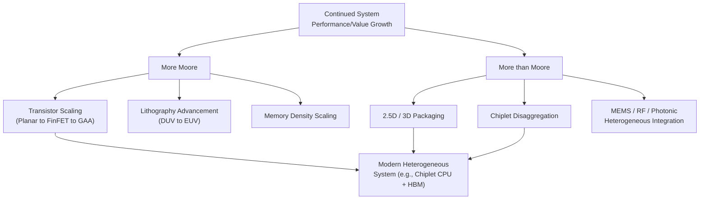

## More Moore Versus More than Moore Paradigms

### Overview

As classical geometric transistor scaling has become increasingly costly and technically constrained, the semiconductor industry has organized its continued-improvement strategies around two complementary but distinct paradigms, formalized in industry roadmap documents (originally the ITRS — International Technology Roadmap for Semiconductors — and its successor, the IRDS — International Roadmap for Devices and Systems). **"More Moore"** describes continued scaling of digital CMOS density and performance along the historical Moore's Law trajectory. **"More than Moore"** describes value creation through functional diversification, heterogeneous integration, and system-level co-design rather than pure transistor shrink. Understanding this distinction is central to modern technology and product roadmap planning, since most advanced systems today derive performance and cost benefit from *both* paradigms simultaneously rather than from either alone.

---

### More Moore: Continued Geometric/Density Scaling

**Definition and Scope**

"More Moore" encompasses all technology directions aimed at continuing to increase digital logic and memory density, switching speed, and energy efficiency through transistor-level and process-level innovation — the traditional axis along which Moore's Law has historically been measured.

**Key Points — Constituent Technology Directions**

- **Lithography advancement**: Progression through deep ultraviolet (DUV) immersion lithography, multiple patterning techniques, and extreme ultraviolet (EUV) lithography to print progressively finer features
- **Transistor architecture evolution**: The historical sequence from planar MOSFET to FinFET/Tri-Gate to gate-all-around (GAA) nanosheet transistors, each innovation restoring or improving electrostatic gate control lost as channel dimensions shrink
- **Materials innovation**: High-κ/metal gate stacks, strained silicon channel engineering, and emerging channel materials (e.g., research into 2D materials such as transition-metal dichalcogenides for future nodes) aimed at maintaining carrier mobility and drive current as dimensions shrink
- **Memory scaling**: Continued density scaling of DRAM and NAND flash, including 3D NAND vertical stacking (itself arguably a "More than Moore"-adjacent technique applied within a "More Moore" memory context) and emerging non-volatile memory technologies (MRAM, ReRAM, phase-change memory) as potential future replacements or complements to conventional charge-storage memory
- **Interconnect scaling**: Continued back-end-of-line (BEOL) metal pitch scaling, alongside emerging interconnect materials (e.g., ruthenium, cobalt) as copper resistivity scaling becomes increasingly unfavorable at very fine interconnect dimensions due to electron surface/grain-boundary scattering effects at nanoscale wire widths

**Key Points — Constraints Driving the Paradigm's Limits**

- Diminishing returns from further monolithic density scaling due to escalating lithography and process-development costs (EUV tooling capital cost, multi-patterning complexity)
- Physical limits approaching at atomic-scale dimensions — gate lengths and channel dimensions are now only tens of atoms across, introducing quantum-mechanical and atomistic-variability effects that are difficult to control with continued conventional scaling
- Dennard scaling breakdown (loss of constant power-density scaling) means density increases no longer automatically translate into proportional performance-per-watt improvement, reducing the direct performance benefit of pure transistor-count scaling relative to earlier scaling eras

---

### More than Moore: Functional Diversification and Heterogeneous Integration

**Definition and Scope**

"More than Moore" encompasses technologies that add system value through integration of diverse functionality — often non-digital or non-logic functions — and through packaging-level or system-level architectural innovation, rather than through further transistor geometric shrink.

**Key Points — Constituent Technology Directions**

1. **Heterogeneous Integration / Advanced Packaging**
   - **2.5D integration**: Multiple dies mounted side-by-side on a shared interposer (silicon, organic, or glass) providing high-density, low-parasitic interconnect between dies without requiring them to be fabricated on the same monolithic substrate
   - **3D integration**: Dies stacked vertically and connected via through-silicon vias (TSVs), enabling much shorter interconnect and higher interconnect density than any package-level (wire-bond or even 2.5D) alternative, at the cost of increased thermal management complexity (heat generated in a lower die must conduct through overlying dies)
   - **Chiplet architectures**: Disaggregation of what would traditionally be a single large monolithic SoC into multiple smaller dies — potentially fabricated on different, independently optimized process nodes chosen per function (e.g., a leading-edge node for compute logic, a mature/cost-optimized node for I/O or analog blocks) — reassembled via 2.5D/3D packaging, improving yield (smaller dies have inherently higher yield than one large die) and enabling process-node specialization per functional block
2. **MEMS and Sensor Integration**: Incorporating mechanical, optical, or fluidic microsystems (accelerometers, gyroscopes, microphones, microfluidic devices — as covered elsewhere in this chapter) alongside or adjacent to digital CMOS, adding sensing/actuation functionality that pure digital scaling cannot provide
3. **RF and Analog/Mixed-Signal Integration**: Combining RF front-end components (power amplifiers, LNAs, passive networks — as covered in the RF and Analog chapter) with digital baseband processing, either monolithically or via heterogeneous packaging, to enable compact wireless system integration
4. **Power Electronics and High-Voltage Integration**: Integrating power management, voltage regulation, and battery-charging functions — often requiring specialized high-voltage-tolerant device structures distinct from mainstream logic transistors — alongside digital control logic
5. **Photonic Integration**: Combining silicon photonics (optical waveguides, modulators, photodetectors) with electronic circuitry for high-bandwidth optical interconnect, increasingly relevant for data-center and high-performance-computing interconnect as electrical interconnect bandwidth-per-watt scaling becomes a limiting factor

**Key Points — Why This Paradigm Has Grown in Importance**

- Provides a path to continued *system-level* performance, cost, and functionality improvement even where further monolithic transistor density scaling faces diminishing economic or physical returns
- Enables **process-node specialization**: not every functional block in a system benefits equally from the most advanced (and most expensive) logic process node — analog, RF, I/O, and power management blocks often perform better, or at lower cost, on older/mature nodes better suited to their electrical characteristics, and chiplet disaggregation allows each block to be fabricated on its most appropriate node rather than forcing a one-size-fits-all monolithic die
- Improves yield economics: since defect density scales with die area, disaggregating a large monolithic SoC into multiple smaller chiplets can substantially improve overall system yield, particularly important given the escalating cost of leading-edge wafer processing

---

### Comparative Summary: More Moore vs. More than Moore

| Aspect | More Moore | More than Moore |
| --- | --- | --- |
| Primary value driver | Transistor density, switching speed | Functional diversity, system integration |
| Typical technologies | FinFET/GAA, EUV lithography, memory scaling | 2.5D/3D packaging, chiplets, MEMS/RF/photonic integration |
| Cost driver | Lithography/process development cost | Packaging/interconnect/assembly cost |
| Primary limiting factor | Atomic-scale physical limits, Dennard breakdown | Thermal management, interconnect bandwidth/latency, assembly yield |
| Roadmap body (historical) | ITRS "More Moore" working group | ITRS "More than Moore" working group |
| Representative product trend | Leading-edge logic/memory process nodes | Multi-chiplet processors, SiP sensor modules, 3D-stacked memory |

---

### Convergence: Most Modern Systems Use Both Paradigms Simultaneously

**Key Points**

- Modern high-performance processors increasingly combine "More Moore" leading-edge logic chiplets with "More than Moore" 2.5D/3D packaging to integrate memory (e.g., high-bandwidth memory, HBM, itself a 3D-stacked "More than Moore" technology) directly adjacent to compute logic, illustrating that the two paradigms are complementary rather than competing strategies in contemporary system design
- Consumer MEMS sensor modules (as discussed in the MEMS/Sensor chapter) typically combine a "More Moore"-scaled CMOS readout ASIC with a "More than Moore" heterogeneously integrated MEMS transducer die, again illustrating the two paradigms operating together within a single product
- The IRDS (successor to ITRS) formally tracks both paradigms as parallel, interacting roadmap tracks rather than treating "More than Moore" as a secondary or fallback strategy — reflecting the industry's consensus view that continued system-level progress depends on advancing both axes together [Inference — the precise organizational structure and specific chapter names within the current IRDS roadmap may be updated periodically; consult the current IRDS publication for the authoritative, up-to-date roadmap structure]

---

### Mermaid Diagram — Technology Roadmap Paradigm Relationship

---

### SVG Diagram — More Moore vs. More than Moore Axes (svg_diagram)

<svg xmlns="http://www.w3.org/2000/svg" viewBox="0 0 620 340" font-family="sans-serif">
<text x="310" y="20" text-anchor="middle" font-size="14" font-weight="bold">Two-Axis Scaling Roadmap (svg_diagram)</text>
<line x1="80" y1="290" x2="580" y2="290" stroke="black" stroke-width="1.5" />
<line x1="80" y1="290" x2="80" y2="50" stroke="black" stroke-width="1.5" />
<text x="330" y="320" text-anchor="middle" font-size="12">More Moore (density/speed) →</text>
<text x="35" y="170" text-anchor="middle" font-size="12" transform="rotate(-90 35 170)">More than Moore (integration) →</text>
<rect x="100" y="260" width="60" height="20" fill="#95a5a6" />
<text x="130" y="255" text-anchor="middle" font-size="8">1990s planar SoC</text>
<rect x="250" y="200" width="60" height="20" fill="#3498db" />
<text x="280" y="195" text-anchor="middle" font-size="8">2010s FinFET SoC</text>
<rect x="420" y="100" width="90" height="30" fill="#c0392b" />
<text x="465" y="90" text-anchor="middle" font-size="8" fill="#c0392b">Modern chiplet CPU + HBM</text>
<rect x="150" y="90" width="70" height="25" fill="#27ae60" />
<text x="185" y="80" text-anchor="middle" font-size="8" fill="#27ae60">SiP sensor module</text>
</svg>

---

### Practical Design Implications

- When planning a new product's silicon architecture, explicitly evaluate whether each functional block benefits more from leading-edge "More Moore" density scaling or from mature-node cost efficiency combined with "More than Moore" packaging integration, rather than defaulting to a single monolithic die on the most advanced available node
- Factor packaging and heterogeneous-integration cost/complexity (thermal management, interconnect bandwidth, assembly yield) into system cost models alongside traditional per-transistor cost metrics, since "More than Moore" value increasingly comes from packaging innovation rather than wafer processing alone
- Track both ITRS/IRDS roadmap tracks when planning multi-generation product technology strategy, since the two paradigms are increasingly interdependent rather than alternative paths
- Recognize that memory technologies like HBM and 3D NAND blur the traditional "More Moore"/"More than Moore" boundary, since they achieve density scaling through 3D stacking (a packaging/integration technique) rather than purely through 2D lithographic shrink

**Related Topics**

- Chiplet architectures and die-to-die interconnect standards (e.g., UCIe)
- 2.5D/3D packaging technologies: silicon interposers, TSVs, hybrid bonding
- High-bandwidth memory (HBM) architecture and 3D-stacked DRAM
- International Roadmap for Devices and Systems (IRDS) structure and projections
- Silicon photonics integration for optical interconnect
- CMOS-MEMS integration strategies (pre-CMOS, post-CMOS, hybrid)