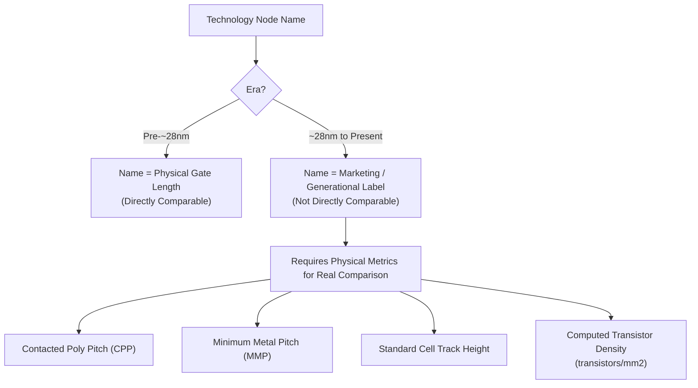

## Technology Node Naming Conventions

### Overview

Technology node names — "180nm," "28nm," "7nm," "3nm," and so on — are among the most widely quoted but most widely misunderstood figures in the semiconductor industry. Historically, a node name corresponded directly to a specific, physically measurable transistor dimension. Since roughly the 2000s, and increasingly aggressively from the ~28nm/22nm generation onward, node names have progressively decoupled from any single literal physical dimension and function primarily as **marketing and generational labels**, chosen by each foundry largely independently, making cross-foundry node-name comparison technically unreliable without examining underlying physical metrics directly.

Understanding this history and the metrics that have replaced simple node-name comparison is essential for any technology roadmap planning, foundry selection, or cross-vendor process comparison.

---

### The Historical Era: Node Name as Physical Gate Length

**Key Points**

- In early CMOS scaling generations (roughly 1970s through the early 2000s), the node name directly and consistently referred to the **minimum printable feature size**, most commonly the transistor's physical (drawn) gate length
- Under this convention, successive nodes followed an approximately $0.7\times$ linear scaling factor per generation (chosen because $(0.7)^2 \approx 0.5$, so area — and thus roughly transistor count per unit area — approximately doubled each generation), producing the classic sequence: 500nm → 350nm → 250nm → 180nm → 130nm → 90nm → 65nm → 45nm
- During this era, node names from different foundries at the same nominal value were reasonably comparable, since all were measuring approximately the same physical quantity (drawn gate length) using broadly similar definitions

---

### The Decoupling: Why Node Names Stopped Tracking Gate Length

**Key Points**

- Beginning around the 32nm/28nm generation, and accelerating sharply from 22nm/20nm onward, actual physical gate length scaling slowed dramatically relative to the historical $0.7\times$-per-generation trend, even as node *names* continued to decrease at the traditional pace
- This divergence occurred because continued gate-length shrinking alone no longer delivered the primary benefits (density, performance, power) that node names were originally meant to signal — architecture innovations (FinFET, then GAA) delivered performance and density gains through means *other* than further literal gate-length reduction, yet the industry retained the convention of decreasing node numbers to signal "generational improvement" to the market
- As a result, from roughly the 22nm/16nm-class generation onward, physical gate length in many leading-edge processes has remained comparatively stable across several node-name generations, while the *node name itself* continued its historical downward numerical progression — meaning the numeric label increasingly reflects marketing positioning and relative generational sequencing rather than a specific measured dimension
- Foundries have also historically used different naming conventions for functionally comparable technology: for example, one foundry's "10nm" node has in some historical comparisons corresponded to transistor density and characteristics roughly comparable to a competing foundry's "7nm" node, illustrating that node names are not directly comparable across foundries even at nominally identical numeric values [Inference — specific historical density/performance comparisons between named nodes at different foundries are foundry-specific, change over time, and should be verified against current, foundry-published density metrics rather than node name alone]

---

### What Node Names Actually Signal Today

**Key Points**

- A modern node name (e.g., "5nm," "3nm," "2nm") functions primarily as:
  1. A **generational/marketing identifier** distinguishing a foundry's successive process offerings from one another
  2. A rough **relative** indicator of transistor density and performance improvement *within a single foundry's own node sequence* (i.e., a given foundry's "3nm" node is expected to offer meaningful density/performance/power improvement over that same foundry's "5nm" node)
  3. **Not** a reliable indicator of any specific physical transistor dimension, and **not** directly comparable across different foundries at face value

---

### Standardized Metrics That Have Replaced Node-Name Comparison

Because node names alone are unreliable for technical comparison, the industry has increasingly adopted more precise, directly measurable metrics for genuine cross-node and cross-foundry comparison:

**1. Contacted Poly Pitch (CPP)**

The minimum center-to-center distance between adjacent transistor gates (polysilicon or metal gate lines), including the space needed for the source/drain contact between them. CPP is a strong driver of transistor density along one dimension and is directly measurable via cross-sectional imaging, making it a more objective comparison metric than the node name alone.

**2. Metal Pitch (Minimum Metal Pitch, MMP)**

The minimum center-to-center spacing of the finest interconnect metal layer (typically metal-1 or metal-2). Metal pitch is often the actual limiting factor for achievable transistor and standard-cell density in modern processes, sometimes more so than CPP itself, since interconnect routing density constrains how tightly transistors can practically be wired together.

**3. Standard Cell Height / Track Height**

Measured in the number of horizontal interconnect "tracks" (e.g., a "6-track" or "5-track" standard cell library), this metric directly reflects achievable logic density, since cell height (combined with metal pitch) determines how many standard cells can be packed into a given silicon area.

**4. Transistor Density (Transistors per mm²)**

A composite metric — often estimated using a standardized formula combining CPP, metal pitch, and a weighted mix of typical logic cell types (e.g., the widely referenced formula popularized by industry analysts, combining NAND2 and scan flip-flop cell densities in a fixed ratio) — providing a single figure intended for more meaningful cross-foundry and cross-node comparison than node name alone

**Approximate Density Formula (Industry-Standard Composite Metric)**

$$\text{Density} \approx \frac{1}{\text{CPP} \times \text{MMP}} \times \left(0.6 \times N_{d,\text{NAND2}} + 0.4 \times N_{d,\text{FF}}\right)$$

where $N_{d,\text{NAND2}}$ and $N_{d,\text{FF}}$ represent the transistor counts of standard 2-input NAND and scan flip-flop cells respectively, weighted according to a commonly used industry approximation of typical logic mix. [Note: exact weighting coefficients and reference cell definitions vary somewhat between published industry analyses; this formula should be treated as a representative approximation of the type of composite metric used, not a universally standardized exact formula.]

---

### Comparative Summary: Node Name Era Timeline

| Approximate Era | Node Naming Basis | Cross-Foundry Comparability |
| --- | --- | --- |
| 1970s–early 2000s (≥90nm) | Direct physical gate length | High — names tracked a consistent measured quantity |
| ~2000s–2010s (65nm–22nm) | Gate length, with increasing marketing influence | Moderate — some divergence begins to appear |
| ~2010s–present (16nm and below) | Primarily marketing/generational label | Low — requires CPP, metal pitch, or density metrics for real comparison |

---

### Why This Matters for Roadmap and Sourcing Decisions

**Key Points**

- Comparing two candidate foundry processes by node name alone (e.g., assuming a "5nm" process from one foundry is equivalent to a "5nm" process from another) can lead to materially incorrect assumptions about achievable density, performance, or cost — actual comparison requires examining foundry-published CPP, metal pitch, and transistor density figures directly
- Node name remains a reasonably reliable indicator of *relative generational progression within a single foundry's own roadmap*, and is therefore still useful for internal single-foundry technology planning, even where it is unreliable for cross-foundry comparison
- Industry roadmap bodies (the IRDS, successor to the ITRS) and independent semiconductor analysis organizations increasingly report and track CPP, metal pitch, and computed density metrics explicitly alongside (or instead of) node names, reflecting the broader industry's recognition of the node-name/physical-dimension decoupling described above [Inference — the specific metrics emphasized in current IRDS publications should be checked against the current roadmap document, as reporting conventions continue to evolve]

---

### Mermaid Diagram — Node Name Evolution and Comparison Metrics

---

### SVG Diagram — Node Name vs. Physical Gate Length Divergence (svg_diagram)

<svg xmlns="http://www.w3.org/2000/svg" viewBox="0 0 640 340" font-family="sans-serif">
<text x="320" y="20" text-anchor="middle" font-size="14" font-weight="bold">Node Name vs. Actual Gate Length Trend (svg_diagram)</text>
<line x1="70" y1="290" x2="580" y2="290" stroke="black" stroke-width="1.5" />
<line x1="70" y1="290" x2="70" y2="50" stroke="black" stroke-width="1.5" />
<text x="325" y="320" text-anchor="middle" font-size="12">Generation (time) →</text>
<text x="30" y="170" text-anchor="middle" font-size="12" transform="rotate(-90 30 170)">Value (log scale)</text>
<path d="M 100 80 L 250 140 L 350 190 L 450 220 L 560 245" stroke="#c0392b" stroke-width="2.5" fill="none" />
<text x="500" y="230" font-size="10" fill="#c0392b">Marketed "node name"</text>
<path d="M 100 90 L 250 155 L 350 235 L 450 255 L 560 260" stroke="#2980b9" stroke-width="2.5" stroke-dasharray="5,3" fill="none" />
<text x="480" y="270" font-size="10" fill="#2980b9">Actual physical gate length</text>
<line x1="350" y1="290" x2="350" y2="50" stroke="#7f8c8d" stroke-width="1" stroke-dasharray="3,3" />
<text x="350" y="305" text-anchor="middle" font-size="9" fill="#7f8c8d">Decoupling begins (~28nm era)</text>
</svg>

---

### Practical Design Implications

- Never assume equivalent performance, density, or cost between processes at nominally the same node name from different foundries — always request or derive CPP, metal pitch, and density figures for genuine comparison
- Use node name primarily for tracking a single foundry's own generational roadmap progression, and treat it as a rough label rather than a specification when doing cross-foundry technology selection
- When evaluating a new process node for a design, request the foundry's PDK documentation for actual measured/targeted gate length, CPP, and metal pitch rather than relying on the marketed node name for any quantitative sizing or performance estimation work
- Track industry-independent density metrics (e.g., those published by semiconductor analysis firms) alongside foundry marketing material when making multi-generation technology roadmap decisions

**Related Topics**

- Historical Moore's Law scaling trends and Dennard scaling
- FinFET and Gate-All-Around (GAA) transistor architecture evolution
- EUV lithography and its role in advanced-node feature printing
- Standard cell library design and track-height scaling
- International Roadmap for Devices and Systems (IRDS) metrics and projections
- Foundry PDK (Process Design Kit) structure and design rule interpretation