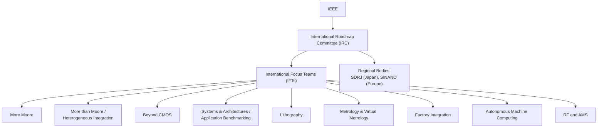

## International Roadmap for Devices and Systems

### Overview

The **International Roadmap for Devices and Systems (IRDS)** is the industry's primary coordinated technology forecasting document for semiconductor devices, systems, and related manufacturing technologies, projecting likely developments over a rolling **15-year horizon**. The IRDS was established in 2016 as the successor to the International Technology Roadmap for Semiconductors (ITRS), reflecting a deliberate broadening of scope from a pure semiconductor-process roadmap to one explicitly encompassing systems, architectures, and applications alongside devices. [Wikipedia](https://en.wikipedia.org/wiki/International_Roadmap_for_Devices_and_Systems)

The IRDS is sponsored and organized under the **IEEE**, coordinated through International Focus Teams (IFTs) working under an International Roadmap Committee (IRC), with contributions from regional roadmap bodies and industry/academic stakeholders worldwide.

---

### Purpose and Governance

The IEEE specifies the goals of the roadmap as identifying key trends related to devices, systems, and all related technologies via a 15-year-horizon roadmap, and determining generic device and system needs, challenges, potential solutions, and opportunities for innovation. A third stated goal is to encourage related collaborative activity worldwide, such as IEEE conferences and roadmap workshops built around the roadmap's findings. [Wikipedia](https://en.wikipedia.org/wiki/International_Roadmap_for_Devices_and_Systems)

**Key Points — Governance Structure**

- The roadmap executive committee is composed of leaders from five world regions: Europe, Korea, Japan, Taiwan, and the U.S.A. [kurzweilai](https://www.kurzweilai.net/international-roadmap-for-devices-and-systems-irds)
- Work is carried out through International Focus Teams (IFTs) under the International Roadmap Committee (IRC), which engages with other IEEE bodies such as the Rebooting Computing Initiative (RCI), Electron Devices Society (EDS), Computer Society (CS), and Communications Society (ComSoc), as well as allied regional bodies such as Japan's System and Device Roadmap Committee (SDRJ) and Europe's SINANO Institute (ESI). [ieee](https://irds.ieee.org/editions/irds2024/)
- One of the IRDS's founding co-chairs, IEEE Fellow Thomas Conte, has framed the roadmap's expanded scope as a response to the industry moving toward greater diversity and change, remarking that the shift is driven less by an "ending of Moore's Law" than by an evolving relationship with conventional CMOS itself. [gazettabyte](https://gazettabyte.com/?p=142892)

---

### Evolution from ITRS to IRDS: Expanded Scope

**Key Points**

- The transition from the ITRS to the IRDS reflects an expanded focus on systems, with emphasis placed on architectures and applications that deviate from the traditional device→circuit→logic gate→functional block→system paradigm. [ieee](https://irds.ieee.org/)
- This scope expansion directly reflects the "More than Moore" trend discussed elsewhere in this chapter: as monolithic transistor scaling alone became less sufficient to describe or predict system-level industry progress, the roadmap itself had to widen from a semiconductor-process-centric document into one explicitly covering packaging, heterogeneous integration, and system architecture as co-equal roadmap tracks

---

### IRDS Focus Areas / International Focus Teams (IFTs)

The IRDS roadmap IFTs historically span: Application Benchmarking, System and Architecture, More Moore, Beyond CMOS, Heterogeneous Integration (including Systems, Devices, and Packaging), Outside System Connectivity, Factory Integration, Lithography, Metrology, Emerging Research Materials, Environment/Health/Safety, Yield, Test and Test Equipment, and RF and Analog/Mixed-Signal (RF and AMS). [kurzweilai](https://www.kurzweilai.net/international-roadmap-for-devices-and-systems-irds)

Current published topic tracks (with their active date ranges) include Autonomous Machine Computing (2022–current), Outside System Connectivity (2016–current), Yield Enhancement (2016–current), More Moore (2020–current), More Than Moore (2020–current), Metrology & Virtual Metrology (2016–current), Beyond CMOS (2016–current), and Systems & Architectures (2016–current). [ieee](https://irds.ieee.org/editions/)

**Key Points on Selected Focus Areas**

| Focus Area | Scope |
| --- | --- |
| More Moore | Continued transistor/density/performance scaling (see the dedicated topic in this chapter) |
| More than Moore | Heterogeneous integration, packaging, functional diversification (see the dedicated topic in this chapter) |
| Beyond CMOS | Emerging device concepts intended to extend or succeed conventional CMOS transistor technology |
| Heterogeneous Integration | Systems, devices, and packaging technologies for combining diverse dies/technologies into a single system |
| Autonomous Machine Computing | A more recently added focus area addressing computing architecture needs specific to autonomous/AI-driven systems |
| Lithography | Patterning technology roadmap, including EUV and successor lithography techniques |
| Metrology & Virtual Metrology | Measurement techniques required to characterize and control advanced manufacturing processes |
| Factory Integration | Manufacturing/fab-level process integration and automation trends |
| Emerging Research Materials | New materials under research consideration for future device generations |
| RF and AMS | RF and analog/mixed-signal device and circuit roadmap needs |

---

### Publication Cadence and Recent Editions

**Key Points**

- Published editions/updates include the 2016 Edition (white papers), 2017 Edition, 2018 Edition, 2020 Edition, 2021 Update, 2022 Edition, 2023 Update, and the 2024 Edition. [ieee](https://irds.ieee.org/editions/)
- The roadmap alternates between full "Edition" years (comprehensive revisions across most chapters) and "Update" years (more limited revisions); the 2023 Update revised most chapters of the 2022 full edition, while 2024 was designated a full edition year. [ieee](https://irds.ieee.org/)
- The 2024 edition introduced a new white paper titled "Applications, Systems and Architectures," combining what were previously separate Application Benchmarking and Systems & Architectures work products into a single document describing the functional relationships between applications, systems, and architectures. [ieee](https://irds.ieee.org/)
- The 2024 IRDS edition also includes a multi-part "Executive Packaging Tutorial," addressing the adoption, evolution, and transformation of multi-chip modules (MCMs) in the context of high-performance computing (HPC) and artificial intelligence (AI) applications. This reflects the increasing roadmap emphasis on advanced packaging as a primary driver of continued system performance improvement (see the "More than Moore" discussion elsewhere in this chapter). [ieee](https://irds.ieee.org/editions/irds2024/)

---

### Relationship to Industry Practice

**Key Points**

- The IRDS is a **coordination and forecasting** document, not a binding standard — individual companies and foundries make independent roadmap and investment decisions, but widely reference IRDS projections as a common technical baseline for cross-industry planning (e.g., in academic research proposals, equipment supplier roadmaps, and materials research prioritization)
- IRDS publications are freely accessible and shareable with proper attribution to IEEE and the IRDS, reflecting the roadmap's intent to support broad, coordinated industry and research planning rather than serve as proprietary competitive intelligence. [nist](https://www.nist.gov/node/1886371)
- Because the roadmap explicitly separates "More Moore" and "More than Moore" as parallel, co-equal tracks (rather than treating heterogeneous integration as a secondary or fallback strategy), it provides a useful organizing framework for technology and product roadmap planning that spans both transistor-level scaling and system/packaging-level integration decisions, as discussed in the dedicated "More Moore versus More than Moore" topic in this chapter

---

### Mermaid Diagram — IRDS Organizational and Focus-Area Structure

---

### SVG Diagram — IRDS 15-Year Rolling Roadmap Horizon (svg_diagram)

<svg xmlns="http://www.w3.org/2000/svg" viewBox="0 0 640 300" font-family="sans-serif">
<text x="320" y="20" text-anchor="middle" font-size="14" font-weight="bold">IRDS 15-Year Rolling Roadmap Concept (svg_diagram)</text>
<line x1="60" y1="200" x2="580" y2="200" stroke="black" stroke-width="1.5" />
<text x="320" y="225" text-anchor="middle" font-size="11">Time →</text>
<circle cx="150" cy="200" r="6" fill="#2980b9" />
<text x="150" y="185" text-anchor="middle" font-size="10">Current Edition Year</text>
<rect x="150" y="150" width="400" height="30" fill="#3498db" opacity="0.3" />
<text x="350" y="145" text-anchor="middle" font-size="11" fill="#2980b9">15-Year Forecast Horizon</text>
<circle cx="230" cy="200" r="4" fill="#7f8c8d" />
<text x="230" y="245" text-anchor="middle" font-size="9">Update Year</text>
<circle cx="320" cy="200" r="6" fill="#c0392b" />
<text x="320" y="245" text-anchor="middle" font-size="9" fill="#c0392b">Full Edition</text>
<circle cx="410" cy="200" r="4" fill="#7f8c8d" />
<text x="410" y="245" text-anchor="middle" font-size="9">Update Year</text>
<circle cx="500" cy="200" r="6" fill="#27ae60" />
<text x="500" y="245" text-anchor="middle" font-size="9" fill="#27ae60">Next Full Edition</text>
</svg>

---

### Practical Design Implications

- Use IRDS focus-area documents (particularly More Moore, More than Moore, and Beyond CMOS) as a shared technical reference point when framing internal multi-year technology roadmap discussions, since they represent broad cross-industry consensus rather than any single company's proprietary projection
- Consult the Lithography and Metrology focus areas specifically when planning process-node transition timing, since these tracks directly inform realistic manufacturing-readiness timelines that pure device-scaling projections alone do not capture
- Reference the Executive Packaging Tutorial and Heterogeneous Integration focus area when evaluating chiplet, 2.5D, or 3D integration strategy, given the roadmap's explicit recent emphasis on packaging as a primary performance driver for HPC/AI applications
- Recognize that IRDS projections are forecasts and industry-coordination tools, not guarantees — actual foundry and company roadmaps may diverge from IRDS projections, and current, specific technical claims should always be verified against the latest published edition directly

**Related Topics**

- Historical Moore's Law scaling trends and Dennard scaling
- More Moore versus More than Moore paradigms
- Technology node naming conventions and density metrics (CPP, metal pitch)
- Beyond-CMOS emerging device research (e.g., 2D materials, spintronics)
- Advanced packaging and heterogeneous integration (2.5D/3D, chiplets)
- EUV lithography roadmap and successor patterning technologies