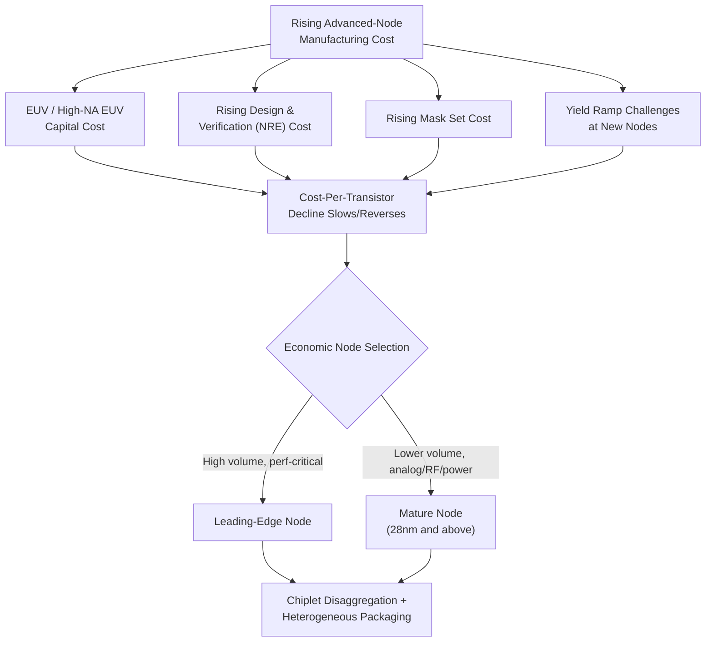

## Economic Limits of Transistor Scaling

### Overview

While much discussion of semiconductor scaling limits focuses on physical constraints (quantum tunneling, atomistic variability, electrostatic control), Moore's Law has historically been, at its core, an **economic** observation: the viability of each successive scaling generation depends on the industry's ability to manufacture smaller transistors at equal or lower cost per transistor while maintaining acceptable yield. Beginning around the 28nm–20nm node generation, this economic dimension has become an increasingly binding constraint in its own right — in several respects a more immediate limiter of continued scaling than any single physical effect — driven by escalating capital equipment costs, design/verification costs, and diminishing per-generation cost-per-transistor improvement.

---

### Cost-Per-Transistor: The Foundational Economic Metric

**Key Points**

- The historical engine of Moore's Law's economic sustainability was a consistent generation-over-generation **decline in cost per transistor**, even as absolute wafer processing cost increased, because transistor density improvements outpaced the growth in per-wafer manufacturing cost
- Beginning around the 28nm–20nm node transition, and continuing at subsequent advanced nodes, industry analysts and semiconductor economists have observed a slowing — and at some node transitions, an outright reversal — of this historical cost-per-transistor decline [Inference — the precise magnitude, timing, and node-by-node detail of this trend vary across published industry analyses, foundry-specific cost structures, and design/product mix assumptions; directional trends are broadly agreed upon, but specific quantitative figures should be sourced from current, primary industry-economics publications rather than treated as fixed values]
- This shift means that migrating a design to a smaller node no longer automatically guarantees a lower manufacturing cost per function — a fundamental change from the assumption that underpinned decades of prior semiconductor product planning

---

### Drivers of Rising Advanced-Node Cost

**1. Lithography Capital Cost**

**Key Points**

- **Extreme ultraviolet (EUV) lithography** tooling represents an order-of-magnitude increase in capital cost per lithography tool compared to prior-generation deep ultraviolet (DUV) immersion lithography systems, driven by the technical complexity of generating, collecting, and delivering usable EUV light (13.5nm wavelength) at production-viable throughput
- **High-NA EUV** (higher numerical aperture next-generation EUV tooling), required for continued resolution scaling at the most advanced nodes, represents a further substantial capital cost increase over standard-NA EUV systems
- Multi-patterning techniques (using multiple exposure/etch cycles with conventional DUV lithography to achieve finer effective pitch than a single exposure allows) — used both as an alternative to EUV at some layers and in combination with EUV at the most advanced layers — add process complexity, cycle time, and defect-accumulation risk, each contributing additional cost per wafer even without new capital tooling

**2. Design and Verification Cost**

**Key Points**

- Non-recurring engineering (NRE) cost for a leading-edge advanced-node chip design — encompassing design tools/EDA licensing, verification, physical design closure, and mask set cost — has grown substantially across successive node generations, driven by increasing design rule complexity, more extensive verification requirements (timing, power, signal integrity, reliability), and the sheer scale of modern SoC designs
- Rising NRE cost creates a strong economic pressure toward higher production volumes to amortize design cost — a dynamic that favors large-volume consumer products (smartphone application processors, high-volume GPUs) at leading-edge nodes, while pushing lower-volume or cost-sensitive designs toward mature, fully-amortized older nodes where NRE cost is dramatically lower relative to unit volume

**3. Yield and Defect Density Challenges**

**Key Points**

- As process complexity increases (more lithography/etch steps, tighter dimensional tolerances, higher aspect-ratio structures), achieving and maintaining acceptable yield becomes progressively more difficult, and yield learning curves for new advanced nodes tend to require longer ramp periods before reaching mature-yield economics
- Larger die sizes compound this challenge, since yield scales unfavorably with die area for a given defect density — a key economic argument (alongside the "More than Moore" functional-diversification motivations discussed elsewhere in this chapter) behind the industry's growing adoption of **chiplet-based disaggregation**, where a large monolithic SoC is split into multiple smaller dies to improve overall system yield even though it introduces additional packaging/assembly cost

**4. Mask Set and Reticle Cost**

**Key Points**

- Photomask set cost for a leading-edge process node has grown substantially across generations, driven both by an increasing number of mask layers and by the higher per-layer cost of masks compatible with EUV and advanced multi-patterning processes
- High mask-set cost further reinforces the volume-amortization dynamic described above, and is a significant contributor to the total NRE cost facing any new advanced-node design

---

### The Resulting Economic Bifurcation: Leading-Edge vs. Mature-Node Strategy

**Key Points**

- The combination of rising leading-edge NRE, mask, and per-wafer cost has produced an increasingly pronounced **bifurcation** in industry sourcing strategy: high-volume, performance-critical digital logic (CPUs, GPUs, mobile application processors) continues migrating to the most advanced available node, while a large and economically significant share of semiconductor demand — analog, RF, power management, sensor interface, and many lower-volume or cost-sensitive digital designs — increasingly targets **mature, fully-amortized nodes** (often 28nm and above) where NRE and mask costs are dramatically lower and process maturity yields excellent, well-characterized yield
- This bifurcation is a direct economic manifestation of the "More Moore" versus "More than Moore" distinction discussed elsewhere in this chapter: rather than every function migrating to the leading edge, functions are increasingly matched to the node that is economically optimal for their specific volume, performance, and cost requirements, with heterogeneous packaging used to combine components from different nodes into a single system where needed
- This dynamic has also driven substantial recent investment in expanding mature-node manufacturing capacity globally, reflecting sustained (and in some analyses, growing) demand for mature-node capacity even as leading-edge capacity continues to expand in parallel [Inference — specific capacity investment figures and geographic distribution change frequently and should be checked against current industry capacity-tracking sources for up-to-date figures]

---

### Comparative Summary: Cost Drivers by Node Generation Era

| Cost Driver | Mature Nodes (≥28nm) | Leading-Edge Nodes (≤7nm-class) |
| --- | --- | --- |
| Lithography capital cost | Low (DUV, largely single-patterning) | Very high (EUV, High-NA EUV, multi-patterning) |
| Design/verification (NRE) cost | Low–moderate | Very high |
| Mask set cost | Low–moderate | Very high |
| Yield maturity | High (long-established, well-characterized) | Lower initially, improves over ramp period |
| Economic sweet spot | Analog, RF, power, sensor interface, lower-volume digital | High-volume performance-critical digital logic |

---

### Economic Implications for System-Level Design Strategy

**Key Points**

- The rising cost of leading-edge NRE and mask sets strengthens the economic case for **chiplet-based system architectures**, since disaggregating a design allows each functional block to be fabricated on its economically optimal node — leading-edge for compute-critical logic, mature nodes for I/O, analog, and power management — while sharing amortized packaging/interconnect infrastructure across a family of products
- Rising design cost also increases the relative economic value of **IP reuse, design-for-manufacturability (DFM) methodology, and design automation improvements**, since these directly offset a growing share of total product cost that is no longer being reduced automatically by node migration alone
- For system architects and product planners, node selection is increasingly a multi-variable economic optimization (balancing NRE amortization against target volume, performance requirement, and packaging strategy) rather than a default assumption that "newer/smaller is always better," a shift with direct implications for technology roadmap and sourcing strategy across the industry

---

### Mermaid Diagram — Economic Drivers of Advanced-Node Cost

---

### SVG Diagram — Cost-Per-Transistor Trend Across Node Generations (svg_diagram)

<svg xmlns="http://www.w3.org/2000/svg" viewBox="0 0 640 320" font-family="sans-serif">
<text x="320" y="20" text-anchor="middle" font-size="14" font-weight="bold">Cost-Per-Transistor Trend (Illustrative) (svg_diagram)</text>
<line x1="70" y1="270" x2="580" y2="270" stroke="black" stroke-width="1.5" />
<line x1="70" y1="270" x2="70" y2="50" stroke="black" stroke-width="1.5" />
<text x="325" y="300" text-anchor="middle" font-size="12">Node Generation (decreasing size) →</text>
<text x="30" y="160" text-anchor="middle" font-size="12" transform="rotate(-90 30 160)">Cost per Transistor</text>
<path d="M 100 240 Q 200 220 300 190 T 420 175" stroke="#27ae60" stroke-width="2.5" fill="none" />
<text x="250" y="205" font-size="10" fill="#27ae60">Historical decline (older nodes)</text>
<path d="M 420 175 Q 480 172 540 180" stroke="#c0392b" stroke-width="2.5" stroke-dasharray="5,3" fill="none" />
<text x="470" y="200" font-size="10" fill="#c0392b">Slowing / flattening (advanced nodes)</text>
<line x1="420" y1="270" x2="420" y2="50" stroke="#7f8c8d" stroke-width="1" stroke-dasharray="3,3" />
<text x="420" y="290" text-anchor="middle" font-size="9" fill="#7f8c8d">~28nm-20nm era</text>
</svg>

---

### Practical Design Implications

- Evaluate node selection for any new design as an explicit economic trade-off between NRE/mask amortization, target production volume, and per-unit manufacturing cost — do not assume the newest available node is automatically the most cost-effective choice
- For analog, RF, power management, and lower-volume digital functions, default to evaluating mature, fully-amortized nodes before considering leading-edge alternatives, reserving leading-edge nodes for functions that specifically require their density/performance benefit at sufficient volume to justify NRE cost
- Factor rising mask-set and verification cost explicitly into any make/reuse decision for design IP, since IP reuse increasingly offers a larger relative economic benefit at advanced nodes than it did historically
- Consider chiplet-based disaggregation not only for yield and performance reasons but as a direct economic strategy for matching each functional block to its most cost-effective process node
- Track industry cost-per-transistor and NRE trend data from current primary sources when making multi-year technology roadmap decisions, since specific quantitative figures evolve and should not be assumed static

**Related Topics**

- Historical Moore's Law scaling trends and Dennard scaling
- More Moore versus More than Moore paradigms
- Technology node naming conventions and density metrics
- Chiplet architectures and heterogeneous packaging economics
- EUV and High-NA EUV lithography roadmap
- International Roadmap for Devices and Systems (IRDS) cost/manufacturing projections