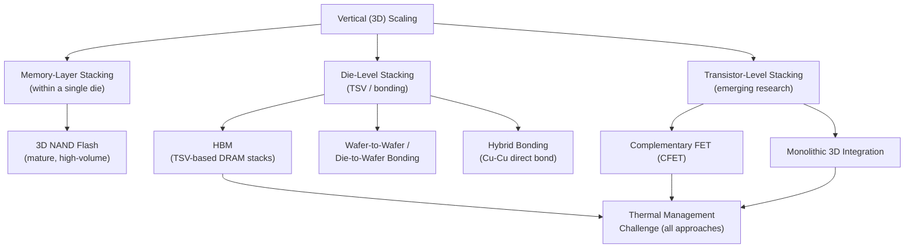

## Vertical Scaling Through 3D Stacking

### Overview

As two-dimensional lateral transistor scaling has become increasingly costly and technically constrained (as discussed in the economic and node-naming topics elsewhere in this chapter), the semiconductor industry has increasingly turned to the **vertical (Z-axis) dimension** as an additional scaling degree of freedom. Vertical or "3D" scaling encompasses a spectrum of techniques — from stacking transistor devices within a single die, to stacking multiple memory layers, to stacking entirely separate dies via through-silicon vias (TSVs) or direct wafer bonding — that increase functional density, bandwidth, and integration without requiring further lateral (X-Y) feature-size reduction. This represents one of the primary practical implementations of the "More than Moore" paradigm discussed elsewhere in this chapter, alongside emerging "More Moore" transistor-level 3D concepts.

---

### Motivation: Why Vertical Scaling

**Key Points**

- Lateral scaling faces compounding economic and physical constraints: escalating lithography cost (EUV, High-NA EUV), atomic-scale physical limits, and diminishing cost-per-transistor benefit at each new node generation (see the "Economic Limits of Transistor Scaling" topic in this chapter)
- Vertical integration offers a largely independent scaling axis: stacking additional device or memory layers increases density and bandwidth per unit **footprint area** without requiring the underlying lateral feature size to shrink further, sidestepping many of the lithography-driven cost pressures of continued 2D scaling
- Vertical integration also dramatically shortens interconnect length between stacked layers compared to any lateral (on-package or on-board) alternative, directly benefiting bandwidth, latency, and interconnect energy efficiency — a critical consideration as data movement, rather than raw compute, has become an increasingly dominant contributor to overall system power in modern high-performance and AI workloads

---

### 3D NAND Flash: The Established Vertical Scaling Success Story

**Key Points**

- **3D NAND flash memory** represents the most mature, highest-volume example of vertical scaling in production today, achieved by stacking dozens to well over a hundred memory cell layers vertically within a single die, using a charge-trap memory cell structure built around vertically etched channel holes through the stacked layers
- This approach directly replaced the industry's prior strategy of continuing to shrink individual planar NAND cell dimensions, which had encountered severe reliability and scaling-limit challenges (charge leakage between increasingly close-packed floating-gate cells) as planar cell dimensions approached their practical minimum
- 3D NAND continues to scale primarily by increasing the **number of stacked layers** (rather than further shrinking lateral cell dimensions), illustrating a direct, high-volume, commercially mature precedent for the general principle that vertical layer-count scaling can substitute for lateral dimensional scaling once the latter becomes economically or physically unfavorable

---

### 3D-Stacked DRAM and High-Bandwidth Memory (HBM)

**Key Points**

- **High-Bandwidth Memory (HBM)** stacks multiple DRAM dies vertically, connected through **through-silicon vias (TSVs)** that pass electrical signals directly through each die in the stack, and mounts the resulting stack on a silicon interposer immediately adjacent to a compute die (GPU, AI accelerator, or CPU)
- This architecture provides dramatically higher memory bandwidth and lower per-bit energy than equivalent-bandwidth conventional planar DRAM connected via traditional package-level interconnect, because the TSV-based vertical interconnect is far shorter and denser than any achievable lateral (PCB-trace or wire-bond) alternative
- HBM is a direct, high-volume commercial example of the "More than Moore" paradigm applied specifically through vertical stacking, and its adoption has become essential infrastructure for modern high-performance computing and AI accelerator systems, where memory bandwidth (rather than compute throughput alone) is frequently the dominant system-level performance bottleneck

---

### Through-Silicon Via (TSV) Technology

**Physical Structure**

A TSV is a vertical electrical connection passing completely through a silicon die (or wafer), typically fabricated by etching a deep, high-aspect-ratio hole (often via DRIE, as discussed in the bulk micromachining topic in the MEMS chapter), lining it with an insulating dielectric, and filling it with a conductive material (commonly copper, or tungsten for smaller-diameter vias).

**Key Points**

- TSVs enable direct vertical electrical connection between stacked dies without requiring wire bonding or lateral redistribution, providing much higher interconnect density and much shorter electrical path length than any wire-bond-based alternative
- **Via-first, via-middle, and via-last** process integration schemes describe different points in the overall fabrication flow at which TSV formation occurs relative to front-end (transistor) and back-end (interconnect) processing, each offering different trade-offs in thermal budget compatibility, achievable via aspect ratio, and process integration complexity [Inference — the specific trade-offs and preferred integration scheme vary by application and foundry, and should be confirmed against current process documentation for a specific design]
- Achieving high TSV aspect ratio (depth-to-diameter ratio) while maintaining reliable, void-free conductive fill is a persistent process engineering challenge, directly analogous to (and sharing underlying etch/fill process lineage with) deep trench capacitor and DRIE-based MEMS structure fabrication discussed elsewhere in this course

---

### Wafer-to-Wafer and Die-to-Wafer Bonding

**Key Points**

- **Wafer-to-wafer (W2W) bonding** aligns and bonds two complete wafers together before dicing, offering high throughput (all dies on both wafers are bonded simultaneously) but requiring that both wafers have compatible die sizes and, ideally, comparable yield (since a single low-yield wafer degrades the yield of the entire bonded stack)
- **Die-to-wafer (D2W) bonding** individually places and bonds known-good dies onto a base wafer, allowing pre-bond yield screening (avoiding the yield-multiplication penalty of blindly bonding two full wafers) at the cost of lower throughput than wafer-to-wafer bonding
- **Hybrid bonding** (direct copper-to-copper and dielectric-to-dielectric bonding without an intervening solder or adhesive layer) achieves substantially finer interconnect pitch than conventional micro-bump-based bonding, and has become the leading-edge technique for the highest-density 3D die-stacking applications, including advanced HBM generations and logic-on-logic 3D stacking [Inference — hybrid bonding process specifics and achievable pitch continue to advance rapidly; current figures should be verified against recent primary industry sources]

---

### Emerging Transistor-Level 3D Concepts

Beyond die- and memory-layer stacking, research and early industrial efforts are extending 3D integration down to the transistor level itself:

**Key Points**

- **Complementary FET (CFET)**: A proposed transistor architecture that vertically stacks an n-type and a p-type transistor directly on top of one another within the same footprint, rather than placing them side-by-side as in conventional CMOS layout — if successfully industrialized, this would allow continued effective logic density scaling within the same lateral footprint by adding a vertical dimension directly at the transistor level, representing a potential successor architecture beyond gate-all-around (GAA) nanosheet transistors [Inference — CFET remains at the research/early-development stage as of the current roadmap horizon and specific industrialization timelines should be treated as roadmap projections rather than confirmed near-term production plans]
- **Monolithic 3D integration**: Building multiple active transistor layers sequentially on the same substrate (rather than fabricating separate dies and bonding them afterward) offers, in principle, the finest possible vertical interconnect pitch, but faces substantial thermal-budget challenges, since forming a second transistor layer on top of a completed first layer risks damaging the already-formed lower-layer transistors and interconnect — directly analogous to the thermal-budget constraint discussed in the CMOS-MEMS post-CMOS integration topic, though at even more stringent tolerance given the sensitivity of transistor formation itself

---

### Comparative Summary: 3D Stacking Approaches

| Approach | Stacking Granularity | Interconnect | Maturity | Primary Application |
| --- | --- | --- | --- | --- |
| 3D NAND | Memory cell layers (single die) | Vertical channel holes | Mature, high-volume | NAND flash storage |
| HBM (TSV-based die stacking) | Full DRAM dies | Through-silicon vias | Mature, high-volume | HPC/AI accelerator memory |
| Hybrid bonding (die/wafer) | Full dies or wafers | Direct Cu-Cu bonding | Emerging to mature | Advanced HBM, logic-on-logic stacking |
| CFET (transistor-level) | Individual transistors (n/p stacked) | N/A (monolithic) | Research/early development | Future logic density scaling |
| Monolithic 3D | Sequential transistor layers | Fine-pitch vertical vias | Research | Future ultra-dense logic |

---

### Thermal Management: The Central Engineering Challenge

**Key Points**

- Stacking active, heat-generating dies vertically concentrates power dissipation into a smaller footprint and creates a fundamental thermal challenge: heat generated in a lower die within the stack must conduct through the overlying die(s) to reach a heat sink, since the natural heat-removal path (typically through the top of the package) is progressively obstructed by additional intervening layers
- This thermal constraint is frequently the dominant practical limiter on how many active (power-dissipating) layers can be practically stacked in a given application, distinct from any purely electrical or interconnect-density limitation — a direct parallel to the thermal challenge noted for 3D MEMS/CMOS integration and multi-die packaging elsewhere in this course
- Mitigation approaches include embedded microfluidic cooling channels within the die stack, careful thermal-aware floorplanning (placing the highest-power logic layers closest to the primary heat-removal path), and thermal-interface-material (TIM) optimization at each bonded interface [Inference — the relative maturity and adoption of these specific mitigation techniques vary by application and continue to evolve]

---

### Mermaid Diagram — 3D Stacking Technology Spectrum

---

### SVG Diagram — TSV-Based Die Stack Cross-Section (svg_diagram)

<svg xmlns="http://www.w3.org/2000/svg" viewBox="0 0 640 340" font-family="sans-serif">
<text x="320" y="20" text-anchor="middle" font-size="14" font-weight="bold">TSV-Based 3D Die Stack (svg_diagram)</text>
<rect x="200" y="280" width="240" height="30" fill="#95a5a6" />
<text x="320" y="300" text-anchor="middle" font-size="10">Package Substrate</text>
<rect x="220" y="230" width="200" height="45" fill="#3498db" />
<text x="320" y="256" text-anchor="middle" font-size="9" fill="white">Base Logic / Compute Die</text>
<rect x="240" y="190" width="160" height="35" fill="#e74c3c" />
<text x="320" y="211" text-anchor="middle" font-size="8" fill="white">DRAM Die 1</text>
<rect x="240" y="155" width="160" height="35" fill="#e74c3c" />
<text x="320" y="176" text-anchor="middle" font-size="8" fill="white">DRAM Die 2</text>
<rect x="240" y="120" width="160" height="35" fill="#e74c3c" />
<text x="320" y="141" text-anchor="middle" font-size="8" fill="white">DRAM Die 3 (Top)</text>
<g stroke="#f1c40f" stroke-width="3">
<line x1="270" y1="120" x2="270" y2="230" />
<line x1="320" y1="120" x2="320" y2="230" />
<line x1="370" y1="120" x2="370" y2="230" />
</g>
<text x="470" y="175" font-size="9" fill="#f1c40f">TSVs (through-silicon vias)</text>
<path d="M 320 105 L 320 300" stroke="black" stroke-width="1" stroke-dasharray="2,2" opacity="0.4" />
<text x="480" y="250" font-size="9" fill="#7f8c8d">Heat path (bottom to top,</text>
<text x="480" y="263" font-size="9" fill="#7f8c8d">obstructed by stacked layers)</text>
</svg>

---

### Practical Design Implications

- Treat vertical (3D) stacking as a complementary scaling axis to lateral node scaling, particularly for memory-bandwidth-critical applications where HBM-class 3D-stacked memory now represents standard practice rather than an exotic option
- Budget thermal design explicitly and early for any 3D-stacked architecture, since thermal removal — not interconnect density — is frequently the binding constraint on practical layer count in an active die stack
- Select TSV integration scheme (via-first/middle/last) and bonding approach (wafer-to-wafer, die-to-wafer, or hybrid bonding) based on target interconnect pitch, yield-screening requirements, and thermal budget compatibility with the specific dies being stacked
- Monitor CFET and monolithic 3D integration as longer-horizon roadmap items rather than near-term production options, distinguishing clearly between mature (3D NAND, HBM), emerging (hybrid bonding at scale), and research-stage (CFET, monolithic 3D) vertical scaling technologies when making multi-year technology planning decisions

**Related Topics**

- More Moore versus More than Moore paradigms
- Economic limits of transistor scaling and chiplet disaggregation economics
- Through-silicon via (TSV) fabrication and deep reactive-ion etching (DRIE)
- CMOS-MEMS integration and thermal-budget-constrained process design
- High-bandwidth memory (HBM) architecture for HPC/AI systems
- Gate-all-around (GAA) nanosheet transistors and future CFET architectures