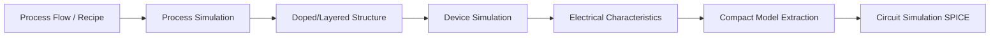
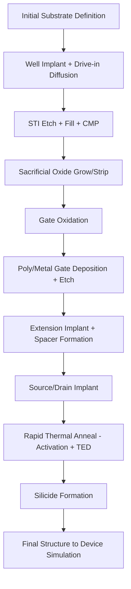

## Process Simulation Fundamentals

### Overview

Process simulation is the computational modeling of semiconductor fabrication steps to predict the physical and structural outcomes of manufacturing before or without running physical wafers. It forms one half of Technology CAD (TCAD), the other being device simulation, which takes the structures produced here as input to predict electrical behavior. Process simulation numerically solves the physics and chemistry governing operations such as oxidation, diffusion, ion implantation, etching, and deposition, producing a virtual wafer cross-section (or 3D structure) with accurate doping profiles, layer thicknesses, and geometries.

### Role Within the TCAD Flow

Process simulation tools (e.g., Synopsys Sentaurus Process, Silvaco Victory Process, TCAD SUPREM lineage) take a **process flow** (a sequence of fabrication steps with associated parameters: temperatures, times, doses, energies, gas ambients) and output a meshed structure with:

- Layer geometry (film thicknesses, trench profiles, sidewall angles)
- Dopant concentration profiles as a function of position
- Stress/strain fields (in advanced simulators)
- Material interfaces and grain structure (for polysilicon, silicides)

### Core Physical Phenomena Modeled

#### 1. Oxidation

Thermal oxidation of silicon is modeled predominantly with the **Deal-Grove model**, which describes oxide growth kinetics:

$$x_{ox}^2 + A x_{ox} = B(t + \tau)$$

where $x_{ox}$ is the oxide thickness, $A$ and $B$ are rate constants dependent on temperature and ambient (dry $O_2$ vs. wet $H_2O$), $t$ is oxidation time, and $\tau$ accounts for initial oxide thickness. For thin oxides (<~30 nm), the linear-parabolic Deal-Grove model requires correction terms since it underpredicts growth rate; simulators incorporate empirical thin-oxide enhancement factors.

Modern TCAD tools use compressible viscoelastic flow models for oxide growth in advanced geometries (e.g., LOCOS bird's beak, STI corner rounding), since oxidation causes volume expansion (silicon converts to $SiO_2$ with ~2.2x volume increase) that mechanically deforms surrounding material.

**Key Points**

- Dry oxidation: slower, higher quality oxide (gate oxides)
- Wet oxidation: faster growth (field oxides, masking layers)
- Segregation coefficient governs how dopants redistribute between Si and growing $SiO_2$ (boron segregates into oxide, depleting the silicon surface; phosphorus and arsenic pile up in silicon)

#### 2. Diffusion

Dopant redistribution during thermal cycles is modeled via **Fick's laws** generalized for point-defect-mediated diffusion in silicon:

$$\frac{\partial C}{\partial t} = \nabla \cdot (D(C, T) \nabla C)$$

The diffusivity $D$ is not constant — it depends on local dopant concentration (concentration-enhanced diffusion), temperature (Arrhenius-activated), and crucially on **point defect concentrations** (silicon self-interstitials $I$ and vacancies $V$), since most dopants (boron, phosphorus) diffuse via interaction with these native point defects rather than pure vacancy or interstitial mechanisms alone.

Advanced diffusion models track:

- **Transient Enhanced Diffusion (TED)**: a burst of excess interstitials injected by ion implantation damage causes anomalously fast dopant diffusion for a limited time after implant, before defects anneal out. This is one of the most critical effects in modern shallow-junction formation.
- **Pair diffusion models**: explicitly solve coupled equations for dopant-defect pairs (e.g., boron-interstitial pairs)
- **Segregation and trapping** at interfaces (Si/SiO2) and extended defects (dislocation loops, {311} defects)

$$D_{eff} = D^X \left(\frac{C_I}{C_I^*}\right) + D^V\left(\frac{C_V}{C_V^*}\right)$$

where superscripts $X$ (interstitialcy) and $V$ (vacancy) denote the diffusion mechanism component, and $C^*$ denotes equilibrium concentration.

#### 3. Ion Implantation

Implant simulation predicts the as-implanted dopant profile from beam energy, dose, tilt/rotation angle, and species. Two main approaches:

- **Analytic models**: Pearson-IV or dual-Pearson distributions fit to tabulated moments (range $R_p$, straggle $\Delta R_p$, skewness, kurtosis) obtained from Monte Carlo binary collision calibrations. Fast but limited for complex 3D geometries or channeling effects.
- **Monte Carlo simulation**: full binary-collision-approximation (BCA) tracking of ion trajectories through the crystal lattice, capturing **channeling** (ions traveling unusually deep along crystallographic axes with low nuclear stopping), damage cascades, and sputtering. Computationally expensive but necessary for tilted implants into crystalline targets and for predicting implant damage that seeds TED.

Implant damage also produces **amorphization** above a dose threshold, which subsequently affects solid-phase epitaxial regrowth (SPER) behavior during anneal — a coupled process-simulation concern.

**Example**

A boron implant at 10 keV, dose $5\times10^{14} \text{cm}^{-2}$, 7° tilt (standard to avoid channeling) into a source/drain extension region would be simulated to produce $R_p \approx 30$ nm with $\Delta R_p \approx 15$ nm, followed by an anneal step simulation to compute TED-driven junction depth.

#### 4. Etching and Deposition (Topography Simulation)

These govern the evolving 3D/2D geometry of the wafer surface, distinct from the dopant/diffusion physics above:

- **Deposition**: film growth models range from simple directional/conformal geometric rules to more physical models incorporating flux visibility (line-of-sight deposition from a source, important for sputtering and evaporation) and surface reaction kinetics for CVD/ALD (where near-perfect conformality into trenches/vias is expected).
- **Etching**: isotropic vs. anisotropic etch rate models; **level-set methods** are the standard numerical technique for tracking evolving etch/deposition fronts because they naturally handle topology changes (merging, splitting of surfaces) without explicit mesh regeneration.

Level-set surface evolution is generally expressed as:

$$\frac{\partial \phi}{\partial t} + F|\nabla \phi| = 0$$

where $\phi$ is the level-set function (the surface is the zero level-set $\phi=0$) and $F$ is the local normal velocity (etch rate or deposition rate, which can depend on flux, angle of incidence, and local geometry/shadowing).

### Mesh Generation and Adaptation

Accurate simulation requires meshing that balances resolution against computational cost:

- **Structured/rectangular grids**: simple, fast, used for 1D/simple 2D problems
- **Unstructured triangular/tetrahedral meshes**: needed for arbitrary 2D/3D geometry with sharp corners, curved interfaces (STI, gate spacers)
- **Adaptive mesh refinement**: automatically refines mesh in regions of high gradient (junctions, oxide/silicon interfaces, channel regions) and coarsens elsewhere to control node count

[Inference] Mesh quality and refinement criteria are often a dominant factor in whether a given TCAD process flow reproduces experimentally calibrated results, since coarse meshing near steep dopant gradients can introduce numerical diffusion artifacts that mimic (or mask) real physical diffusion.

### Calibration Against Experimental Data

Process simulators are predictive only insofar as their models are calibrated. Standard calibration data sources include:

- **SIMS (Secondary Ion Mass Spectrometry)**: 1D dopant concentration-vs-depth profiles, the primary calibration target for diffusion/implant models
- **Spreading resistance profiling (SRP)**: electrically active carrier concentration vs. depth (differs from SIMS since SIMS measures total chemical concentration, including inactive/clustered dopants)
- **TEM cross-sections**: for geometric/topographic calibration (oxide thickness, etch profile angles, spacer geometry)
- **Electrical test structures**: sheet resistance, junction leakage, capacitance-voltage measurements provide indirect but device-relevant validation

Calibration typically involves tuning model coefficients (diffusivity prefactors, segregation coefficients, damage model parameters) to a technology's specific thermal budget and implant conditions, since foundry-specific film stress, ambient purity, and equipment characteristics shift real behavior from generic literature parameter sets. [Unverified] Exact proprietary calibration parameter sets used by foundries are not publicly disclosed and vary between technology nodes and fabs.

### Typical Process Flow Simulation Sequence (Illustrative CMOS Front-End)

Each box above corresponds to one or more discrete simulation steps in the TCAD deck, each invoking the relevant physical model (Deal-Grove for oxidation, Pearson/Monte Carlo for implant, pair-diffusion for anneal, level-set for etch).

### Coupled Effects Requiring Simultaneous Treatment

- **Stress-diffusion coupling**: mechanical stress (from STI, silicide, nitride liners) modifies point-defect diffusivities and dopant activation energies — significant in stressed-channel technologies (strained Si/SiGe)
- **Damage-diffusion coupling**: implant amorphization state affects subsequent TED behavior and dopant activation/deactivation kinetics
- **Oxidation-induced stress**: bird's-beak formation in LOCOS or STI corner stress affects both geometric outcome and local diffusion rates

[Inference] As feature sizes shrink and 3D architectures (FinFET, GAA nanosheets) dominate, coupled 3D stress-diffusion-implant simulation with full 3D level-set topography has become effectively mandatory rather than optional, since 1D/2D approximations poorly capture corner effects, fin-sidewall implant shadowing, and multi-directional stress fields.

### Illustrative Doping Profile Cross-Section (svg_diagram)

<svg xmlns="http://www.w3.org/2000/svg" viewBox="0 0 640 340" font-family="sans-serif">
<text x="320" y="24" text-anchor="middle" font-size="15" font-weight="bold">Simplified 1D Doping Profile After Implant + Anneal (svg_diagram)</text>
<line x1="70" y1="280" x2="600" y2="280" stroke="black" stroke-width="1.5" />
<line x1="70" y1="280" x2="70" y2="50" stroke="black" stroke-width="1.5" />
<text x="335" y="315" text-anchor="middle" font-size="13">Depth (nm)</text>
<text x="30" y="165" text-anchor="middle" font-size="13" transform="rotate(-90 30,165)">log(Concentration)</text>
<path d="M 90 70 C 130 75, 170 100, 210 150 C 250 195, 290 230, 340 250 C 400 268, 480 275, 590 278" fill="none" stroke="#1f6feb" stroke-width="2.5" />
<text x="120" y="65" font-size="11" fill="#1f6feb">As-implanted (Pearson)</text>
<path d="M 90 95 C 140 105, 190 140, 240 190 C 300 235, 380 260, 470 270 C 520 274, 560 276, 590 277" fill="none" stroke="#d1242f" stroke-width="2.5" stroke-dasharray="6,4" />
<text x="330" y="200" font-size="11" fill="#d1242f">After anneal (TED-broadened)</text>
<line x1="70" y1="230" x2="600" y2="230" stroke="#888" stroke-width="1" stroke-dasharray="3,3" />
<text x="580" y="225" font-size="10" fill="#555">Background doping</text>
<line x1="270" y1="280" x2="270" y2="205" stroke="#333" stroke-width="1" stroke-dasharray="2,2" />
<text x="272" y="200" font-size="10">Junction depth $x_j$</text>
</svg>

### Common Process Simulation Tools

| Tool | Vendor | Notable Capability |
| --- | --- | --- |
| Sentaurus Process | Synopsys | Industry-standard, full pair-diffusion, stress coupling, 3D |
| Victory Process | Silvaco | 3D topography and implant, level-set etch/deposition |
| Athena (legacy) | Silvaco | 2D process simulation, widely used in academia/teaching |
| SUPREM-IV lineage | Stanford origin | Foundational 1D/2D diffusion-oxidation simulator, basis for many derivatives |

[Unverified] Current feature sets and version-specific capabilities of commercial tools change with vendor release cycles; the table reflects general, long-standing tool positioning rather than a specific current version.

### Limitations and Practical Considerations

- Process simulation accuracy degrades for exotic/novel materials (high-k dielectrics, 2D materials, novel III-V channels) where physical models are less mature than for silicon
- Computational cost of full 3D Monte Carlo implant + level-set topography + coupled stress-diffusion for a full FinFET/GAA flow can be substantial, often necessitating hybrid analytic/Monte Carlo approaches or reduced-order models for design-of-experiments (DOE) style studies
- Calibration is fab- and node-specific; models transferred from one technology generation to another without recalibration can produce systematically wrong junction depths or activation levels

**Related Topics**

- Deal-Grove oxidation kinetics (detailed derivation and thin-oxide corrections)
- Transient enhanced diffusion and point-defect engineering
- Ion implantation: channeling, damage, and amorphization
- Level-set methods for topography simulation
- Device simulation fundamentals (drift-diffusion, hydrodynamic transport)
- Stress engineering in strained-channel CMOS
- SIMS and electrical calibration methodologies for TCAD
- 3D TCAD for FinFET and Gate-All-Around architectures