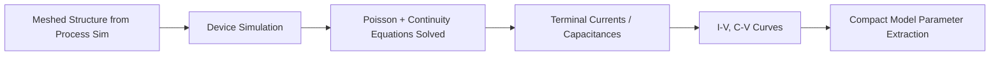
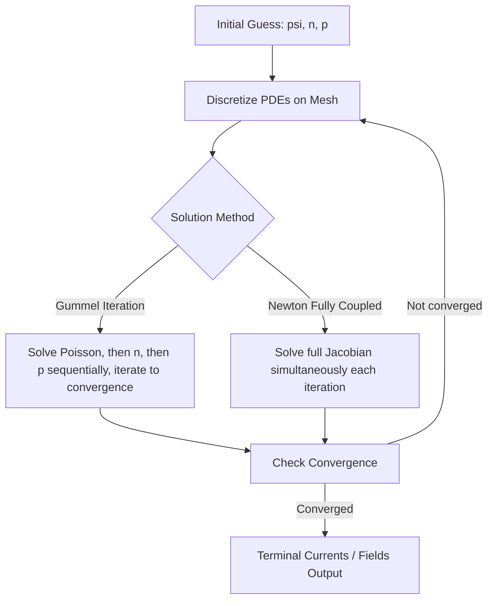

## Device Simulation and Drift Diffusion Models

### Overview

Device simulation is the numerical solution of semiconductor transport physics on a meshed device structure (typically produced by process simulation) to predict electrical characteristics — current-voltage curves, capacitance, breakdown behavior, switching speed — without fabricating physical test devices. The **drift-diffusion (DD) model** is the foundational and most widely used transport model in commercial TCAD, striking a practical balance between physical accuracy and computational tractability for the vast majority of device sizes down to roughly the deep-submicron regime.

### Position Within the TCAD Flow

### The Fundamental Equation Set

Drift-diffusion device simulation self-consistently solves three coupled partial differential equations over the device domain: **Poisson's equation** and two **continuity equations** (one for electrons, one for holes).

#### 1. Poisson's Equation

Relates the electrostatic potential $\psi$ to the net charge density:

$$\nabla \cdot (\varepsilon \nabla \psi) = -q(p - n + N_D^+ - N_A^-)$$

where $\varepsilon$ is the local permittivity, $q$ is elementary charge, $n$ and $p$ are electron and hole concentrations, and $N_D^+$, $N_A^-$ are ionized donor/acceptor concentrations (from the doping profile handed off by process simulation).

#### 2. Electron and Hole Continuity Equations

Express charge conservation including generation-recombination:

$$\frac{\partial n}{\partial t} = \frac{1}{q}\nabla \cdot \vec{J_n} + (G - R)$$

$$\frac{\partial p}{\partial t} = -\frac{1}{q}\nabla \cdot \vec{J_p} + (G - R)$$

where $G$ and $R$ are generation and recombination rates.

#### 3. Drift-Diffusion Current Relations

The defining approximation of this model expresses carrier current density as the sum of a **drift** term (field-driven) and a **diffusion** term (concentration-gradient-driven):

$$\vec{J_n} = q\mu_n n \vec{E} + qD_n \nabla n$$

$$\vec{J_p} = q\mu_p p \vec{E} - qD_p \nabla p$$

Here $\mu_n, \mu_p$ are electron/hole mobilities, $\vec{E} = -\nabla\psi$ is the electric field, and $D_n, D_p$ are diffusion coefficients, related to mobility via the **Einstein relation**:

$$D_n = \frac{k_B T}{q}\mu_n$$

**Key Points**

- The drift-diffusion model assumes carriers are always in local quasi-equilibrium with the local electric field, i.e., mobility and diffusivity depend only on local field/carrier density, not on transport history
- This assumption breaks down when carrier transit time becomes comparable to or shorter than the energy relaxation time — the regime where hydrodynamic or Monte Carlo models become necessary (see Limitations below)
- The three equations (Poisson + 2 continuity) are solved self-consistently and simultaneously (fully coupled Newton method) or via decoupled iteration (Gummel's method), since the equations are nonlinearly interdependent

### Physical Models Required to Close the System

The DD equation set alone is incomplete without auxiliary physical models supplying $\mu$, $G-R$, and boundary conditions appropriate to the material and operating regime.

#### Mobility Models

Carrier mobility is not a constant — it depends on multiple scattering mechanisms that must be combined (typically via Matthiessen's rule) or modeled directly:

- **Doping-dependent mobility**: mobility decreases with increasing ionized impurity concentration due to Coulomb scattering (commonly modeled via the Caughey-Thomas or Masetti formulations)
- **Lateral/transverse electric field dependence (velocity saturation)**: at high fields, drift velocity saturates rather than increasing linearly, captured by field-dependent mobility models such as Caughey-Thomas:

$$\mu(E) = \frac{\mu_0}{\left[1 + \left(\frac{\mu_0 E}{v_{sat}}\right)^{\beta}\right]^{1/\beta}}$$

- **Perpendicular field / surface mobility degradation**: near Si/$SiO_2$ interfaces (MOSFET channels), surface roughness scattering reduces mobility as a function of the vertical field — critical for accurate MOSFET $I_{DS}$-$V_{GS}$ prediction
- **Temperature-dependent mobility**: phonon (lattice) scattering dominates at higher temperatures, following an inverse power-law dependence

#### Generation-Recombination Models

- **Shockley-Read-Hall (SRH) recombination**: trap-assisted recombination through defect/impurity states within the bandgap, the dominant mechanism in most silicon devices at moderate carrier injection:

$$R_{SRH} = \frac{np - n_i^2}{\tau_p(n+n_1) + \tau_n(p+p_1)}$$

- **Auger recombination**: three-particle process dominant at high carrier concentrations (heavily doped regions, high-injection power devices)
- **Radiative recombination**: direct band-to-band recombination, negligible in indirect-bandgap silicon but essential for III-V/optoelectronic device simulation
- **Impact ionization (avalanche generation)**: field-driven carrier multiplication, essential for modeling breakdown voltage, avalanche photodiodes, and hot-carrier reliability effects

#### Bandgap and Carrier Statistics Models

- **Bandgap narrowing**: at high doping concentrations, the effective bandgap shrinks, affecting intrinsic carrier concentration $n_i$ and hence junction behavior (bipolar transistor emitter efficiency in particular)
- **Fermi-Dirac vs. Boltzmann statistics**: Boltzmann statistics (assuming non-degenerate carrier populations) are the default simplification; Fermi-Dirac statistics become necessary at high doping/degenerate conditions where Boltzmann overestimates carrier concentration

### Numerical Solution Method

The coupled nonlinear PDE system is discretized spatially (finite-element or finite-volume/box-integration methods on the mesh from process simulation) and solved iteratively:

- **Scharfetter-Gummel discretization**: the standard finite-volume scheme for discretizing the current continuity equations on a mesh edge, chosen because it correctly captures exponential carrier variation across a mesh edge in regions of strong field (e.g., depletion regions) without requiring impractically fine meshing
- **Gummel's method**: decoupled iterative solution (solve Poisson holding $n,p$ fixed, then solve continuity equations holding $\psi$ fixed, repeat) — more robust for weakly coupled bias points but slower to converge
- **Newton's method (fully coupled)**: solves all three equations simultaneously each iteration via the full Jacobian — faster convergence near strongly coupled operating points (e.g., high current density) but requires a good initial guess

**Example**

For a MOSFET $I_D$-$V_{GS}$ sweep, the simulator ramps gate voltage in small steps, using the converged solution from the previous bias point as the initial guess for the next (bias stepping) — this significantly improves Newton convergence versus solving each bias point from a cold start.

### Boundary Conditions

- **Ohmic contacts**: carrier concentrations fixed at local equilibrium values consistent with charge neutrality and the applied bias (Dirichlet-type)
- **Schottky contacts**: thermionic emission boundary condition, current dependent on the barrier height and local field
- **Insulator interfaces**: zero normal current, but electric flux continuity enforced (relevant for gate oxide boundaries in MOSFETs)
- **Artificial/Neumann boundaries**: zero-flux, no-field conditions imposed at simulation domain edges to emulate an "infinite" surrounding structure

### Extracted Output Quantities

- **DC characteristics**: $I$-$V$ curves (transfer, output characteristics), threshold voltage, subthreshold slope, breakdown voltage
- **Small-signal AC**: capacitances ($C_{gg}$, $C_{gd}$, $C_{gs}$), transconductance $g_m$, output conductance $g_{ds}$ via small-signal perturbation around a DC operating point
- **Transient**: switching waveforms, turn-on/turn-off delay, reverse recovery (power diodes)
- **Noise**: thermal and flicker noise spectra (requires additional noise models layered on the DD solution)

### Limitations of the Drift-Diffusion Model

[Inference] As channel lengths shrink toward and below ~100 nm, the local quasi-equilibrium assumption underlying drift-diffusion becomes increasingly inaccurate, since carriers can traverse the channel faster than they thermalize with the lattice, giving rise to non-local transport effects the DD model cannot capture.

Key phenomena poorly captured by pure DD:

- **Velocity overshoot**: carriers can transiently exceed the saturation velocity predicted by local field-dependent mobility models in short-channel devices, since velocity depends on carrier energy history, not just instantaneous field
- **Ballistic/quasi-ballistic transport**: in very short channels, a significant fraction of carriers can traverse without scattering at all
- **Hot carrier effects and impact ionization accuracy**: since these depend on the carrier energy distribution, not just density, DD-based impact ionization models (field-dependent only) are known to be less accurate than energy-dependent formulations

**Higher-order alternatives, in increasing physical fidelity and computational cost:**

| Model | Additional Physics Captured | Relative Cost |
| --- | --- | --- |
| Drift-Diffusion | Local drift + diffusion only | Baseline |
| Hydrodynamic / Energy-Transport | Carrier energy (temperature) as separate solved variable, captures velocity overshoot | ~2-5x DD |
| Monte Carlo | Full carrier energy distribution via stochastic trajectory simulation | 10-1000x DD |
| Quantum-corrected DD (density-gradient) | Quantum confinement effects (channel inversion layer quantization) added as correction terms | ~1.5-3x DD |

[Unverified] Precise relative computational cost multipliers vary substantially with implementation, mesh density, and convergence behavior for the specific device/bias point being simulated; the table values are illustrative orderings rather than benchmarked figures.

### Quantum Corrections

Even within a broadly drift-diffusion framework, modern nanoscale MOSFETs require **quantum correction models** since classical DD does not capture the quantization of carrier energy levels in strongly confined inversion layers (thin gate oxides, narrow fins):

- **Density-gradient method**: adds a quantum potential correction term to the effective potential seen by carriers, approximating confinement-induced carrier density depletion near interfaces
- **Van Dort model**: simpler empirical bandgap-widening correction near interfaces to mimic quantum confinement effects on threshold voltage

### Illustrative MOSFET Simulation Domain (svg_diagram)

<svg xmlns="http://www.w3.org/2000/svg" viewBox="0 0 640 320" font-family="sans-serif">
<text x="320" y="22" text-anchor="middle" font-size="15" font-weight="bold">Simplified MOSFET Cross-Section for Device Simulation (svg_diagram)</text>
<rect x="80" y="200" width="480" height="80" fill="#e0c9a6" stroke="black" stroke-width="1.5" />
<text x="320" y="245" text-anchor="middle" font-size="12">P-Substrate / P-Well</text>
<rect x="100" y="170" width="90" height="30" fill="#5b9bd5" stroke="black" stroke-width="1.2" />
<text x="145" y="190" text-anchor="middle" font-size="10">N+ Source</text>
<rect x="450" y="170" width="90" height="30" fill="#5b9bd5" stroke="black" stroke-width="1.2" />
<text x="495" y="190" text-anchor="middle" font-size="10">N+ Drain</text>
<rect x="240" y="185" width="160" height="15" fill="#cfd8dc" stroke="black" stroke-width="1" />
<text x="320" y="180" text-anchor="middle" font-size="10">Gate Oxide</text>
<rect x="230" y="150" width="180" height="35" fill="#8a8a8a" stroke="black" stroke-width="1.2" />
<text x="320" y="172" text-anchor="middle" font-size="11" fill="white">Gate</text>
<line x1="320" y1="150" x2="320" y2="60" stroke="black" stroke-width="1" />
<text x="320" y="50" text-anchor="middle" font-size="10">V_G</text>
<line x1="145" y1="170" x2="145" y2="90" stroke="black" stroke-width="1" />
<text x="145" y="80" text-anchor="middle" font-size="10">V_S</text>
<line x1="495" y1="170" x2="495" y2="90" stroke="black" stroke-width="1" />
<text x="495" y="80" text-anchor="middle" font-size="10">V_D</text>
<text x="120" y="220" font-size="9" fill="#333">Mesh refined near</text>
<text x="120" y="232" font-size="9" fill="#333">junctions &amp; channel</text>
<line x1="190" y1="200" x2="190" y2="280" stroke="#c62828" stroke-width="0.6" stroke-dasharray="2,2" />
<line x1="450" y1="200" x2="450" y2="280" stroke="#c62828" stroke-width="0.6" stroke-dasharray="2,2" />
<line x1="240" y1="200" x2="240" y2="280" stroke="#c62828" stroke-width="0.6" stroke-dasharray="2,2" />
<line x1="400" y1="200" x2="400" y2="280" stroke="#c62828" stroke-width="0.6" stroke-dasharray="2,2" />
</svg>

### Common Device Simulation Tools

| Tool | Vendor | Notes |
| --- | --- | --- |
| Sentaurus Device | Synopsys | Full DD, hydrodynamic, Monte Carlo, quantum-corrected models |
| Victory Device | Silvaco | DD/hydrodynamic, wide device-type support |
| Atlas | Silvaco | Long-standing 2D/3D DD device simulator, common in academic use |
| GENIUS / open-source solvers | Various | [Unverified] Feature completeness and active maintenance status vary and should be checked directly rather than assumed |

### Practical Workflow Considerations

- Convergence difficulty increases sharply near breakdown, high-injection, or strongly nonlinear bias regions — often requiring smaller bias steps or damped Newton schemes
- Mesh density directly trades off accuracy versus simulation time; under-resolved meshes near high-gradient regions (channel, junctions) are a common source of non-physical kinks in extracted I-V curves
- Model calibration (mobility parameters especially) against measured device data is standard practice, since default/generic mobility model parameters rarely match a specific process's measured carrier mobility without adjustment

**Related Topics**

- Hydrodynamic and energy-transport models for short-channel effects
- Monte Carlo device simulation for hot-carrier and ballistic transport
- Quantum-corrected drift-diffusion (density-gradient method)
- Small-signal AC and RF device simulation
- Compact model extraction (BSIM, PSP) from TCAD-generated I-V/C-V data
- Impact ionization and breakdown voltage simulation
- Process-simulation-to-device-simulation structure handoff and meshing considerations