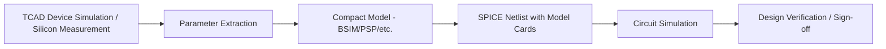
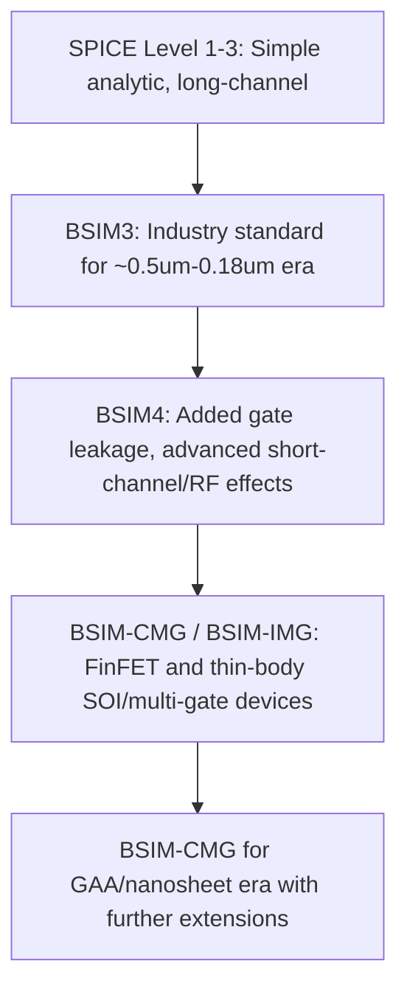
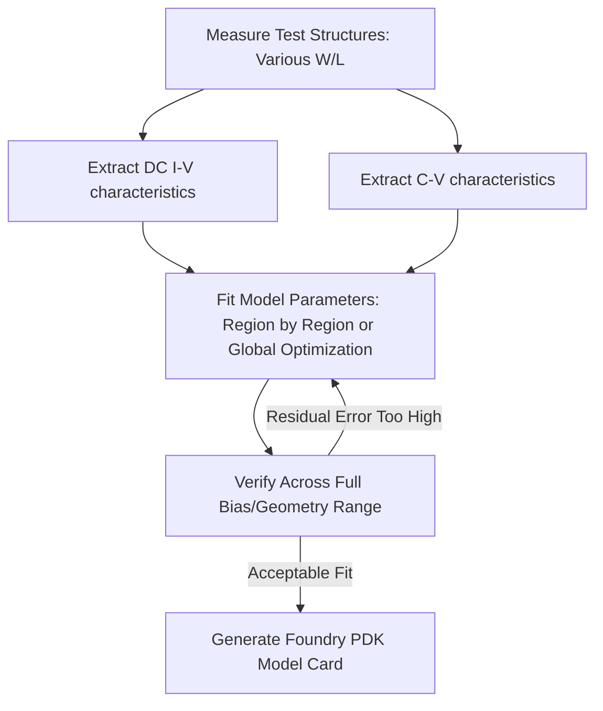

## Compact Modeling for Circuit Simulation

### Overview

Compact models are computationally efficient, physics-based analytical (or semi-empirical) equations describing device terminal behavior (currents, charges, capacitances) as continuous functions of terminal voltages, designed for use inside SPICE-class circuit simulators. Unlike TCAD device simulation, which numerically solves transport PDEs over a meshed structure (expensive: seconds to minutes per bias point), a compact model evaluates in microseconds, enabling circuit simulators to solve systems with millions of transistors. Compact modeling is the essential bridge between physical/TCAD-level device characterization and practical IC design.

### Position in the Design Flow

### Core Requirements of a Compact Model

A production-grade compact model must satisfy several engineering constraints beyond pure physical accuracy:

- **Continuity**: current, charge, and their derivatives (transconductance, capacitance) must be continuous and smooth across all operating regions (subthreshold, linear, saturation) — discontinuities cause SPICE convergence failures
- **Scalability**: a single parameter set must predict behavior across the full range of geometries (channel length, width) fabricated in a given technology, not just one device size
- **Symmetry**: for devices without inherent source/drain distinction (MOSFETs), the model must behave correctly when source and drain terminals are swapped, since circuit simulators do not track which terminal is "really" the source
- **Computational efficiency**: closed-form or rapidly converging iterative equations, since these are evaluated potentially billions of times during a circuit simulation
- **Charge conservation**: capacitance models must be derived consistently from a charge-based formulation to avoid non-physical charge creation/destruction during transient simulation

### The MOSFET Compact Modeling Hierarchy

#### Historical Progression

- **SPICE Level 1-3 models**: simple square-law or basic empirical equations, adequate only for long-channel devices; inadequate for any modern process due to neglect of short-channel effects
- **BSIM3/BSIM4 (Berkeley Short-channel IGFET Model)**: became the de facto industry-standard compact MOSFET model, later adopted as a **Compact Model Council (CMC)** standard. BSIM4 added models for gate tunneling current, more detailed RF/noise behavior, and improved short-channel effect coverage
- **BSIM-CMG (Common Multi-Gate)**: extends the BSIM surface-potential framework to FinFET and other multi-gate/3D architectures, treating the gate(s) wrapping the fin body
- **BSIM-IMG (Independent Multi-Gate)**: for devices where multiple gates can be biased independently (e.g., independently-driven double-gate devices)
- **PSP model**: an alternative surface-potential-based model (developed jointly by Penn State and NXP/Philips), also a CMC standard, noted for a fully symmetric, physics-based surface-potential formulation from first principles rather than the more empirical/regional-fitting approach of earlier BSIM generations

[Unverified] The specific model chosen by a given foundry for a given process node (BSIM-CMG vs. proprietary in-house variants vs. PSP) is confidential foundry information not universally disclosed; general industry adoption patterns are described here rather than any single foundry's specific choice.

### Modeling Approaches: Regional vs. Surface-Potential vs. Charge-Sheet

- **Regional (piecewise) models**: separate equations for subthreshold, linear (triode), and saturation regions, stitched together with smoothing functions to maintain continuity at region boundaries. Historically simpler to derive and calibrate but prone to residual discontinuities in higher-order derivatives if smoothing is imperfect. Classic BSIM3/4 largely follow this philosophy.
- **Surface-potential-based models**: solve for the semiconductor surface potential $\psi_s$ implicitly as a function of terminal voltages using the full MOS electrostatics, then derive currents and charges from $\psi_s$ directly — inherently continuous across all operating regions since there is no artificial region-stitching. PSP and later BSIM revisions increasingly adopt this approach for improved accuracy, particularly in moderate inversion (critical for analog/RF circuits operating near threshold for low-power design).
- **Charge-sheet approximation**: treats the inversion layer as an infinitesimally thin sheet of charge, a simplifying assumption underlying most practical long-channel-derived compact models, with correction terms added for quantum-mechanical inversion layer thickness in advanced nodes

### Key Physical Effects Modeled

A modern compact MOSFET model must capture dozens of physical effects; the major categories:

#### Short-Channel Effects

- **Threshold voltage roll-off**: $V_{th}$ decreases as channel length shrinks due to charge sharing between source/drain depletion regions and the channel
- **Drain-Induced Barrier Lowering (DIBL)**: $V_{th}$ further decreases with increasing $V_{DS}$ as the drain field penetrates into the channel
- **Velocity saturation**: current saturates at lower $V_{DS}$ than simple square-law theory predicts, since carrier velocity saturates at high lateral field

#### Output Resistance Effects

- **Channel length modulation (CLM)**
- **Substrate current induced body effect (SCBE)**
- **Drain-induced barrier lowering's effect on output conductance**, important for analog gain stages where $g_{ds}$ accuracy directly determines predicted amplifier gain

#### Parasitic and Layout-Dependent Effects

- **Series resistance** (source/drain access resistance)
- **Gate resistance** (important for RF)
- **Well/body proximity effects, and shallow-trench-isolation (STI) stress effects** on nearby transistors — layout-dependent effects (LDE) that make electrical parameters a function not just of device size but of surrounding layout context
- **Self-heating**: particularly critical in SOI and FinFET/GAA technologies, where thermal isolation from the substrate causes significant channel temperature rise under bias, requiring an internal thermal-node sub-circuit within the compact model itself

#### Gate Leakage and Reliability-Adjacent Effects

- Gate tunneling current models (direct tunneling, Fowler-Nordheim) — became necessary once gate oxides thinned to a few nanometers
- **Noise models**: thermal noise, flicker (1/f) noise, and (for RF) induced gate noise, essential for analog/RF/mixed-signal design sign-off

### Charge and Capacitance Modeling

Accurate transient and AC (small-signal) simulation requires the model to supply terminal charges $Q_G, Q_S, Q_D, Q_B$ as functions of terminal voltages, from which the nine-terminal capacitance matrix (e.g., $C_{gs}, C_{gd}, C_{gb}$, and their non-reciprocal transcapacitance counterparts) is derived by differentiation:

$$C_{ij} = \pm\frac{\partial Q_i}{\partial V_j}$$

**Key Points**

- Charge-based (rather than capacitance-based) formulation is essential for charge conservation in transient simulation — directly modeling capacitances as independent functions can violate charge conservation during fast transients
- Non-reciprocal capacitances ($C_{gs} \neq C_{sg}$ in general) arise naturally from a proper charge-based treatment and are physically necessary to represent charge redistribution delay in the channel

### Beyond MOSFETs: Other Device Compact Models

- **BJT models**: Gummel-Poon and its extensions (VBIC — Vertical Bipolar Inter-Company model) capture base-width modulation (Early effect), high-injection effects, and parasitic substrate transistor behavior
- **Diode models**: standard SPICE diode equation extended with recombination current, high-injection series resistance, and breakdown modeling
- **Passive parasitic models**: interconnect RC/RLC models, extracted separately (parasitic extraction, distinct from device compact modeling) but co-simulated in post-layout circuit simulation
- **Emerging device models**: compact models for FinFET, nanosheet/GAA, and increasingly for novel devices (RRAM, ferroelectric FETs) are developed following similar principles — continuity, scalability, charge conservation — though model maturity for very new device types generally lags behind established bulk/FinFET MOSFET models. [Inference] As GAA and further novel device architectures proliferate industrially, compact model standardization efforts (through bodies such as the Compact Model Coalition) are likely to continue extending BSIM-family frameworks rather than introducing entirely new modeling paradigms, given the strong ecosystem investment in existing BSIM/PSP infrastructure.

### Parameter Extraction Workflow

- **Local extraction**: parameters extracted from specific bias regions or specific device geometries independently, historically common but can produce inconsistent parameter sets across regions
- **Global optimization**: simultaneously fits parameters across the full measured dataset (multiple geometries, full bias range, multiple temperatures), generally producing more physically consistent and robust parameter sets, at higher computational/optimization cost
- **Temperature scaling**: model parameters must additionally be characterized across the operating temperature range, since mobility, threshold voltage, and leakage all have strong temperature dependence relevant to circuit reliability sign-off

**Example**

A foundry PDK's `nmos_hvt` model card contains hundreds of BSIM parameters (e.g., `VTH0`, `U0`, `RDSW`, `CGSO`) fitted across the full range of manufacturable $W$ and $L$ combinations, each with corresponding statistical corner variants (`_ff`, `_ss`, `_tt`, etc.) for process-variation-aware circuit design.

### Statistical and Variation-Aware Modeling

Beyond nominal (typical-typical) model cards, modern PDKs provide:

- **Corner models**: discrete fast/slow, fast-fast/slow-slow parameter sets bounding expected process variation for worst-case design sign-off
- **Monte Carlo statistical models**: parameter sets with statistical distributions (local mismatch and global process variation) enabling Monte Carlo circuit simulation to predict yield-relevant spread in circuit performance
- **Mismatch models**: specifically capture local (within-die, device-to-device) variation, critical for analog matching-sensitive circuits (differential pairs, current mirrors, SRAM bit cells)

### Illustrative I-V Curve Family from a Compact Model (svg_diagram)

<svg xmlns="http://www.w3.org/2000/svg" viewBox="0 0 620 340" font-family="sans-serif">
<text x="310" y="22" text-anchor="middle" font-size="15" font-weight="bold">Compact Model Output Characteristics (svg_diagram)</text>
<line x1="70" y1="280" x2="580" y2="280" stroke="black" stroke-width="1.5" />
<line x1="70" y1="280" x2="70" y2="50" stroke="black" stroke-width="1.5" />
<text x="325" y="315" text-anchor="middle" font-size="13">$V_{DS}$ (V)</text>
<text x="30" y="165" text-anchor="middle" font-size="13" transform="rotate(-90 30,165)">$I_D$ (A)</text>
<path d="M 70 280 C 100 200, 130 170, 200 165 C 300 160, 450 158, 580 155" fill="none" stroke="#1f6feb" stroke-width="2.2" />
<text x="500" y="145" font-size="10" fill="#1f6feb">$V_{GS4}$ (highest)</text>
<path d="M 70 280 C 100 220, 130 195, 200 190 C 300 185, 450 183, 580 180" fill="none" stroke="#2e7d32" stroke-width="2.2" />
<text x="500" y="200" font-size="10" fill="#2e7d32">$V_{GS3}$</text>
<path d="M 70 280 C 100 245, 130 220, 200 215 C 300 210, 450 208, 580 206" fill="none" stroke="#f9a825" stroke-width="2.2" />
<text x="500" y="225" font-size="10" fill="#f9a825">$V_{GS2}$</text>
<path d="M 70 280 C 90 265, 110 250, 150 245 C 250 238, 450 236, 580 234" fill="none" stroke="#c62828" stroke-width="2.2" />
<text x="500" y="250" font-size="10" fill="#c62828">$V_{GS1}$ (lowest)</text>
<line x1="200" y1="280" x2="200" y2="50" stroke="#888" stroke-width="0.8" stroke-dasharray="4,4" />
<text x="150" y="65" font-size="10" fill="#555">Linear region</text>
<text x="380" y="65" font-size="10" fill="#555">Saturation region</text>
</svg>

### Compact Model Standardization Bodies

- **Compact Model Coalition (CMC)**: industry consortium (foundries, IDMs, EDA vendors) that formally standardizes reference compact models (BSIM family, PSP, VBIC, Mextram, HICUM) to ensure a common, vetted implementation is available across all major SPICE simulators, avoiding fragmentation between simulator vendors' proprietary reimplementations
- Standardized models are typically distributed via **Verilog-A** reference implementations, allowing consistent behavior across SPICE simulators supporting the Verilog-A hardware description language for analog behavioral/compact modeling

### Limitations and Practical Considerations

- Compact models are empirically/physically calibrated to a specific technology's measured silicon; extrapolation outside the characterized bias/geometry range (especially high-current stress conditions or extreme temperature) is unreliable
- Even standardized models (BSIM-CMG, PSP) require substantial foundry-specific calibration effort per node — the equations are standard, but the hundreds of fitted coefficients are proprietary and process-specific
- Model complexity has grown substantially with each generation (modern BSIM models can carry many hundreds of parameters), creating an ongoing tension between physical completeness and simulation runtime/convergence robustness for very large circuit simulations (full-chip, memory arrays)

**Related Topics**

- BSIM4 vs. BSIM-CMG parameter set structure and typical use cases
- Surface-potential-based modeling (PSP) mathematical formulation
- SPICE simulation convergence and Newton-Raphson circuit solving
- Parasitic extraction (RC extraction) and its interaction with compact models in post-layout simulation
- Process-Voltage-Temperature (PVT) corner methodology in IC sign-off
- Verilog-A behavioral modeling for custom/novel device compact models
- Statistical/Monte Carlo circuit simulation for yield prediction