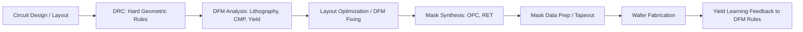
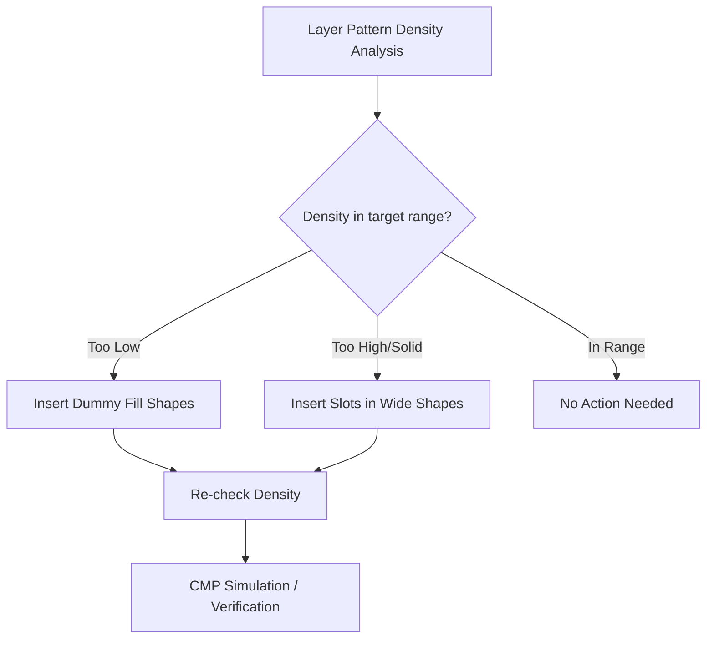

## Design for Manufacturability

### Overview

Design for Manufacturability (DFM) is the discipline of adapting IC layout, design rules, and design methodology to account for the physical realities and statistical variability of semiconductor fabrication, with the goal of maximizing yield, reliability, and performance predictability. Where traditional Design Rule Checking (DRC) enforces hard pass/fail geometric limits, DFM addresses the broader, often probabilistic space of manufacturing-induced variation — lithographic distortion, chemical-mechanical polishing (CMP) non-uniformity, random defects, and process-induced stress — that DRC-clean layouts can still be vulnerable to.

### Position in the Design-to-Manufacturing Flow

### Why DRC Alone Is Insufficient

DRC enforces deterministic geometric constraints (minimum width, minimum spacing, minimum enclosure) derived conservatively from process capability. However, a layout can be fully DRC-clean and still:

- Print poorly under the actual lithographic process (pattern-dependent proximity effects distort shapes in ways simple spacing rules don't capture)
- Suffer excess dishing or erosion during CMP due to uneven pattern density across the chip
- Have statistically elevated random defect sensitivity due to critical-area geometry
- Experience stress-induced mobility shifts from neighboring structures (STI stress, well proximity)

[Inference] As process nodes have shrunk, the gap between "DRC-clean" and "manufacturable with high yield and predictable performance" has widened considerably, since sub-wavelength lithography and increasingly tight process margins make many second-order physical effects first-order yield and performance concerns.

### Lithography-Related DFM

#### Optical Proximity Correction (OPC)

Since feature sizes have long been smaller than the exposure wavelength used in production lithography, mask patterns must be pre-distorted so that the *printed* wafer pattern matches the intended design — this correction process is OPC.

- **Rule-based OPC**: applies pre-characterized correction rules (e.g., add serifs to corners, adjust line-end extensions) based on local layout context
- **Model-based OPC**: uses a calibrated lithography simulation model to iteratively adjust mask geometry until simulated wafer printing matches target geometry within tolerance — generally more accurate for advanced nodes but computationally intensive

#### Resolution Enhancement Techniques (RET)

- **Phase-Shift Masks (PSM)**: exploit destructive interference between adjacent mask openings to sharpen printed feature edges beyond what amplitude-only masks achieve
- **Off-Axis Illumination (OAI)**: tailors the illumination source angular distribution to enhance contrast for specific pitch/orientation combinations common in the design (Source Mask Optimization, SMO, jointly optimizes illumination source shape and mask pattern)
- **Sub-Resolution Assist Features (SRAFs)**: additional non-printing mask features placed near primary features to improve process window without themselves being resolved on the wafer

#### Litho-Friendly Design (Restricted Design Rules)

Many advanced nodes adopt **restricted design rules (RDR)** or gridded/regular layout styles (uniform poly/metal pitch, unidirectional routing on critical layers) specifically because highly regular, repetitive patterns are dramatically easier to print reliably with double/multiple patterning and tight process windows than arbitrary, irregular shapes.

**Key Points**

- Multi-patterning (Litho-Etch-Litho-Etch, Self-Aligned Double/Quadruple Patterning) decomposes a single dense layer into multiple less-dense mask exposures — this imposes new DFM constraints around **coloring** (which features are assigned to which exposure) and **decomposition-compliant layout**, since not all layouts can be validly decomposed
- **Litho Hotspot Detection**: pattern-matching or simulation-based identification of layout configurations known to be prone to poor process-window printing, flagged for correction before tapeout

### Chemical-Mechanical Polishing (CMP) DFM

CMP planarizes each interconnect/deposition layer, but polishing rate depends on local pattern density — dense metal regions polish differently from sparse regions, causing **dishing** (metal recessing below the surrounding dielectric) and **erosion** (dielectric thinning in densely patterned areas).

- **Dummy fill insertion**: non-functional metal/poly shapes are automatically inserted into low-density regions specifically to equalize pattern density across the layer, reducing CMP-induced topography variation
- **Density rule checking**: DFM tools verify that pattern density within any local window falls within a target range across the chip
- **Slotting**: large solid metal shapes are deliberately subdivided with slots, since very wide unbroken metal is itself prone to dishing and stress-induced reliability issues (e.g., electromigration-related voiding)

### Yield-Oriented DFM

#### Critical Area Analysis (CAA)

**Critical area** is the region of a layout where a randomly located point defect (particle) of a given size would cause a functional short or open circuit. CAA statistically estimates:

$$Y = \exp\left(-\int_0^\infty A_c(r) D(r)\, dr\right)$$

where $A_c(r)$ is the critical area as a function of defect radius $r$ and $D(r)$ is the defect size distribution density (typically derived from fab-specific defect monitoring data). Layouts are optimized to minimize critical area — for example, by increasing spacing beyond the DRC minimum in non-critical-timing regions, or by avoiding long parallel runs of minimum-spaced wires where a single particle could bridge them.

#### Redundancy Insertion

- **Redundant contacts/vias**: placing two vias in parallel wherever layout space permits, since a single-via connection failing due to a missed/defective via causes a hard open, while a redundant via provides a fallback path
- **Redundant routing paths**: for critical nets, alternate routing options can reduce single-point-of-failure risk from localized defects

#### Antenna Effect Mitigation

During plasma etching, long conductive traces connected to a transistor gate before the protective diode/well contact is formed can accumulate charge, causing gate oxide damage (the "antenna effect" or plasma-induced damage). DFM/DRC rules limit the ratio of conductor area to connected gate area, and layout fixes include **antenna diodes** (added protection diodes) or **jumper insertion** (breaking a long wire and routing part of it on a different, non-charge-accumulating layer/level added later in the process).

### Stress and Layout-Dependent Effects (LDE)

- **STI (Shallow Trench Isolation) stress**: the mechanical stress from trench-fill oxide varies with the distance from a transistor to the nearest STI edge, altering channel mobility — meaning two nominally identical transistors can have measurably different electrical characteristics purely due to differing local layout context (**Length of Diffusion**, LOD, effect)
- **Well proximity effect (WPE)**: ion implant scattering near well-mask edges causes dopant concentration (and thus threshold voltage) to vary with a transistor's distance from the well boundary
- **Poly spacing / gate-to-gate proximity effects**: affect both lithographic printing fidelity and localized stress

[Inference] Because these layout-dependent effects couple electrical parameter variation directly to physical placement/context, accurate simulation increasingly requires that circuit simulators read layout-derived parameters (LOD, WPE distance) per-instance rather than using a single flat transistor model for every instance in a design — a capability incorporated into most modern parasitic/LDE-aware extraction flows.

### Electromigration and Reliability-Adjacent DFM

While formally a reliability discipline, EM-aware design rules are commonly grouped under manufacturability/reliability co-design:

- **Current density limits per metal width**: enforced to keep electromigration-induced wire failure probability below target lifetime thresholds
- **Via redundancy** (noted above) also serves EM mitigation, since current sharing across multiple vias reduces current density per via
- **Self-heating-aware EM rules**: in advanced nodes, localized Joule heating further accelerates electromigration, requiring current limits that account for local thermal environment, not just nominal ambient temperature

### DFM Verification and Scoring

Modern DFM signoff flows typically produce a **DFM score** or set of hotspot reports rather than a binary pass/fail, reflecting the statistical/probabilistic nature of manufacturability risk:

- **Lithography hotspot count and severity**
- **Critical area / estimated defect-limited yield**
- **CMP density violation count**
- **Via redundancy coverage percentage**
- **LDE-driven parameter variation bounds**

These are typically used to rank and prioritize layout fixes rather than as hard tapeout blockers, since fixing every DFM hotspot to a theoretical ideal is rarely practical within schedule and area constraints — DFM optimization is inherently a cost/benefit tradeoff against schedule, die area, and routing congestion.

### Illustrative Dummy Fill Density Equalization (svg_diagram)

<svg xmlns="http://www.w3.org/2000/svg" viewBox="0 0 640 300" font-family="sans-serif">
<text x="320" y="22" text-anchor="middle" font-size="15" font-weight="bold">Dummy Fill for CMP Density Equalization (svg_diagram)</text>
<text x="160" y="45" text-anchor="middle" font-size="12" font-weight="bold">Before Fill</text>
<rect x="40" y="55" width="240" height="200" fill="none" stroke="black" stroke-width="1.5" />
<rect x="55" y="70" width="60" height="40" fill="#5b9bd5" />
<rect x="130" y="70" width="60" height="20" fill="#5b9bd5" />
<rect x="55" y="130" width="30" height="30" fill="#5b9bd5" />
<rect x="200" y="100" width="60" height="130" fill="#5b9bd5" />
<text x="160" y="275" text-anchor="middle" font-size="10" fill="#555">Sparse region: left; Dense: right</text>
<text x="480" y="45" text-anchor="middle" font-size="12" font-weight="bold">After Fill</text>
<rect x="360" y="55" width="240" height="200" fill="none" stroke="black" stroke-width="1.5" />
<rect x="375" y="70" width="60" height="40" fill="#5b9bd5" />
<rect x="450" y="70" width="60" height="20" fill="#5b9bd5" />
<rect x="375" y="130" width="30" height="30" fill="#5b9bd5" />
<rect x="520" y="100" width="60" height="130" fill="#5b9bd5" />
<rect x="375" y="105" width="15" height="15" fill="#bdbdbd" />
<rect x="395" y="105" width="15" height="15" fill="#bdbdbd" />
<rect x="415" y="100" width="15" height="15" fill="#bdbdbd" />
<rect x="375" y="170" width="15" height="15" fill="#bdbdbd" />
<rect x="395" y="170" width="15" height="15" fill="#bdbdbd" />
<rect x="415" y="170" width="15" height="15" fill="#bdbdbd" />
<rect x="435" y="170" width="15" height="15" fill="#bdbdbd" />
<rect x="375" y="195" width="15" height="15" fill="#bdbdbd" />
<rect x="395" y="195" width="15" height="15" fill="#bdbdbd" />
<rect x="450" y="200" width="15" height="15" fill="#bdbdbd" />
<rect x="470" y="200" width="15" height="15" fill="#bdbdbd" />
<rect x="490" y="200" width="15" height="15" fill="#bdbdbd" />
<text x="480" y="275" text-anchor="middle" font-size="10" fill="#555">Gray = inserted dummy fill</text>
</svg>

### DFM Tool Categories

| Tool Category | Function | Example Vendors/Tools |
| --- | --- | --- |
| Physical Verification / DRC-DFM | Rule and pattern-based hotspot detection | Calibre (Siemens), IC Validator (Synopsys) |
| Litho Simulation / OPC | Model-based mask correction, hotspot prediction | Calibre LFD, Synopsys Proteus |
| CMP Simulation | Topography/density prediction | Various foundry/EDA-integrated CMP models |
| Critical Area Analysis | Yield estimation from defect statistics | Calibre YieldAnalyzer and equivalents |

[Unverified] Specific current tool names, versions, and vendor market positioning change over time with EDA industry consolidation and product naming updates; the table reflects general tool category functions rather than a verified current product lineup.

### Practical Considerations

- DFM rules and scoring weight are foundry- and node-specific, often delivered as part of the PDK alongside standard DRC/LVS decks, since manufacturability sensitivities depend on the specific fab's process control capability
- Excessive DFM "fixing" (e.g., maximal spacing everywhere, maximal via redundancy) trades off directly against die area and routing congestion — DFM optimization is a constrained tradeoff, not a maximization problem
- Early DFM awareness in the design/floorplanning stage (rather than only as a late-stage signoff check) generally reduces costly late-cycle layout rework, since fixing systemic density or litho-friendliness issues after full routing is far more disruptive than designing with DFM-aware regular structures from the outset

**Related Topics**

- Optical Proximity Correction and model-based lithography simulation in depth
- Multi-patterning decomposition and coloring constraints
- Critical area analysis and defect-limited yield modeling
- Layout-dependent effects (STI stress, WPE) and LDE-aware parasitic extraction
- Electromigration-aware routing and current density signoff
- Statistical/Monte Carlo yield modeling in IC design
- DFM co-optimization with Design-Technology Co-Optimization (DTCO)