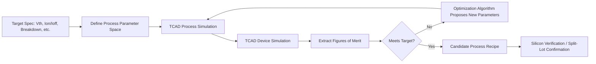
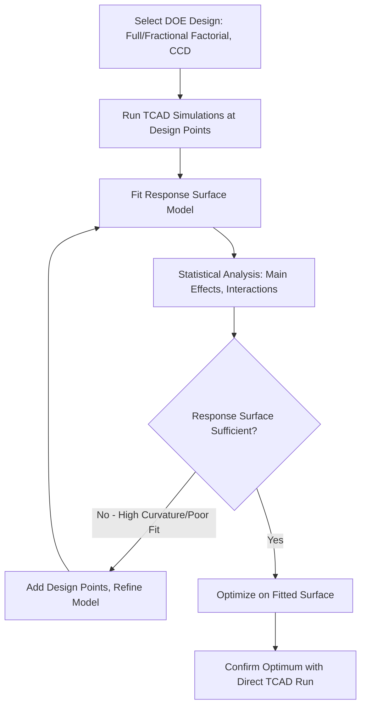
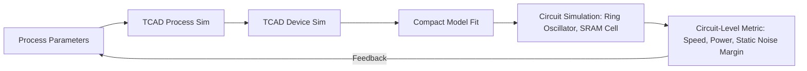

## Simulation Driven Process Optimization

### Overview

Simulation-driven process optimization uses TCAD process and device simulation, coupled with systematic experimental-design and optimization methodologies, to identify fabrication process parameters (implant doses, anneal schedules, film thicknesses, etch times) that maximize a target device or circuit metric — without requiring an exhaustive, costly campaign of physical wafer splits. It represents the practical application layer that sits on top of the process/device simulation capabilities themselves, turning "can we simulate this structure" into "what is the best process recipe for this structure."

### Position in the TCAD-Driven Development Flow

### Why Simulation-Driven Optimization Over Pure Experimentation

A physical wafer split (fabricating multiple lots with varied process conditions) is expensive and slow — typically weeks of fab cycle time per iteration, with material and tool-time costs scaling with the number of split conditions. Simulation-driven optimization instead explores the parameter space computationally, reserving physical fabrication for confirmation of the simulation-selected optimum (or a small number of top candidates).

**Key Points**

- The approach fundamentally trades fab cycle time and material cost against simulation compute time and model calibration accuracy
- The value proposition depends entirely on simulation model fidelity: an optimization run against a poorly calibrated TCAD deck will converge to an incorrect "optimum," so pre-existing model calibration (per the calibration practices described in process/device simulation fundamentals) is a prerequisite, not optional
- [Inference] Because model calibration accuracy is the binding constraint on optimization validity, teams typically restrict simulation-driven exploration to parameter ranges reasonably close to previously calibrated/validated conditions, extrapolating cautiously rather than trusting simulation accuracy far outside the calibration envelope

### Design of Experiments (DOE) Methodology

DOE provides the statistical framework for efficiently sampling a multi-dimensional process parameter space rather than exhaustively simulating every combination.

#### Full Factorial vs. Fractional Factorial

- **Full factorial**: every combination of every parameter level is simulated — exhaustive but combinatorially expensive; a study with 5 parameters at 3 levels each requires $3^5 = 243$ simulation runs
- **Fractional factorial**: a carefully chosen subset of the full factorial matrix, exploiting the fact that higher-order parameter interactions are usually negligible, dramatically reducing required runs while still estimating main effects and low-order interactions
- **Response Surface Methodology (RSM)**: uses designs such as Central Composite Design (CCD) or Box-Behnken to fit a quadratic (or higher-order) response surface model, enabling gradient-based optimization on the fitted surface rather than the (expensive) simulator directly

#### Latin Hypercube Sampling (LHS)

For higher-dimensional parameter spaces (many process variables simultaneously), **Latin Hypercube Sampling** provides space-filling sample distribution across the full parameter range with fewer runs than a full factorial grid, commonly used as the sampling basis for building surrogate/metamodel-based optimization.

### Optimization Algorithms

Once a sampling strategy has generated data (or a response surface/surrogate model is available), an optimization algorithm searches for parameter combinations meeting the target specification:

- **Gradient-based methods** (steepest descent, Levenberg-Marquardt): efficient when the response surface is smooth and reasonably well-behaved, common for local refinement around a promising region
- **Genetic algorithms / evolutionary optimization**: effective for multi-modal, non-smooth, or discontinuous response landscapes (common when combining process and device physics with sharp transitions, e.g., threshold behaviors), at the cost of requiring many more function evaluations
- **Simulated annealing**: useful for escaping local optima in rugged response landscapes
- **Bayesian optimization / surrogate-model-based optimization**: builds a probabilistic surrogate model (commonly Gaussian Process regression) of the simulator's response, using an acquisition function to intelligently select the next simulation point that best balances exploration (uncertain regions) and exploitation (regions near the current best) — particularly valuable when each TCAD simulation run is expensive, since Bayesian optimization is explicitly designed to minimize the number of expensive function evaluations needed to converge

**Example**

Optimizing an anneal temperature-time pair to hit a target junction depth $x_j$ while maximizing dopant activation (minimizing sheet resistance $R_s$) is a two-objective problem: higher temperature/longer time increases activation but also increases diffusion (deepening $x_j$ beyond target). A Bayesian optimization loop would propose a handful of temperature-time combinations, run TCAD process simulation for each, evaluate both objectives, and iteratively refine toward the Pareto-optimal tradeoff frontier.

### Multi-Objective Optimization and Pareto Fronts

Real process optimization problems rarely have a single objective — typically several competing figures of merit must be balanced simultaneously:

- On-current ($I_{on}$) vs. off-current/leakage ($I_{off}$)
- Junction depth vs. dopant activation (sheet resistance)
- Gate oxide thickness vs. gate leakage vs. drive current
- Process margin/robustness vs. nominal performance

Rather than collapsing these into a single weighted-sum objective (which requires arbitrarily choosing relative weights), multi-objective optimization algorithms (e.g., NSGA-II, a widely used genetic algorithm variant for multi-objective problems) identify the **Pareto front** — the set of solutions where no objective can be improved without degrading another — allowing the process engineer to select a final operating point based on engineering judgment among genuinely non-dominated tradeoffs.

$$\text{Pareto-optimal: } \nexists\, x' \text{ such that } f_i(x') \leq f_i(x)\ \forall i \text{ and } f_j(x') < f_j(x) \text{ for some } j$$

### Sensitivity Analysis

Before or alongside optimization, sensitivity analysis identifies which process parameters most strongly influence the target outcome — essential for both prioritizing tight process control on high-sensitivity parameters and reducing the effective dimensionality of the optimization problem.

- **Local sensitivity (One-Factor-At-a-Time, OFAT)**: perturbs each parameter individually around a nominal point — simple but does not capture parameter interactions
- **Global sensitivity analysis (e.g., Sobol indices)**: decomposes output variance into contributions from individual parameters and their interactions across the full parameter space, providing a more complete picture than local/OFAT analysis, particularly important when parameter interactions are physically significant (e.g., implant dose and anneal temperature jointly determining activation and diffusion)

### Process Window and Robustness Optimization

Beyond finding a single nominal optimum, robust process optimization explicitly accounts for manufacturing variability (tool-to-tool, run-to-run, wafer-to-wafer variation in temperature, dose, timing):

- **Process window analysis**: determines the range of each process parameter over which the target specification is still met, given expected variation in all other parameters simultaneously
- **Six Sigma / robust design (Taguchi methods)**: explicitly optimizes for insensitivity to parameter noise, not just nominal-condition performance — a process recipe with a slightly worse nominal result but much lower sensitivity to realistic process variation may yield a higher-performing, higher-yielding population of actual manufactured devices than a "sharper" nominal optimum that is highly variation-sensitive

[Inference] Given that yield and parametric spread typically matter more to overall manufacturing economics than peak nominal device performance, mature simulation-driven optimization workflows generally weight robustness-to-variation at least as heavily as nominal figure-of-merit optimization, particularly for high-volume manufacturing processes as opposed to research/exploratory device development.

### Illustrative Optimization Loop with Surrogate Model (svg_diagram)

<svg xmlns="http://www.w3.org/2000/svg" viewBox="0 0 640 320" font-family="sans-serif">
<text x="320" y="22" text-anchor="middle" font-size="15" font-weight="bold">Bayesian Optimization Loop for Process Recipe (svg_diagram)</text>
<rect x="40" y="60" width="140" height="60" rx="8" fill="#e3f2fd" stroke="#1f6feb" stroke-width="1.5" />
<text x="110" y="95" text-anchor="middle" font-size="11">Initial DOE Sample Points</text>
<rect x="250" y="60" width="140" height="60" rx="8" fill="#e8f5e9" stroke="#2e7d32" stroke-width="1.5" />
<text x="320" y="88" text-anchor="middle" font-size="11">Run TCAD</text>
<text x="320" y="102" text-anchor="middle" font-size="11">Process + Device Sim</text>
<rect x="460" y="60" width="140" height="60" rx="8" fill="#fff3e0" stroke="#f57c00" stroke-width="1.5" />
<text x="530" y="88" text-anchor="middle" font-size="11">Update Gaussian</text>
<text x="530" y="102" text-anchor="middle" font-size="11">Process Surrogate</text>
<rect x="250" y="190" width="140" height="60" rx="8" fill="#fce4ec" stroke="#c2185b" stroke-width="1.5" />
<text x="320" y="215" text-anchor="middle" font-size="11">Acquisition Function</text>
<text x="320" y="229" text-anchor="middle" font-size="11">Selects Next Point</text>
<rect x="460" y="190" width="140" height="60" rx="8" fill="#ede7f6" stroke="#5e35b1" stroke-width="1.5" />
<text x="530" y="215" text-anchor="middle" font-size="11">Converged?</text>
<text x="530" y="229" text-anchor="middle" font-size="11">Check Target Spec</text>
<line x1="180" y1="90" x2="250" y2="90" stroke="black" stroke-width="1.3" marker-end="url(#arrow1)" />
<line x1="390" y1="90" x2="460" y2="90" stroke="black" stroke-width="1.3" marker-end="url(#arrow1)" />
<line x1="530" y1="120" x2="530" y2="190" stroke="black" stroke-width="1.3" marker-end="url(#arrow1)" />
<line x1="460" y1="220" x2="390" y2="220" stroke="black" stroke-width="1.3" marker-end="url(#arrow1)" />
<line x1="320" y1="190" x2="320" y2="120" stroke="black" stroke-width="1.3" stroke-dasharray="5,3" marker-end="url(#arrow1)" />
<text x="335" y="155" font-size="9" fill="#555">loop until converged</text>
</svg>

### Coupled Process-Device-Circuit Optimization

Advanced simulation-driven optimization increasingly spans multiple abstraction levels simultaneously rather than optimizing process parameters against device-level figures of merit alone:

This closes the loop all the way to circuit-relevant metrics (e.g., ring-oscillator delay, SRAM static noise margin) rather than stopping at device-level $I_{on}/I_{off}$, since the ultimate design target is typically circuit or product performance, and device-level optima do not always translate linearly to circuit-level optima once parasitic and matching effects are included. [Unverified] The degree to which a given organization's TCAD-to-circuit optimization flow is fully automated versus manually staged (engineers reviewing intermediate device results before proceeding to circuit-level simulation) varies substantially by organization and is not standardized industry-wide.

### Verification Against Silicon

Simulation-driven optimization output is a **candidate recipe**, not a final qualified process — physical confirmation remains necessary because:

- No TCAD model captures every physical effect with perfect fidelity (see limitations discussed under process and device simulation fundamentals)
- Tool-specific, fab-specific equipment behavior (chamber-to-chamber variation, real ambient purity) is imperfectly represented by generic physical models
- Statistical/yield-relevant behavior (rare defect events, tail distributions) is generally outside the scope of deterministic TCAD simulation

A typical practice is to fabricate a small confirmation split around the simulation-predicted optimum (rather than a full exploratory split matrix), substantially reducing the physical experimentation burden while retaining silicon validation as the final gate.

### Practical Considerations and Limitations

- Optimization quality is bounded by simulation model calibration quality — "garbage in, garbage out" applies directly; an uncalibrated or poorly calibrated TCAD deck can confidently converge to a wrong answer
- High-dimensional parameter spaces (many simultaneous process knobs) suffer from the curse of dimensionality — DOE and surrogate modeling techniques mitigate but do not eliminate this, and practical projects generally restrict the actively-optimized parameter set to the handful of variables with the highest sensitivity (informed by prior sensitivity analysis)
- Computational cost remains non-trivial for full 3D coupled process-device simulations; simulation-driven optimization workflows often rely on reduced-dimensionality models (1D/2D process approximations where physically justified) for the bulk of the optimization search, reserving full 3D simulation for final candidate confirmation

**Related Topics**

- Response Surface Methodology and Central Composite Design in depth
- Bayesian optimization and Gaussian Process surrogate modeling
- Multi-objective (Pareto) optimization algorithms (NSGA-II and variants)
- Global sensitivity analysis (Sobol indices) for process parameter ranking
- Process window analysis and Taguchi robust design methods
- Coupled TCAD-to-compact-model-to-circuit optimization flows
- Statistical process control and yield learning feedback loops