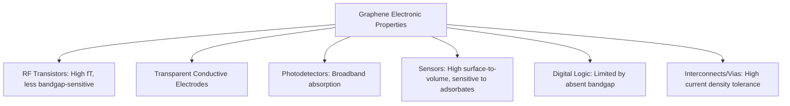

## Graphene Electronic Properties

### Overview

Graphene is a single atomic layer of carbon atoms arranged in a two-dimensional hexagonal (honeycomb) lattice, and its electronic properties are qualitatively distinct from conventional bulk semiconductors due to its unique band structure. Rather than the parabolic energy-momentum dispersion characteristic of silicon and most semiconductors, graphene's charge carriers behave as massless relativistic particles described by the Dirac equation, giving rise to exceptionally high carrier mobility, ambipolar transport, and other properties of significant interest for post-CMOS electronic and optoelectronic devices.

### Crystal Structure and Band Structure Origin

Graphene's honeycomb lattice consists of two interpenetrating triangular sublattices (commonly labeled A and B), each carbon atom $sp^2$-hybridized, forming strong in-plane $\sigma$-bonds with three neighbors and contributing one unpaired electron to a delocalized $\pi$-system perpendicular to the sheet. It is this $\pi$-electron system that governs graphene's electronic transport properties.

Using a **tight-binding approximation** considering nearest-neighbor hopping between the two sublattices, the electronic dispersion relation near the corners of the hexagonal Brillouin zone (the **K and K' points**, also called **Dirac points**) is:

$$E(\vec{k}) = \pm \hbar v_F |\vec{k} - \vec{K}|$$

where $v_F \approx 10^6\ \text{m/s}$ is the **Fermi velocity** (roughly 1/300th the speed of light) and $\vec{k}$ is measured relative to the Dirac point $\vec{K}$. This linear (rather than quadratic) dispersion is the defining feature of graphene's low-energy band structure.

**Key Points**

- The linear dispersion relation is mathematically identical in form to the relativistic energy-momentum relation for massless particles, $E = pc$, which is why graphene's low-energy charge carriers are described as behaving like massless Dirac fermions, with the Fermi velocity $v_F$ playing the role of the speed of light in this analogy
- Graphene is a **zero-bandgap semiconductor** (or semimetal): the conduction and valence bands touch exactly at the Dirac points with no energy gap, in contrast to conventional semiconductors with a finite bandgap separating the bands
- The absence of a bandgap is the central practical limitation for graphene as a replacement channel material in digital logic transistors, since it prevents achieving a low off-state current in transistor structures without additional bandgap-engineering (see Limitations below)

### Illustrative Band Structure Near the Dirac Point (svg_diagram)

<svg xmlns="http://www.w3.org/2000/svg" viewBox="0 0 560 340" font-family="sans-serif">
<text x="280" y="24" text-anchor="middle" font-size="15" font-weight="bold">Graphene Dirac Cone vs. Parabolic Semiconductor Band (svg_diagram)</text>
<line x1="120" y1="290" x2="120" y2="50" stroke="black" stroke-width="1.3" />
<line x1="40" y1="170" x2="200" y2="170" stroke="black" stroke-width="1.3" />
<text x="120" y="310" text-anchor="middle" font-size="12">Graphene</text>
<text x="20" y="60" font-size="10">E</text>
<text x="205" y="175" font-size="10">k</text>
<line x1="60" y1="230" x2="120" y2="170" stroke="#1f6feb" stroke-width="2.2" />
<line x1="120" y1="170" x2="180" y2="230" stroke="#1f6feb" stroke-width="2.2" />
<line x1="60" y1="110" x2="120" y2="170" stroke="#c62828" stroke-width="2.2" />
<line x1="120" y1="170" x2="180" y2="110" stroke="#c62828" stroke-width="2.2" />
<circle cx="120" cy="170" r="3" fill="black" />
<text x="120" y="155" text-anchor="middle" font-size="9">Dirac point, $E_F$</text>
<text x="60" y="100" font-size="9" fill="#c62828">Conduction</text>
<text x="65" y="245" font-size="9" fill="#1f6feb">Valence</text>
<line x1="400" y1="290" x2="400" y2="50" stroke="black" stroke-width="1.3" />
<line x1="320" y1="170" x2="480" y2="170" stroke="black" stroke-width="1.3" />
<text x="400" y="310" text-anchor="middle" font-size="12">Conventional Semiconductor</text>
<text x="485" y="175" font-size="10">k</text>
<path d="M 340 240 Q 400 190, 400 165" fill="none" stroke="#1f6feb" stroke-width="2.2" />
<path d="M 400 165 Q 400 190, 460 240" fill="none" stroke="#1f6feb" stroke-width="2.2" />
<path d="M 340 100 Q 400 130, 400 120" fill="none" stroke="#c62828" stroke-width="2.2" />
<path d="M 400 120 Q 400 130, 460 100" fill="none" stroke="#c62828" stroke-width="2.2" />
<line x1="400" y1="165" x2="400" y2="120" stroke="#555" stroke-width="1" stroke-dasharray="3,3" />
<text x="415" y="145" font-size="9" fill="#555">$E_g$</text>
<text x="340" y="90" font-size="9" fill="#c62828">Conduction</text>
<text x="345" y="255" font-size="9" fill="#1f6feb">Valence</text>
</svg>

### Carrier Transport Properties

#### High Carrier Mobility

Graphene exhibits exceptionally high room-temperature carrier mobility, with suspended or high-quality substrate-supported samples reporting values substantially exceeding conventional silicon channel mobility. [Unverified] Reported mobility figures vary considerably (commonly cited ranges span roughly $10^4$ to over $10^5\ \text{cm}^2/\text{V·s}$) depending strongly on sample quality, substrate choice, temperature, and measurement methodology, so any single numerical figure should be treated as sample- and condition-dependent rather than a fixed material constant.

Key factors limiting real-world (as opposed to intrinsic) mobility:

- **Substrate-induced scattering**: charged impurities and surface roughness in the underlying substrate (commonly $SiO_2$) scatter carriers, substantially reducing mobility relative to suspended/freestanding graphene
- **Phonon scattering**: both graphene's own acoustic phonons and remote substrate phonons contribute to scattering, particularly at elevated temperature
- **Substrate engineering**: encapsulation in hexagonal boron nitride (h-BN), a lattice-matched insulating 2D material with minimal charged impurities and a very flat surface, substantially improves mobility compared to $SiO_2$-supported graphene, since h-BN removes much of the substrate-induced scattering present with oxide substrates

#### Ambipolar Field Effect

Because graphene has no bandgap, applying a gate voltage does not turn the channel fully "off" as in a conventional MOSFET — instead, it shifts the Fermi level continuously through the Dirac point, transitioning smoothly from hole-dominated to electron-dominated conduction:

$$\sigma(V_G) \propto n(V_G) \cdot e\mu$$

where carrier density $n$ is tuned by gate voltage via the induced charge $n = C_{ox}(V_G - V_{Dirac})/e$, and conductivity reaches a **minimum (not zero)** at the Dirac point due to the presence of residual carriers from electron-hole puddles (spatial charge inhomogeneity, largely substrate-disorder-induced).

**Example**

A graphene field-effect transistor's transfer characteristic ($I_{DS}$ vs. $V_{GS}$) shows a characteristic V-shaped (or "Dirac point") curve: current decreases as gate voltage approaches the charge-neutrality point from either the hole side or the electron side, reaches a finite minimum (rather than dropping to near-zero as in a conventional MOSFET's off state), then rises again as the opposite carrier type dominates.

### Density of States and Quantum Capacitance

The linear dispersion relation produces a density of states that varies linearly with energy near the Dirac point, in contrast to the constant 2D density of states of a conventional parabolic-band 2D electron gas:

$$g(E) = \frac{2|E|}{\pi \hbar^2 v_F^2}$$

This vanishing density of states at the Dirac point itself (zero at $E=0$) gives rise to a finite **quantum capacitance** contribution that becomes significant relative to the geometric (oxide) capacitance in graphene-channel devices with thin gate dielectrics, an effect that must be accounted for in accurate compact/device modeling of graphene transistors — unlike conventional MOSFETs where quantum capacitance effects are typically a smaller correction.

### Anomalous (Half-Integer) Quantum Hall Effect

Under strong magnetic field and low temperature, graphene exhibits a distinctive **half-integer quantum Hall effect**, with Hall conductivity plateaus at:

$$\sigma_{xy} = \pm 4\left(n + \frac{1}{2}\right)\frac{e^2}{h}, \quad n = 0, 1, 2, \dots$$

rather than the integer plateaus ($\sigma_{xy} = n \cdot e^2/h$) seen in conventional 2D electron gas systems. This distinctive shift is a direct consequence of the **Berry phase** acquired by Dirac fermions circulating in a magnetic field and is widely regarded as one of the definitive experimental signatures confirming graphene's massless Dirac fermion behavior, historically significant in establishing graphene's unique electronic character following its initial experimental isolation.

### Bandgap Engineering Approaches

Because pristine graphene's absence of a bandgap prevents effective transistor switching (poor on/off ratio), multiple strategies have been explored to induce or open a usable bandgap:

- **Graphene nanoribbons (GNRs)**: confining graphene to narrow ribbon widths opens a bandgap through quantum confinement, with bandgap magnitude roughly inversely proportional to ribbon width; edge structure (armchair vs. zigzag) additionally affects electronic character
- **Bilayer graphene with perpendicular electric field**: applying a transverse displacement field across AB-stacked bilayer graphene breaks inversion symmetry and opens a tunable bandgap, with gap magnitude controllable by the applied field strength
- **Strain engineering**: mechanical strain can modify graphene's band structure and, in some configurations, induce pseudo-magnetic field effects, though achieving a robust, uniform, manufacturable bandgap via strain alone remains challenging
- **Chemical functionalization**: hydrogenation (producing "graphane") or fluorination can open a bandgap by disrupting the $sp^2$ conjugation, at the cost of degrading the exceptional mobility that motivates graphene's use in the first place

[Inference] Because most bandgap-opening strategies trade away some of graphene's signature high mobility or introduce fabrication complexity/variability (precise nanoribbon width control, uniform bilayer stacking and gating, controlled functionalization), no single approach has yet displaced conventional semiconductor channels for mainstream digital logic, which is consistent with graphene's practical adoption to date concentrating more heavily in RF, sensing, and other applications where the bandgap constraint is less limiting than for digital switching (see Applications below).

### Practical Device-Relevant Properties

- **High thermal conductivity**: graphene's in-plane thermal conductivity is notably high among known materials, relevant for thermal management in high-power-density device applications
- **Mechanical strength combined with flexibility**: graphene's high mechanical strength alongside flexibility supports interest in flexible/wearable electronics applications
- **Optical transparency with finite absorption**: monolayer graphene absorbs a small, well-defined, thickness-independent fraction of incident visible light (a consequence of its linear dispersion and the fine structure constant), relevant for transparent conductor and photodetector applications
- **High current-carrying capacity**: graphene has demonstrated tolerance to very high current densities before electromigration-type failure, of interest for interconnect and high-power RF applications

### Application-Relevant Contexts

- **RF/analog electronics**: since RF transistor figures of merit emphasize cutoff frequency and transconductance rather than a hard digital on/off ratio, the absence of a bandgap is less limiting than for digital logic, making graphene RF transistors a more actively pursued application than graphene digital logic
- **Transparent conductive electrodes**: potential alternative to indium tin oxide (ITO) for touchscreens/displays, motivated by graphene's combination of optical transparency and electrical conductivity, alongside mechanical flexibility ITO lacks
- **Photodetectors and optoelectronics**: broadband optical absorption (not limited to a specific bandgap-defined wavelength range, unlike conventional semiconductor photodetectors) is of interest for broadband detection applications
- **Chemical/biological sensing**: graphene's entirely surface-exposed atomic structure makes its conductivity highly sensitive to adsorbed molecules, of interest for high-sensitivity sensor applications

### Comparison with Conventional Semiconductor Channel Materials

| Property | Graphene | Silicon (bulk) |
| --- | --- | --- |
| Bandgap | None (or engineered, typically small) | ~1.12 eV (indirect) |
| Carrier dispersion | Linear (Dirac-like) | Parabolic (effective mass) |
| Room-temp mobility (typical/reported) | Very high, substrate-dependent | Moderate, well-characterized |
| On/off ratio (as digital switch) | Poor without bandgap engineering | Excellent |
| Dimensionality | Strictly 2D (single atomic layer) | Bulk (3D), with 2D channel in inversion layer |

[Unverified] Specific numerical mobility and performance comparisons depend heavily on measurement conditions, device geometry, and fabrication quality for both materials; the table reflects qualitative, well-established distinctions rather than precise benchmarked figures.

### Limitations and Open Challenges

- **Absence of intrinsic bandgap**: the central obstacle for graphene as a mainstream digital logic channel material, as detailed above
- **Substrate and interface quality sensitivity**: graphene's electronic properties are strongly influenced by its immediate environment, since every atom is a surface atom — charged impurities, substrate roughness, and adsorbates all directly affect transport, making reproducible, high-yield device fabrication more sensitive to process/environmental control than for bulk semiconductor channels
- **Wafer-scale synthesis and transfer challenges**: achieving large-area, high-quality, defect-free graphene with reproducible electronic properties at a scale and cost compatible with volume semiconductor manufacturing remains an active area of process development, distinct from the electronic-properties physics itself but a practical gating factor for commercial adoption
- **Contact resistance**: forming low-resistance ohmic contacts to graphene has historically been more challenging than for conventional 3D semiconductors, given graphene's 2D nature and the physics of metal-graphene interface charge transfer

**Related Topics**

- Graphene synthesis methods (CVD growth, mechanical exfoliation, epitaxial growth on SiC)
- Graphene nanoribbon fabrication and edge-state engineering
- Bilayer and few-layer graphene stacking (AB-stacking, twisted bilayer/magic-angle graphene)
- Transition metal dichalcogenides (TMDs) as bandgap-possessing 2D semiconductor alternatives
- Van der Waals heterostructures and h-BN encapsulation techniques
- Graphene-based RF transistor design and figures of merit
- Quantum Hall effect and Berry phase physics in 2D Dirac materials