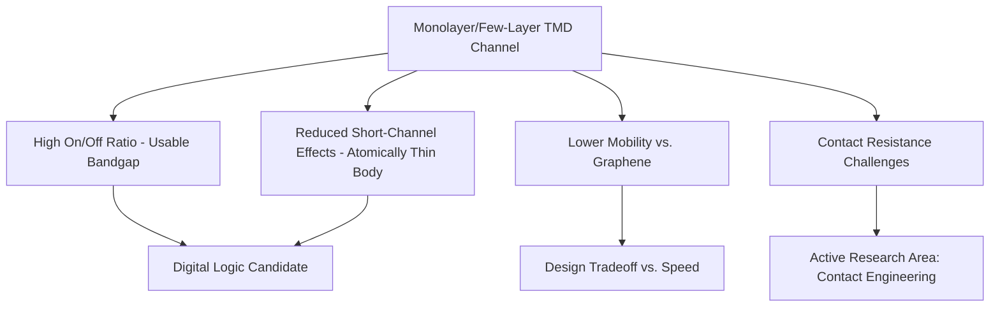

## Transition Metal Dichalcogenide Semiconductors

### Overview

Transition metal dichalcogenides (TMDs) are a family of layered materials with the general formula $MX_2$, where $M$ is a transition metal (commonly Mo, W) and $X$ is a chalcogen (S, Se, or Te). Unlike graphene, many monolayer TMDs are genuine semiconductors with sizable, tunable bandgaps, positioning them as a leading class of two-dimensional materials for post-silicon transistor channels, optoelectronics, and heterostructure device engineering — directly addressing graphene's central limitation (absence of a bandgap) while retaining atomically thin, dangling-bond-free 2D form factors.

### Structure and Common Materials

Each TMD monolayer consists of a plane of metal atoms sandwiched between two planes of chalcogen atoms in an X-M-X trilayer, held together internally by strong covalent bonds and stacked into bulk crystals via weak van der Waals forces between layers — the same weak interlayer bonding that permits mechanical exfoliation down to monolayers, analogous to graphite-to-graphene exfoliation.

**Commonly studied semiconducting TMDs:**

| Material | Typical Monolayer Bandgap Character | Notes |
| --- | --- | --- |
| $MoS_2$ | Direct (monolayer) | Most widely studied TMD; benchmark material for TMD FETs |
| $WS_2$ | Direct (monolayer) | Similar behavior to $MoS_2$, generally higher mobility reported |
| $MoSe_2$ | Direct (monolayer) | Smaller bandgap than $MoS_2$ |
| $WSe_2$ | Direct (monolayer) | Notable for ambipolar transport behavior |

[Unverified] Specific numerical bandgap values and mobility figures vary across the literature depending on synthesis method, substrate, and measurement technique; the table reflects broadly agreed-upon qualitative behavior rather than precise benchmark numbers, which should be checked against current primary literature for any quantitative design use.

### Crystal Phases (Polytypes)

TMDs commonly occur in multiple structural phases with distinct electronic character, and phase engineering is itself an active area of device-relevant research:

- **2H phase (trigonal prismatic)**: the thermodynamically stable, semiconducting phase for most Mo- and W-based TMDs, and the phase of primary interest for transistor channel applications
- **1T phase (octahedral)**: typically metallic, of interest for forming low-resistance contacts to 2H-phase semiconducting regions within the same material (a phase-engineered contact strategy distinct from using an external metal)
- **1T' (distorted 1T)**: a semi-metallic/topologically distinct variant seen in some TMDs (e.g., $WTe_2$), relevant to topological materials research rather than conventional transistor applications

### The Direct-to-Indirect Bandgap Transition

One of the most electronically significant features of many semiconducting TMDs is a **layer-number-dependent bandgap nature**:

- **Bulk and few-layer** $MoS_2$ (and similar TMDs) have an **indirect** bandgap
- **Monolayer** $MoS_2$ transitions to a **direct** bandgap at the K-point of the Brillouin zone

This transition arises from interlayer coupling effects on the conduction and valence band edges that are present in multilayer material but absent once the material is thinned to a single layer, and it has substantial practical consequence: direct-gap semiconductors exhibit vastly more efficient light absorption and emission (radiative recombination does not require phonon-assisted momentum conservation), making **monolayer** TMDs of particular interest for optoelectronic applications (photodetectors, LEDs, photoluminescence-based sensing) in a way that bulk/few-layer material is not.

**Key Points**

- This layer-dependence is a defining and distinctive characteristic of TMDs relative to most conventional 3D semiconductors, whose bandgap character does not shift with simple layer-count/thickness reduction in this manner
- Photoluminescence intensity is commonly used experimentally as a diagnostic signature to confirm monolayer thickness, since the direct-gap monolayer emits dramatically more strongly than thicker, indirect-gap samples

### Illustrative Direct/Indirect Bandgap Comparison (svg_diagram)

<svg xmlns="http://www.w3.org/2000/svg" viewBox="0 0 600 320" font-family="sans-serif">
<text x="300" y="22" text-anchor="middle" font-size="15" font-weight="bold">Monolayer (Direct) vs. Bulk (Indirect) TMD Band Structure (svg_diagram)</text>
<line x1="120" y1="270" x2="120" y2="50" stroke="black" stroke-width="1.3" />
<line x1="40" y1="170" x2="200" y2="170" stroke="black" stroke-width="1.3" />
<text x="120" y="290" text-anchor="middle" font-size="12">Monolayer: Direct Gap</text>
<path d="M 70 230 Q 120 195, 120 190" fill="none" stroke="#1f6feb" stroke-width="2.2" />
<path d="M 120 190 Q 120 195, 170 230" fill="none" stroke="#1f6feb" stroke-width="2.2" />
<path d="M 70 110 Q 120 130, 120 115" fill="none" stroke="#c62828" stroke-width="2.2" />
<path d="M 120 115 Q 120 130, 170 110" fill="none" stroke="#c62828" stroke-width="2.2" />
<line x1="120" y1="190" x2="120" y2="115" stroke="#2e7d32" stroke-width="2" stroke-dasharray="4,3" />
<text x="135" y="155" font-size="9" fill="#2e7d32">Direct: same k</text>
<line x1="400" y1="270" x2="400" y2="50" stroke="black" stroke-width="1.3" />
<line x1="320" y1="170" x2="480" y2="170" stroke="black" stroke-width="1.3" />
<text x="400" y="290" text-anchor="middle" font-size="12">Bulk: Indirect Gap</text>
<path d="M 350 230 Q 400 195, 400 190" fill="none" stroke="#1f6feb" stroke-width="2.2" />
<path d="M 400 190 Q 400 195, 450 230" fill="none" stroke="#1f6feb" stroke-width="2.2" />
<path d="M 350 130 Q 375 90, 400 130" fill="none" stroke="#c62828" stroke-width="2.2" />
<path d="M 400 130 Q 425 90, 450 130" fill="none" stroke="#c62828" stroke-width="2.2" />
<line x1="400" y1="190" x2="375" y2="90" stroke="#f57c00" stroke-width="2" stroke-dasharray="4,3" />
<text x="410" y="140" font-size="9" fill="#f57c00">Indirect: different k</text>
</svg>

### Electronic Transport Properties

- **Moderate carrier mobility**: TMD monolayers generally exhibit lower carrier mobility than graphene (a direct consequence of their finite effective mass, since TMDs have a conventional parabolic-like band structure near the band edges rather than graphene's massless Dirac dispersion), but this tradeoff comes with the practical benefit of a usable bandgap and correspondingly high on/off switching ratio for transistor applications
- **n-type vs. p-type behavior**: different TMDs and different contact metal choices favor different dominant carrier polarities — $MoS_2$ is commonly reported as predominantly n-type in typical device configurations, while $WSe_2$ has been demonstrated with strong ambipolar (both n- and p-type) behavior depending on contact engineering and gating conditions
- **Contact resistance (Schottky barrier) challenges**: forming low-resistance ohmic contacts to monolayer TMD semiconductors has historically been a significant device engineering challenge, since Fermi-level pinning at the metal-TMD interface often produces a Schottky barrier that limits achievable on-current — an active area of research involving phase-engineered contacts (1T-phase regions), specific low-work-function metal choices, and van der Waals contact integration strategies
- **Valley polarization and spin-valley coupling**: in monolayer TMDs, strong spin-orbit coupling combined with broken inversion symmetry produces coupled spin and valley (K vs. K') degrees of freedom, allowing selective optical excitation of one valley using circularly polarized light — a property of significant interest for valleytronic and spintronic device concepts distinct from conventional charge-based electronics

### Transistor Device Considerations

**Key Points**

- The atomically thin body of a TMD channel provides excellent electrostatic control by the gate, since the channel thickness itself is a fundamental limit on short-channel effects — a monolayer channel body is effectively as thin a body as is physically achievable, of significant interest as silicon-based FinFET/GAA scaling approaches fundamental short-channel control limits
- Because TMDs possess a genuine, sizable bandgap (unlike pristine graphene), they can, in principle, achieve high on/off current ratios suitable for digital logic switching without requiring the bandgap-engineering workarounds graphene needs
- [Inference] The combination of usable bandgap and ultimate body-thickness scaling is the primary reason TMDs (rather than graphene) are generally regarded as the more direct 2D-material candidate for extending transistor scaling beyond silicon FinFET/GAA limits, even though TMD mobility and contact resistance currently lag behind mature silicon technology

### Heterostructures and van der Waals Stacking

Because TMD layers (and other 2D materials such as graphene and h-BN) interact only via weak van der Waals forces, they can be stacked in arbitrary combinations to form **van der Waals heterostructures** with engineered electronic properties not available in any single constituent material:

- **Type-II band alignment heterobilayers** (e.g., $MoS_2$/$WSe_2$): can spatially separate electrons and holes into different layers, of interest for interlayer exciton physics and certain photovoltaic/optoelectronic device concepts
- **Moiré superlattice effects**: stacking two TMD (or graphene) layers with a small twist angle or lattice mismatch produces a long-period moiré pattern that can dramatically modify the electronic structure, including flat-band physics and correlated-electron phenomena — an active frontier research area extending beyond conventional semiconductor device physics
- **Encapsulation with h-BN**: as with graphene, encapsulating TMD channels in hexagonal boron nitride reduces substrate-induced disorder and charged-impurity scattering, generally improving measured mobility and device performance consistency relative to bare oxide-substrate devices

### Synthesis and Fabrication Approaches

- **Mechanical exfoliation**: produces the highest-quality, lowest-defect-density flakes (historically the source material for most fundamental TMD physics studies) but yields small, non-uniform, randomly placed flakes unsuitable for wafer-scale manufacturing
- **Chemical Vapor Deposition (CVD)**: the primary pathway toward wafer-scale, more uniform TMD growth, though [Unverified] achieving CVD-grown TMD quality (grain size, defect density, uniformity) fully comparable to exfoliated flakes at production-relevant wafer scale remains an active area of ongoing materials development rather than a fully mature, standardized process
- **Metal-organic chemical vapor deposition (MOCVD) and atomic layer deposition (ALD)-adjacent approaches**: explored specifically for improved wafer-scale uniformity and integration compatibility with existing semiconductor fabrication infrastructure

### Comparison with Graphene and Conventional Silicon

| Property | TMDs (e.g., $MoS_2$) | Graphene | Silicon (bulk) |
| --- | --- | --- | --- |
| Bandgap | Present, moderate (direct in monolayer) | None (or engineered) | ~1.12 eV (indirect) |
| Carrier mobility | Moderate | Very high | Moderate, mature |
| On/off ratio potential | High | Poor (without engineering) | Excellent |
| Body thickness scalability | Ultimate (monolayer) | Ultimate (monolayer) | Limited by 3D bulk/FinFET geometry |
| Contact resistance maturity | Active research challenge | Also challenging | Highly mature |

[Unverified] As with the graphene comparison, precise quantitative mobility and performance figures are highly dependent on specific material, synthesis method, and measurement conditions; the table reflects qualitative, broadly-supported relative positioning rather than fixed benchmark values.

### Applications Beyond Digital Logic

- **Photodetectors and photovoltaics**: direct bandgap in monolayer form, combined with strong light-matter interaction relative to material thickness, supports interest in ultrathin photodetector and solar energy conversion applications
- **Light-emitting devices**: direct bandgap enables efficient electroluminescence in monolayer TMD-based LED concepts
- **Flexible and transparent electronics**: atomically thin, mechanically flexible TMD layers are of interest for flexible display backplane and wearable electronics applications, an application space shared conceptually with graphene
- **Valleytronic and spintronic devices**: exploiting the spin-valley coupling discussed above for information encoding schemes distinct from conventional charge-based logic

### Limitations and Open Challenges

- **Mobility and contact resistance**: still generally below mature silicon technology figures for equivalent device metrics, representing the primary performance gap that must close for TMD-channel digital logic to become commercially competitive rather than a research curiosity
- **Wafer-scale synthesis uniformity**: growing large-area, uniform, low-defect-density, reproducible monolayer or controlled few-layer TMD material compatible with existing semiconductor manufacturing infrastructure and cost structures remains a significant unresolved engineering challenge
- **Doping and threshold voltage control**: achieving precise, stable, reproducible doping control in atomically thin 2D semiconductors (analogous to well-established ion implantation and diffusion doping in bulk silicon) is considerably less mature, since conventional 3D doping techniques do not straightforwardly translate to a material that is, by definition, only one or a few atoms thick
- **Integration with existing CMOS process flows**: practical adoption requires compatibility with existing back-end and front-end-of-line process infrastructure, thermal budgets, and reliability qualification standards — an integration challenge distinct from, and generally larger than, the underlying materials physics itself

[Inference] Given the combination of unresolved contact resistance, doping control, and wafer-scale uniformity challenges, near-to-mid-term TMD adoption is more plausible in niche or heterogeneously-integrated applications (specialized sensors, optoelectronic components, or back-end-of-line-integrated auxiliary logic layered atop conventional silicon CMOS) than as a wholesale channel-material replacement for mainstream high-volume digital logic in the immediate term.

**Related Topics**

- $MoS_2$ field-effect transistor device physics and contact engineering strategies
- Van der Waals heterostructure design and moiré superlattice physics
- Valleytronics and spin-valley coupling in monolayer TMDs
- CVD growth optimization for wafer-scale 2D semiconductor synthesis
- Phase engineering (2H-to-1T transition) for low-resistance contact formation
- Comparison with graphene electronic properties and bandgap engineering approaches
- 2D material heterogeneous integration with silicon CMOS back-end-of-line processes