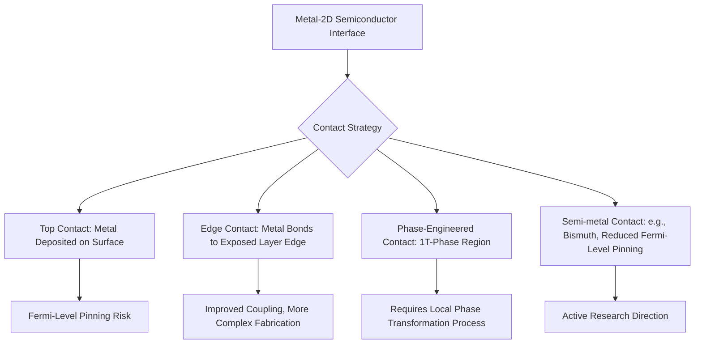
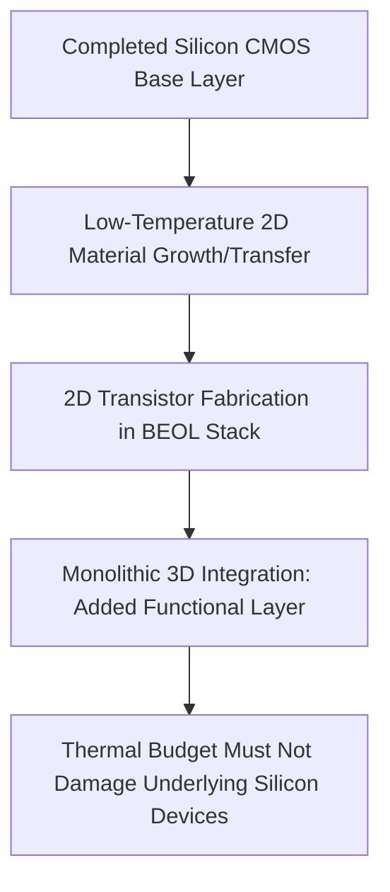

## 2D Material Transistor Integration Challenges

### Overview

While individual 2D materials (graphene, transition metal dichalcogenides, hexagonal boron nitride) exhibit compelling intrinsic electronic properties, translating these materials from laboratory-scale exfoliated-flake devices into manufacturable transistor technology compatible with existing or next-generation semiconductor fabrication requires overcoming a distinct and substantial set of integration challenges. These span materials synthesis, contact formation, gate stack engineering, doping, and process compatibility — collectively representing the gap between demonstrated device physics and volume-manufacturable technology.

### The Lab-to-Fab Gap

[Inference] Because most of the seminal 2D-material device physics results were obtained using mechanically exfoliated flakes — small, randomly placed, non-uniform samples selected individually under a microscope — the transition to wafer-scale, uniform, reproducible material is not a simple scaling exercise but requires re-solving many aspects of materials growth, contact formation, and process integration essentially from first principles for manufacturing-relevant conditions.

### Wafer-Scale Synthesis Challenges

#### Chemical Vapor Deposition (CVD) Limitations

CVD is the primary path toward wafer-scale 2D material growth, but faces several persistent challenges:

- **Grain boundary formation**: CVD growth typically nucleates at multiple points across a substrate, producing polycrystalline material with grain boundaries that degrade electronic transport (acting as scattering centers and potential leakage paths) relative to single-crystal exfoliated flakes
- **Layer number uniformity**: precise, uniform control of monolayer (or specific few-layer) thickness across a full wafer is significantly more difficult than achieving monolayer thickness in a small exfoliated flake, and thickness variations directly affect electronic properties (particularly critical for TMDs, given the direct-to-indirect bandgap transition's sensitivity to layer count)
- **Defect density**: sulfur/selenium vacancies (in TMDs) and other point defects introduced during CVD growth act as charge traps and scattering centers, generally degrading mobility and introducing hysteresis in transistor characteristics relative to exfoliated material
- **Substrate-dependent growth**: achieving high-quality direct growth on technologically relevant substrates (as opposed to specialized growth substrates that must then be followed by a transfer step) remains an active development area

#### Transfer-Process-Induced Damage

Since many 2D materials are grown on one substrate (chosen for growth quality) but need to be integrated onto another (chosen for device/circuit compatibility), a **transfer step** is frequently required:

- **Polymer residue contamination**: common transfer methods use a sacrificial polymer support layer (e.g., PMMA) that can leave residual contamination on the 2D material surface, degrading contact quality and introducing unintentional doping/charge trapping
- **Mechanical damage and wrinkling**: transfer processes can introduce tears, wrinkles, and bubbles, particularly problematic at wafer scale where uniform, defect-free transfer across a full wafer area is considerably harder than for a small flake
- **Alignment challenges**: for heterostructure devices requiring precise stacking of multiple 2D layers (or alignment to underlying pre-patterned structures), wafer-scale transfer alignment tolerances become a significant process engineering challenge distinct from the materials growth challenge itself

[Inference] Direct growth of 2D material on its final target substrate, avoiding a separate transfer step entirely, is generally viewed as a more manufacturing-compatible long-term direction than grow-then-transfer approaches, given that transfer-induced defects and contamination represent an additional, avoidable yield-loss mechanism; however, achieving high-quality direct growth on arbitrary target substrates (as opposed to specialized growth-optimized substrates) remains its own significant materials challenge.

### Contact Resistance

Forming low-resistance electrical contacts to atomically thin 2D semiconductors is one of the most persistent and heavily studied integration challenges, since contact resistance can dominate total device resistance in a way not typically seen in bulk 3D semiconductor devices with well-established, mature contact technology.

#### Origin of the Problem

- **Fermi-level pinning**: at a metal-2D semiconductor interface, interface states can pin the Schottky barrier height largely independent of the metal's nominal work function, meaning that simply choosing a metal with an "ideal" work function (as would be expected from simple Schottky-Mott theory) often does not yield the expected low-barrier ohmic contact in practice
- **Van der Waals gap**: because 2D materials interact with deposited metal contacts partly through van der Waals-like bonding rather than the strong covalent/metallic bonding at conventional 3D semiconductor-metal interfaces, the resulting interface can have different (and often less favorable) electronic coupling characteristics than a conventional ohmic contact
- **Limited contact area for edge contacts**: some contact geometries (contacting only the edge of a 2D flake, rather than its top surface) further constrain the effective contact area and current injection efficiency

#### Mitigation Strategies

- **Phase engineering**: locally converting the semiconducting phase (e.g., 2H) to a metallic phase (e.g., 1T) of the same TMD material directly beneath the contact region, forming a homojunction contact without introducing a dissimilar-material interface — conceptually elegant but requiring an additional local phase-transformation process step
- **Edge contacts**: contacting the exposed edge of a 2D layer (rather than only its top surface) has been demonstrated to improve contact quality in certain material systems, since edge bonding can provide more direct orbital overlap than van der Waals top-contact
- **Low-work-function or semi-metal contacts**: certain metal choices (including semi-metals such as bismuth in some reported TMD contact studies) have been explored specifically to reduce Fermi-level pinning effects
- **Doped contact regions**: heavily doping the 2D material locally beneath the contact (via chemical doping, substitutional doping, or charge-transfer doping techniques) to thin the effective Schottky barrier width and promote tunneling-dominated, effectively ohmic behavior

[Unverified] The relative effectiveness and manufacturing readiness of these various contact strategies differ considerably across specific material systems and are the subject of active, evolving research; no single approach has yet emerged as a universally adopted manufacturing standard analogous to silicide contact formation in conventional silicon CMOS.

### Gate Dielectric Integration

- **Nucleation challenges for high-k dielectric deposition**: 2D materials present a chemically inert, dangling-bond-free surface (a fundamental consequence of their van der Waals-bonded structure), which is advantageous for avoiding interface trap states but creates a distinct practical problem — standard atomic layer deposition (ALD) processes for high-k gate dielectrics (e.g., $HfO_2$) typically rely on surface dangling bonds or hydroxyl groups to nucleate uniform film growth, and this nucleation mechanism is largely absent on pristine 2D material surfaces
- **Seed layer approaches**: a thin nucleation-promoting seed layer (e.g., a thin oxidized metal film or a functionalization treatment) is commonly used to enable uniform high-k ALD growth on 2D material surfaces, though this adds process complexity and potential additional interface states relative to direct dielectric growth
- **h-BN as a native 2D dielectric**: hexagonal boron nitride, itself a 2D van der Waals material with a wide bandgap and no dangling bonds, has been explored as an integrated gate dielectric that avoids the interface quality issues of depositing a dissimilar 3D dielectric directly onto a 2D channel — conceptually attractive for an all-2D-material heterostructure device stack, though wafer-scale h-BN synthesis and integration face similar synthesis-uniformity challenges as other 2D materials discussed above

### Doping Challenges

Conventional semiconductor doping techniques (ion implantation, thermal diffusion) are difficult to apply directly to atomically thin 2D materials:

- **Ion implantation damage**: the implantation process itself, well-suited to introducing dopants into a bulk 3D crystal with substantial thickness to absorb lattice damage, is poorly suited to a material that is only one or a few atoms thick, since implantation-induced lattice damage can be catastrophic relative to the total material thickness
- **Substitutional doping during growth**: introducing dopant precursor species during CVD growth to achieve substitutional doping of the 2D lattice is an alternative approach, but achieving precise, spatially selective (as opposed to uniform, whole-wafer) doping profiles analogous to masked ion implantation in silicon CMOS is considerably more difficult
- **Surface charge-transfer doping**: chemically adsorbing electron-donating or electron-withdrawing molecular species onto the 2D material surface can shift carrier concentration via charge transfer, without requiring lattice-substitutional doping — but this approach's long-term stability, reproducibility, and process compatibility (particularly under subsequent thermal processing steps) remains an active area of investigation
- **Electrostatic (gate-induced) doping**: using an additional gate electrode to electrostatically induce carrier density in specific regions can substitute for chemical doping in some device demonstrations, though this consumes additional device area and design complexity compared to a permanently, chemically doped region

[Inference] The absence of a mature, precise, spatially selective doping technology directly analogous to masked ion implantation is likely one of the more significant unresolved gaps preventing 2D-material transistor technology from reaching the same level of process control maturity as conventional silicon CMOS, since precise source/drain doping profile control is fundamental to conventional transistor design flexibility.

### Process Thermal Budget and Compatibility

- **Thermal stability limits**: some 2D materials and their contacts/interfaces have thermal stability limits that constrain the maximum processing temperature available for subsequent integration steps, which can conflict with thermal budgets required for high-quality dielectric annealing, dopant activation (where applicable), or other standard back-end processing steps
- **Back-end-of-line (BEOL) integration potential**: because many 2D material growth and transfer processes can, in principle, occur at lower temperatures than front-end-of-line silicon processing requires, 2D-material transistors have been proposed as candidates for **monolithic 3D integration** — building additional active device layers directly atop a completed conventional silicon CMOS layer within the back-end interconnect stack, which requires strict thermal budget compatibility with the underlying, already-completed silicon devices
- **Chemical compatibility with existing process chemistries**: standard photoresist processing, wet chemical cleans, and plasma etch steps developed for conventional 3D semiconductor materials do not necessarily behave equivalently on atomically thin 2D materials, sometimes requiring process-specific modification to avoid unintended damage or removal of the active layer

### Variability and Reliability Concerns

- **Device-to-device variability**: grain boundaries, defect density variation, and layer-number non-uniformity across a wafer translate directly into device-to-device electrical parameter variability, generally exceeding what is typical for mature silicon CMOS processes at comparable stages of technology development
- **Bias-stress instability and hysteresis**: charge trapping at 2D material/dielectric interfaces and within the 2D material itself (particularly defect-related traps introduced during synthesis or transfer) commonly produces threshold voltage instability under sustained bias stress and hysteresis in transfer characteristics — a reliability concern requiring further materials and interface quality improvement before qualification-level reliability standards could plausibly be met
- **Environmental sensitivity**: because every atom in a 2D material is effectively a surface atom, device characteristics can be more sensitive to ambient exposure (moisture, oxygen, adsorbed contaminants) than bulk 3D semiconductor devices, motivating encapsulation strategies (e.g., h-BN capping) as much for environmental protection as for electronic quality improvement

### Metrology and Characterization Challenges

- **Layer-count verification at scale**: while optical contrast, Raman spectroscopy, and photoluminescence are well-established techniques for verifying monolayer thickness on small flake samples, extending rapid, reliable, wafer-scale layer-count and uniformity metrology to production-relevant throughput is a distinct engineering challenge from the underlying spectroscopic technique itself
- **Non-destructive defect density assessment**: characterizing grain boundary density, point defect density, and contamination levels across a full wafer non-destructively, at a throughput compatible with production monitoring, remains less mature than equivalent metrology for conventional silicon materials

### Summary Comparison: Barriers by Category

| Challenge Category | Primary Issue | Relative Maturity |
| --- | --- | --- |
| Wafer-scale synthesis | Grain boundaries, layer uniformity, defect density | Active development |
| Contact resistance | Fermi-level pinning, van der Waals interface | Active research, multiple competing approaches |
| Gate dielectric integration | Nucleation on dangling-bond-free surface | Seed-layer workarounds established, not fully mature |
| Doping | No direct analog to ion implantation | Early-stage, multiple approaches explored |
| Thermal/process compatibility | BEOL integration thermal budget constraints | Concept-stage for most monolithic 3D proposals |
| Variability/reliability | Grain boundaries, trapping, environmental sensitivity | Below silicon CMOS qualification maturity |

[Unverified] Relative maturity assessments reflect general, broadly-observed research-community consensus rather than a formal, standardized technology-readiness-level benchmarking exercise, and should be understood as qualitative positioning rather than precise, universally agreed maturity scores.

### Practical Outlook

[Inference] Given the combination of challenges spanning synthesis, contacts, dielectric integration, and doping simultaneously, near-term commercially viable 2D-material transistor applications are more plausible in contexts that do not require matching mature silicon CMOS's full process control maturity — such as specialized sensor devices, optoelectronic components, or limited-scope monolithic-3D-integrated auxiliary functional layers — rather than as a wholesale replacement channel material for mainstream high-volume digital logic manufacturing in the near-to-medium term.

**Related Topics**

- Contact engineering strategies for 2D semiconductor transistors (phase engineering, edge contacts)
- High-k dielectric integration and seed-layer ALD nucleation techniques
- Monolithic 3D integration and back-end-of-line thermal budget constraints
- CVD growth optimization for wafer-scale TMD and graphene synthesis
- Doping strategies for atomically thin semiconductors (charge-transfer, substitutional)
- Reliability and bias-stress instability characterization for 2D-material devices
- Graphene electronic properties and transition metal dichalcogenide semiconductors (foundational materials background)