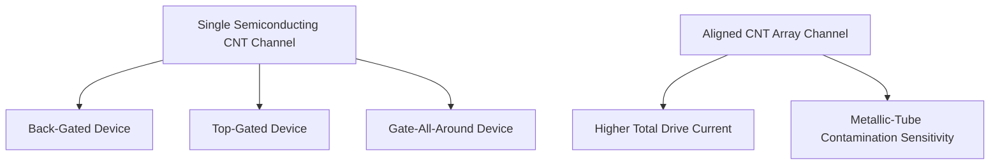
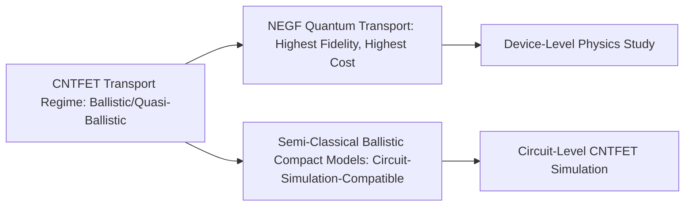

## Carbon Nanotube Transistors

### Overview

Carbon nanotube field-effect transistors (CNTFETs) use single-walled carbon nanotubes (SWCNTs) — cylindrical, seamless rolled-up sheets of graphene-like sp²-bonded carbon, typically 1-2 nm in diameter — as the transistor channel material. Semiconducting carbon nanotubes combine an intrinsic bandgap (unlike planar graphene) with quasi-one-dimensional ballistic-transport-favorable transport properties and an ultrathin body geometry, positioning CNTFETs among the most actively pursued non-silicon channel material candidates for extending transistor scaling, and one of the few 2D/1D nanomaterial technologies to have reached small-scale integrated-circuit demonstrations.

### Nanotube Structure and Chirality-Dependent Electronic Character

A single-walled carbon nanotube can be conceptually described as a graphene sheet rolled into a seamless cylinder, with the rolling direction defined by a **chiral vector** $(n,m)$:

$$\vec{C} = n\vec{a}_1 + m\vec{a}_2$$

The $(n,m)$ indices determine whether a given nanotube is **metallic** or **semiconducting**:

- If $n - m$ is a multiple of 3, the nanotube is (approximately) **metallic**
- Otherwise, the nanotube is **semiconducting**, with a bandgap that scales inversely with tube diameter

**Key Points**

- Only semiconducting-chirality nanotubes are useful as a transistor channel material — metallic nanotubes behave as ohmic conductors and cannot be gated off, making them a source of leakage/parasitic conduction if present in a device
- As-synthesized nanotube growth typically produces a statistical mixture of roughly one-third metallic and two-thirds semiconducting tubes (following simply from the $n-m \mod 3$ counting), meaning **chirality purity/sorting is a first-order practical requirement**, not a refinement, for viable CNTFET technology (discussed further below)
- Bandgap tunability via diameter provides a design lever unavailable in fixed-bandgap bulk semiconductors, though achieving a specific target diameter/chirality distribution reproducibly at scale is itself a synthesis challenge

### Illustrative Nanotube Rolling and Chirality (svg_diagram)

<svg xmlns="http://www.w3.org/2000/svg" viewBox="0 0 600 300" font-family="sans-serif">
<text x="300" y="22" text-anchor="middle" font-size="15" font-weight="bold">Graphene Sheet Rolled into a Carbon Nanotube (svg_diagram)</text>
<g transform="translate(60,50)">
<text x="90" y="-10" text-anchor="middle" font-size="11">Unrolled Graphene Lattice</text>
<line x1="0" y1="20" x2="180" y2="20" stroke="#888" stroke-width="0.6" />
<line x1="0" y1="45" x2="180" y2="45" stroke="#888" stroke-width="0.6" />
<line x1="0" y1="70" x2="180" y2="70" stroke="#888" stroke-width="0.6" />
<line x1="0" y1="95" x2="180" y2="95" stroke="#888" stroke-width="0.6" />
<line x1="20" y1="0" x2="20" y2="115" stroke="#888" stroke-width="0.6" />
<line x1="60" y1="0" x2="60" y2="115" stroke="#888" stroke-width="0.6" />
<line x1="100" y1="0" x2="100" y2="115" stroke="#888" stroke-width="0.6" />
<line x1="140" y1="0" x2="140" y2="115" stroke="#888" stroke-width="0.6" />
<line x1="0" y1="20" x2="100" y2="95" stroke="#1f6feb" stroke-width="2.2" />
<text x="105" y="98" font-size="10" fill="#1f6feb">Chiral vector (n,m)</text>
</g>
<g transform="translate(340,50)">
<text x="90" y="-10" text-anchor="middle" font-size="11">Rolled Nanotube</text>
<ellipse cx="90" cy="20" rx="80" ry="16" fill="none" stroke="#c62828" stroke-width="2" />
<line x1="10" y1="20" x2="10" y2="110" stroke="#c62828" stroke-width="2" />
<line x1="170" y1="20" x2="170" y2="110" stroke="#c62828" stroke-width="2" />
<ellipse cx="90" cy="110" rx="80" ry="16" fill="none" stroke="#c62828" stroke-width="2" />
<line x1="10" y1="20" x2="10" y2="110" stroke="none" />
<text x="90" y="140" text-anchor="middle" font-size="10">Diameter ~1-2 nm</text>
</g>
</svg>

### CNTFET Device Architectures

- **Back-gated or top-gated planar CNTFETs**: individual (or small-bundle) nanotube channels placed on a substrate with source/drain contacts and a gate, conceptually analogous in layout to early planar MOSFET research devices, historically the primary vehicle for fundamental CNTFET device physics studies
- **Wrap-around / gate-all-around geometries**: exploiting the nanotube's cylindrical geometry to wrap the gate electrode fully around the tube circumference, maximizing electrostatic control — conceptually similar in intent to gate-all-around silicon nanosheet transistors, and a natural extension given the nanotube's inherently 1D, fully surface-exposed body
- **Nanotube array/thin-film channels**: using a parallel array of many aligned nanotubes as a composite channel (rather than a single tube) to increase total drive current per unit device width, at the cost of reintroducing sensitivity to any residual metallic-tube contamination in the array (a single metallic tube bridging source and drain in a parallel array can dominate leakage)

### Ballistic and Quasi-Ballistic Transport

Because the nanotube's diameter (a few nm) can be comparable to or smaller than the electron mean free path at room temperature, semiconducting CNTs can exhibit **ballistic or quasi-ballistic transport** over channel lengths relevant to scaled transistors — carriers traverse the channel with few or no scattering events, in contrast to the diffusive transport that drift-diffusion device models (used for conventional bulk semiconductors) assume.

**Key Points**

- Ballistic transport is of significant interest because it implies current drive limited primarily by the number of available conduction channels and contact-injection efficiency, rather than by bulk mobility degradation mechanisms that limit conventional scaled MOSFETs
- [Inference] Because ballistic/quasi-ballistic transport violates the local-equilibrium assumption underlying standard drift-diffusion device simulation, accurate CNTFET device modeling generally requires transport formalisms explicitly designed for this regime (see Modeling Approaches below) rather than direct application of conventional TCAD drift-diffusion device simulation
- Quantum capacitance effects (analogous to, but generally more pronounced than, the quantum capacitance considerations discussed for graphene) become significant in CNTFET electrostatics given the very small physical channel cross-section and correspondingly small density of states per unit gate area

### Contact Formation

As with other nanomaterial channels, forming low-resistance ohmic contacts to carbon nanotubes has been a persistent device engineering challenge:

- **Metal work function selection**: palladium has been widely reported in the literature as forming relatively low-resistance contacts to semiconducting CNTs, attributed to favorable work function alignment and wetting behavior at the metal-nanotube interface, though [Unverified] the precise, universally optimal contact metal choice can depend on nanotube diameter, chirality, and specific device geometry, and should not be treated as a fixed, context-independent rule
- **End-contact vs. side-contact geometries**: contacting the exposed end of a nanotube (end-contact) versus depositing metal along its side (side-contact) produces different injection physics, with the choice affecting achievable contact resistance and contact length scaling behavior
- **Contact resistance scaling with contact length**: unlike conventional 3D semiconductor ohmic contacts, CNT contact resistance can continue to depend on contact length down to relatively short lengths, a distinctive scaling behavior relevant to aggressive device pitch scaling where minimizing contact length/area is often desirable for density

### The Chirality Purity and Placement Challenge

Two closely related practical challenges dominate discussion of manufacturable CNTFET technology:

#### Chirality (Metallic/Semiconducting) Purity

Since as-grown nanotube material contains a mixture of metallic and semiconducting chiralities, achieving sufficiently high semiconducting purity for viable digital logic is essential:

- **Post-growth sorting techniques**: density-gradient ultracentrifugation, gel chromatography, and DNA-based sorting methods have been developed to separate semiconducting from metallic nanotubes after synthesis, achieving progressively higher purity levels reported in the research literature
- **Selective growth approaches**: research into growth conditions or catalyst engineering that preferentially favor semiconducting-chirality nanotube nucleation, aiming to reduce reliance on post-growth sorting
- **Metallic-tube removal/breakdown post-fabrication**: electrical breakdown techniques (applying a current sufficient to selectively destroy metallic tubes, which carry higher current density at a given bias than semiconducting tubes in certain configurations) have been used to remove residual metallic-tube leakage paths after device fabrication, particularly relevant for parallel-array channel devices

[Inference] Because even a small residual fraction of metallic nanotubes can dominate off-state leakage in a parallel-array channel device (a single conducting bridge path shorts the channel regardless of how well-behaved the surrounding semiconducting tubes are), the required semiconducting purity threshold for viable digital logic is generally understood to be very high, making purity level one of the most consequential figures of merit distinguishing research-grade from manufacturing-relevant CNT material.

#### Nanotube Placement and Alignment

- **Directed self-assembly**: various surface-chemistry-based approaches to guide nanotube deposition into desired locations and orientations on a substrate, since nanotubes are typically synthesized in bulk solution or on growth substrates and must subsequently be positioned into device-relevant array configurations
- **Density and pitch uniformity**: achieving uniform nanotube density and consistent spacing across an array (relevant both for consistent per-device drive current and for compatibility with lithographically-defined gate/contact patterning) remains an active process engineering challenge distinct from the chirality-sorting challenge

### Modeling and Simulation Approaches

Given the ballistic/quasi-ballistic transport regime and quasi-1D geometry, CNTFET device modeling generally departs from conventional drift-diffusion TCAD approaches:

- **Non-Equilibrium Green's Function (NEGF) formalism**: a quantum transport framework well-suited to capturing ballistic and quasi-ballistic conduction, coherent tunneling, and quantum confinement effects self-consistently with electrostatics — the most physically complete approach commonly used for CNTFET device simulation, at significantly higher computational cost than drift-diffusion
- **Semi-classical ballistic transport models**: simplified compact-model-style approaches that approximate ballistic/quasi-ballistic current-voltage behavior with more tractable closed-form or rapidly-evaluated equations, more suitable for circuit-level simulation than full NEGF quantum transport simulation of every transistor instance
- **Virtual-source / compact CNTFET models**: research-community-developed compact models (extending virtual-source MOSFET modeling concepts to the CNTFET ballistic-transport context) aimed at enabling circuit-level simulation incorporating CNTFET-specific transport physics without requiring full quantum transport simulation for every device instance in a circuit netlist

### Demonstrated Integration Milestones

[Unverified] Specific reported milestones (such as small CNT-based microprocessor or integrated-circuit demonstrations) have appeared in the academic literature; exact device counts, technology generations, and performance figures for such demonstrations should be verified against current primary sources rather than assumed, since this is an actively evolving research area and figures reported at the time of any given publication may be superseded by subsequent work. In general terms, CNTFET technology has progressed from single-device characterization through small-scale digital logic gate demonstrations toward increasingly complex integrated digital circuit demonstrations, reflecting incremental but sustained progress on the purity, placement, and contact challenges discussed above.

### Comparison with Other Non-Silicon Channel Candidates

| Property | Carbon Nanotubes | TMDs (e.g., $MoS_2$) | Graphene |
| --- | --- | --- | --- |
| Bandgap | Present (semiconducting chirality), diameter-tunable | Present, moderate | None (or engineered) |
| Dimensionality | Quasi-1D | 2D | 2D |
| Transport regime | Ballistic/quasi-ballistic favorable | Diffusive, moderate mobility | Very high mobility, diffusive |
| Primary integration barrier | Chirality purity and placement | Wafer-scale synthesis uniformity, contacts | Absence of intrinsic bandgap |
| Circuit-level demonstration maturity | Small-scale ICs demonstrated in research | Individual/small-array transistor demonstrations | Primarily RF/analog demonstrations |

[Unverified] Relative maturity comparisons reflect general research-community trends rather than a formal, standardized technology-readiness benchmarking; specific current state-of-the-art figures for any of these technologies should be checked against up-to-date primary literature.

### Limitations and Open Challenges

- **Chirality purity threshold**: as discussed above, the semiconducting purity requirement for viable digital logic is demanding, and achieving it reproducibly and cost-effectively at manufacturing-relevant volume and consistency remains a central unresolved challenge
- **Placement and density control at scale**: directed assembly techniques have demonstrated feasibility at research scale, but wafer-scale, high-yield, lithography-compatible placement with tight pitch and density control is a substantially harder engineering problem
- **Contact resistance and variability**: contact quality can vary tube-to-tube even within nominally identical process conditions, contributing to device-to-device parameter variability that exceeds what is typical in mature silicon CMOS
- **Diameter and chirality distribution control**: even within the "semiconducting" category, some diameter/bandgap spread is typical of most synthesis and sorting processes, contributing to threshold voltage and on-current variability across a nanotube population used in circuit-relevant arrays

[Inference] Given the combination of demanding purity requirements and placement precision needs, CNTFET technology's path to high-volume digital logic manufacturing is generally viewed as requiring simultaneous, coordinated progress across synthesis, sorting, and placement — rather than being limited by any single bottleneck alone — which is consistent with the technology's progression to date being characterized by steady, incremental circuit-scale demonstrations rather than an abrupt manufacturing breakthrough.

**Related Topics**

- Carbon nanotube synthesis methods (arc discharge, laser ablation, CVD growth) and chirality control
- Post-growth nanotube sorting techniques (density-gradient ultracentrifugation, gel chromatography)
- NEGF quantum transport simulation methodology
- Directed self-assembly and nanomaterial placement techniques
- Comparison with graphene and TMD-based transistor integration challenges
- Compact modeling approaches for ballistic and quasi-ballistic transistors
- Gate-all-around device geometries across silicon and non-silicon channel materials