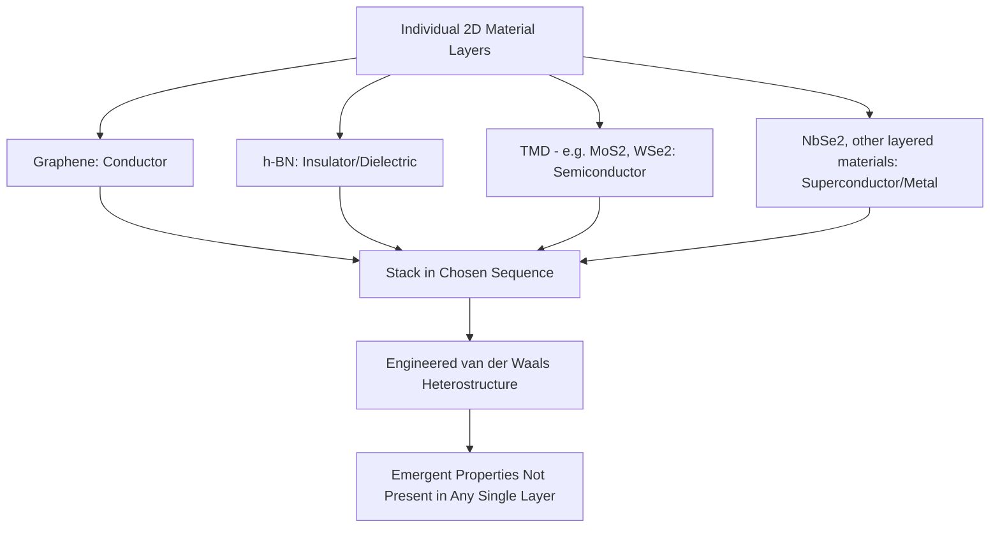
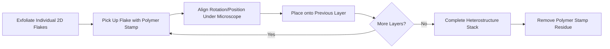
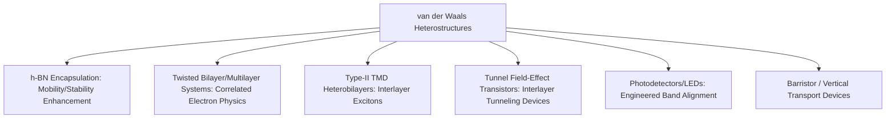

## Van der Waals Heterostructures

### Overview

Van der Waals (vdW) heterostructures are artificial layered materials assembled by stacking different two-dimensional crystals — graphene, hexagonal boron nitride (h-BN), transition metal dichalcogenides (TMDs), and other 2D materials — on top of one another, held together by weak interlayer van der Waals forces rather than covalent bonding. Because each constituent layer is internally covalently bonded but interacts with adjacent layers only through van der Waals interaction, layers with entirely different crystal structures and lattice constants can, in principle, be combined in arbitrary sequence without the strict epitaxial lattice-matching requirements that govern conventional 3D semiconductor heterostructure growth (e.g., III-V epitaxy), opening a combinatorially large design space of engineered electronic and optical properties.

### The Core Concept: LEGO-Brick Materials Assembly

**Key Points**

- Because interlayer bonding is weak (van der Waals) rather than strong covalent bonding, lattice mismatch between stacked materials is accommodated without the dislocation formation and strain-relaxation constraints that govern conventional epitaxial 3D heterostructure growth, in principle permitting far more flexible combinations of dissimilar materials than 3D epitaxy allows
- This flexibility is frequently described in the literature using a "LEGO block" or "materials by design" analogy, reflecting the ability to select and combine layers based on desired functional properties (conductor, insulator, semiconductor) rather than being constrained primarily by lattice-matching compatibility
- [Inference] This design flexibility is a primary reason van der Waals heterostructures are viewed as a distinct and significant research direction beyond simply "another 2D material," since the technique in principle enables entirely new material combinations and emergent phenomena unavailable from any single constituent 2D material or from conventional 3D heterostructure growth techniques

### Fabrication Approaches

#### Mechanical Stacking (Transfer-Based Assembly)

The predominant method for research-scale vdW heterostructure fabrication involves individually exfoliating each constituent 2D material, then sequentially transferring and stacking layers using a controlled pick-up and placement process:

- **Dry transfer techniques**: using a polymer stamp (commonly polydimethylsiloxane, PDMS, sometimes combined with other polymer layers) to mechanically pick up an exfoliated flake and precisely place it onto a previously stacked layer, repeated sequentially to build up the full heterostructure
- **All-dry viscoelastic stamping**: variants of dry transfer specifically developed to minimize polymer residue and interfacial contamination between stacked layers, since contamination trapped between layers can degrade interlayer coupling and introduce unwanted doping or scattering
- **Alignment and rotational control**: for heterostructures where relative crystallographic orientation (twist angle) between layers is functionally significant (see Moiré Physics below), the stacking process must incorporate precise rotational alignment control, typically performed under optical microscope guidance using each flake's crystallographic edges as alignment references

#### Wafer-Scale Approaches

Because mechanical exfoliation-based stacking produces only small, individually-assembled heterostructure samples unsuitable for volume manufacturing, wafer-scale alternatives are an active development area:

- **Sequential CVD growth**: growing one 2D material layer directly, then growing or transferring a subsequent layer on top, aiming to reduce reliance on individually hand-assembled flakes
- **Layer-by-layer transfer of CVD-grown sheets**: using large-area CVD-grown 2D material sheets (rather than small exfoliated flakes) as the starting material for a transfer-and-stack process, improving area scalability relative to flake-based assembly while still facing the interfacial cleanliness and alignment control challenges discussed above

[Unverified] The relative maturity and adopted-in-practice status of specific wafer-scale vdW heterostructure fabrication approaches varies across the research literature and is an actively evolving area; claims of production-ready wafer-scale vdW heterostructure manufacturing should be verified against current primary sources rather than assumed as an established, mature capability.

### Encapsulation with Hexagonal Boron Nitride

One of the most widely adopted and well-established applications of vdW heterostructure assembly is encapsulating an active 2D channel material (graphene, TMDs) between two h-BN layers:

- **Substrate disorder screening**: h-BN's atomically flat surface and low density of charged impurities substantially reduces substrate-induced scattering relative to conventional oxide substrates (commonly $SiO_2$), directly improving measured carrier mobility in the encapsulated active layer
- **Environmental protection**: the top h-BN layer physically isolates the active channel from ambient atmospheric exposure (moisture, oxygen, airborne contaminants), improving both electronic quality consistency and long-term device stability
- **Established benchmark technique**: h-BN encapsulation is now considered a standard, well-established technique specifically for achieving research-benchmark-quality graphene and TMD device measurements, distinguishing intrinsic material physics measurements from substrate-disorder-limited measurements on bare oxide substrates

### Moiré Superlattices and Twist-Angle Physics

When two 2D layers (particularly two layers of the same or similar material) are stacked with a small relative rotational twist angle, the mismatch between the two layers' periodic lattices produces a long-wavelength **moiré superlattice pattern** — a periodic modulation with a much larger period than either constituent lattice.

#### Magic-Angle Twisted Bilayer Graphene

The most widely known example of twist-angle-induced emergent physics is **twisted bilayer graphene** at specific "magic angles" (a rotational twist of approximately 1.1°, as most prominently reported in the founding experimental work on this system):

- At the magic angle, the moiré superlattice produces dramatically **flattened electronic bands** near the Fermi level, since the moiré periodicity effectively localizes electronic states and suppresses their kinetic energy/bandwidth
- Flat bands correspondingly enhance the relative importance of electron-electron interactions (since kinetic energy no longer dominates over interaction energy), giving rise to strongly correlated electronic phenomena including reported unconventional superconductivity and correlated insulating states at specific electron filling fractions
- This discovery launched an active subfield often referred to as **"twistronics"** or moiré materials physics, extending the twist-angle concept to other layer combinations (twisted TMD bilayers, twisted trilayer graphene, and various heterobilayer combinations) as a general tuning parameter for engineering correlated electronic phenomena

**Key Points**

- Twist angle functions as an additional, continuously tunable design parameter for electronic band structure engineering that has no direct analog in conventional bulk semiconductor heterostructure engineering, where band structure is fixed by material composition and (to a lesser degree) strain, rather than by a mechanically-set rotational angle between layers
- [Inference] Because achieved device properties in twisted systems are highly sensitive to the precise twist angle (with reported behavior changing qualitatively over a fraction of a degree in some twisted graphene systems), precise, reproducible twist-angle control during fabrication is a significant practical challenge distinguishing twistronics research from more conventional (non-twist-sensitive) vdW heterostructure assembly

### Illustrative Moiré Pattern Formation (svg_diagram)

<svg xmlns="http://www.w3.org/2000/svg" viewBox="0 0 600 300" font-family="sans-serif">
<text x="300" y="22" text-anchor="middle" font-size="15" font-weight="bold">Moire Superlattice from Twisted Bilayer Stacking (svg_diagram)</text>
<g transform="translate(70,50)" opacity="0.6">
<line x1="0" y1="0" x2="200" y2="0" stroke="#1f6feb" stroke-width="1" />
<line x1="0" y1="20" x2="200" y2="20" stroke="#1f6feb" stroke-width="1" />
<line x1="0" y1="40" x2="200" y2="40" stroke="#1f6feb" stroke-width="1" />
<line x1="0" y1="60" x2="200" y2="60" stroke="#1f6feb" stroke-width="1" />
<line x1="0" y1="80" x2="200" y2="80" stroke="#1f6feb" stroke-width="1" />
<line x1="0" y1="100" x2="200" y2="100" stroke="#1f6feb" stroke-width="1" />
<line x1="0" y1="120" x2="200" y2="120" stroke="#1f6feb" stroke-width="1" />
<line x1="0" y1="140" x2="200" y2="140" stroke="#1f6feb" stroke-width="1" />
<line x1="0" y1="160" x2="200" y2="160" stroke="#1f6feb" stroke-width="1" />
<line x1="0" y1="180" x2="200" y2="180" stroke="#1f6feb" stroke-width="1" />
<line x1="0" y1="200" x2="200" y2="200" stroke="#1f6feb" stroke-width="1" />
<g transform="rotate(9,100,100)">
<line x1="0" y1="0" x2="200" y2="0" stroke="#c62828" stroke-width="1" />
<line x1="0" y1="20" x2="200" y2="20" stroke="#c62828" stroke-width="1" />
<line x1="0" y1="40" x2="200" y2="40" stroke="#c62828" stroke-width="1" />
<line x1="0" y1="60" x2="200" y2="60" stroke="#c62828" stroke-width="1" />
<line x1="0" y1="80" x2="200" y2="80" stroke="#c62828" stroke-width="1" />
<line x1="0" y1="100" x2="200" y2="100" stroke="#c62828" stroke-width="1" />
<line x1="0" y1="120" x2="200" y2="120" stroke="#c62828" stroke-width="1" />
<line x1="0" y1="140" x2="200" y2="140" stroke="#c62828" stroke-width="1" />
<line x1="0" y1="160" x2="200" y2="160" stroke="#c62828" stroke-width="1" />
<line x1="0" y1="180" x2="200" y2="180" stroke="#c62828" stroke-width="1" />
<line x1="0" y1="200" x2="200" y2="200" stroke="#c62828" stroke-width="1" />
</g>
</g>
<text x="300" y="270" text-anchor="middle" font-size="11">Small twist angle theta between layers -&gt; long-period moire pattern (dark bands)</text>
</svg>

### Band Alignment Engineering

Beyond twist-angle effects, the choice of which materials to stack and in what sequence directly determines the resulting heterostructure's band alignment, with direct device-relevant consequences:

- **Type-I alignment**: both conduction band minimum and valence band maximum of one material lie within the bandgap of the other, tending to confine both electrons and holes to the same layer — relevant for certain light-emission-oriented device designs
- **Type-II alignment**: conduction band minimum of one layer and valence band maximum of the other layer are staggered such that electrons and holes are spatially separated into different layers upon photoexcitation — this is commonly reported for several TMD heterobilayer combinations (e.g., $MoS_2$/$WSe_2$) and is of particular interest for **interlayer exciton** physics, where the bound electron-hole pair has its electron and hole residing in different physical layers, producing excitons with distinctive long lifetimes (since spatial separation reduces electron-hole wavefunction overlap and recombination rate) and potentially long diffusion lengths of interest for exciton-based optoelectronic and possibly exciton-condensate physics research

### Applications and Device Concepts

- **Tunnel field-effect transistors (TFETs)**: vertical stacking allows engineered interlayer tunneling barriers and band alignments, of interest for steep-subthreshold-swing transistor concepts that could, in principle, outperform conventional thermionic-emission-limited MOSFET subthreshold characteristics
- **Vertical heterostructure transistors**: devices exploiting current flow perpendicular to the layer stack (rather than the conventional lateral, in-plane channel current of most transistor designs), enabled naturally by the layered geometry
- **Photodetectors and light-emitting devices**: engineered type-II band alignment heterobilayers support interest in efficient photodetection and interlayer-exciton-based light emission device concepts
- **Correlated-electron and quantum device research**: twisted moiré systems are of substantial fundamental-physics research interest for studying strongly correlated electron phenomena (unconventional superconductivity, correlated insulator states, and related many-body physics) in a highly tunable materials platform

### Practical and Manufacturing Considerations

- **Interfacial cleanliness**: contamination (polymer residue, trapped bubbles, adsorbed molecules) between stacked layers directly degrades interlayer electronic coupling and can dominate device behavior if not adequately controlled during assembly — a persistent practical fabrication concern across essentially all mechanically-stacked vdW heterostructure work
- **Scalability**: as with individual 2D materials, the transition from painstaking, individually-aligned flake-by-flake assembly (standard in most fundamental-physics research demonstrations) to wafer-scale, reproducible, high-throughput heterostructure fabrication represents a substantial unresolved manufacturing engineering challenge, distinct from the underlying physics
- **Twist-angle reproducibility**: for twist-angle-sensitive device concepts specifically, achieving and verifying the required angular precision reproducibly across many devices (rather than as isolated, carefully hand-tuned research samples) is a significant additional manufacturing precision requirement beyond what conventional (non-twist-sensitive) heterostructure assembly requires
- **Characterization complexity**: verifying the internal structure, layer count, alignment, and twist angle of a completed heterostructure (as opposed to a single 2D material layer) typically requires a combination of optical, Raman/photoluminescence, and in some cases cross-sectional electron microscopy techniques, adding characterization complexity relative to single-layer 2D material work

[Inference] Given the combination of assembly precision requirements (interfacial cleanliness, alignment, and in twist-sensitive systems, angular precision) with the general 2D-material wafer-scale synthesis challenges discussed elsewhere in this chapter, van der Waals heterostructure technology is generally understood to remain substantially closer to a fundamental materials-physics research platform than to a near-term, high-volume manufacturable semiconductor device technology, even though specific narrower application concepts (such as h-BN encapsulation for improving individual TMD or graphene device quality) are comparatively closer to practical device-engineering use.

**Related Topics**

- Twisted bilayer graphene and magic-angle superconductivity in depth
- h-BN encapsulation techniques for graphene and TMD device quality enhancement
- Interlayer exciton physics in type-II band-aligned TMD heterobilayers
- Tunnel field-effect transistor (TFET) device concepts using vdW heterostructures
- Wafer-scale vdW heterostructure fabrication approaches
- Graphene electronic properties and transition metal dichalcogenide semiconductors (constituent materials background)
- Moiré superlattice band structure engineering and correlated electron physics