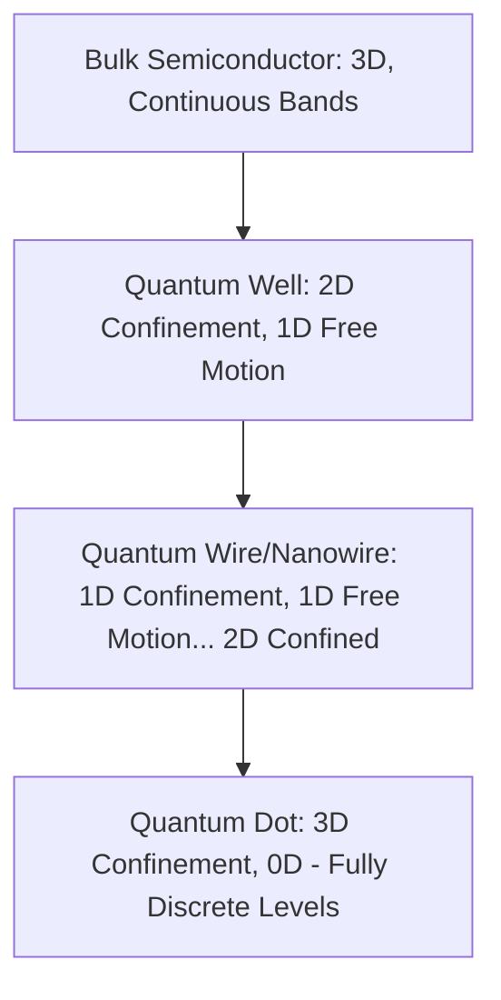
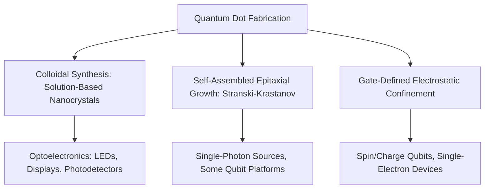
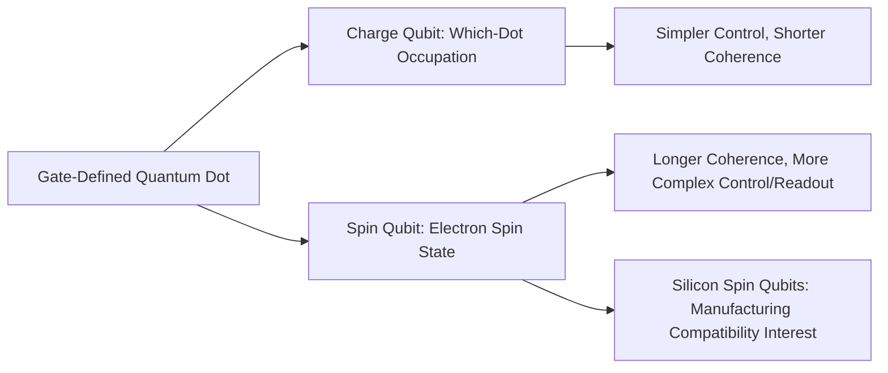

## Quantum Dot Device Physics

### Overview

Quantum dots are nanoscale semiconductor structures that confine charge carriers (electrons and/or holes) in all three spatial dimensions to length scales comparable to or smaller than the carrier's de Broglie wavelength, producing fully discretized, atom-like energy levels rather than the continuous bands characteristic of bulk semiconductors. This zero-dimensional confinement — in contrast to the 2D confinement of quantum wells or the 1D confinement of quantum wires/nanowires — gives quantum dots their distinctive electronic and optical properties, with applications spanning optoelectronics (LEDs, displays, photodetectors, single-photon sources), quantum information processing (spin and charge qubits), and single-electron electronics.

### Dimensional Confinement Hierarchy

**Key Points**

- Density of states evolves qualitatively across this hierarchy: bulk (3D) has a continuous $\sqrt{E}$-dependent density of states, quantum wells (2D) have a step-function density of states, quantum wires (1D) have a $1/\sqrt{E}$ singular density of states, and quantum dots (0D) have a fully discrete, delta-function-like density of states analogous to atomic orbitals
- This atom-like discreteness is why quantum dots are frequently described as "artificial atoms," since their energy level structure, tunable via size and composition, plays a role analogous to the fixed energy levels of a real atom's electron shells

### Quantum Confinement and Size-Dependent Bandgap

The central practical consequence of 3D confinement is a size-dependent effective bandgap: as the physical dimension of a quantum dot shrinks below the material's exciton Bohr radius, the confinement energy added to the bulk bandgap increases as the dot size decreases. A commonly used simplified estimate, based on the particle-in-a-sphere approximation within the **effective mass approximation**, gives:

$$E_g(\text{dot}) \approx E_g(\text{bulk}) + \frac{\hbar^2 \pi^2}{2R^2}\left(\frac{1}{m_e^*} + \frac{1}{m_h^*}\right) - \frac{1.8e^2}{4\pi\varepsilon\varepsilon_0 R}$$

where $R$ is the dot radius, $m_e^*$ and $m_h^*$ are electron and hole effective masses, and the final (Coulomb) term accounts for the attractive electron-hole interaction energy, which becomes significant at small $R$.

**Key Points**

- The quadratic $1/R^2$ confinement-energy scaling means bandgap (and correspondingly emission/absorption wavelength) can be tuned continuously across a wide spectral range simply by controlling dot size during synthesis or fabrication, without changing the underlying bulk material composition — a design lever with no direct analog in bulk semiconductor engineering, where bandgap is fixed by composition and, to a lesser degree, strain or alloying
- [Inference] Because this effective-mass, particle-in-a-sphere formula is a simplified approximation that neglects surface/interface effects, potential well shape details, and strong-confinement-regime corrections, it is generally most reliable for weak-to-moderate confinement and for order-of-magnitude/trend estimation rather than for precise quantitative bandgap prediction, particularly for the smallest dot sizes where surface effects become proportionally more significant

### Illustrative Discrete Energy Levels vs. Bulk Bands (svg_diagram)

<svg xmlns="http://www.w3.org/2000/svg" viewBox="0 0 600 300" font-family="sans-serif">
<text x="300" y="22" text-anchor="middle" font-size="15" font-weight="bold">Bulk Continuous Bands vs. Quantum Dot Discrete Levels (svg_diagram)</text>
<line x1="120" y1="260" x2="120" y2="50" stroke="black" stroke-width="1.3" />
<text x="120" y="280" text-anchor="middle" font-size="12">Bulk Semiconductor</text>
<rect x="70" y="60" width="100" height="60" fill="#c62828" opacity="0.3" />
<text x="120" y="55" text-anchor="middle" font-size="9">Conduction band (continuous)</text>
<rect x="70" y="190" width="100" height="60" fill="#1f6feb" opacity="0.3" />
<text x="120" y="285" text-anchor="middle" font-size="9" fill="none"> </text>
<text x="120" y="185" text-anchor="middle" font-size="9">Valence band (continuous)</text>
<line x1="400" y1="260" x2="400" y2="50" stroke="black" stroke-width="1.3" />
<text x="400" y="280" text-anchor="middle" font-size="12">Quantum Dot</text>
<line x1="350" y1="70" x2="450" y2="70" stroke="#c62828" stroke-width="3" />
<line x1="350" y1="90" x2="450" y2="90" stroke="#c62828" stroke-width="3" />
<line x1="350" y1="108" x2="450" y2="108" stroke="#c62828" stroke-width="3" />
<text x="460" y="90" font-size="9">Discrete e- levels</text>
<line x1="350" y1="180" x2="450" y2="180" stroke="#1f6feb" stroke-width="3" />
<line x1="350" y1="198" x2="450" y2="198" stroke="#1f6feb" stroke-width="3" />
<line x1="350" y1="216" x2="450" y2="216" stroke="#1f6feb" stroke-width="3" />
<text x="460" y="198" font-size="9">Discrete hole levels</text>
</svg>

### Quantum Dot Fabrication Approaches

#### Colloidal Synthesis

Chemical solution-based synthesis (commonly hot-injection or related colloidal chemistry methods) produces free-standing, surface-ligand-capped nanocrystal quantum dots dispersed in solution:

- **Core-only vs. core-shell structures**: a core-only dot exposes the semiconductor surface directly to the surrounding environment/ligands, while a **core-shell** structure grows a wider-bandgap shell material around the core (e.g., ZnS shell around a CdSe core), passivating surface states that would otherwise trap carriers and quench light emission, substantially improving optical quantum yield
- **Surface ligand chemistry**: organic ligand molecules bound to the nanocrystal surface control colloidal stability (preventing aggregation), solubility in specific solvents, and can influence electronic coupling when dots are subsequently deposited into solid films
- **Size-selective precipitation and size distribution control**: since size directly determines bandgap, tight control of the size distribution during and after synthesis is essential for narrow-linewidth optical emission — a broader size distribution produces inhomogeneous line broadening in ensemble optical measurements

#### Epitaxially Grown (Self-Assembled) Quantum Dots

- **Stranski-Krastanov growth mode**: a widely used epitaxial method (commonly for III-V material systems such as InAs dots on GaAs) in which lattice-mismatch-induced strain causes initially planar epitaxial growth to spontaneously transition into 3D island (dot) formation above a critical thickness, self-assembling quantum dots directly during epitaxial growth without lithographic patterning
- **Capping layer growth**: subsequent epitaxial overgrowth embeds the self-assembled dots within the surrounding crystal matrix, providing a solid-state, electrically-contactable, and generally more robust confinement environment than colloidal dots' organic ligand shell
- **Random nucleation site distribution**: a practical limitation of self-assembled growth is that dot nucleation position is generally not deterministically controlled, complicating device designs requiring dots at specific, pre-defined locations (relevant to some quantum information device architectures)

#### Lithographically Defined (Gate-Defined) Quantum Dots

- **Electrostatic confinement via patterned gate electrodes**: rather than confining carriers through a physically distinct nanocrystal or self-assembled island, metal gate electrodes patterned above a 2D electron gas (formed in a semiconductor heterostructure, e.g., GaAs/AlGaAs or a silicon-based platform) apply locally tailored electric fields that electrostatically define a confined region, effectively "drawing" a quantum dot potential well using voltage rather than physical material boundaries
- **Deterministic positioning and tunability**: this approach provides precise, deterministic control over dot location (set by lithographic gate pattern design) and substantial in-situ electrical tunability of confinement strength, tunnel coupling to leads, and charge occupancy — properties particularly valuable for quantum information applications requiring precise, reproducible qubit control (see Spin Qubits below)
- **Requires an underlying high-mobility 2D electron gas or equivalent starting material**, meaning gate-defined dot quality is contingent on the quality of the underlying heterostructure material system, in a manner analogous to how 2D-material device quality depends on underlying substrate/material quality discussed elsewhere in this course

### Single-Electron Charging and Coulomb Blockade

Because a quantum dot is a small, capacitively isolated conducting island, adding or removing a single electron changes its electrostatic potential energy by a measurable amount — the **charging energy**:

$$E_C = \frac{e^2}{2C_{\Sigma}}$$

where $C_\Sigma$ is the total capacitance of the dot to its surrounding environment (gates, leads, substrate). When $E_C$ exceeds both the thermal energy $k_BT$ and any relevant tunnel-coupling broadening, electron transport through the dot exhibits **Coulomb blockade**: current is suppressed except at specific gate voltages where the electrochemical potential of the dot aligns with the source/drain leads, permitting single-electron tunneling.

**Key Points**

- Coulomb blockade produces characteristic **Coulomb diamond** patterns in current-voltage measurements plotted against gate and bias voltage, a standard diagnostic signature used to confirm single-electron-transistor-like behavior and to extract charging energy and dot capacitance parameters experimentally
- This single-electron sensitivity underlies **single-electron transistor (SET)** device concepts, where the extreme sensitivity of tunneling current to the dot's electrostatic environment (including a single nearby elementary charge) enables ultra-sensitive charge detection, of interest both for fundamental charge-sensing applications and as a readout mechanism for other quantum devices (including reading out the charge state of nearby qubits)
- Achieving well-resolved Coulomb blockade requires operating at sufficiently low temperature that $k_BT \ll E_C$, meaning smaller dots (larger $E_C$, since $E_C$ scales inversely with dot size/capacitance) can exhibit Coulomb blockade at higher, more experimentally convenient temperatures than larger dots

### Optical Properties and Applications

#### Photoluminescence and Emission Tunability

The size-dependent bandgap directly translates into size-tunable photoluminescence emission wavelength, a property that has driven substantial commercial interest in colloidal quantum dots for display and lighting applications:

- **Quantum dot displays**: colloidal quantum dots are used as a color-conversion or direct-emission layer in some commercial display technologies, exploiting narrow, size-tunable emission linewidths to achieve wider, more precisely controllable color gamuts than some conventional phosphor-based approaches
- **Quantum dot LEDs (QLEDs)**: electrically-driven light emission from quantum dot active layers, of interest for display and general lighting applications combining the emission tunability of quantum dots with direct electrical (rather than optical) excitation

#### Single-Photon Emission

Because a quantum dot's discrete energy levels support a well-defined, isolated optical transition (unlike a bulk semiconductor's continuous band-to-band emission), quantum dots — particularly epitaxially grown, solid-state-embedded dots — are of substantial interest as **single-photon sources**:

- **Antibunched emission**: a single quantum dot, once excited, can emit at most one photon before requiring re-excitation, producing quantum-statistically "antibunched" light (photons emitted with reduced probability of near-simultaneous pairs) distinct from the classical statistics of conventional light sources — a property directly useful for quantum key distribution and other quantum photonic information protocols
- **Cavity-coupled emission enhancement**: embedding a quantum dot within an optical microcavity (e.g., photonic crystal or micropillar cavity) can enhance photon emission rate and directionality via the Purcell effect, of interest for improving single-photon source efficiency and indistinguishability for quantum photonic applications

### Quantum Dots as Qubits

Gate-defined and some self-assembled quantum dots are actively pursued as physical platforms for quantum information processing qubits, representing one of several competing solid-state qubit technology approaches (alongside superconducting qubits, trapped ions, and others):

#### Charge Qubits

- Encode quantum information in the charge configuration (e.g., which of two coupled dots an electron occupies) of a double-quantum-dot system
- Generally simpler to control and readout than spin qubits, but typically suffer from shorter coherence times, since charge states couple relatively strongly to electrical noise in the surrounding environment

#### Spin Qubits

- Encode quantum information in the spin state (e.g., spin-up vs. spin-down, or singlet-triplet states of two coupled electron spins) of one or more confined electrons
- Generally offer longer coherence times than charge qubits, since electron spin couples more weakly to typical electrical noise sources than charge does, though spin qubits require more elaborate initialization, control (e.g., via microwave-driven electron spin resonance or exchange-interaction-based gating), and readout schemes (often converting spin information to charge information for detection via a nearby charge sensor, exploiting the single-electron charge sensitivity discussed above)
- **Silicon-based spin qubits**: gate-defined quantum dots in isotopically purified silicon have attracted particular research interest, motivated by silicon's potential for long spin coherence times (attributable to weak spin-orbit coupling and the possibility of nearly nuclear-spin-free isotopic composition) combined with prospective compatibility with mature silicon semiconductor manufacturing infrastructure

[Inference] Given the tradeoff between control simplicity and coherence time, and given silicon spin qubits' potential manufacturing-compatibility advantage, much of the ongoing solid-state quantum-dot-qubit research effort appears weighted toward spin-based (rather than pure charge-based) qubit architectures, particularly in silicon-based material systems, though this represents one of several actively competing qubit technology approaches rather than a settled or dominant industry consensus.

### Comparison of Quantum Dot Platforms

| Platform | Confinement Mechanism | Primary Application Focus | Positioning Control |
| --- | --- | --- | --- |
| Colloidal nanocrystals | Physical nanocrystal boundary + ligand shell | Optoelectronics (LEDs, displays, photodetectors) | Solution-based, ensemble/random |
| Self-assembled epitaxial | Strain-driven island formation | Single-photon sources, some qubit research | Generally random nucleation |
| Gate-defined electrostatic | Patterned gate electric fields on 2DEG | Charge/spin qubits, single-electron devices | Deterministic (lithography-set) |

[Unverified] Emerging techniques for improving positional control of self-assembled dots (e.g., seeded or site-controlled growth methods) exist in the research literature; the general characterization of self-assembled growth as producing largely random nucleation reflects the predominant conventional approach rather than every reported variant.

### Practical and Manufacturing Considerations

- **Colloidal quantum dots**: commercially the most mature application area (particularly displays), with established, scalable solution-processing manufacturing routes, though long-term photostability, potential toxicity of some historically used core materials (e.g., cadmium-based compositions), and consistent batch-to-batch size/quality control remain ongoing practical considerations actively addressed through material substitution (e.g., indium-based or other reduced-toxicity compositions) and process refinement
- **Epitaxial self-assembled dots**: require specialized epitaxial growth infrastructure (e.g., molecular beam epitaxy) and generally remain a more research/specialty-application-oriented technology than colloidal dots' broader commercial manufacturing base
- **Gate-defined qubit dots**: require extremely low operating temperatures (typically dilution-refrigerator-range, millikelvin regime) and high-purity, low-noise starting material and fabrication processes, positioning this platform as a specialized quantum computing hardware technology rather than a near-term mainstream commercial semiconductor device category, with scaling to the large qubit counts needed for practically useful quantum computation representing a substantial, actively-pursued engineering challenge distinct from the fundamental device physics itself

**Related Topics**

- Colloidal nanocrystal synthesis chemistry and core-shell passivation strategies
- Self-assembled epitaxial quantum dot growth (Stranski-Krastanov mode) in depth
- Single-electron transistor operation and Coulomb blockade diagnostics
- Silicon spin qubit architectures and electron spin resonance control techniques
- Single-photon source engineering and cavity quantum electrodynamics (Purcell effect)
- Comparison with superconducting and trapped-ion qubit platforms
- Quantum dot display and QLED optoelectronic technology