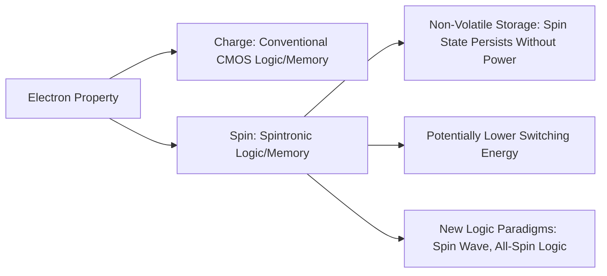
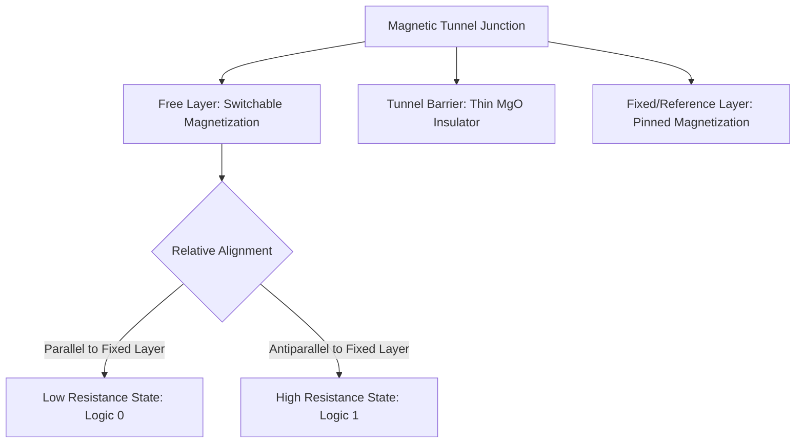
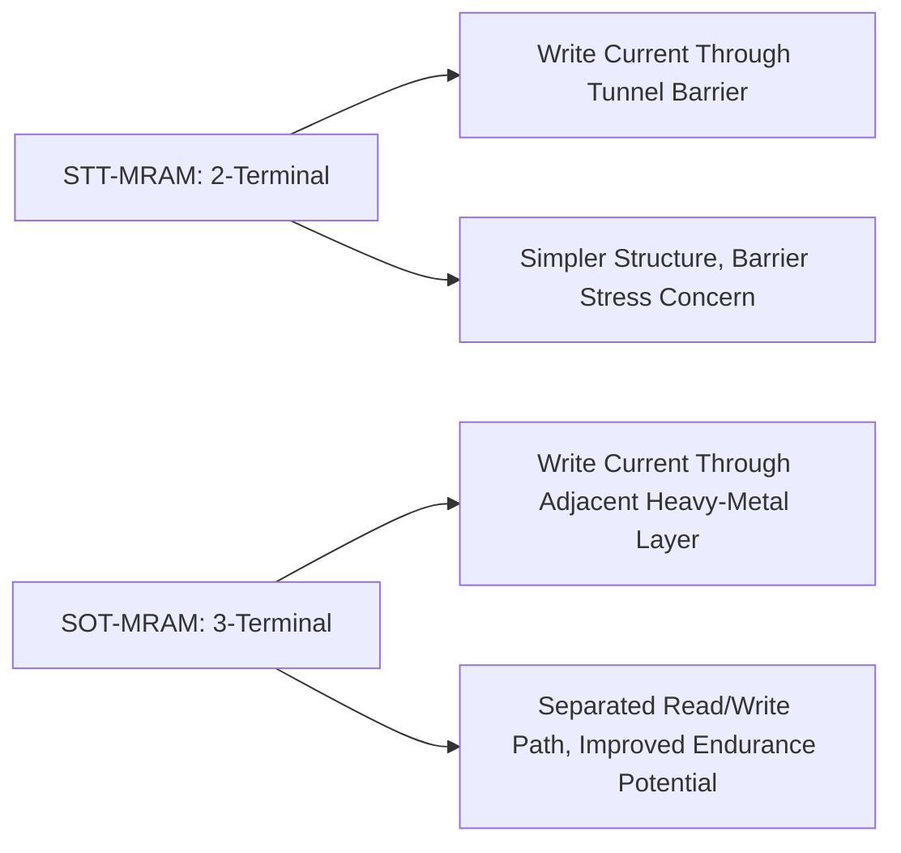
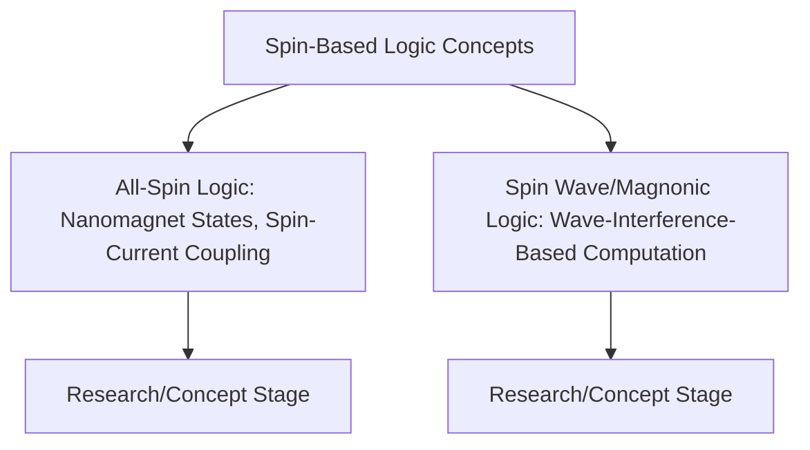

## Spintronics and Spin Based Logic

### Overview

Spintronics (spin electronics) is the study and exploitation of electron spin, in addition to or instead of electron charge, as the physical quantity carrying and processing information. Where conventional CMOS logic and memory rely exclusively on charge state (presence/absence of charge, or charge accumulation determining a voltage level), spintronic devices leverage the intrinsic quantum mechanical spin angular momentum of electrons — and its associated magnetic moment — to store, transport, and manipulate information, motivated primarily by the potential for non-volatility, lower switching energy, and new logic paradigms not directly accessible to pure charge-based devices.

### Fundamental Concept: Spin as an Information Carrier

**Key Points**

- Electron spin is a two-level quantum system (spin-up, spin-down along a chosen quantization axis), providing a natural binary-like state variable analogous in structure to a charge-based bit, but governed by different physics with different associated energy scales and switching mechanisms
- A central motivating property of many spintronic devices is **non-volatility**: since spin state (particularly magnetic order) can persist without continuously applied power, spintronic memory and, in principle, spintronic logic elements avoid the standby power consumption inherent in volatile charge-based memory (e.g., SRAM, DRAM) that must be continuously refreshed or powered to retain state
- [Inference] The combination of potential non-volatility and, in some device concepts, lower fundamental switching energy than charge-based switching is the primary reason spintronics is pursued as a candidate direction for both memory technology (where adoption is comparatively mature, see MRAM below) and, more speculatively, future logic technology (where adoption remains substantially less mature than for memory)

### Giant Magnetoresistance (GMR) and the Origins of Spintronics

The modern spintronics field traces its practical origins to the discovery of **Giant Magnetoresistance (GMR)** in multilayer thin-film structures alternating ferromagnetic and non-magnetic metal layers:

- In a GMR structure, electrical resistance depends strongly on the relative magnetic alignment (parallel vs. antiparallel) of adjacent ferromagnetic layers, since electrons of a given spin orientation scatter differently depending on whether they encounter a ferromagnetic layer whose magnetization is aligned with or against their spin
- **Parallel alignment**: lower resistance, since one spin channel experiences low scattering through both ferromagnetic layers
- **Antiparallel alignment**: higher resistance, since both spin channels experience significant scattering in at least one of the two layers
- This spin-dependent scattering mechanism enabled dramatically more sensitive magnetic field sensors than prior technologies, and GMR-based read heads became foundational to modern hard disk drive data storage technology, representing spintronics' first major, large-scale commercial success and establishing the broader field's practical relevance beyond fundamental physics research

### Tunneling Magnetoresistance (TMR) and Magnetic Tunnel Junctions

Building on the GMR concept, **Tunneling Magnetoresistance (TMR)** occurs in a **Magnetic Tunnel Junction (MTJ)**: two ferromagnetic layers separated not by a metallic spacer (as in GMR) but by a thin insulating tunnel barrier (commonly $MgO$ in modern devices).

**Key Points**

- Electrons tunnel quantum mechanically through the thin insulating barrier, with tunneling probability depending on the relative spin alignment of the two ferromagnetic layers, producing a resistance contrast between parallel and antiparallel configurations substantially larger than typical GMR structures, particularly with crystalline MgO barriers engineered for coherent spin-dependent tunneling
- The MTJ's two stable resistance states (parallel/low, antiparallel/high) directly provide a natural non-volatile binary memory element — the MTJ is the fundamental storage/readout element underlying **Magnetoresistive Random Access Memory (MRAM)**

### Spin-Transfer Torque (STT) and Modern MRAM

Early MTJ-based memory concepts required an external magnetic field (generated by current through a nearby write line) to switch the free layer's magnetization, which scales poorly with device size and consumes substantial write energy/area. **Spin-Transfer Torque (STT)** switching addresses this by using spin-polarized current itself, passed directly through the MTJ stack, to switch the free-layer magnetization:

- A spin-polarized current (electrons whose spins are predominantly aligned in one direction, produced by passing current through the fixed reference layer first) transfers angular momentum to the free layer's magnetization as it passes through, and above a threshold current density, this transferred torque can reverse the free layer's magnetic orientation
- **STT-MRAM** switches the MTJ using this current-driven mechanism directly through the same two terminals used for reading the device's resistance state, substantially improving scalability (write current requirement generally decreases with device area, unlike field-switched approaches) relative to earlier field-switched MRAM concepts
- [Unverified] Specific quantitative comparisons of STT-MRAM switching energy, speed, and endurance relative to competing non-volatile and volatile memory technologies (SRAM, DRAM, NAND flash, other emerging non-volatile memory types) vary across sources and depend on specific technology generation and device design; general qualitative positioning (non-volatile, comparatively fast switching, generally higher write energy than volatile SRAM/DRAM at present) is described here rather than fixed numerical benchmarks

### Spin-Orbit Torque (SOT) Switching

A further development, **Spin-Orbit Torque (SOT)** switching, uses a separate write current path through an adjacent heavy-metal layer (exhibiting strong spin-orbit coupling, commonly via the **spin Hall effect**) positioned beneath the magnetic free layer, rather than passing the write current directly through the MTJ's tunnel barrier:

- **Spin Hall effect**: a charge current flowing through a heavy-metal layer with strong spin-orbit coupling generates a transverse spin current, which is injected into the adjacent magnetic free layer and exerts torque on its magnetization
- **Separated read and write current paths**: because SOT switching current flows through the heavy-metal layer rather than through the tunnel barrier itself, the MTJ's tunnel barrier is not subjected to the potentially damaging high current densities associated with repeated STT write operations, of interest for improving endurance
- **Three-terminal device structure**: SOT-MRAM cells generally require a three-terminal geometry (separate write-current path and read-current path) rather than STT-MRAM's simpler two-terminal structure, trading additional device area/design complexity for potential endurance and switching-speed advantages

### Spin Injection and Spin Transport

Beyond magnetic memory elements, several spintronic device concepts rely on injecting, transporting, and detecting spin-polarized carriers within a non-magnetic semiconductor or metal channel — conceptually analogous in structure to conventional charge-transport devices, but with spin (rather than charge alone) as the transported/detected quantity:

- **Spin injection from a ferromagnetic contact into a semiconductor**: introducing spin-polarized carriers into a non-magnetic channel from an adjacent ferromagnetic electrode, a process historically complicated by a **conductivity mismatch problem**, where the substantial conductivity difference between a metallic ferromagnet and a semiconductor channel limits achievable spin injection efficiency unless mitigated (commonly via an inserted thin tunnel barrier between the ferromagnetic contact and the semiconductor channel)
- **Spin diffusion length**: the characteristic distance over which injected spin polarization survives before spin-relaxation (spin-flip scattering) processes randomize it, a key figure of merit determining how far spin information can be usefully transported within a given channel material before being lost
- **Spin relaxation mechanisms**: multiple physical mechanisms (spin-orbit-coupling-mediated scattering processes, generally classified under names such as Elliott-Yafet and D'yakonov-Perel' mechanisms in the semiconductor spintronics literature) contribute to spin relaxation, with relative importance depending on material system, temperature, and carrier density

[Inference] Because achievable spin diffusion length directly constrains the physical scale over which spin-based logic or interconnect concepts can operate before spin information is lost to relaxation, materials and device geometries offering longer spin diffusion length (all else equal) are generally more favorable for spin-transport-based logic concepts than for those with shorter spin lifetimes, making spin relaxation physics a first-order design consideration for any all-spin logic proposal rather than a secondary refinement.

### Spin-Based Logic Concepts

While spintronic memory (MRAM) has reached significant commercial and research maturity, spin-based **logic** — performing Boolean computation using spin states rather than charge states throughout — remains substantially less mature and is an active area of exploratory device research.

#### All-Spin Logic (ASL)

Proposed device concepts in which information is represented, transmitted between logic stages, and processed entirely in the spin domain (rather than converting to charge for signal transmission between stages, as would be the case in a hybrid spin-charge scheme):

- Typically envisions nanomagnets as bistable logic state elements, with information transmitted between adjacent nanomagnets via spin currents (e.g., through spin-orbit or spin-transfer-torque-mediated coupling) rather than conventional charge-current wiring
- Motivated by the potential for lower net switching energy and inherent non-volatility at each logic stage, avoiding the need to refresh/hold charge-based state during idle periods
- [Unverified] All-spin logic remains, at present, substantially closer to a conceptual/early-research-stage proposal than to a demonstrated, competitive alternative to CMOS logic at any practically relevant integration scale; specific claimed energy or performance advantages should be treated as design-concept projections rather than established, silicon-verified figures

#### Spin Wave (Magnonic) Logic

An alternative spin-based computing paradigm uses **spin waves** (collective precessional excitations of magnetization in a magnetic medium, whose quanta are called **magnons**) as the information-carrying signal, rather than the motion of individual spin-polarized charge carriers:

- Spin waves can propagate through a magnetic medium and interfere, analogous in some conceptual respects to wave-based computing approaches, potentially enabling wave-interference-based logic operations (e.g., majority-gate-like functions) distinct from conventional transistor-switch-based Boolean logic
- Motivated in part by the possibility of computing without net charge current flow through the logic-performing medium itself, potentially reducing resistive (Joule heating) losses associated with charge-current-based switching
- This subfield ("magnonics") remains a comparatively early-stage, actively-researched computing paradigm rather than an established manufacturing-relevant logic technology

### Spintronic Transistor Concepts

- **Spin Field-Effect Transistor (Spin-FET, Datta-Das concept)**: a long-standing proposed device structure using ferromagnetic source/drain contacts to inject and detect spin-polarized current through a semiconductor channel, with a gate-controlled spin-orbit interaction (Rashba effect) in the channel used to rotate carrier spin orientation during transit, modulating the detected current at the drain depending on whether the rotated spin orientation matches the drain contact's preferred spin polarization
- [Unverified] Despite being proposed as a foundational spintronic transistor concept, robust, room-temperature, high-on/off-ratio experimental realization of the original Datta-Das spin-FET concept has proven challenging in practice, and the device remains more significant as a conceptual foundation for the broader spin-logic research field than as a demonstrated, near-term manufacturable transistor technology; specific current experimental status should be verified against up-to-date primary literature given the device's long and evolving research history

### Comparison: Spintronic Memory vs. Spin-Based Logic Maturity

| Aspect | Spintronic Memory (MRAM) | Spin-Based Logic |
| --- | --- | --- |
| Commercial/manufacturing maturity | Established, in production for various applications | Early research/concept stage |
| Primary mechanism | MTJ resistance states (TMR), STT/SOT switching | Nanomagnet coupling, spin waves, spin-FET concepts |
| Non-volatility | Core established advantage | Proposed advantage, not yet demonstrated at scale |
| Competing technologies | SRAM, DRAM, NAND flash, other emerging NVM | Conventional CMOS logic (dominant incumbent) |

[Unverified] Precise current manufacturing/commercialization status for specific MRAM variants (STT-MRAM, SOT-MRAM) and their market positioning relative to other memory technologies evolves with ongoing industry developments; the qualitative distinction between comparatively mature memory applications and substantially less mature logic applications reflects a stable, broadly-supported characterization in the spintronics literature rather than a claim about any specific current product's status.

### Practical and Physical Limitations

- **Switching energy and speed tradeoffs**: while spin-based switching mechanisms (STT, SOT) offer non-volatility, achieving switching speeds and energies simultaneously competitive with mature CMOS logic switching across the full range of relevant operating conditions remains an active engineering challenge, particularly for logic (as opposed to memory) applications where switching must occur repeatedly at high speed within a computational pipeline
- **Thermal stability vs. switching energy tradeoff**: a fundamental tension exists in magnetic memory/logic element design between magnetic thermal stability (required for long-term non-volatile data retention, generally favoring a larger energy barrier between stable states) and low switching energy (generally favoring a smaller energy barrier) — this tradeoff is a recurring, physically fundamental design constraint across most spintronic memory and logic element concepts, not merely an engineering refinement to be optimized away
- **Materials and interface quality sensitivity**: MTJ performance (TMR ratio, switching reliability) is highly sensitive to interface quality, crystalline texture, and layer thickness uniformity at the atomic scale, requiring precise, well-controlled thin-film deposition processes
- **Scalability of spin-transport-based logic concepts**: as discussed above, finite spin diffusion length and spin relaxation fundamentally limit the physical scale over which spin-based information transport concepts can operate before signal degradation, a constraint without a direct analog in conventional charge-based interconnect (where charge conservation, rather than a finite relaxation length, is the governing constraint)

**Related Topics**

- Magnetic Tunnel Junction materials engineering and MgO barrier optimization
- STT-MRAM and SOT-MRAM device architectures and endurance/retention tradeoffs
- Spin injection, spin diffusion length, and the conductivity mismatch problem
- Datta-Das spin field-effect transistor and Rashba spin-orbit coupling
- All-spin logic and magnonic (spin wave) computing paradigms
- Comparison with charge-based CMOS logic and other emerging non-volatile logic/memory technologies
- Neuromorphic device concepts using magnetic/spintronic elements