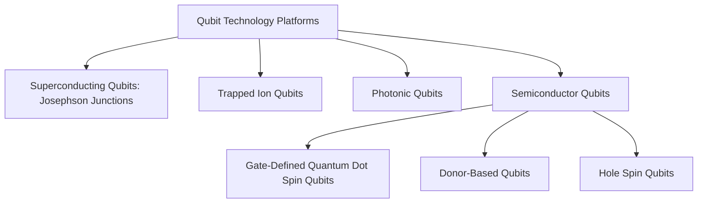
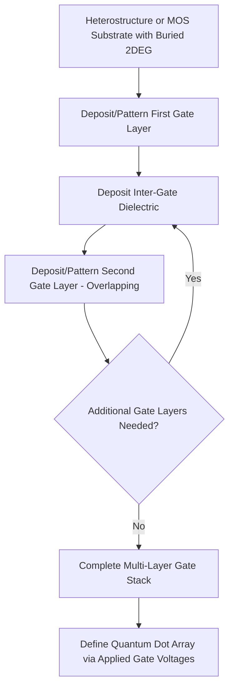
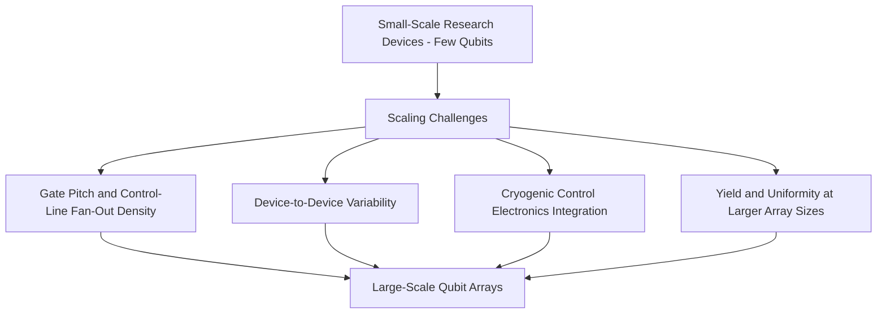

## Semiconductor Qubit Fabrication

### Overview

Semiconductor qubit fabrication encompasses the specialized materials growth, lithographic patterning, and process integration techniques used to build quantum bits (qubits) within semiconductor material systems — most prominently gate-defined quantum dot spin qubits in silicon and silicon-germanium heterostructures, and related donor-based and hole-spin qubit platforms. This fabrication discipline shares some tooling and process heritage with conventional CMOS manufacturing (lithography, thin-film deposition, etch) but operates under substantially different design rules, material purity requirements, and cryogenic operating constraints than conventional logic/memory fabrication.

### Position Within the Broader Qubit Technology Landscape

[Inference] Semiconductor spin qubits are frequently discussed alongside superconducting qubits as two of the more actively pursued solid-state qubit approaches, with semiconductor qubits' potential manufacturing compatibility with existing silicon industry infrastructure often cited as a distinguishing long-term scaling argument relative to other platforms, though semiconductor qubits currently trail superconducting qubits in demonstrated qubit count and gate fidelity at the time of this content's preparation, and relative platform standing continues to evolve with ongoing research progress.

### Material System Selection

#### Isotopically Purified Silicon

Natural silicon contains approximately 4.7% of the $^{29}\text{Si}$ isotope, which carries nonzero nuclear spin and consequently produces a fluctuating nuclear spin bath that decoheres nearby electron spin qubits via hyperfine interaction. **Isotopic purification** — enriching silicon to be overwhelmingly composed of the zero-nuclear-spin $^{28}\text{Si}$ isotope — substantially suppresses this decoherence channel:

- Isotopically purified $^{28}\text{Si}$ substrates (or epitaxial layers) are grown specifically to minimize residual $^{29}\text{Si}$ concentration, since even small residual concentrations of nuclear-spin-carrying isotope can dominate electron spin decoherence in an otherwise high-quality qubit device
- [Unverified] Specific achieved isotopic purity levels (residual $^{29}\text{Si}$ parts-per-million figures) vary across reported sources and specific enrichment processes; general purification strategy is described here rather than a fixed, universally-cited purity benchmark
- Silicon's comparatively weak spin-orbit coupling (relative to many III-V semiconductors) is a separate, complementary advantage for spin qubit coherence, since weak spin-orbit coupling reduces certain spin relaxation pathways

#### Silicon-Germanium (Si/SiGe) Heterostructures

- **Strained silicon quantum well**: a thin silicon layer grown under tensile strain (induced by an underlying, relaxed SiGe buffer/virtual substrate with different natural lattice constant) confines electrons in a 2D electron gas within the strained silicon layer, providing the starting material upon which gate-defined quantum dots are subsequently patterned
- **SiGe barrier layers**: wider-bandgap SiGe layers above and below the strained silicon quantum well confine carriers vertically, analogous in general heterostructure-confinement principle to III-V quantum well structures used in other semiconductor device contexts
- **Valley degeneracy considerations**: silicon's conduction band structure exhibits multiple nearly-degenerate conduction band valleys, and the strain/confinement conditions in a Si/SiGe quantum well determine the energy splitting between these valley states (**valley splitting**) — a design-relevant parameter, since insufficient valley splitting can introduce additional, unwanted low-energy states that complicate qubit initialization, control, and readout fidelity

#### Metal-Oxide-Semiconductor (MOS)-Based Platforms

- Alternative to the SiGe heterostructure approach, some spin qubit devices confine electrons directly at a silicon/silicon-dioxide interface, in a structure more directly analogous to a conventional MOSFET's inversion-layer channel
- **Interface trap density sensitivity**: because carriers are confined immediately at the Si/$SiO_2$ interface, MOS-based qubit device performance is sensitive to interface trap density and oxide quality, connecting qubit fabrication quality requirements directly to the same interface-quality metrics relevant to conventional MOSFET gate oxide engineering, though generally requiring higher standards of interface cleanliness and trap density than typical logic-transistor-grade oxide

### Gate Stack Design and Lithographic Patterning

Gate-defined quantum dot qubits require precisely patterned, multi-layer metal gate electrode structures positioned above the confined 2D electron gas, using voltage-controlled electrostatic confinement (as introduced in the discussion of quantum dot device physics) to define individual dot potential wells, tunnel barriers between adjacent dots, and coupling to source/drain reservoirs.

- **Electron-beam lithography**: because gate-defined quantum dot devices typically require nanoscale (sub-100 nm and often substantially smaller) gate feature sizes and pitches to achieve appropriately strong electrostatic confinement and inter-dot tunnel coupling, electron-beam lithography (rather than conventional optical lithography) is commonly used at the research-device scale, given its finer resolution capability, albeit at lower throughput than optical lithography — a tradeoff broadly acceptable for current research-scale device counts but a potential scaling bottleneck for larger qubit arrays
- **Overlapping multi-layer gate architectures**: many gate-defined qubit device designs use two or more overlapping metal gate layers, separated by thin dielectric layers, to achieve fine-pitch gate patterns beyond what a single lithographic exposure/etch layer could reliably achieve at the required feature density, with each gate layer's edges self-aligning relative to underlying layers through the overlap geometry
- **Ohmic contact formation**: source/drain reservoir contacts to the buried 2D electron gas require dedicated ohmic contact formation steps (e.g., dopant diffusion or implantation through defined contact windows), conceptually analogous to, but generally requiring more specialized process development than, standard CMOS source/drain contact formation, since the buried, relatively deep 2DEG location differs from a conventional MOSFET's near-surface channel

### Qubit Control and Readout Integration

- **Microwave control lines**: spin qubit control (e.g., electron spin resonance driving, or exchange-interaction-based gate voltage pulsing) requires integrated on-chip microwave-frequency control lines routed to individual gate electrodes, adding interconnect routing and crosstalk-management design considerations beyond simple DC gate biasing
- **Integrated charge sensors**: as introduced in the discussion of quantum dot device physics, qubit spin state readout commonly relies on converting spin information into a charge-state difference detectable by an adjacent single-electron-transistor-like charge sensor (e.g., a nearby quantum point contact or single-electron transistor), requiring these sensor structures to be fabricated in close proximity to the qubit dots themselves, adding layout density and fabrication-alignment requirements
- **Cryogenic packaging and wiring**: because these devices operate at millikelvin temperatures (dilution refrigerator range), fabrication and packaging must additionally account for cryogenic-compatible materials, wire bonding, and thermal contraction behavior distinct from room-temperature semiconductor device packaging considerations

### Donor-Based Qubits

An alternative semiconductor qubit approach uses individual dopant atoms (most commonly phosphorus in silicon) as the qubit, exploiting either the donor electron spin or the donor's nuclear spin as the quantum information carrier:

- **Ion implantation-based placement**: individual phosphorus donors can be introduced via low-dose, carefully controlled ion implantation, though achieving deterministic single-atom placement at a precise target location via implantation alone carries inherent statistical placement uncertainty
- **Scanning tunneling microscope (STM) hydrogen lithography**: an alternative, more deterministic donor-placement technique uses an STM tip to selectively remove hydrogen resist atoms from a hydrogen-terminated silicon surface at precisely chosen locations, followed by selective phosphine gas dosing and silicon overgrowth encapsulation, enabling atomically precise, deterministic single-donor (or few-donor) placement — a substantially more specialized and lower-throughput fabrication approach than conventional lithography-based gate-defined dot fabrication, but offering superior positional precision for specific donor-based qubit architectures
- **Long coherence times**: donor nuclear spins in isotopically purified silicon have been reported to exhibit particularly long coherence times among solid-state qubit platforms, motivating continued research interest in donor-based approaches despite their more specialized, lower-throughput fabrication requirements relative to gate-defined quantum dot approaches

### Hole Spin Qubits

More recently, qubits based on **hole spins** (rather than electron spins) in silicon or germanium have attracted growing research interest:

- **Stronger intrinsic spin-orbit coupling for holes**: valence-band holes generally exhibit stronger spin-orbit coupling than conduction-band electrons in silicon/germanium, which can be exploited to enable faster, all-electrical qubit control (avoiding the need for on-chip microwave control lines/magnetic driving used for many electron spin qubit control schemes) — a potentially fabrication-simplifying advantage, since eliminating microwave control line integration reduces certain interconnect routing and crosstalk challenges
- **Germanium-based hole qubit platforms**: strained germanium quantum well heterostructures (conceptually paralleling the Si/SiGe electron platform but inverted in terms of which layer hosts the confined carriers and confining holes rather than electrons) have been an area of increasing reported research activity as a hole-spin-qubit host material
- [Unverified] The relative maturity and specific reported performance metrics (coherence time, gate fidelity, achieved qubit counts) of hole-spin-qubit platforms relative to more established electron-spin gate-defined approaches continue to evolve rapidly in the current research literature and should be checked against up-to-date primary sources rather than assumed static

### Scaling Challenges Specific to Qubit Fabrication

- **Control-line fan-out and interconnect density**: as qubit array size grows, routing individually addressable control and readout lines to each qubit within realistic device area and cryogenic wiring constraints becomes an increasingly significant fabrication and system-integration challenge, distinct from the fundamental qubit device physics itself
- **Device-to-device variability**: charge disorder, interface trap variation, and lithographic edge-placement variation across a gate-defined qubit array can produce device-to-device variation in confinement potential, tunnel coupling, and valley splitting, generally exceeding the variability tolerances that would be considered acceptable in mature conventional CMOS manufacturing at comparable feature scale, and motivating ongoing materials and process refinement efforts
- **Cryogenic CMOS control electronics**: to avoid the wiring bottleneck of routing every control/readout line from room temperature down to the millikelvin-stage qubit chip individually, integrating some control/readout electronics directly at cryogenic temperatures near the qubit chip (**cryo-CMOS**) is an active area of system-level research, requiring conventional CMOS circuit design and fabrication adapted for reliable operation at cryogenic temperatures — a distinct but closely related engineering challenge to the qubit fabrication process itself

[Inference] Given that qubit count scaling for semiconductor spin qubits appears increasingly gated by these interconnect, variability, and cryogenic-control-integration challenges as much as by the fundamental qubit device physics, continued progress in semiconductor qubit technology plausibly depends substantially on parallel advances in cryogenic control electronics and high-yield, low-variability nanofabrication process development, rather than qubit physics improvements alone.

### Comparison of Semiconductor Qubit Fabrication Approaches

| Approach | Placement Precision | Fabrication Complexity | Key Advantage |
| --- | --- | --- | --- |
| Gate-defined (Si/SiGe or MOS) | Lithography-set, moderate precision | Multi-layer overlapping gates, e-beam lithography | Electrical tunability, relatively higher qubit-count demonstrations |
| Donor-based (implantation) | Statistical placement uncertainty | Low-dose implantation, activation anneal | Simpler process flow than STM approach |
| Donor-based (STM hydrogen lithography) | Atomically precise, deterministic | Highly specialized, low-throughput STM-based process | Best achievable positional precision |
| Hole spin (Ge-based) | Lithography-set, similar to electron gate-defined | Similar to Si/SiGe gate-defined, germanium-specific growth | All-electrical control potential |

[Unverified] Relative qubit-count and fidelity achievements across these approaches change with ongoing research progress; the comparison reflects general structural/fabrication-approach tradeoffs rather than a fixed, current-state performance ranking, which should be checked against up-to-date primary literature for any specific quantitative claim.

### Materials Purity and Process Cleanliness Requirements

- **Charge noise sensitivity**: gate-defined qubit performance is highly sensitive to charge traps and defects in surrounding dielectrics and interfaces, since fluctuating trapped charge produces electrical noise that directly couples to and degrades qubit coherence — motivating materials and process purity standards that in some respects exceed even those applied in advanced logic transistor fabrication, despite qubit devices generally using much larger minimum feature sizes than leading-edge logic transistors
- **Substrate and epitaxial layer quality**: for Si/SiGe heterostructure platforms specifically, minimizing threading dislocations and interface roughness in the strained silicon quantum well and surrounding SiGe layers is essential both for achieving adequate carrier mobility and for achieving sufficient valley splitting, connecting epitaxial growth quality directly to qubit operational fidelity in a manner with some conceptual parallel to how epitaxial quality affects conventional strained-channel CMOS performance, though with generally more stringent qubit-specific quality requirements

### Practical Outlook

[Inference] Given the combination of specialized isotopic purification, ultra-low-noise materials/interface requirements, nanoscale multi-layer gate patterning, and emerging cryo-CMOS control integration needs, semiconductor qubit fabrication is best understood as a specialized research-and-early-development manufacturing discipline that borrows selected tooling and process concepts from conventional CMOS fabrication (lithography, thin-film deposition) while imposing substantially different, and in several respects more stringent, materials purity and device uniformity requirements — positioning it, at the time of this content's preparation, as a technology under active scaling development rather than an established, high-volume manufacturing process comparable to mainstream logic or memory fabrication.

**Related Topics**

- Quantum dot device physics (foundational confinement and single-electron physics)
- Isotopic purification techniques for $^{28}\text{Si}$ substrate and epitaxial growth
- Si/SiGe heterostructure epitaxy and valley splitting engineering
- STM hydrogen lithography for deterministic donor qubit placement
- Cryo-CMOS control electronics for scalable qubit readout and control
- Comparison with superconducting qubit fabrication (Josephson junction processes)
- Charge noise characterization and materials purity standards for quantum devices