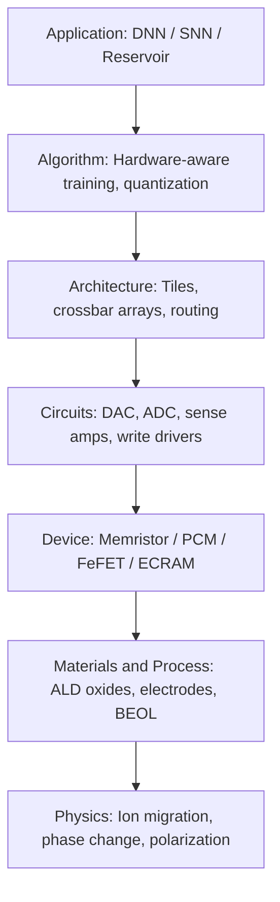

## Memristive Devices and Neuromorphic Computing


### Overview and Motivation

Conventional digital computers separate memory from processing (the von Neumann architecture). Every operation shuttles data across a bus, which costs time and energy — the so-called *von Neumann bottleneck* or *memory wall*. Biological brains, by contrast, co-locate memory and computation in synapses and neurons, operate with sparse, event-driven signaling, and consume roughly 20 W for the whole brain.

**Neuromorphic computing** seeks to emulate these principles in hardware. **Memristive devices** — two-terminal nonvolatile resistive elements whose conductance depends on their history of applied voltage/current — are the leading candidate for compact, dense, low-power artificial synapses (and, in some cases, neurons).

**Key Points**

- Memristors store information as a physical state (conductance) and can compute in place via Ohm's and Kirchhoff's laws.
- Synaptic weights map naturally to device conductance; crossbar arrays perform vector–matrix multiplication (VMM) in a single step, in the analog domain.
- Practical systems are limited by device variability, nonlinearity, endurance, retention, and peripheral-circuit overhead, not just by the memristor itself.

---

### Theoretical Foundations

#### The Memristor Concept

In 1971, Leon Chua postulated a fourth fundamental two-terminal circuit element, completing the symmetry among the four circuit variables: voltage $v$, current $i$, charge $q$, and magnetic flux linkage $\varphi$.

| Element | Relation | Definition |
| --- | --- | --- |
| Resistor | $v$–$i$ | $dv = R\,di$ |
| Capacitor | $q$–$v$ | $dq = C\,dv$ |
| Inductor | $\varphi$–$i$ | $d\varphi = L\,di$ |
| Memristor | $\varphi$–$q$ | $d\varphi = M\,dq$ |

The charge-controlled memristor is defined by:

$$v(t) = M\big(q(t)\big)\, i(t)$$

where $M(q)$ is the memristance, with units of ohms. Because $M$ depends on the integral of current, the device "remembers" past current flow.

#### Memristive Systems

Chua and Kang (1976) generalized the idea to **memristive systems**:

$$v = R(\mathbf{x}, i)\, i, \qquad \frac{d\mathbf{x}}{dt} = f(\mathbf{x}, i)$$

where $\mathbf{x}$ is a vector of internal state variables. Nearly all physical "memristors" (ReRAM, PCM, etc.) are more accurately memristive systems.

#### Signature Fingerprint: Pinched Hysteresis Loop

The defining experimental signature is a $i$–$v$ curve that:

1. Passes through the origin for any periodic bipolar input (the loop is "pinched" at $v = 0,\ i = 0$).
2. Shrinks in lobe area as the drive frequency increases, tending toward a single-valued (linear or nonlinear) function at high frequency.

**Key Points**

- A pinched hysteresis loop is necessary but not sufficient to prove a device is a memristor; artifacts such as capacitive or inductive effects can produce similar shapes.
- Whether the HP Labs 2008 device was the "missing" ideal memristor remains debated in the literature; the memristive-system framework is the safer description.

---

### Physical Mechanisms of Resistive Switching

#### The HP Linear Ion Drift Model

The 2008 HP Labs report (Strukov et al.) modeled a TiO$_2$ thin film with a doped (low-resistance) region of width $w$ and an undoped (high-resistance) region, in total thickness $D$:

$$v(t) = \left[R_{ON}\frac{w(t)}{D} + R_{OFF}\left(1 - \frac{w(t)}{D}\right)\right] i(t)$$


$$\frac{dw(t)}{dt} = \mu_v \frac{R_{ON}}{D}\, i(t)$$

where $\mu_v$ is the average ion mobility. Integrating gives the memristance as a function of charge:

$$M(q) = R_{OFF}\left(1 - \frac{\mu_v R_{ON}}{D^2}\, q(t)\right)$$

The model is pedagogically useful but physically oversimplified: it lacks the strong nonlinearity of ionic transport and boundary effects. **Window functions** $F(x)$ (Joglekar, Biolek, Prodromakis) are added to the state equation to enforce boundary behavior:

$$\frac{dx}{dt} = \frac{\mu_v R_{ON}}{D^2}\, i(t)\, F(x), \qquad x = \frac{w}{D}$$

For example, the Joglekar window is $F(x) = 1 - (2x - 1)^{2p}$.

#### Mechanism Classes

**1. Valence Change Mechanism (VCM) / Anion-migration filaments**

- Materials: HfO$_x$, TaO$_x$, TiO$_x$, and other transition-metal oxides.
- Oxygen vacancies ($V_O^{2+}$) migrate under field and Joule heating, forming or rupturing a conductive filament.
- Typically bipolar switching; forming step required in many devices.

**2. Electrochemical Metallization (ECM) / Cation-migration filaments**

- Structure: active electrode (Ag, Cu) / solid electrolyte or dielectric / inert electrode (Pt, W).
- Metal cations oxidize at the active electrode, drift, and reduce to grow a metallic filament.
- Very low-voltage, high-ON/OFF-ratio switching; filament can be volatile (diffusive memristors) or nonvolatile depending on the stack.

**3. Thermochemical Mechanism (TCM)**

- Unipolar switching driven primarily by Joule heating (e.g., NiO).
- Less common in neuromorphic work because of high current and poor controllability.

**4. Phase-Change Memory (PCM)**

- Materials: chalcogenides such as Ge$_2$Sb$_2$Te$_5$ (GST).
- Crystalline (low resistance) vs. amorphous (high resistance) phases; SET by crystallization (moderate heating), RESET by melt-quench.
- Multilevel conductance via partial crystallization; suffers from resistance drift in the amorphous phase.

**5. Ferroelectric Devices**

- FeFET, ferroelectric tunnel junction (FTJ), and ferroelectric capacitors (e.g., doped HfO$_2$).
- Polarization domains switch under field, modulating channel conductance or tunneling probability.
- Field-driven, low energy, but limited multilevel/analog linearity in some implementations.

**6. Magnetic Devices (STT-MRAM / SOT-MRAM)**

- Magnetic tunnel junction (MTJ) resistance depends on the relative magnetization of two layers (tunnel magnetoresistance, TMR).
- Naturally binary; analog behavior is possible via domain-wall motion or probabilistic switching, and MTJs are also used as stochastic neurons.

**7. Electrochemical / Ion-Insertion Synaptic Transistors (ECRAM)**

- Three-terminal devices that shuttle ions (e.g., Li$^+$, H$^+$, O$^{2-}$) into a channel to tune conductance.
- Excellent linearity and symmetry of weight updates; separate read/write paths; typically slower and harder to integrate than two-terminal devices.

**8. Mott Insulator-Metal Transition Devices**

- Materials: VO$_2$, NbO$_2$.
- Threshold switching (volatile) from a temperature- or field-driven insulator-to-metal transition, enabling oscillator and spiking-neuron circuits.

#### Comparison of Device Technologies

| Technology | Terminals | Volatility | Analog Levels | Typical Speed | Endurance (order of magnitude) | Key Strength | Key Weakness |
| --- | --- | --- | --- | --- | --- | --- | --- |
| VCM ReRAM | 2 | Nonvolatile | Moderate | ns–µs | $10^6$–$10^{10}$ cycles | Scalable, CMOS-compatible | Variability, forming |
| ECM (CBRAM) | 2 | Non-/volatile | Moderate | ns–µs | $10^3$–$10^7$ | Low voltage | Retention/variability |
| PCM | 2 | Nonvolatile | Good | 10 ns–µs | $10^6$–$10^9$ | Mature, multilevel | Drift, high RESET current |
| FeFET/FTJ | 3 / 2 | Nonvolatile | Limited–moderate | ns–µs | $10^5$–$10^{10}$ | Low energy | Variability, wake-up/fatigue |
| MRAM | 2 | Nonvolatile | Binary (mostly) | ns | $>10^{12}$ | Endurance, speed | Low ON/OFF ratio |
| ECRAM | 3 | Nonvolatile | Excellent | µs–ms | $10^7$+ (reported) | Linear, symmetric updates | Speed, integration |
| Mott (VO$_2$/NbO$_2$) | 2 | Volatile | N/A (threshold) | ns | $10^9$+ | Compact oscillator/neuron | Thermal, temperature sensitive |

[Inference] The endurance and speed values above are representative ranges drawn from typical published reports; specific numbers vary widely by materials stack, device size, and measurement protocol.

---

### Device Metrics for Neuromorphic Use

A memristor used as an analog synapse must be judged on properties different from those that matter for digital memory.

| Metric | Why It Matters |
| --- | --- |
| Number of distinguishable conductance levels | Sets effective weight precision (bit depth) |
| Dynamic range $G_{max}/G_{min}$ | Sets weight range and signal-to-noise |
| Linearity of $\Delta G$ vs. pulse number | Nonlinear updates degrade online-training accuracy |
| Symmetry of potentiation vs. depression | Asymmetry biases weights and causes drift in training |
| Cycle-to-cycle variability | Stochastic error in each write |
| Device-to-device variability | Fixed-pattern error across the array |
| Read noise (RTN, 1/f) | Limits inference precision |
| Retention | Time stability of programmed weights |
| Endurance | Number of write cycles before failure (critical for training) |
| Write energy and latency | System-level efficiency |
| Conductance drift | Especially PCM; can be compensated |
| Read-disturb tolerance | Repeated inference must not alter state |

A common phenomenological update model for potentiation is:

$$G_{n+1} = G_n + \alpha_p \left(G_{max} - G_n\right)$$

and for depression:

$$G_{n+1} = G_n - \alpha_d \left(G_n - G_{min}\right)$$

where $\alpha_p,\ \alpha_d$ are update-rate parameters. Linear, symmetric devices satisfy $\alpha_p \approx \alpha_d \to 0$ with constant step size; real devices exhibit saturating behavior as above.

---

### Crystalline Building Block: Crossbar Arrays

#### Architecture

A crossbar places a memristor at every intersection of $M$ horizontal word lines (rows) and $N$ vertical bit lines (columns). With conductance $G_{ij}$ at the crossing of row $i$ and column $j$, applying input voltages $V_i$ on rows and grounding columns yields column currents:

$$I_j = \sum_{i=1}^{M} G_{ij}\, V_i \qquad\Longleftrightarrow\qquad \mathbf{I} = \mathbf{G}^{T}\mathbf{V}$$

Ohm's law performs each multiplication and Kirchhoff's current law performs each accumulation, so an entire $M \times N$ vector–matrix product finishes in one read step with $O(1)$ time complexity in the analog domain, independent of matrix size (ignoring periphery).

(svg_diagram) Crossbar array performing vector–matrix multiplication:

<svg xmlns="http://www.w3.org/2000/svg" viewBox="0 0 520 380" width="520" height="380" font-family="sans-serif" font-size="12">
<title>(svg_diagram) Memristor crossbar vector-matrix multiplication</title>
<text x="260" y="20" text-anchor="middle" font-weight="bold">(svg_diagram) Memristor Crossbar: I_j = Σ G_ij · V_i</text>

<line x1="60" y1="80" x2="400" y2="80" stroke="#333" stroke-width="2" />
<line x1="60" y1="150" x2="400" y2="150" stroke="#333" stroke-width="2" />
<line x1="60" y1="220" x2="400" y2="220" stroke="#333" stroke-width="2" />

<line x1="140" y1="50" x2="140" y2="290" stroke="#333" stroke-width="2" />
<line x1="230" y1="50" x2="230" y2="290" stroke="#333" stroke-width="2" />
<line x1="320" y1="50" x2="320" y2="290" stroke="#333" stroke-width="2" />

<circle cx="140" cy="80" r="9" fill="#f5a623" stroke="#333" />
<circle cx="230" cy="80" r="9" fill="#f5a623" stroke="#333" />
<circle cx="320" cy="80" r="9" fill="#f5a623" stroke="#333" />
<circle cx="140" cy="150" r="9" fill="#f5a623" stroke="#333" />
<circle cx="230" cy="150" r="9" fill="#f5a623" stroke="#333" />
<circle cx="320" cy="150" r="9" fill="#f5a623" stroke="#333" />
<circle cx="140" cy="220" r="9" fill="#f5a623" stroke="#333" />
<circle cx="230" cy="220" r="9" fill="#f5a623" stroke="#333" />
<circle cx="320" cy="220" r="9" fill="#f5a623" stroke="#333" />

<text x="40" y="84" text-anchor="end">V1</text>
<text x="40" y="154" text-anchor="end">V2</text>
<text x="40" y="224" text-anchor="end">V3</text>

<text x="140" y="312" text-anchor="middle">I1</text>
<text x="230" y="312" text-anchor="middle">I2</text>
<text x="320" y="312" text-anchor="middle">I3</text>

<rect x="120" y="322" width="40" height="22" fill="#d0e8ff" stroke="#333" />
<text x="140" y="338" text-anchor="middle">ADC</text>
<rect x="210" y="322" width="40" height="22" fill="#d0e8ff" stroke="#333" />
<text x="230" y="338" text-anchor="middle">ADC</text>
<rect x="300" y="322" width="40" height="22" fill="#d0e8ff" stroke="#333" />
<text x="320" y="338" text-anchor="middle">ADC</text>

<circle cx="440" cy="120" r="9" fill="#f5a623" stroke="#333" />
<text x="455" y="124">G_ij</text>
<text x="420" y="150">Memristor</text>
<text x="420" y="166">conductance</text>
</svg>

#### Selector Devices and the Sneak-Path Problem

In a passive crossbar, current can flow through unselected cells via "sneak paths," corrupting reads and writes. Solutions:

| Approach | Description | Trade-off |
| --- | --- | --- |
| 1T1R | One access transistor per memristor | Robust; larger cell area, breaks pure 4F$^2$ density |
| 1S1R | Two-terminal nonlinear selector (Ovonic threshold switch, Mott, mixed-ionic-electronic conduction, tunnel-based) in series | Retains high density; selector must be fast, high-current, and low-leakage |
| Self-rectifying / self-selecting cells | The memristive stack has intrinsic nonlinearity | Reduced flexibility; design-specific |
| Complementary resistive switch (CRS) | Anti-serial pair of devices | Destructive read; extra cycles |

For analog VMM, 1T1R is common in prototype chips because it offers gate-controlled compliance for precise programming.

#### Non-Idealities in Analog VMM

- **Line resistance (IR drop):** Wire resistance causes voltage to decay along rows/columns, so cells far from drivers see reduced effective voltage.
- **Device nonlinearity of $I$–$V$:** Breaks the ideal linear $I = GV$ assumption; often mitigated by low read voltages or encoding inputs as pulse widths/counts.
- **Conductance variability and noise.**
- **Finite ADC/DAC resolution:** Periphery often dominates area and energy budgets.
- **Negative weights:** Conductance is inherently positive, so signed weights use differential pairs ($w = G^{+} - G^{-}$) or offset columns:

$$w_{ij} \propto G^{+}_{ij} - G^{-}_{ij}$$


---

### Memristors as Synapses

#### Weight Mapping

A trained weight $w$ is mapped linearly to a conductance in the device's dynamic range:

$$G = G_{min} + \frac{w - w_{min}}{w_{max} - w_{min}}\left(G_{max} - G_{min}\right)$$

#### Programming Schemes

- **Open-loop (one-shot) programming:** Apply a calibrated pulse; fast, but limited by variability.
- **Closed-loop write-verify:** Pulse, read, compare against the target, repeat until within tolerance. Higher precision at the cost of time and energy.
- **Incremental step pulse programming (ISPP):** Progressive amplitude/width ramp to avoid overshoot.
- **Hybrid in-situ training:** Coarse weights on-chip, fine-tuned per device.

#### Synaptic Plasticity Rules Implemented by Memristors

**Spike-Timing-Dependent Plasticity (STDP)**

STDP updates the synaptic weight based on the relative timing $\Delta t = t_{post} - t_{pre}$ of pre- and post-synaptic spikes:

$$\Delta w = \begin{cases} A_{+}\, e^{-\Delta t/\tau_{+}}, & \Delta t > 0 \quad (\text{potentiation}) \\ -A_{-}\, e^{\Delta t/\tau_{-}}, & \Delta t < 0 \quad (\text{depression}) \end{cases}$$

Memristors realize STDP by having overlapping pre- and post-spike waveforms produce a net voltage across the device that exceeds the switching threshold only when spikes are temporally correlated.

**Other Biological Learning Behaviors**

- Short-term plasticity (STP), paired-pulse facilitation/depression (often via volatile diffusive memristors).
- Long-term potentiation/depression (LTP/LTD).
- Homeostatic scaling and metaplasticity (demonstrated in a limited number of experimental systems).

---

### Memristors as Neurons

Although synapses are the main target, certain devices emulate neuron dynamics:

#### Leaky Integrate-and-Fire (LIF) Neuron

The canonical model:

$$C_m \frac{dV_m}{dt} = -\frac{V_m - V_{rest}}{R_m} + I_{syn}(t)$$

When $V_m \ge V_{th}$, the neuron fires a spike and $V_m$ resets to $V_{reset}$.

**Hardware implementations:**

- **Volatile threshold switches (Ag-based diffusive memristors, NbO$_2$, VO$_2$)** in series with a capacitor: the capacitor integrates current until the threshold switch turns ON, discharging and emitting a spike.
- **PCM-based neurons:** Membrane potential stored as progressive crystallization; a threshold crossing triggers output and a RESET.
- **Mott relaxation oscillators:** Two-terminal, compact spiking generators.

#### Hodgkin–Huxley-Like Behavior

Two NbO$_2$ Mott memristors combined with passive elements have reproduced a range of neuron-like behaviors (action potentials, spike-frequency adaptation, bursting) in published demonstrations. [Inference] Fidelity to biological detail is qualitative rather than quantitative in most reports.

---

### Neuromorphic Architectures and Computing Paradigms

#### Artificial Neural Networks (ANNs) on Crossbars

- **Inference acceleration:** Weights are pre-trained offline and programmed onto arrays; forward passes exploit analog VMM. The most mature use case.
- **Convolutional layers:** Kernels are unrolled into matrix columns (im2col) and mapped to the array; activations stream in as voltage inputs.
- **Recurrent networks and LSTMs:** Multiple crossbars store gate matrices with digital or analog peripherals for nonlinearities.
- **Transformers/attention:** Static weight projections map well to crossbars; dynamic attention matrices are harder because they need frequent rewriting.

#### Spiking Neural Networks (SNNs)

- Information is encoded in spike timing/rate rather than analog values.
- Event-driven operation means energy is consumed only when spikes occur.
- Memristive crossbars act as synaptic matrices; input spikes trigger read pulses, and columns integrate current into LIF neurons.
- Supports on-chip unsupervised or reward-modulated learning through STDP variants.

#### Reservoir Computing

- A fixed, nonlinear dynamical "reservoir" projects input into a high-dimensional space, and only a linear readout is trained.
- Volatile memristors with short-term memory serve as physical reservoir nodes, offering temporal processing with a small training cost.

#### Hyperdimensional and In-Memory Associative Computing

- **Content-addressable memories (CAM/TCAM)** built from memristors accelerate search, few-shot learning, and memory-augmented networks.
- **Hyperdimensional computing** uses high-dimensional binary/bipolar vectors, tolerant of device noise, and is well suited to noisy analog hardware.

#### Stochastic Computing and Probabilistic Neural Networks

- Intrinsic switching stochasticity (cycle-to-cycle variability) is exploited as a resource: Bayesian neural networks, Boltzmann machines, and Monte Carlo sampling.
- Probabilistic bits (p-bits), often built from low-barrier MTJs, implement stochastic neurons for optimization and sampling.

#### Neuromorphic Platforms (Reference Landscape)

| System | Approach | Notes |
| --- | --- | --- |
| IBM TrueNorth | Digital CMOS, event-driven | Not memristive; a reference for neuromorphic scale |
| Intel Loihi / Loihi 2 | Digital CMOS spiking with on-chip learning | Not memristive; commonly compared against |
| SpiNNaker | ARM-based digital many-core | Not memristive; large-scale SNN simulation |
| BrainScaleS | Mixed-signal analog CMOS | Accelerated-time analog neurons |
| IBM PCM analog AI chips | PCM crossbar for DNN inference | Research prototypes demonstrated |
| Academic ReRAM CIM macros | Compute-in-memory ReRAM arrays | Multiple published macros; e.g., from academic and industrial groups |

[Inference] Product- and platform-level details continue to evolve rapidly; consult recent literature for current specifications.

---

### In-Situ Learning and Training

Training on memristive hardware is harder than inference because it requires many, precise, symmetric weight updates.

#### Backpropagation Through Crossbars

For a layer with weights $\mathbf{W}$:

- **Forward pass:** $\mathbf{y} = f(\mathbf{W}\mathbf{x})$ — VMM on the array.
- **Backward pass:** $\boldsymbol{\delta}_{prev} = \mathbf{W}^{T}\boldsymbol{\delta}$ — VMM in the transposed direction using the same array (rows and columns swap roles).
- **Weight update:** $\Delta \mathbf{W} = -\eta\, \boldsymbol{\delta}\, \mathbf{x}^{T}$ — an outer product.

#### Parallel Outer-Product Update

Rows receive pulses encoding $x_i$; columns receive pulses encoding $\delta_j$. Coincident pulse overlap at cell $(i,j)$ programs $\Delta G_{ij} \propto x_i \delta_j$ — parallel across the whole array in $O(1)$ steps.

#### Challenges and Mitigations

| Challenge | Mitigation |
| --- | --- |
| Nonlinear/asymmetric updates | Device engineering (e.g., ECRAM), pulse-shape optimization, asymmetry-aware algorithms |
| Limited precision | Mixed-precision training: accumulate gradients digitally, transfer to analog periodically |
| Endurance | Reduce write frequency; hybrid weight storage (e.g., volatile + nonvolatile pair) |
| Variability | Hardware-aware training with injected noise; ensemble or redundancy |
| Weight drift (PCM) | Periodic recalibration; drift compensation circuits |
| Zero-weight-point mismatch | Reference devices; algorithmic compensation (e.g., Tiki-Taka-style algorithms) |

[Inference] The relative effectiveness of these mitigations depends on device type and network; published comparisons are not always directly comparable across groups.

---

### Circuit and System Integration

#### Peripheral Circuits

- **DACs / pulse generators:** Convert digital activations to voltage amplitudes or pulse trains.
- **Sense amplifiers / TIAs:** Convert column currents to voltages.
- **ADCs:** Digitize outputs; ADC area/energy frequently dominates. Approaches include shared ADCs, low-resolution ADCs, and bit-serial input schemes.
- **Non-linear activation units:** Digital or analog implementations (ReLU, sigmoid).
- **Write drivers and verify logic:** For programming.

#### Energy and Efficiency Reasoning

A first-order energy model for a single VMM read:

$$E_{VMM} \approx \sum_{i,j} G_{ij} V_i^{2} T_{read} + E_{DAC} + E_{ADC} + E_{periph}$$

The array itself is efficient; the periphery frequently dominates. Reducing read voltage and pulse duration reduces array energy but worsens signal-to-noise.

**Efficiency metrics:** TOPS/W (tera-operations per second per watt), TOPS/mm$^2$, and accuracy under noise. [Unverified] Headline TOPS/W numbers from prototypes are often not comparable because of differing precision, array size, and what is included in the energy accounting.

#### Three-Dimensional and Heterogeneous Integration

- **3D vertical RRAM (VRRAM) and stacked crossbars** increase density.
- **Back-end-of-line (BEOL) integration** places memristors between metal layers above CMOS logic.
- **Chiplet and monolithic 3D** approaches co-package memristive arrays with digital control.

---

### Fabrication of Memristive Devices

#### Typical Device Stack (VCM ReRAM Example)

```plaintext
Top Electrode (TE)         e.g., TiN, Ti/Pt, W
Switching Layer            e.g., HfO2 (3-10 nm)
Oxygen-exchange Layer      e.g., Ti or TaOx
Bottom Electrode (BE)      e.g., TiN, Pt, W
Substrate / CMOS BEOL      SiO2 / Si
```

#### Process Flow (Representative)

1. **Substrate preparation:** CMOS front-end with transistors (for 1T1R) and lower metal layers.
2. **Bottom electrode deposition:** Sputtering or ALD/PVD of TiN, Pt, or W; patterned by lithography and etch or damascene.
3. **Switching-layer deposition:** Atomic layer deposition (ALD) for thickness control and conformality (HfO$_2$, Al$_2$O$_3$, Ta$_2$O$_5$); reactive sputtering or PLD in research settings.
4. **Oxygen-exchange/interface layer:** Metal reactive deposition to create oxygen-deficient layers.
5. **Top electrode deposition:** Sputtering (TiN, Pt, Ti); optional capping layer.
6. **Patterning:** Photolithography plus dry etch (RIE), or electron-beam lithography in research; feature sizes from micrometer to sub-20 nm.
7. **Passivation and via formation:** Dielectric encapsulation, contact opening, and BEOL metal connection.
8. **Forming/electroforming:** Initial high-voltage step to generate the first filament (for many VCM devices).
9. **Electrical characterization:** DC I–V sweeps, pulsed switching, endurance, retention at elevated temperature.

#### Fabrication Considerations

- **CMOS compatibility:** Thermal budget limits (typically ≲ 400 °C for BEOL); avoid contaminants (some noble metals, Cu, Ag in front-end lines).
- **Interface engineering:** Electrode work function, oxygen scavenging, and interfacial layers strongly affect switching uniformity.
- **Scaling:** Filamentary devices scale well (sub-10 nm demonstrated in research); area-dependent (interface-type) devices scale differently.
- **Variability sources:** Filament-formation randomness, oxygen-vacancy distribution, line-edge roughness, and film thickness nonuniformity.
- **Yield and uniformity at wafer scale:** Critical for large arrays; drives adoption of ALD and tightly controlled BEOL processes.
- **Emerging materials:** 2D materials (h-BN, MoS$_2$) for memristive switching, organic and polymer memristors, and perovskite-based devices, mainly at research stage.

---

### Modeling and Simulation

#### Compact Models

| Model | Idea |
| --- | --- |
| HP linear/nonlinear drift | State-variable drift with window functions |
| Simmons tunnel barrier | Tunneling gap width as state variable |
| Yakopcic | Generalized memristor model with tunable threshold and window |
| VTEAM | Voltage-threshold adaptive model |
| Stanford–PKU RRAM model | Physics-inspired gap-growth filament model |
| JART VCM | Physics-based model including Joule heating and ion transport |

#### Example: Simple Python Crossbar Simulation with Variability

**Example**

```python
import numpy as np

rng = np.random.default_rng(0)

# Trained weights (signed), small layer
W = rng.normal(0, 0.5, size=(4, 3))

# Device parameters (siemens)
G_min, G_max = 1e-6, 1e-4

# Map signed weights onto differential conductance pairs
w_max = np.abs(W).max()
scale = (G_max - G_min) / w_max
G_pos = G_min + np.clip(W, 0, None) * scale
G_neg = G_min + np.clip(-W, 0, None) * scale

# Add device-to-device lognormal variability (~5% sigma)
sigma = 0.05
G_pos_noisy = G_pos * rng.lognormal(0, sigma, G_pos.shape)
G_neg_noisy = G_neg * rng.lognormal(0, sigma, G_neg.shape)

# Input voltage vector (read voltages, volts)
V = np.array([0.1, 0.2, 0.05, 0.15])

# Analog VMM: column currents
I_pos = V @ G_pos_noisy
I_neg = V @ G_neg_noisy
I_out = I_pos - I_neg

# Convert back to weight-domain result
y_analog = I_out / scale
y_ideal = V @ W

print("Ideal:  ", np.round(y_ideal, 4))
print("Analog: ", np.round(y_analog, 4))
print("Error:  ", np.round(y_analog - y_ideal, 4))
```

**Output**

The script prints the ideal digital result, the noisy analog result, and their difference. [Inference] With ~5% lognormal conductance variation, per-output errors typically appear on the order of a few percent of the output magnitude, but exact values depend on the random seed and weight distribution.

#### Example: Simple HP-Style Memristor Simulation

```python
import numpy as np

# Parameters
R_on, R_off = 100.0, 16e3      # ohms
D = 10e-9                      # thickness (m)
mu_v = 1e-14                   # ion mobility (m^2 / (V*s))
x = 0.1                        # initial normalized state w/D

dt = 1e-5
t = np.arange(0, 2.0, dt)
V = 1.0 * np.sin(2 * np.pi * 1.0 * t)  # 1 Hz sine drive

I = np.zeros_like(t)
X = np.zeros_like(t)

def window(x, p=2):
    return 1 - (2*x - 1)**(2*p)   # Joglekar window

for k in range(len(t)):
    M = R_on * x + R_off * (1 - x)
    I[k] = V[k] / M
    X[k] = x
    dx = (mu_v * R_on / D**2) * I[k] * window(x)
    x = np.clip(x + dx * dt, 0.0, 1.0)

# Plotting I vs V would show a pinched hysteresis loop.
```

**Output**

Plotting `I` against `V` yields a pinched hysteresis loop through the origin whose lobe area shrinks as the drive frequency rises.

#### Simulation Frameworks (Reference)

- **NeuroSim / DNN+NeuroSim:** Benchmarking circuit-level performance of compute-in-memory accelerators.
- **IBM Analog Hardware Acceleration Kit (aihwkit):** PyTorch-based simulation of analog crossbar training and inference with device models.
- **MemTorch:** PyTorch extension for memristive-device-aware simulation.
- **CrossSim (Sandia):** Analog crossbar simulator.
- **SPICE-level models (Verilog-A):** For circuit-accurate simulation of devices and peripherals.

[Inference] Available features and maintenance status of these tools may change; verify against their current repositories/documentation.

---

### Mermaid Overview: System Stack



---

### Applications

- **Edge AI inference:** Low-power keyword spotting, vision, anomaly detection where energy per inference is critical.
- **In-memory computing for linear algebra:** Solving linear systems, PDE acceleration, and signal processing (e.g., DFT/matrix operations) via analog crossbars.
- **Associative memory and search:** TCAM-based nearest-neighbor and few-shot learning.
- **Sensory neuromorphic systems:** Event-based vision and tactile sensing combined with spiking hardware.
- **Optimization and sampling:** Ising machines, Boltzmann sampling, and stochastic optimization with probabilistic devices.
- **Security primitives:** Physical unclonable functions (PUFs) and true random number generators exploiting intrinsic device variability.
- **Brain–machine interfaces and adaptive prosthetics:** Low-power adaptive filtering (largely exploratory).

---

### Challenges and Open Problems

**Key Points**

- **Variability and reliability:** Cycle-to-cycle and device-to-device spread remains the dominant barrier to high-precision analog computing at scale.
- **Precision:** Analog weights typically give effective 4–8 bit precision; more demanding workloads need hybrid digital–analog designs.
- **Peripheral overhead:** ADC/DAC energy and area can negate array-level gains.
- **Training support:** Nonlinear/asymmetric updates and limited endurance complicate on-chip training.
- **Retention and drift:** PCM drift and filament relaxation cause weight decay; compensation adds overhead.
- **Scalability of interconnect:** IR drop and parasitics grow with array size, limiting practical tile dimensions.
- **Software stack and benchmarking:** Lack of standardized compilers, benchmarks, and metrics complicates fair comparison against digital accelerators.
- **Biological fidelity vs. engineering utility:** Deciding how closely hardware should mimic biology remains an open design question; many practical wins come from the in-memory-compute idea rather than from bio-realism.

---

### Conclusion

Memristive devices provide a physical substrate that fuses memory and computation, enabling dense, energy-efficient analog matrix operations and hardware realizations of synapses and neurons. Their diverse mechanisms (VCM, ECM, PCM, ferroelectric, magnetic, ionic, and Mott) offer a rich design space, but each brings distinct trade-offs in linearity, endurance, speed, and variability. Realizing the neuromorphic promise requires co-optimization across materials, devices, circuits, architectures, and algorithms, with hardware-aware training and hybrid digital–analog design serving as the near-term pragmatic route.

---

### Related Topics

**Next Steps**

- Resistive RAM (ReRAM/RRAM) device physics and forming/switching kinetics
- Phase-change memory materials and drift compensation
- Ferroelectric HfO$_2$ (FeFET, FTJ) and wake-up/fatigue behavior
- Spin-based devices: STT/SOT-MRAM and probabilistic bits
- Compute-in-memory (CIM) macro design and ADC-efficient readout
- Spiking neural network algorithms and STDP learning rules
- Hardware-aware training, quantization, and noise-injection methods
- Selector devices and 3D crossbar integration
- Reservoir computing with volatile memristors
- Reliability engineering: endurance, retention, and read-disturb characterization
- Neuromorphic sensors and event-based vision pipelines
- Benchmarking and simulation tools (NeuroSim, aihwkit, MemTorch)