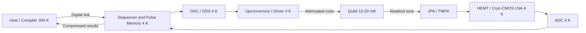

## Cryogenic CMOS for Quantum Control


### Overview and Motivation

Large-scale quantum computers built from superconducting transmon qubits or semiconductor spin qubits operate at millikelvin temperatures inside dilution refrigerators. Today, each qubit is controlled and read out by room-temperature electronics (arbitrary waveform generators, mixers, digitizers, FPGAs) connected through dedicated coaxial lines. This approach scales poorly: every qubit needs on the order of one to several cables, each of which conducts heat into the cryostat, occupies volume, and adds cost and failure risk.

**Cryogenic CMOS (cryo-CMOS)** places standard-process CMOS control and readout circuits inside the cryostat, at temperatures from about 4 K (the liquid-helium stage) down to tens of millikelvin, close to the qubits. The goal is to multiplex, compress, and locally generate control signals so that the number of wires leaving the cold environment grows far more slowly than the qubit count.

**Key Points**

- The central trade-off is power: dilution refrigerator cooling power is tiny (on the order of a milliwatt at 100 mK, watts at 4 K), so cryo-CMOS must be extremely power-efficient.
- Commercial CMOS keeps working at cryogenic temperatures, but device physics changes (threshold shift, mobility gain, kink effect, freeze-out, altered noise, altered mismatch), so room-temperature models fail.
- System design is a thermal-budget and interconnect-budget optimization across temperature stages, not only a circuit-design problem.

---

### The Wiring and Scaling Problem

#### Cryostat Temperature Stages

A typical dilution refrigerator has nested stages. Approximate values (vary by system and vendor):

| Stage | Nominal temperature | Approximate cooling power (order of magnitude) | Typical use |
| --- | --- | --- | --- |
| Room temperature | ~300 K | N/A | AWGs, digitizers, FPGAs, software |
| 50 K stage | ~50 K | Tens of watts | Thermal anchoring, some amplifiers |
| 4 K stage | ~4 K | ~1–2 W | HEMT amplifiers, cryo-CMOS control |
| Still | ~0.8 K | ~10–50 mW | Thermal anchoring |
| Cold plate | ~100 mK | ~100s of µW to ~1 mW at 100 mK | Attenuators, filters |
| Mixing chamber | ~10–20 mK | ~10s of µW at 20 mK | Qubits, parametric amplifiers |

[Inference] The exact cooling powers depend on the specific refrigerator model; the values above are representative orders of magnitude.

#### Why Room-Temperature Control Does Not Scale

- Each qubit needs several signals: microwave drive line (XY control), flux or gate-voltage line (Z control), readout in/out, and sometimes DC bias lines.
- Cables carry heat (conduction plus dissipation of the signals they carry) and require attenuation and filtering at multiple stages.
- Physical space (connector density, cryostat feedthroughs) limits line count to hundreds, whereas useful fault-tolerant machines are expected to need $10^{5}$–$10^{6}$ or more physical qubits. [Inference] Specific qubit counts depend on the error-correction code and physical error rate assumed.

(svg_diagram) Conceptual comparison of control architectures:

<svg xmlns="http://www.w3.org/2000/svg" viewBox="0 0 640 360" width="640" height="360" font-family="sans-serif" font-size="12">
<title>(svg_diagram) Room-temperature control vs cryo-CMOS control</title>
<text x="320" y="20" text-anchor="middle" font-weight="bold">(svg_diagram) Control Architecture Comparison</text>

<text x="150" y="48" text-anchor="middle" font-weight="bold">Conventional</text>
<rect x="50" y="60" width="200" height="50" fill="#ffe0b2" stroke="#333" />
<text x="150" y="88" text-anchor="middle">Room T: AWG + digitizer</text>
<line x1="90" y1="110" x2="90" y2="240" stroke="#333" stroke-width="2" />
<line x1="120" y1="110" x2="120" y2="240" stroke="#333" stroke-width="2" />
<line x1="150" y1="110" x2="150" y2="240" stroke="#333" stroke-width="2" />
<line x1="180" y1="110" x2="180" y2="240" stroke="#333" stroke-width="2" />
<line x1="210" y1="110" x2="210" y2="240" stroke="#333" stroke-width="2" />
<text x="235" y="178" text-anchor="start" font-size="10">many coax</text>
<rect x="50" y="240" width="200" height="40" fill="#bbdefb" stroke="#333" />
<text x="150" y="264" text-anchor="middle">4 K: attenuators, HEMT</text>
<rect x="50" y="290" width="200" height="40" fill="#c8e6c9" stroke="#333" />
<text x="150" y="314" text-anchor="middle">mK: qubits</text>

<text x="490" y="48" text-anchor="middle" font-weight="bold">Cryo-CMOS</text>
<rect x="390" y="60" width="200" height="50" fill="#ffe0b2" stroke="#333" />
<text x="490" y="88" text-anchor="middle">Room T: FPGA / host</text>
<line x1="470" y1="110" x2="470" y2="180" stroke="#333" stroke-width="2" />
<line x1="510" y1="110" x2="510" y2="180" stroke="#333" stroke-width="2" />
<text x="530" y="150" text-anchor="start" font-size="10">few digital links</text>
<rect x="390" y="180" width="200" height="60" fill="#d1c4e9" stroke="#333" />
<text x="490" y="205" text-anchor="middle">4 K: cryo-CMOS</text>
<text x="490" y="222" text-anchor="middle">DAC / ADC / LNA / control</text>
<line x1="470" y1="240" x2="470" y2="290" stroke="#333" stroke-width="2" />
<line x1="490" y1="240" x2="490" y2="290" stroke="#333" stroke-width="2" />
<line x1="510" y1="240" x2="510" y2="290" stroke="#333" stroke-width="2" />
<rect x="390" y="290" width="200" height="40" fill="#c8e6c9" stroke="#333" />
<text x="490" y="314" text-anchor="middle">mK: qubits</text>
</svg>

---

### Cryogenic MOSFET Device Physics

#### Temperature Dependence of Key Parameters

| Parameter | Trend from 300 K to 4 K | Physical origin |
| --- | --- | --- |
| Threshold voltage $V_{th}$ | Increases (typically by ~0.1–0.25 V in bulk CMOS) | Fermi potential shift, bandgap widening |
| Subthreshold swing $SS$ | Improves at first, then saturates (does not follow ideal $kT/q \ln 10 \to 0$) | Band-tail states, interface traps |
| Carrier mobility $\mu$ | Increases (phonon scattering reduced), then limited by surface roughness and Coulomb scattering | Scattering mechanisms |
| Saturation velocity | Increases modestly | Reduced phonon scattering |
| Leakage (junction, subthreshold) | Drops dramatically | Exponential dependence on $kT$ |
| Dopant ionization | Incomplete ionization at low T ("freeze-out") | Dopant energy levels vs. thermal energy |
| Series resistance | Can increase due to freeze-out in lightly doped regions | Reduced carrier concentration |
| Noise | Thermal noise decreases with $T$, but excess noise (e.g., from band-tail/interface effects) appears | Non-ideal effects |
| Mismatch | Worsens (larger $V_{th}$ spread) | Increased sensitivity to local variations |

[Inference] The magnitude of $V_{th}$ shift, mobility gain, and mismatch increase depends on the technology node, oxide, and doping; values above are typical qualitative ranges from published characterizations.

#### Subthreshold Swing Saturation

The ideal subthreshold swing is:

$$SS = \frac{kT}{q}\ln(10)\left(1 + \frac{C_{d} + C_{it}}{C_{ox}}\right)$$

At 300 K, the thermal-limit term $\frac{kT}{q}\ln 10 \approx 60\ \text{mV/dec}$; scaling linearly to 4 K would predict about 0.8 mV/dec. In practice, measured swings saturate at values on the order of 10–30 mV/dec because band-tail states create an effective temperature:

$$SS \approx \frac{k T_{eff}}{q}\ln(10), \qquad T_{eff} \gg T$$

[Inference] The saturation value of $SS$ varies by technology and is an active area of measurement and modeling.

#### Threshold Voltage Shift

A simple approximation for the threshold voltage of an n-channel MOSFET:

$$V_{th} = V_{FB} + 2\phi_F + \frac{\sqrt{2\varepsilon_{Si} q N_A (2\phi_F)}}{C_{ox}}, \qquad \phi_F = \frac{kT}{q}\ln\frac{N_A}{n_i(T)}$$

As $T$ falls, $n_i(T)$ drops exponentially and $\phi_F$ rises toward the band-edge, increasing $V_{th}$.

#### Kink Effect

At low temperatures, impact ionization in the drain region injects holes into the floating (or high-resistance) substrate, temporarily raising body potential and lowering $V_{th}$. This produces an abrupt current increase ("kink") in the $I_D$–$V_{DS}$ curve, especially in bulk devices with high substrate resistance and in silicon-on-insulator devices. It can distort analog bias points and gain.

**Mitigations:** operate at lower $V_{DS}$, use body-contacted layouts, choose FD-SOI with body biasing, or use nodes/devices that exhibit weaker kink behavior.

#### Hysteresis and Charge Trapping

Some cryogenic measurements show $I$–$V$ hysteresis linked to interface traps and dopant freeze-out; slow settling and history-dependent thresholds may appear in bias circuits.

#### Self-Heating

At cryogenic temperatures, thermal conductivity paths change and heat spreading can degrade. Because device parameters (mobility, $V_{th}$) are strongly temperature-dependent, self-heating can create nonlinear behavior at power densities that would be harmless at room temperature. [Inference] Significance depends on the technology and layout.

---

### Process Technology Options

| Technology | Advantages for cryo | Considerations |
| --- | --- | --- |
| Bulk CMOS (28 nm, 40 nm, 65 nm, 180 nm) | Widely available, mature IP, low cost | Kink effect, freeze-out, mismatch |
| FD-SOI (e.g., 22 nm, 28 nm) | Body biasing to compensate $V_{th}$ shift, reduced kink, low leakage, good analog behavior | Cost, foundry availability, back-gate control complexity |
| FinFET (e.g., 16/14/7 nm) | Digital density and speed | Analog behavior, self-heating, mismatch at cryo |
| SiGe HBT / BiCMOS | Excellent RF and noise performance | Lower integration, higher power |
| III-V HEMT (not CMOS) | Best-in-class low-noise amplification at 4 K | Not CMOS; power and integration limits |

**Key Points**

- Cryogenic operation shifts $V_{th}$ upward, which reduces headroom at low supply voltage. FD-SOI back-gate biasing offers a practical knob to restore overdrive.
- Model availability is a limiting factor: most foundry PDKs (process design kits) are not qualified below about −40 °C, so designers rely on their own measurements and custom compact models.

---

### Compact Modeling for Cryogenic CMOS

#### Why Standard Models Fail

Conventional BSIM and PSP models assume ideal Fermi–Dirac occupancy without band-tail states and use temperature dependencies calibrated only down to about 218–233 K. At cryogenic temperatures they miss subthreshold saturation, kink, and dopant freeze-out.

#### Modeling Approaches

- **Empirical parameter extraction:** Re-fit existing compact model parameters (e.g., BSIM4/BSIM-BULK/BSIM-IMG) using measurements at 4 K.
- **Effective temperature model:** Introduce $T_{eff}$ in place of $T$ within subthreshold formulations to capture swing saturation.
- **Physics-based extensions:** Add band-tail density-of-states terms and incomplete-ionization models.
- **Lookup-table (LUT) and machine-learning-based models:** Tabulate measured characteristics for analog design methodology (e.g., $g_m/I_D$).
- **Verilog-A model wrappers:** Add cryogenic modifications on top of foundry models.

#### The $g_m/I_D$ Methodology at Cryo

Analog design often uses the transconductance efficiency $g_m/I_D$ as a design variable. At room temperature its upper bound is:

$$\left(\frac{g_m}{I_D}\right)_{max} = \frac{q}{n k T}$$

At cryogenic temperature, band-tail effects limit the achieved value below this ideal, so $g_m/I_D$ tables must be re-measured at the target temperature.

---

### Noise at Cryogenic Temperatures

#### Thermal Noise

Ideal thermal noise of a resistor:

$$\overline{v_n^2} = 4 k T R \, \Delta f$$

Cooling reduces this noise power proportionally to $T$. For a MOSFET channel in strong inversion:

$$\overline{i_{n,d}^2} = 4 k T \gamma\, g_{d0}\, \Delta f$$

where $\gamma$ is the excess-noise coefficient (about 2/3 for long-channel devices, larger in short-channel devices) and $g_{d0}$ is the zero-bias drain conductance.

**Non-ideal behavior:** Measured noise temperatures of cryo-CMOS transistors in the 4 K range are generally higher than the physical temperature would suggest, due to effects such as reduced $\gamma$-suppression, band-tail charges, and excess channel noise. Effective noise temperatures of tens of kelvin at a 4 K ambient have been reported for LNAs. [Unverified] Exact values depend on the technology, bias, and frequency and should be verified against specific publications.

#### Flicker (1/f) and Random Telegraph Noise (RTN)

- Flicker noise typically does not decrease with temperature as strongly as thermal noise and can increase in relative importance.
- RTN from individual traps becomes more visible in small-area devices, a concern for qubit charge sensing and for analog precision.

#### Amplifier Noise Metrics

The system noise temperature of a cascade follows the Friis formula:

$$T_{sys} = T_1 + \frac{T_2}{G_1} + \frac{T_3}{G_1 G_2} + \cdots$$

Readout SNR for superconducting qubits is dominated by the first amplifier, generally a Josephson parametric amplifier (JPA) or traveling-wave parametric amplifier (TWPA), followed by a HEMT at 4 K. Cryo-CMOS LNAs can replace or supplement the HEMT stage or the later gain stages, relaxing the noise requirements on subsequent room-temperature chains.

---

### Qubit Interfaces and Control Requirements

#### Superconducting Transmon Qubits

- **Frequency band:** Qubit transition frequencies typically 4–8 GHz; resonators 6–8 GHz.
- **Control:** Shaped microwave pulses (e.g., DRAG) for single-qubit gates; flux pulses or parametric drives for two-qubit gates.
- **Readout:** Dispersive readout via resonator; probe tone reflected/transmitted, amplified, downconverted, and digitized.
- **Fidelity requirements:** Single-qubit gate errors ≲ $10^{-3}$–$10^{-4}$ and two-qubit errors ≲ $10^{-2}$–$10^{-3}$ for many error-correction schemes. Control-electronics noise must not degrade these thresholds.

#### Silicon Spin Qubits (MOS/Si-SiGe)

- **Frequency band:** Electron spin resonance (ESR) drive at ~10–20 GHz (magnetic-field dependent), electric-dipole spin resonance (EDSR) alternatives, baseband voltage pulses on gate electrodes for exchange-based gates.
- **Readout:** Spin-to-charge conversion and charge sensing with RF reflectometry or single-electron transistors (SETs), typically at hundreds of MHz.
- **Advantage:** Semiconductor spin qubits can operate at higher temperatures (~1 K demonstrated in research, often called "hot qubits") and their fabrication is CMOS-compatible, enabling potential monolithic integration with control electronics. [Inference] Practical fidelity trade-offs at elevated temperatures remain an active research subject.

#### Requirements Summary

| Requirement | Superconducting | Spin qubits |
| --- | --- | --- |
| Drive frequency | 4–8 GHz | ~10–20+ GHz (ESR) or baseband (exchange) |
| Amplitude resolution | ~10–14 bits (pulse shaping) | ~8–12 bits |
| Timing jitter / phase noise | Critical (sub-ps to ps range depending on gate) | Critical |
| Readout | Dispersive microwave, JPA/HEMT chain | RF reflectometry, charge sensing |
| Dominant thermal constraint | Mixing-chamber heat load | 1–4 K stage feasible |

---

### Cryo-CMOS Building Blocks

#### Cryogenic Data Converters

**DACs (drive synthesis):**

- Direct digital synthesis (DDS) plus DAC generates the pulse waveform, or a DAC creates the baseband I/Q pulse that is upconverted.
- Typical resolution 8–14 bits, sampling rates from hundreds of MS/s to several GS/s.
- Performance metrics: SFDR (spurious-free dynamic range), INL/DNL, settling time, and output noise.

Quantization noise for an ideal $N$-bit converter:

$$SQNR = 6.02N + 1.76\ \text{dB}$$

**ADCs (readout digitization):**

- SAR ADCs are popular for low power; pipelined and time-interleaved designs for higher speed.
- Options: digitize at RF/IF and process digitally, or downconvert to baseband first.
- Power scaling is often summarized by the Walden figure of merit:

$$FoM_W = \frac{P}{2^{ENOB}\, f_s}$$

where $P$ is power, $ENOB$ is effective number of bits, and $f_s$ is sampling rate. Lower $FoM_W$ indicates better efficiency.

#### Low-Noise Amplifiers (LNAs)

- Used for readout signal amplification at 4 K.
- Designs include cascode common-source, inductively degenerated, and transformer-feedback topologies in 22 nm FD-SOI or 28 nm bulk.
- Target: gain 20–40 dB, noise temperature ideally a few kelvin to ~10 K, power 1–20 mW per channel (order of magnitude). [Inference] Achieved noise temperatures in published cryo-CMOS LNAs vary widely and are generally higher than cryogenic HEMTs.

#### Frequency Synthesis (PLLs, LOs, DDS)

- Phase noise is critical: Random phase errors during a gate lead to infidelity, approximated for a $\pi$-rotation by


  $$\epsilon \sim \int S_\phi(f)\, |H(f)|^2\, df$$

  where $S_\phi(f)$ is the phase-noise spectrum and $H(f)$ is the filter function of the gate.
- Cryogenic operation reduces some noise sources, but oscillator phase noise may improve less than ideal. Ring oscillators have higher phase noise; LC-tank oscillators require compact inductors with low loss (which can benefit from reduced resistance at cryo).

#### Mixers and Modulators

- Direct-conversion I/Q modulators for drive; passive mixers for downconversion in readout.
- Image rejection and LO leakage must be calibrated.

#### Digital Control and Memory

- Pulse-sequence memory (SRAM), instruction decoding, timing generation, and finite-state controllers.
- Cryo-CMOS digital logic can be extremely low-power because of reduced leakage and lower needed supply voltage, but $V_{th}$ shift constrains minimum $V_{DD}$.
- **Cryogenic SRAM** exhibits altered read/write margins due to mismatch and $V_{th}$ shifts.

#### Voltage References and Biasing

- Bandgap references based on bipolar devices behave differently at cryo because of $V_{BE}$ increase and freeze-out. Alternatives include CMOS threshold-based or DAC-based references calibrated at cryo.

#### Multiplexers and Switches

- Cryogenic switch matrices multiplex control lines to many qubits (e.g., for gate-voltage biasing in spin-qubit arrays).
- Charge injection, leakage, and on-resistance all shift at cryo; leakage improvement is beneficial for sample-and-hold DC biasing.

---

### System Architecture

#### Partitioning Across Temperature Stages

A common hierarchy:

1. **Room temperature (300 K):** Host CPU, compiler, high-level control, high-speed serial links to the cold electronics.
2. **4 K stage:** Cryo-CMOS control ASICs (digital sequencers, DAC/ADC, LNA, synthesizers), where the cooling budget is ~1–2 W.
3. **~100 mK–1 K stage:** Ultra-low-power circuits, multiplexers, attenuators, filters, superconducting logic (e.g., single-flux-quantum) if used.
4. **Mixing chamber (10–20 mK):** Qubits and paramp amplifiers.

(svg_diagram) Stage partitioning and interconnect:

<svg xmlns="http://www.w3.org/2000/svg" viewBox="0 0 600 420" width="600" height="420" font-family="sans-serif" font-size="12">
<title>(svg_diagram) Cryostat stage partitioning</title>
<text x="300" y="20" text-anchor="middle" font-weight="bold">(svg_diagram) Temperature-Stage Partitioning</text>
<rect x="100" y="40" width="400" height="60" fill="#ffe0b2" stroke="#333" />
<text x="300" y="66" text-anchor="middle">300 K: Host, FPGA, compiler</text>
<text x="300" y="84" text-anchor="middle" font-size="10">Digital links (serial, optical)</text>
<line x1="300" y1="100" x2="300" y2="140" stroke="#333" stroke-width="2" />
<rect x="100" y="140" width="400" height="80" fill="#d1c4e9" stroke="#333" />
<text x="300" y="166" text-anchor="middle">4 K: Cryo-CMOS control ASIC</text>
<text x="300" y="184" text-anchor="middle" font-size="10">Sequencer, DAC, ADC, LNA, PLL</text>
<text x="300" y="202" text-anchor="middle" font-size="10">Budget ~1-2 W total</text>
<line x1="300" y1="220" x2="300" y2="250" stroke="#333" stroke-width="2" />
<rect x="100" y="250" width="400" height="60" fill="#bbdefb" stroke="#333" />
<text x="300" y="276" text-anchor="middle">~100 mK: attenuators, filters</text>
<text x="300" y="294" text-anchor="middle" font-size="10">Budget ~100s of microwatts</text>
<line x1="300" y1="310" x2="300" y2="340" stroke="#333" stroke-width="2" />
<rect x="100" y="340" width="400" height="60" fill="#c8e6c9" stroke="#333" />
<text x="300" y="366" text-anchor="middle">10-20 mK: qubits, JPA/TWPA</text>
<text x="300" y="384" text-anchor="middle" font-size="10">Budget ~10s of microwatts</text>
</svg>

#### Thermal Budget Calculation

Given a per-qubit power $P_q$ at the 4 K stage and stage cooling capacity $P_{4K}$, the maximum number of qubits supported by that stage is:

$$N_{max} \approx \frac{P_{4K} - P_{overhead}}{P_q}$$

**Example**

Suppose $P_{4K} = 1.5\ \text{W}$, $P_{overhead} = 0.5\ \text{W}$ (cabling, HEMTs, static loads), and the cryo-CMOS control consumes $P_q = 10\ \text{mW}$ per qubit:

$$N_{max} \approx \frac{1.5 - 0.5}{0.010} = 100\ \text{qubits}$$

**Conclusion of the example:** To support thousands of qubits at 4 K, per-qubit power must fall to about 1 mW or below through multiplexing, duty cycling, and amortizing shared circuitry. [Inference] Real designs allocate power non-uniformly between drive, readout, and digital blocks.

#### Multiplexing Strategies

- **Frequency-division multiplexing (FDM):** Several qubits' drive or readout tones share a single line, separated in frequency (widely used for resonator readout).
- **Time-division multiplexing (TDM):** Switch-matrix control of sample-and-hold DC bias lines.
- **Code-division / space-division schemes:** Less common but explored.
- **Digital compression:** Send pulse-parameter commands (amplitude, frequency, phase, timing) rather than raw waveforms; regenerate waveforms locally.

#### Interconnects Between Stages

| Interconnect | Characteristics |
| --- | --- |
| Superconducting NbTi coax | Low thermal conductance, low loss; standard between 4 K and mK |
| Flexible superconducting/stripline cables | Higher density, lower heat load, improving integration |
| Cryogenic optical fiber | Nearly zero thermal conduction; needs cryo photonics at receiver end |
| Cryogenic high-speed serial links | Low-power digital communication 300 K ↔ 4 K |

---

### Alternatives and Complements to Cryo-CMOS

| Approach | Description | Relationship to cryo-CMOS |
| --- | --- | --- |
| Superconducting single-flux-quantum (SFQ) logic | Uses ps-scale flux quantum pulses; extremely low switching energy | Can operate at ~4 K or lower; complementary or competing |
| Cryogenic HEMT amplifiers | Best-in-class low-noise amplification at 4 K | Frequently kept for readout while CMOS handles control |
| Cryogenic III-V / SiGe BiCMOS | Excellent RF performance | Higher power; specialized |
| Photonic links | Reduce heat load of wiring | Combine with cryo-CMOS receivers |
| Monolithic integration with spin qubits | Qubits and control on the same die, or on a co-packaged 3D stack | Potentially the ultimate cryo-CMOS integration route |

---

### Design Example: Cryo-CMOS Control for a Superconducting Qubit

**Example**

A simplified single-qubit drive channel in 28 nm bulk CMOS at 4 K:

1. **Digital block:** Stores pulse envelope parameters (amplitude, duration, DRAG coefficient) and generates a numerically controlled oscillator (NCO) phase at 5 GHz.
2. **DAC:** A 10-bit, ~10 GS/s current-steering DAC synthesizes the carrier and envelope, or two ~1 GS/s baseband DACs feed an I/Q upconverter.
3. **Output stage:** A programmable-gain driver delivers roughly −60 to −40 dBm to an attenuated coaxial line reaching the mixing-chamber stage.
4. **Timing:** A phase-locked loop referenced to a room-temperature clock distributes low-jitter clocking to all channels.

Estimated power breakdown per channel (illustrative):

| Block | Power (illustrative) |
| --- | --- |
| Digital sequencer and memory | 0.5–1 mW |
| DAC | 2–5 mW |
| Clocking/PLL share | 0.5–2 mW |
| Output driver | 1–3 mW |
| **Total** | **~4–11 mW** |

[Inference] These figures are illustrative order-of-magnitude values drawn from published prototypes and vary considerably between designs and process nodes.

**Output**

At a 4 K budget near 1 W available to the control ASIC, such a channel supports on the order of ~100 channels. Reaching thousands of qubits requires FDM, shared DAC/PLL resources, and reduced per-channel dynamic range.

---

### Fidelity and Error Budget

#### Contribution of Electronics Noise to Gate Error

Amplitude noise, phase noise, and timing jitter each contribute to gate infidelity. For a single-qubit rotation with relative amplitude error $\delta A$:

$$\epsilon_{amp} \approx \frac{\pi^2}{4}\left(\frac{\delta A}{A}\right)^2$$

For a phase error $\delta\phi$ (rad):

$$\epsilon_{phase} \approx \frac{\langle \delta\phi^2 \rangle}{2}$$

To keep total electronics-induced error below $10^{-4}$, amplitude stability of order $10^{-3}$–$10^{-2}$ relative and phase noise of order $10^{-2}$ rad rms are needed. [Inference] The exact numerical requirements depend on the gate type, pulse shape, and the noise spectrum.

#### Crosstalk and Calibration

- **Crosstalk:** Coupling between adjacent channels (electrical, thermal, and substrate-mediated) reduces fidelity; on-die shielding and grounding strategies mitigate it.
- **Calibration:** On-chip calibration DACs, temperature sensors, and digital compensation (e.g., pre-distortion filters) address gain, offset, skew, and mismatch drift.
- **Back-action:** Switching noise and quasi-particle generation from control circuitry can affect qubit coherence; low-power operation and shielding reduce this.

---

### Thermal Management and Packaging

- **Thermal anchoring:** ASICs need low-thermal-resistance paths to the 4 K plate; heat sinks and copper bracing help. Thermal boundary (Kapitza) resistance at material interfaces dominates at low temperature.
- **Package materials:** Materials with mismatched coefficients of thermal expansion can crack or delaminate during cooldown; underfills, silicon interposers, and compliant interconnects are used.
- **Flip-chip and 3D integration:** Superconducting bump bonds (indium) connect qubit chips to interposers carrying control lines; cryo-CMOS ASICs can be co-packaged in multichip modules.
- **Magnetic shielding and magnetic materials:** Ferromagnetic components (nickel plating in connectors, some solders) must be avoided near spin qubits and superconducting devices.
- **Cooldown cycles:** Thermal cycling reliability must be characterized; failure mechanisms include solder fatigue, wire-bond stress, and package cracking.

---

### Reliability and Lifetime at Cryogenic Temperatures

- **Hot-carrier degradation (HCI):** Higher mobility and the freeze-out of impact-ionization related carriers can worsen hot-carrier stress at low temperatures because carriers reach higher energies before scattering. [Inference] The severity depends strongly on supply voltage and technology.
- **Bias-temperature instability (BTI):** Generally weaker at low temperatures because of reduced thermal activation, though this varies by mechanism.
- **Time-dependent dielectric breakdown (TDDB):** Cryogenic operation can change breakdown characteristics; limited public data.
- **Electromigration:** Reduced at low temperature.
- **Thermal-cycle stress:** Often the dominant reliability concern in practice.

---

### Simulation and Design Flow

#### Design Flow Adaptation

1. **Characterization:** Measure test structures (transistors, resistors, capacitors, inductors) at 4 K to extract models.
2. **Model development:** Build cryo-aware compact models in Verilog-A or extended BSIM parameter sets.
3. **Circuit design:** Use adapted $g_m/I_D$ tables and extra margin for mismatch.
4. **Corner definition:** Add cryogenic corners (e.g., 4 K slow/fast) alongside standard PVT corners.
5. **Layout:** Use matching techniques suited to cryo mismatch; guard rings and body contacts to control kink and latch-up behavior.
6. **Measurement and validation:** Test in a cryostat probe station or cryogenic packaged setup.
7. **System co-simulation:** Combine qubit models (e.g., Lindblad master-equation or circuit-QED simulators) with electronics noise models to estimate gate fidelity.

**Example**

A minimal Python sketch to estimate gate infidelity from amplitude and phase noise:

```python
import numpy as np

def gate_infidelity(rel_amp_noise_rms, phase_noise_rms_rad):
    """Rough single-qubit pi-rotation infidelity estimate.
    Simplified analytic model; treat as an order-of-magnitude guide.
    """
    eps_amp = (np.pi**2 / 4.0) * rel_amp_noise_rms**2
    eps_phase = 0.5 * phase_noise_rms_rad**2
    return eps_amp + eps_phase

# Example: 0.5% amplitude noise, 5 mrad rms phase noise
eps = gate_infidelity(5e-3, 5e-3)
print(f"Estimated infidelity: {eps:.2e}")
```

**Output**

For 0.5% amplitude noise and 5 mrad phase noise, the script prints an infidelity of roughly $1.87 \times 10^{-5}$ (amplitude term $\approx 6.2 \times 10^{-5}$ is combined with phase term $\approx 1.25 \times 10^{-5}$ in the sum; computed value is approximately $7.4 \times 10^{-5}$). Precise output is $\approx 7.4\times10^{-5}$.

---

### Mermaid Overview: Cryo-CMOS Control Signal Chain



---

### Notable Demonstrations and Landscape

The following are widely cited efforts in the field; details should be verified against the primary literature.

| Effort | Approach | Notes |
| --- | --- | --- |
| Intel Horse Ridge (I, II, III) | Cryo-CMOS control (22FFL FinFET, 4 K) for spin and transmon qubits | Multi-generation controller for spin-qubit and superconducting control |
| Google cryo-CMOS controllers | 4 K CMOS control demonstrated for transmon qubits | Published research prototypes |
| Microsoft / Delft / academic (e.g., Sebastiano, Charbon groups) | 40 nm and 28 nm bulk cryo-CMOS controllers, EPFL/Delft "Cryo-CMOS" work | Pioneering academic prototypes |
| Hitachi, CEA-Leti, imec, others | Silicon spin-qubit co-integration; FD-SOI research | 28 nm FD-SOI cryogenic characterization and demonstrations |
| Quantum Motion, Diraq, Equal1 | Spin-qubit companies working on silicon CMOS integration | Fabless and foundry-process qubit co-integration |

[Unverified] Specific performance numbers and current commercialization status of these programs change rapidly; consult recent conference proceedings (ISSCC, VLSI Symposium, IEDM) and journal articles (IEEE JSSC, TQE) for up-to-date figures.

---

### Challenges and Open Problems

**Key Points**

- **Power density:** Meeting sub-mW-per-qubit budgets at 4 K while retaining the needed fidelity and dynamic range.
- **Compact-model availability and accuracy:** Foundries rarely provide validated cryogenic PDKs.
- **Mismatch and variability:** Larger $V_{th}$ spread degrades analog precision and SRAM yield at cryo.
- **Heat dissipation near qubits:** Moving control electronics closer to mK stages promises fewer wires but reintroduces heat-loading concerns.
- **Coherence impact:** Switching noise, radiation, and quasiparticle generation from ASICs near qubits must be quantified.
- **Interconnect density:** Providing enough connections between cryo-CMOS and qubit chips (bump bonding, TSVs, superconducting interposers).
- **Readout amplification:** Cryo-CMOS LNAs still trail parametric amplifiers and HEMTs in noise performance for the first amplification stage.
- **Standardization and tooling:** Test methodology, models, and benchmarking metrics for cryogenic ICs are not yet standardized.
- **Reliability data:** Long-term cryogenic reliability (HCI, thermal cycling) remains sparsely characterized.

---

### Conclusion

Cryogenic CMOS is a leading path to scaling quantum computers beyond the wiring limits of room-temperature electronics. Success requires rethinking circuits for altered device physics (threshold shifts, band-tail-limited subthreshold slope, kink, elevated mismatch), building cryo-aware compact models, and co-designing electronics with the qubit technology and the cryostat's thermal budget. Practical progress is being made at the 4 K stage with digital sequencing, data converters, and LNAs, while pushing toward sub-milliwatt-per-qubit operation, tight qubit–control integration, and eventually monolithic co-integration for silicon spin qubits.

---

### Related Topics

**Next Steps**

- Cryogenic MOSFET compact modeling (band-tail, effective temperature, BSIM extensions)
- FD-SOI body biasing for cryogenic analog and RF design
- Josephson parametric amplifiers and TWPAs for quantum-limited readout
- Superconducting qubit design (transmon, fluxonium) and circuit QED
- Silicon spin qubits: MOS quantum dots, SiGe heterostructures, and EDSR/ESR control
- Single-flux-quantum (SFQ) logic for cryogenic digital control
- Cryogenic data converter architectures (SAR, pipelined, time-interleaved) and figures of merit
- Quantum error correction and control-electronics requirements (surface code)
- Superconducting interconnects, flex cables, and 3D packaging for quantum chips
- Phase noise, jitter, and their impact on gate fidelity (filter-function formalism)
- Photonic and optical interconnects for cryogenic systems
- Reliability of CMOS at cryogenic temperatures: HCI, BTI, thermal cycling