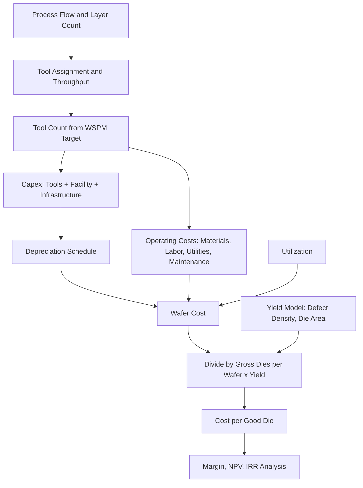

## Fab Capital Intensity and Cost Modeling


### Overview and Motivation

A semiconductor fabrication plant (fab) is among the most capital-intensive manufacturing facilities ever built. A leading-edge logic fab can cost well over $20 billion, and a large memory or mature-node fab commonly costs several billion dollars. Unlike most industries, where variable costs (labor, raw materials) dominate unit cost, semiconductor manufacturing is dominated by **fixed costs**: equipment depreciation, cleanroom infrastructure, and R&D amortization.

This structure drives the industry's central economic behaviors: relentless pursuit of high utilization, aggressive node migration, large scale, cyclical boom-and-bust investment, and heavy government involvement in siting and subsidies.

**Key Points**

- Wafer cost is dominated by depreciation of equipment, which typically represents well over half of the cost of a processed wafer at advanced nodes.
- Capital intensity (capex as a share of revenue) in the industry has historically run in the range of roughly 15–35% for foundries and memory makers, far above most manufacturing sectors. [Inference] Exact ratios vary by year, business model, and cycle position.
- Cost models must combine **capital cost**, **operating cost**, **yield**, and **utilization** to yield a meaningful cost per good die.

---

### Definitions of Capital Intensity

#### Common Metrics

| Metric | Definition | Use |
| --- | --- | --- |
| Capex intensity | $\dfrac{\text{Capital expenditure}}{\text{Revenue}}$ | Industry benchmarking, cyclicality analysis |
| Capital per wafer start capacity | $\dfrac{\text{Total fab investment}}{\text{Wafer starts per month (WSPM)}}$ | Fab planning, comparing nodes and sites |
| Capital per unit of output | $\dfrac{\text{Fab investment}}{\text{Annual good die or bits}}$ | Memory economics, cost-per-bit |
| Capital productivity | $\dfrac{\text{Revenue}}{\text{Net PP\&E}}$ (asset turns) | Efficiency of installed asset base |
| Depreciation-to-revenue | $\dfrac{D\&A}{\text{Revenue}}$ | Margin structure |

#### Capex Composition

A typical fab investment is split between:

- **Equipment (tools):** Typically 70–85% of total investment at modern fabs. Lithography, etch, deposition, metrology/inspection, CMP, and cleans/ion implant make up the major categories.
- **Facility and building:** Shell, cleanroom, subfab, and utilities buildings, typically 10–20%.
- **Infrastructure and utilities:** Ultrapure water, power substations, chemical and gas delivery, abatement, and cooling, often included in the facility share.
- **Automation and IT:** Automated material handling systems (AMHS), manufacturing execution systems (MES), and fab-wide control.
- **Land, permitting, and pre-opening costs.**

[Inference] These percentages are representative of publicly discussed splits; actual values differ by node, region, and whether equipment is counted in the initial phase or in later expansion.

---

### Why Leading-Edge Fabs Cost So Much

#### Tool Cost Escalation

Lithography dominates single-tool cost:

| Tool class | Approximate price (order of magnitude) |
| --- | --- |
| DUV immersion scanner (ArF-i) | ~$50–100 million |
| Low-NA EUV scanner (0.33 NA) | ~$150–200 million |
| High-NA EUV scanner (0.55 NA) | ~$350–400 million |
| Advanced etch tool | ~$3–10 million |
| ALD/CVD deposition tool | ~$3–10 million |
| Metrology/inspection tool | ~$1–10+ million (e-beam inspection higher) |

[Unverified] Tool prices are estimates aggregated from public reporting and vendor disclosures; actual contract prices are confidential and vary by configuration.

#### Process Complexity Growth

- Each new node adds process steps (mask layers, multi-patterning, EUV layers, more deposition and etch cycles).
- The number of lithography mask layers increased from roughly 20–25 at the 90 nm era to 70+ layers at 5 nm-class and beyond (depending on the design and process). [Inference] Exact counts are proprietary and vary by product.
- Advanced packaging (2.5D/3D, chiplets, hybrid bonding) adds a second capital-intensive stack after wafer fabrication.

#### Cleanroom and Facility Cost Factors

- Ultra-clean environments (ISO Class 1–5 zones) require massive HVAC, filtration, and vibration isolation.
- EUV tools require special foundations, high power supply, and extensive cooling water.
- Fabs can consume on the order of 100–200+ MW of power at large scale and millions of gallons of water per day (including recycling). [Inference] Figures depend on the fab size and technology.

#### Rock's Law (Moore's Second Law)

The cost of a leading-edge fab has historically doubled roughly every four years:

$$C_{fab}(t) \approx C_{0}\cdot 2^{\,(t - t_0)/4}$$

where $C_{fab}$ is fab cost and $t$ is time in years. [Inference] This is an empirical observation, and the doubling time has stretched or fluctuated in different eras, but the direction of escalating cost has persisted.

---

### Cost Structure of a Wafer

#### Components of Wafer Cost

$$C_{wafer} = C_{depr} + C_{mat} + C_{labor} + C_{util} + C_{maint} + C_{OH} + C_{other}$$

| Component | Description | Typical relative weight (leading edge) |
| --- | --- | --- |
| Depreciation ($C_{depr}$) | Equipment and facility cost spread over useful life | Largest share, often ~50–70% |
| Materials ($C_{mat}$) | Wafers, chemicals, gases, photoresist, slurries, masks, targets | ~10–20% |
| Labor ($C_{labor}$) | Direct and indirect personnel | ~5–10% |
| Utilities ($C_{util}$) | Electricity, water, gases | ~3–8% |
| Maintenance ($C_{maint}$) | Spare parts, service contracts | ~5–10% |
| Overhead ($C_{OH}$) | Facilities services, IT, insurance, taxes | Varies |
| Other | Waste treatment, logistics, quality | Small |

[Inference] Percentages are indicative ranges from public analyses; individual companies' figures differ.

#### Fixed vs. Variable Cost

- **Fixed:** Depreciation, most labor, facility overhead. These costs are incurred regardless of output.
- **Variable:** Materials, a portion of utilities, consumable spare parts.

Because fixed costs dominate, unit cost falls sharply as **utilization** rises:

$$C_{wafer}(U) = \frac{F}{U \cdot N_{cap}} + v$$

where $F$ is total fixed cost per period, $U$ is utilization (0–1), $N_{cap}$ is capacity in wafers per period, and $v$ is variable cost per wafer.

**Example**

Consider a fab with fixed cost $F = \$1.2$ billion per year, capacity $N_{cap} = 600{,}000$ wafers per year, and variable cost $v = \$800$ per wafer.

- At $U = 0.95$: $C = \dfrac{1.2\times10^{9}}{0.95\times 600{,}000} + 800 \approx \$2{,}105 + 800 = \$2{,}905$ per wafer
- At $U = 0.60$: $C = \dfrac{1.2\times10^{9}}{0.60\times 600{,}000} + 800 \approx \$3{,}333 + 800 = \$4{,}133$ per wafer

**Output**

A drop in utilization from 95% to 60% raises wafer cost by about 42%, illustrating the operating leverage that makes fabs so sensitive to demand cycles.

---

### Depreciation Modeling

#### Straight-Line Depreciation

$$D_{annual} = \frac{P - S}{L}$$

where $P$ is purchase price, $S$ is salvage value, and $L$ is depreciable life (years). Semiconductor equipment is commonly depreciated over about **5 years** for tools (some companies use 5–7 years), and **15–30 years** for buildings and infrastructure. [Inference] Depreciation policy varies by company and accounting standard, and changes in useful-life assumptions can materially shift reported margins.

#### Accelerated Methods

- **Double-declining balance:**


  $$D_t = \frac{2}{L}\, B_{t-1}$$

  where $B_{t-1}$ is the book value at the start of year $t$.
- **Units-of-production:** Depreciation follows wafer output rather than time.

#### Depreciation per Wafer

$$C_{depr/wafer} = \frac{\text{Annual depreciation}}{\text{Annual wafer output}} = \frac{D_{annual}}{U \cdot N_{cap}}$$

#### Technology Obsolescence vs. Physical Life

Physical tool life can exceed 15–20 years, but economic life at the leading edge is shorter because the node becomes non-competitive. Many tools are **cascaded** to older nodes or specialty processes after their leading-edge run, extending economic value.

---

### Capital Investment Evaluation

#### Net Present Value (NPV)

$$NPV = \sum_{t=0}^{T}\frac{CF_t}{(1+r)^t}$$

where $CF_t$ is net cash flow in year $t$ (negative during construction, positive during ramp) and $r$ is the discount rate (often the weighted average cost of capital, WACC).

#### Internal Rate of Return (IRR)

IRR is the discount rate $r^*$ that solves:

$$\sum_{t=0}^{T}\frac{CF_t}{(1+r^*)^t} = 0$$

#### Payback Period

The time until cumulative cash flow becomes positive. Leading-edge fabs commonly require several years to reach payback, and ramp timing is critical.

#### Real Options View

Because fab investments are staged, irreversible, and made under demand uncertainty, **real options** analysis values the flexibility to delay, expand, or abandon:

- Building a shell (empty cleanroom space) preserves the option to add tools later.
- Phased tool installation matches capacity to demand.

**Example**

A simplified NPV model for a fab phase in Python:

```python
import numpy as np

def npv(rate, cashflows):
    """Cashflows indexed by year, starting at t=0."""
    return sum(cf / (1 + rate) ** t for t, cf in enumerate(cashflows))

# Illustrative: $10B capex over years 0-2, then operating cash flow years 3-12
capex = [-4e9, -4e9, -2e9]
op_cf = [1.2e9, 2.0e9, 2.4e9, 2.4e9, 2.4e9, 2.2e9, 2.0e9, 1.8e9, 1.5e9, 1.2e9]
cashflows = capex + op_cf

for r in (0.08, 0.10, 0.12):
    print(f"Discount rate {r:.0%}: NPV = ${npv(r, cashflows)/1e9:.2f}B")
```

**Output**

The script prints NPV in billions of dollars at each discount rate; NPV declines as the rate rises. [Inference] For the cash flows shown, NPV is modestly negative-to-positive near the 8–12% range depending on the sum, illustrating how sensitive the investment is to the assumed WACC and ramp. Run the code to see exact values.

---

### Yield, Die Cost, and Cost per Good Die

#### Cost per Die

$$C_{die} = \frac{C_{wafer}}{N_{dpw}\cdot Y}$$

where $N_{dpw}$ is gross dies per wafer and $Y$ is yield (fraction of good dies), often decomposed into line yield, die yield, and packaging/test yield.

#### Dies per Wafer

A commonly used approximation for a wafer of diameter $d$ and die area $A$:

$$N_{dpw} \approx \frac{\pi (d/2)^2}{A} - \frac{\pi d}{\sqrt{2A}}$$

The second term accounts for edge loss.

#### Yield Models

| Model | Equation | Notes |
| --- | --- | --- |
| Poisson | $Y = e^{-A D_0}$ | Simple; assumes uniformly distributed random defects |
| Murphy | $Y = \left(\dfrac{1 - e^{-A D_0}}{A D_0}\right)^2$ | Accounts for defect density variation |
| Seeds | $Y = \dfrac{1}{1 + A D_0}$ | More pessimistic for large dies |
| Negative binomial | $Y = \left(1 + \dfrac{A D_0}{\alpha}\right)^{-\alpha}$ | Clustering parameter $\alpha$; widely used industrially |

where $D_0$ is defect density (defects per unit area) and $A$ is the critical area of the die. As $\alpha \to \infty$, the negative binomial model reduces to the Poisson model.

**Example**

Compute cost per good die for a $300$ mm wafer costing $C_{wafer} = \$17{,}000$ with die area $A = 1.0\ \text{cm}^2$ and $D_0 = 0.1\ \text{defects/cm}^2$, using the Poisson model.

- Wafer area: $\pi (15\ \text{cm})^2 \approx 706.9\ \text{cm}^2$
- $N_{dpw} \approx \dfrac{706.9}{1.0} - \dfrac{\pi \times 30}{\sqrt{2\times 1.0}} \approx 706.9 - 66.6 \approx 640$
- $Y = e^{-1.0\times 0.1} \approx 0.905$
- Good dies: $\approx 640 \times 0.905 \approx 579$
- $C_{die} \approx 17{,}000 / 579 \approx \$29.4$

**Output**

For this example, the good-die cost is approximately $29 per die. Doubling die area to 2.0 cm$^2$ cuts gross dies to roughly 320 and reduces yield to $e^{-0.2}\approx 0.819$, raising cost per good die to about $65, more than double, illustrating why large dies are disproportionately expensive and why chiplet partitioning has gained traction.

#### Learning Curves and Yield Ramp

Defect density falls over a node's lifetime as engineers learn:

$$D_0(t) = D_{0,\infty} + (D_{0,init} - D_{0,\infty})\, e^{-t/\tau}$$

The **wright's-law (experience-curve)** cost relation:

$$C(n) = C_1\, n^{-b}$$

where $n$ is cumulative output and $b = -\log_2(1 - \text{learning rate})$. For example, an 80% learning curve means each doubling of cumulative volume reduces unit cost by 20%.

---

### Cost Models in Practice

#### Bottom-Up (Process-Based) Cost Modeling

Builds the cost from the ground up, using the process flow:

1. **Process flow definition:** List every step (litho, etch, deposition, CMP, implant, clean, metrology) by layer.
2. **Tool assignment:** Assign each step to a tool type with throughput (wafers per hour, WPH) and purchase price.
3. **Tool count:** Compute the number of tools required for the target wafer starts per month:


   $$N_{tools,k} = \left\lceil \frac{WSPM \cdot n_{passes,k}}{WPH_k \cdot H_{month} \cdot \eta_{k}} \right\rceil$$

   where $n_{passes,k}$ is the number of times a wafer visits tool type $k$, $H_{month}$ is hours per month, and $\eta_k$ is effective availability/utilization.
4. **Capital and depreciation:** Sum tool prices, add facility cost, compute annual depreciation.
5. **Operating cost:** Add materials, labor, utilities, and maintenance.
6. **Yield and die cost:** Apply yield model to compute cost per good die.

#### Cost of Ownership (COO) — SEMI E35

The **Cost of Ownership** framework (standardized in SEMI E35) evaluates the cost of processing a wafer at a single tool:

$$COO_{wafer} = \frac{C_{fixed} + C_{variable} + C_{yield\ loss}}{N_{good\ wafers}}$$

Components:

- **Fixed cost:** Tool depreciation, floor space, installation, facilities.
- **Variable cost:** Consumables, utilities, maintenance, labor.
- **Yield loss cost:** Cost of scrapped material due to tool-induced defects.

The tool throughput and utilization determine how the fixed cost spreads:

$$COO_{fixed/wafer} = \frac{C_{tool}\cdot CRF + C_{floor}}{WPH \cdot H_{yr} \cdot U_{tool}}$$

with capital recovery factor:

$$CRF = \frac{r(1+r)^n}{(1+r)^n - 1}$$

where $r$ is the discount rate and $n$ is the recovery life in years.

**Example**

A deposition tool costs $5 million, recovery life $n=5$ years, $r=10\%$, throughput 40 WPH, operating 8,000 hours/year, utilization 80%. Floor-space cost is $100k/year.

- $CRF = \dfrac{0.10(1.10)^5}{(1.10)^5 - 1} \approx 0.2638$
- Annualized capital: $5\times10^6 \times 0.2638 \approx \$1.319$ million
- Fixed cost: $1.319 + 0.100 = \$1.419$ million/year
- Wafers/year: $40 \times 8000 \times 0.80 = 256{,}000$
- Fixed COO per wafer: $\approx \$5.54$

**Output**

The fixed portion of processing cost for this step is about $5.54 per wafer pass. Summing across all passes and tool types yields the process-based wafer cost.

#### Top-Down (Financial) Cost Modeling

Uses public financial statements:

$$C_{wafer} \approx \frac{\text{Cost of revenue}}{\text{Wafers shipped (equivalent)}}$$

Advantages: simple, uses reported data. Limitations: hides node-specific and product-specific differences; requires normalizing to a common wafer basis (e.g., 300 mm equivalents at a reference node).

#### Hybrid Models

Combine bottom-up for the marginal node economics with top-down calibration against reported gross margins and depreciation.

#### Commercial and Open Models

- **IC Knowledge Strategic Cost Model** and similar third-party tools provide detailed fab and node-level modeling.
- Academic/industry work (e.g., Georgetown CSET and other policy institutes) publishes fab-cost and wafer-cost comparisons across regions. [Unverified] Specific published estimates differ by source and assumptions; verify against current publications.

---

### Capacity Planning and Tool Sizing

#### Fab Capacity Measures

- **Wafer starts per month (WSPM):** Wafers entering the line per month.
- **Wafer outs:** Wafers completed per period.
- **Cycle time (CT):** Total time from wafer start to completion. Leading-edge cycle times run about 60–100+ days at complex logic nodes. [Inference] Varies by node and product mix.

#### Little's Law

The relationship among work-in-process (WIP), throughput ($TH$), and cycle time:

$$WIP = TH \times CT$$

Long cycle times therefore imply large WIP inventory and working-capital tie-up.

#### Bottleneck Analysis

The fab's capacity is limited by the slowest tool group (bottleneck), often lithography at advanced nodes. Overall capacity:

$$Cap_{fab} = \min_k\left(\frac{N_{tools,k}\cdot WPH_k\cdot H\cdot\eta_k}{n_{passes,k}}\right)$$

**Key Points**

- Lithography (especially EUV) often sets the cost-effective fab size, since litho tools are the most expensive and tightly scheduled.
- Adding a few bottleneck tools can raise total output with small incremental capex ("debottlenecking"), whereas adding capacity across the whole line requires far more capital.

#### Utilization Loss Categories

- Scheduled downtime (preventive maintenance)
- Unscheduled downtime (failures)
- Setup and recipe changes
- Engineering and qualification use
- Idle time due to starvation or blocking
- Rework and scrap

Overall equipment effectiveness (OEE):

$$OEE = A \times P \times Q$$

where $A$ is availability, $P$ is performance (rate) efficiency, and $Q$ is quality (yield) factor.

---

### Economies of Scale and Scope

- **Scale:** Larger fabs spread fixed overhead (infrastructure, R&D, support staff) over more wafers. Mega-fabs of 100k+ wafer starts per month at a site (often multiple phases) are common in memory and foundry.
- **Scope:** Product mix flexibility, e.g., foundry fabs serving many customers can maintain high utilization when one customer's demand falls.
- **Cluster effects:** Co-locating fabs, suppliers, packaging, and talent reduces logistics costs and improves learning.
- **Diseconomies:** Very large fabs face greater complexity, tool-matching challenges, and concentration risk from disasters, power, or geopolitical events.

#### Minimum Efficient Scale

At the leading edge, the sheer expense of R&D and tool sets means only a small number of firms can sustain the scale required to amortize costs. This drives industry consolidation (e.g., a small number of advanced logic foundries) and the fabless–foundry business model, which pools demand from many chip designers onto shared capacity.

---

### R&D and Node Development Costs

Beyond fab capex, node development requires substantial R&D spending:

- Process technology development costs for a leading-edge node have escalated into the billions of dollars.
- Design costs for advanced chips have increased steeply, which limits the number of products that can economically use the most advanced nodes.
- Unit economics must recover both manufacturing and non-recurring engineering (NRE) costs:

$$C_{chip} = C_{die} + C_{package/test} + \frac{NRE + \text{Mask set}}{Q}$$

where $Q$ is total units produced. Mask sets for advanced nodes can cost multiple millions to tens of millions of dollars. [Unverified] Publicly cited mask-set costs vary widely by source and node.

**Example**

If NRE plus masks total $300 million and unit volume is 10 million, the amortized cost is $30 per chip; at 100 million units it falls to $3 per chip. This is why advanced nodes favor high-volume products (mobile, data-center accelerators, PCs).

---

### Cyclicality and Investment Timing

#### The Boom-Bust Mechanism

1. Demand rises; utilization approaches 100%; prices firm.
2. Firms announce capacity expansions.
3. Lead times of 2–3+ years for fab construction and tool delivery mean capacity arrives late.
4. Capacity overshoots demand, prices and utilization fall, and firms cut capex.
5. Underinvestment then sets the stage for the next shortage.

This "hog cycle" (cobweb) dynamic is particularly pronounced in commodity memory (DRAM, NAND).

#### Capex-to-Revenue Behavior

Capex intensity tends to be procyclical in the aggregate, though leading-edge foundry investments follow long-term strategic roadmaps and are less volatile than commodity memory investments. [Inference] Company-specific behavior differs.

#### Financing and Risk

- Long payback horizons and high fixed costs mean high **operating leverage**: small revenue changes produce large swings in operating margin.
- **Degree of operating leverage:**


  $$DOL = \frac{\%\Delta EBIT}{\%\Delta Revenue} = \frac{Contribution\ margin}{EBIT}$$

---

### Industrial Policy, Subsidies, and Regional Cost Differences

#### Drivers of Regional Cost Differences

| Factor | Effect |
| --- | --- |
| Construction cost and speed | Labor, permitting, and supply chain differ by region |
| Incentives and subsidies | Grants, tax credits, low-cost land/utilities reduce net capex |
| Labor cost and availability | Skilled engineers and technicians; wages differ across regions |
| Utilities cost | Power and water price and reliability |
| Ecosystem density | Suppliers, materials, and logistics proximity |
| Currency and taxes | Affect reported costs and returns |

Various national programs (e.g., the U.S. CHIPS and Science Act, the EU Chips Act, and subsidy programs in Japan, South Korea, Taiwan, China, and India) provide grants, tax credits, and other incentives intended to offset higher costs in some regions. [Unverified] Program sizes, eligibility rules, and disbursement status change over time; consult current official sources.

#### Cost-Modeling Implications

- Compare **net** capex after subsidies and tax credits.
- Include **time-to-production** differences, since delays add interest and opportunity cost.
- Include **supply-chain resilience** premiums as a strategic (not purely cost) variable.

---

### Sensitivity and Scenario Analysis

#### Key Sensitivity Variables

| Variable | Why it matters |
| --- | --- |
| Utilization | Primary driver of fixed-cost absorption |
| Yield / defect density | Directly scales cost per good die |
| Wafer price (ASP) | Revenue side of margin |
| Depreciation life | Shifts reported margins and cash flow timing |
| Tool price and count | Drives capex and depreciation |
| Discount rate (WACC) | Drives NPV and IRR |
| Ramp speed | Determines time to cash-flow positive |
| Subsidy/tax credit | Reduces net investment |

#### Tornado Analysis

Vary each input by a fixed percentage (e.g., ±10%) and rank the impact on NPV or wafer cost. Typically utilization, ASP, and yield dominate the ranking.

#### Monte Carlo Simulation

Model uncertain inputs as distributions and sample to estimate an NPV distribution.

**Example**

```python
import numpy as np

rng = np.random.default_rng(42)
N = 20_000

# Input distributions (illustrative)
utilization = rng.triangular(0.55, 0.85, 0.98, N)
asp = rng.normal(17000, 1500, N)                 # $ per wafer
yield_frac = rng.triangular(0.70, 0.88, 0.95, N)
capacity_wafers = 600_000                        # wafers/year at full loading
fixed_cost = 1.2e9                               # $ per year
var_cost = 800                                   # $ per wafer

# Annual operating profit
wafers = capacity_wafers * utilization
revenue = wafers * asp * yield_frac              # simplistic: revenue scaled by yield
cost = fixed_cost + wafers * var_cost
profit = revenue - cost

print(f"Mean profit:  ${profit.mean()/1e9:.2f}B")
print(f"P10 / P90:    ${np.percentile(profit,10)/1e9:.2f}B / ${np.percentile(profit,90)/1e9:.2f}B")
print(f"P(loss):      {(profit<0).mean():.1%}")
```

**Output**

The script prints mean annual profit, the 10th/90th percentile range, and the probability of an annual loss under the assumed distributions. [Inference] Because revenue is scaled by yield in this simplified model, the result illustrates sensitivity rather than a calibrated forecast; results will vary with the assumed distributions and random seed.

---

### Cost Comparison Across Node Types

| Segment | Typical wafer size | Capital per WSPM (order of magnitude) | Cost drivers |
| --- | --- | --- | --- |
| Leading-edge logic (≤5 nm class) | 300 mm | Very high (≈$100k–$200k+ per wafer start per month, all-in) | EUV lithography, multi-patterning, advanced packaging |
| Mature logic (28 nm–180 nm) | 200/300 mm | Moderate (≈$20k–$60k per WSPM) | Lower tool cost, longer tool life, depreciated equipment |
| DRAM | 300 mm | High | Capacitor/high-aspect-ratio etch, EUV entering |
| 3D NAND | 300 mm | High | Deposition/etch of 100–200+ layer stacks |
| Power and analog | 150/200/300 mm | Low–moderate | Specialty processes, often older tools |
| Compound semiconductors (SiC, GaN) | 100–200 mm | Moderate | Substrate cost and defectivity dominate |

[Inference] Values are indicative ranges; actual figures depend on scale, equipment mix, geography, and accounting conventions.

**Key Points**

- Mature-node fabs benefit from fully depreciated tools, so incremental cost is dominated by operating cost, but new capacity at mature nodes still requires new-build capex.
- Wafer size transitions (200 mm to 300 mm) historically reduced cost per die by improving area utilization, though they required large capital outlays.

---

### Mermaid Overview: Cost Model Flow



---

### (svg_diagram) Wafer Cost Sensitivity to Utilization

<svg xmlns="http://www.w3.org/2000/svg" viewBox="0 0 560 340" width="560" height="340" font-family="sans-serif" font-size="12">
<title>(svg_diagram) Wafer cost vs utilization</title>
<text x="280" y="20" text-anchor="middle" font-weight="bold">(svg_diagram) Wafer Cost vs Fab Utilization (illustrative)</text>

<line x1="70" y1="290" x2="520" y2="290" stroke="#333" stroke-width="2" />
<line x1="70" y1="290" x2="70" y2="50" stroke="#333" stroke-width="2" />
<text x="295" y="330" text-anchor="middle">Utilization (%)</text>
<text x="20" y="170" text-anchor="middle" transform="rotate(-90 20 170)">Cost per wafer ($)</text>

<text x="70" y="308" text-anchor="middle">50</text>
<text x="182" y="308" text-anchor="middle">62.5</text>
<text x="295" y="308" text-anchor="middle">75</text>
<text x="407" y="308" text-anchor="middle">87.5</text>
<text x="520" y="308" text-anchor="middle">100</text>

<text x="62" y="294" text-anchor="end">2,500</text>
<text x="62" y="234" text-anchor="end">3,000</text>
<text x="62" y="174" text-anchor="end">3,500</text>
<text x="62" y="114" text-anchor="end">4,000</text>
<text x="62" y="54" text-anchor="end">4,500</text>

<polyline fill="none" stroke="#d32f2f" stroke-width="3" points="70,45 126,108 182,150 238,181 295,205 351,225 407,242 463,256 520,266" />

<circle cx="520" cy="266" r="4" fill="#d32f2f" />
<text x="510" y="255" text-anchor="end">100%: ~$2,800</text>
<circle cx="70" cy="45" r="4" fill="#d32f2f" />
<text x="80" y="42" text-anchor="start">50%: ~$4,800</text>
<text x="300" y="80" text-anchor="start" font-size="11">Fixed cost per wafer = F / (U x N_cap)</text>
</svg>

---

### Practical Modeling Workflow

1. **Define scope:** Node, product mix, wafer size, target WSPM, site location, and time horizon.
2. **Gather inputs:** Tool prices and throughputs (from vendor quotes or literature), facility cost, labor rates, utility prices, materials cost per layer, and depreciation policy.
3. **Build the process flow table:** Steps by layer with tool type, WPH, and pass counts.
4. **Compute tool counts and capex:** Apply the tool-sizing equation, add facility and infrastructure.
5. **Compute annual costs:** Depreciation, materials, labor, utilities, maintenance, overhead.
6. **Apply yield model:** Compute cost per good die and per-wafer margins at target ASP.
7. **Run financial analysis:** NPV, IRR, payback, and sensitivity/Monte Carlo.
8. **Calibrate and validate:** Compare to public financials (gross margin, depreciation/revenue) and adjust hidden assumptions.
9. **Scenario analysis:** Subsidies, utilization downturns, yield ramp delays, tool price inflation.

---

### Challenges and Open Problems

**Key Points**

- **Data opacity:** Tool prices, wafer costs, and yields are proprietary, so external cost models rely on estimates.
- **Escalating complexity:** Each node adds process steps and tool types, making bottom-up models harder to keep current.
- **Advanced packaging economics:** Chiplets and 3D integration shift cost from front-end wafer processing to packaging, hybrid bonding, and test, requiring new cost models.
- **Geopolitical and supply-chain risk:** Export controls, tariffs, and regional subsidies complicate comparisons and add non-cost strategic premiums.
- **Energy and sustainability:** Rising power and water consumption, plus emissions targets (e.g., fluorinated gas abatement), increase both capex and opex.
- **Talent constraints:** Skilled labor shortages influence ramp speed and cost.
- **Demand uncertainty:** AI-driven demand shifts (high-bandwidth memory, advanced logic, advanced packaging) create uneven capacity needs across segments.

---

### Conclusion

Semiconductor fab economics are governed by enormous fixed investments, steep learning curves, and razor-sensitive utilization and yield. Effective cost modeling integrates process-flow-based tool sizing, depreciation schedules, operating costs, and yield models into a per-good-die cost, then layers on financial analysis (NPV, IRR, real options) and scenario testing to account for cyclicality, subsidies, and technology risk. Understanding these relationships is essential for evaluating technology roadmaps, siting decisions, pricing, and the competitive structure of the semiconductor industry.

---

### Related Topics

**Next Steps**

- Semiconductor equipment market structure and tool-vendor economics (lithography, etch, deposition)
- Foundry vs. IDM vs. fabless business models
- Yield modeling, defect density learning, and yield-ramp management
- EUV and High-NA EUV lithography economics
- Advanced packaging cost structures (2.5D, 3D, chiplets, hybrid bonding)
- Memory market cyclicality and cost-per-bit scaling
- Government subsidy programs and industrial policy (CHIPS Act, EU Chips Act)
- Supply chain resilience, geopolitical risk, and export controls
- Total cost of ownership (SEMI E35) for individual process tools
- Fab utilities: ultrapure water, power, and gas systems
- Real options and capital-budgeting methods for fab expansion
- Environmental cost and sustainability accounting in fabs