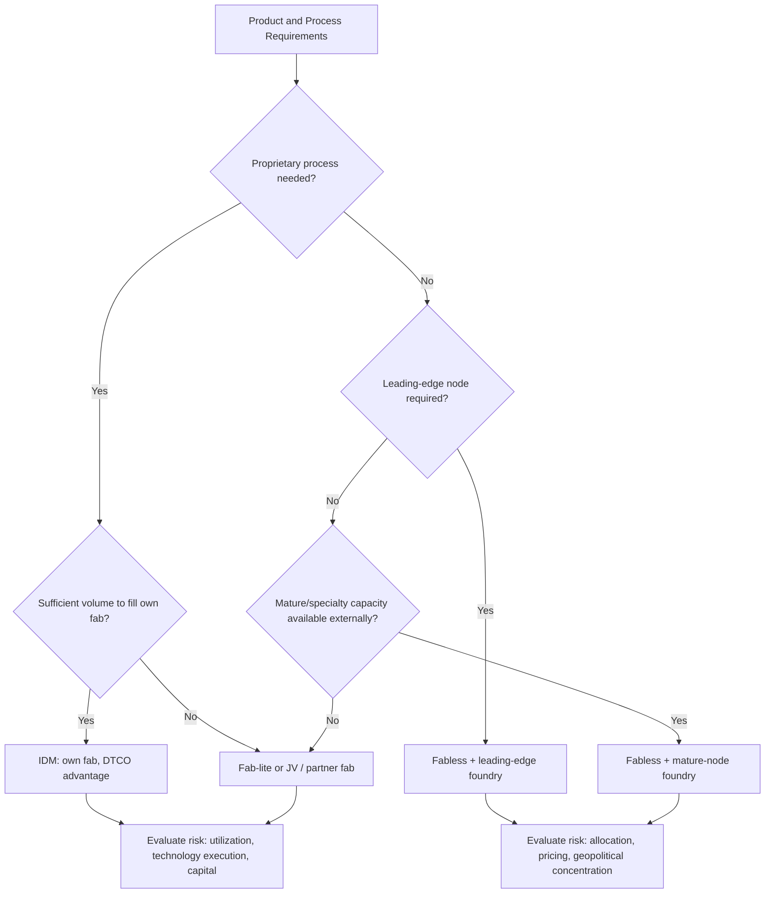

## Foundry versus IDM Business Strategies


### Overview and Motivation

The semiconductor industry organizes the work of turning a chip idea into a shipped product in two broad ways:

- **Integrated Device Manufacturer (IDM):** A single company designs, fabricates, assembles, and tests its own chips, and sells them under its own brand. Historic examples include Intel, Texas Instruments, Samsung Electronics (memory and logic), SK hynix, Micron, and Infineon.
- **Fabless + Foundry:** A **fabless** company designs and markets chips but outsources manufacturing to a **pure-play foundry** that fabricates wafers for many customers. The foundry sells manufacturing capacity and process technology rather than finished branded chips. Examples include TSMC, GlobalFoundries, UMC, and SMIC on the foundry side, and NVIDIA, AMD, Qualcomm, Broadcom, and MediaTek on the fabless side.

The split is largely a consequence of the economics covered in the previous topic: because fabs are enormously capital-intensive and utilization-sensitive, the two models represent different answers to the question of **who bears the fixed-cost risk, and how it is spread across demand**.

**Key Points**

- The pure-play foundry model pools demand from many customers onto shared capacity, improving utilization and letting the foundry fund leading-edge R&D and capex.
- The IDM model keeps design and manufacturing co-optimized under one roof, at the cost of carrying the full capital and utilization burden.
- Hybrid and evolving models (fab-lite, IDM-with-foundry-arm, foundry-plus-packaging, "system foundry") blur the categories; strategy is best viewed as a spectrum rather than a binary.

---

### Historical Evolution

#### Origins of the IDM Era

In the early decades of the industry (1960s–1980s), nearly all firms were IDMs. Process technology, device design, and manufacturing were tightly intertwined, and building a fab was comparatively affordable. Competitive advantage came from proprietary processes and vertical control.

#### Emergence of the Fabless–Foundry Model

Several forces made an alternative model viable:

1. **Rising fab costs (Rock's Law):** Escalating capex priced smaller firms out of owning fabs.
2. **Standardization of design flows:** Electronic design automation (EDA) tools and design rules (e.g., Mead–Conway-style abstraction of layout rules) separated design from process specifics.
3. **Foundry founding (1987):** TSMC was established as a dedicated foundry that would not compete with its customers, creating a trusted manufacturing partner. [Inference] The "no competition with customers" positioning is widely cited as central to the model's credibility.
4. **Fabless startups:** Designers such as Xilinx, Qualcomm, NVIDIA, and later many others scaled without fab ownership.
5. **Excess IDM capacity:** IDMs sometimes sold surplus capacity, an early form of foundry service.

#### Consolidation and the Shift Toward Fab-Lite

Over the 2000s–2010s, many IDMs concluded that keeping pace at the leading edge was uneconomic:

- **AMD** spun off manufacturing in 2009 to form GlobalFoundries and became fabless.
- Many European, Japanese, and U.S. IDMs shifted to **fab-lite** strategies, keeping specialty fabs but outsourcing leading-edge logic.
- The number of firms capable of manufacturing at the leading logic edge shrank sharply.

#### Renewed Interest in Vertical Integration and IDM Foundry Services

More recently, geopolitical concerns, supply shortages, and industrial policy have driven reinvestment in domestic manufacturing and experiments such as **IDM 2.0** (Intel's strategy of running internal manufacturing while also offering foundry services to external customers). [Unverified] The strategic details, organizational structure, and financial outcomes of such programs evolve quickly; consult current company disclosures.

---

### Business Model Definitions

#### IDM (Integrated Device Manufacturer)

| Attribute | Description |
| --- | --- |
| Value chain scope | Design, wafer fabrication, assembly/test (often), marketing, sales |
| Revenue source | Sale of branded chips (and sometimes systems) |
| Capital burden | Very high: owns fabs, R&D, packaging/test |
| Process technology | Often proprietary and co-optimized with product design |
| Risk profile | High fixed cost, high operating leverage, exposure to utilization swings |

#### Pure-Play Foundry

| Attribute | Description |
| --- | --- |
| Value chain scope | Wafer fabrication, increasingly advanced packaging and services; no branded chip products |
| Revenue source | Wafer sales and manufacturing services |
| Capital burden | Very high, but demand aggregated across many customers |
| Process technology | Standardized offering (process design kits, IP ecosystem) |
| Risk profile | High fixed cost mitigated by customer diversification |

#### Fabless

| Attribute | Description |
| --- | --- |
| Value chain scope | Chip architecture, design, verification, IP integration, marketing/sales |
| Revenue source | Sale of chips or IP |
| Capital burden | Low fixed capital; high R&D/NRE and mask costs |
| Process technology | Rents process access from foundry |
| Risk profile | Supply dependence, wafer-price exposure, allocation risk in shortages |

#### Fab-Lite and Hybrid Models

- **Fab-lite:** An IDM that keeps a portion of manufacturing (often specialty or mature-node, or strategic products) and outsources the rest.
- **Asset-light hybrid:** Uses third-party fabs and OSAT (outsourced semiconductor assembly and test) providers for most steps.
- **IDM with external foundry arm:** Operates internal product lines and also sells capacity to third parties.
- **Memory IDMs:** DRAM and NAND producers remain overwhelmingly IDM because process and product are tightly coupled and the products are commodity-like.

---

### The Value Chain

(svg_diagram) Semiconductor value chain and where each model sits:

<svg xmlns="http://www.w3.org/2000/svg" viewBox="0 0 700 360" width="700" height="360" font-family="sans-serif" font-size="12">
<title>(svg_diagram) Value chain coverage by business model</title>
<text x="350" y="20" text-anchor="middle" font-weight="bold">(svg_diagram) Value Chain Coverage by Business Model</text>

<rect x="150" y="40" width="100" height="36" fill="#e3f2fd" stroke="#333" />
<text x="200" y="63" text-anchor="middle">EDA / IP</text>
<rect x="260" y="40" width="100" height="36" fill="#e3f2fd" stroke="#333" />
<text x="310" y="63" text-anchor="middle">Chip Design</text>
<rect x="370" y="40" width="100" height="36" fill="#e3f2fd" stroke="#333" />
<text x="420" y="63" text-anchor="middle">Wafer Fab</text>
<rect x="480" y="40" width="100" height="36" fill="#e3f2fd" stroke="#333" />
<text x="530" y="63" text-anchor="middle">Assembly / Test</text>
<rect x="590" y="40" width="90" height="36" fill="#e3f2fd" stroke="#333" />
<text x="635" y="63" text-anchor="middle">Sales / Brand</text>

<text x="20" y="118" font-weight="bold">IDM</text>
<rect x="260" y="95" width="420" height="36" fill="#c8e6c9" stroke="#333" />
<text x="470" y="118" text-anchor="middle">Design + Fab + (often) Assembly/Test + Brand</text>

<text x="20" y="178" font-weight="bold">Fabless</text>
<rect x="260" y="155" width="100" height="36" fill="#ffe0b2" stroke="#333" />
<text x="310" y="178" text-anchor="middle">Design</text>
<rect x="590" y="155" width="90" height="36" fill="#ffe0b2" stroke="#333" />
<text x="635" y="178" text-anchor="middle">Sales</text>
<text x="470" y="178" text-anchor="middle" font-size="11">(outsourced to foundry + OSAT)</text>

<text x="20" y="238" font-weight="bold">Foundry</text>
<rect x="370" y="215" width="100" height="36" fill="#d1c4e9" stroke="#333" />
<text x="420" y="238" text-anchor="middle">Wafer Fab</text>
<rect x="480" y="215" width="100" height="36" fill="#d1c4e9" stroke="#333" />
<text x="530" y="238" text-anchor="middle">Adv. Pkg (growing)</text>

<text x="20" y="298" font-weight="bold">OSAT</text>
<rect x="480" y="275" width="100" height="36" fill="#ffccbc" stroke="#333" />
<text x="530" y="298" text-anchor="middle">Assembly / Test</text>

<text x="20" y="348" font-weight="bold">EDA / IP vendors</text>
<rect x="150" y="330" width="100" height="24" fill="#b3e5fc" stroke="#333" />
<text x="200" y="347" text-anchor="middle" font-size="11">EDA + IP cores</text>
</svg>

---

### Economics of the Two Models

#### Fixed Cost Absorption

Both models face high fixed costs, but the sources of demand differ.

For a foundry serving $n$ customers with independent demand $D_i$ (mean $\mu_i$, variance $\sigma_i^2$), the aggregate demand has mean and variance:

$$\mu_{total} = \sum_{i=1}^{n}\mu_i, \qquad \sigma_{total}^2 = \sum_{i=1}^{n}\sigma_i^2 + 2\sum_{i<j}\rho_{ij}\sigma_i\sigma_j$$

If demand across customers is not perfectly correlated ($\rho_{ij} < 1$), the **coefficient of variation** falls as customers are added:

$$CV_{total} = \frac{\sigma_{total}}{\mu_{total}}$$

For identical, independent customers, $CV_{total} = CV_{1}/\sqrt{n}$. Lower demand volatility supports higher average utilization, which is the statistical rationale for the foundry's pooling advantage. [Inference] Real customer demand is positively correlated because of shared end-market cycles (e.g., smartphones, data centers), which weakens the pooling benefit.

An IDM must absorb its **own product demand** on its own fab, so utilization tracks its product cycle. It can mitigate this with **internal load balancing** (moving products between fabs or nodes) and **external foundry sales** of surplus capacity.

#### Operating Leverage

$$DOL = \frac{\%\Delta EBIT}{\%\Delta Revenue}$$

IDMs typically exhibit higher DOL than fabless firms because fixed costs are a larger share of total cost. Fabless firms convert manufacturing into a variable cost (wafer purchases), lowering downside risk but also capping the ability to earn manufacturing margin.

#### Margin Structure

| Model | Typical margin drivers | Notes |
| --- | --- | --- |
| IDM | Product ASP, utilization, yield, R&D efficiency | Captures both design and manufacturing margin; carries heavy depreciation |
| Foundry | Wafer ASP, node mix, utilization, yield learning | Leading-edge share and pricing power drive margins |
| Fabless | Product ASP, wafer cost, design win rate | High gross margins possible; exposed to wafer price and allocation |

[Inference] Gross margin levels vary widely by segment and cycle; leading-edge fabless designers and leading foundries have reported gross margins well above many IDMs, whereas memory IDMs swing strongly with the cycle. Verify against current financial statements.

#### Capital Efficiency

Asset turnover ($\text{Revenue}/\text{Net PP\&E}$) and return on invested capital (ROIC) are useful comparison metrics:

$$ROIC = \frac{NOPAT}{\text{Invested capital}}$$

Fabless firms usually show very high asset turnover and ROIC because they carry little PP&E; foundries and IDMs show lower turnover but can earn strong returns when utilization and pricing are high.

**Example**

Simplified comparison of a fabless firm (F), an IDM (I), and a foundry (Fd) with illustrative numbers:

```python
def roic(nopat, invested_capital):
    return nopat / invested_capital

firms = {
    "Fabless": {"revenue": 10e9, "nopat": 2.5e9, "invested_capital": 6e9},
    "IDM":     {"revenue": 10e9, "nopat": 1.8e9, "invested_capital": 25e9},
    "Foundry": {"revenue": 10e9, "nopat": 3.0e9, "invested_capital": 30e9},
}

for name, f in firms.items():
    turns = f["revenue"] / f["invested_capital"]
    print(f"{name:8s} ROIC={roic(f['nopat'], f['invested_capital']):.1%}  "
          f"Capital turns={turns:.2f}")
```

**Output**

The script prints ROIC and capital turns per model. With these illustrative inputs, the fabless firm shows the highest capital turns and ROIC (about 41.7% ROIC, 1.67 turns), the IDM about 7.2% ROIC (0.40 turns), and the foundry about 10.0% ROIC (0.33 turns). [Inference] The numbers are hypothetical and are meant to illustrate the structural difference in capital intensity, not to represent any real company.

---

### Strategic Advantages and Disadvantages

#### IDM

**Advantages**

- **Design–process co-optimization (DTCO):** Circuit design, device architecture, and process flow can be tuned together, potentially yielding performance, power, or density advantages.
- **Control of roadmap and IP:** Proprietary processes, unique device structures (e.g., specialty memory cells, power devices, analog processes), and tight IP protection.
- **Supply security:** Guaranteed access to capacity for own products.
- **Margin capture:** Retains both the design and manufacturing profit pools.
- **Fast learning loops:** Yield engineers, process integrators, and designers can iterate in-house.

**Disadvantages**

- **Capital and R&D burden:** Must fund leading-edge process development and capex on the strength of own volumes.
- **Utilization risk:** Product demand swings directly hit fab loading.
- **Technology lag risk:** A stumble in process development can stall the entire product roadmap (a documented risk in the industry).
- **Limited scale in process ecosystem:** Fewer external customers to help mature design enablement and IP libraries.

#### Pure-Play Foundry

**Advantages**

- **Demand aggregation and scale:** Many customers share fixed costs and fund R&D collectively.
- **Ecosystem and design enablement:** Broad IP libraries, EDA certifications, reference flows, and design-service partners reduce customer time to market.
- **Learning from diverse designs:** Exposure to many design styles accelerates yield learning and process hardening. [Inference] Frequently cited as an advantage; magnitude is hard to quantify externally.
- **Neutrality:** No competing branded products, enabling customer trust.
- **Bargaining position:** At leading edge, limited supplier count confers pricing power.

**Disadvantages**

- **Extreme capital intensity and cyclicality**, with exposure to concentrated customer demand.
- **Customer concentration risk:** A few large customers may account for a large share of revenue.
- **Customization limits:** Standardized process offerings may not fit unique product needs.
- **Geopolitical and concentration risk:** Geographic clustering of leading-edge capacity invites supply-chain and policy scrutiny.

#### Fabless

**Advantages**

- **Low capital requirements** and fast entry for startups.
- **Flexibility:** Ability to choose the best available process node and foundry per product.
- **Focus:** Resources concentrate on architecture, software, and go-to-market.
- **Variable cost structure** (wafer purchases scale with sales).

**Disadvantages**

- **Supply dependence:** Exposure to wafer allocation, price increases, and foundry capacity constraints (evident during shortage periods).
- **Limited process differentiation:** Access to the same process as competitors reduces manufacturing-based advantage.
- **NRE and mask cost burden:** Rising design and mask costs create high up-front commitments.
- **Reliance on foundry roadmap.**

#### Comparison Summary

| Dimension | IDM | Foundry | Fabless |
| --- | --- | --- | --- |
| Capex intensity | Very high | Very high | Low |
| R&D intensity | Process + product | Process + design enablement | Product design |
| Utilization risk | Own-product cycle | Aggregate customer cycle | Indirect (allocation/pricing) |
| DTCO potential | Highest | Moderate (via close partnerships) | Limited to foundry-offered options |
| Speed to leading-edge access | Depends on own process | Depends on foundry lead | Depends on foundry allocation |
| Supply control | High | High (own capacity) | Low |
| Strategic flexibility | Low (locked to own fabs) | Moderate | High |

---

### Decision Framework: Own, Outsource, or Hybrid

A firm evaluating its strategy can frame the choice using transaction-cost economics and resource-based reasoning.

#### Key Decision Factors

1. **Scale:** Can the firm's own volume keep fabs at high utilization? Formally, fab ownership is favored if


   $$V_{own} \ge V_{min}$$

   where $V_{min}$ is the volume that brings the average cost of internal manufacturing below the external foundry price.
2. **Process differentiation:** Does the product require a proprietary or highly specialized process (e.g., memory cells, high-voltage power, RF, analog, SiC/GaN, embedded non-volatile memory)?
3. **Time to market and node access:** Can the firm reach the leading edge internally as fast as a foundry?
4. **Capital availability and cost of capital:** Can it fund the build, and does WACC justify it?
5. **Supply security and geopolitical considerations:** Strategic value of domestic or controlled capacity.
6. **IP protection and customer trust:** Concerns about sharing designs with a foundry that may also serve competitors.
7. **Product portfolio breadth:** A broad portfolio across many nodes can dilute utilization on any single fab.

#### Breakeven Volume Analysis

Let $F_{own}$ be annualized fixed cost of owning capacity (depreciation, facility, fixed overhead), $v_{own}$ the variable cost per wafer internally, and $P_{f}$ the foundry wafer price. Owning is cheaper when:

$$\frac{F_{own}}{Q} + v_{own} < P_f \quad\Longrightarrow\quad Q > Q^{*} = \frac{F_{own}}{P_f - v_{own}}$$

**Example**

Suppose $F_{own} = \$600$ million/year, $v_{own} = \$900$ per wafer, and the foundry charges $P_f = \$3{,}000$ per wafer.

$$Q^{*} = \frac{600\times10^{6}}{3000 - 900} \approx 285{,}714\ \text{wafers/year}$$

**Output**

Above roughly 286,000 wafers per year, internal manufacturing is cheaper on a pure cost basis; below that, outsourcing wins. [Inference] This ignores yield differences, node access, risk, and strategic factors, which often outweigh simple cost comparisons.

#### Real Options and Flexibility

Outsourcing to a foundry preserves the option to switch nodes or vendors without stranded assets, while fab ownership creates irreversible commitment. When demand is uncertain, this option value can be large.

---

### Segment-by-Segment Patterns

| Segment | Dominant model | Rationale |
| --- | --- | --- |
| Leading-edge logic (CPUs, GPUs, SoCs, AI accelerators) | Fabless + leading-edge foundry; a few IDMs | Capex/R&D scale favors demand pooling; a small number of firms maintain leading-edge manufacturing |
| DRAM | IDM | Process and product tightly coupled; commodity economics reward scale and yield |
| NAND flash | IDM (sometimes joint ventures) | 3D stacking process is product-specific; JV structures share capital |
| Analog and mixed-signal | IDM / fab-lite | Proprietary specialty processes and long product life |
| Power devices (Si, SiC, GaN) | IDM, with growing foundry involvement | Process differentiation; substrate integration |
| MCUs and automotive | IDM / fab-lite with foundry use for advanced nodes | Reliability, qualification, embedded memory |
| RF and connectivity | Mix of IDM and specialty foundries | Specialty processes (SOI, SiGe, GaAs) |
| Image sensors | IDM and foundry (stacked-wafer processes) | Specialized process; partial outsourcing |
| Mature-node logic and display drivers | Foundry | Depreciated capacity and cost focus |

**Key Points**

- The leading edge of digital logic gravitated to the foundry model because the cost of staying at the frontier exceeded what most single-company demand streams could support.
- Memory remained IDM-centric because a memory cell is the product; process innovation and product innovation are inseparable.
- Specialty and analog segments favor IDMs (or fab-lite) whose value is in proprietary processes and long-lived product families.

---

### Capital Structure, Financing, and Ownership Variants

- **Joint ventures and consortia:** Firms share fab investment (common in NAND and specialty processes) to spread capital and risk.
- **Take-or-pay and prepayment agreements:** Customers commit volume or provide upfront funding in exchange for capacity guarantees, shifting some utilization risk from foundry to customer. [Inference] Contract structures are confidential, but capacity reservation deals have been widely reported in shortage periods.
- **Capacity-sharing and long-term supply agreements (LTAs):** Common between fabless firms and foundries, or between IDMs and customers.
- **Government support:** Subsidies, tax credits, and equity stakes influence the effective capital burden and thus the make-vs-buy calculus. [Unverified] Program details change frequently; verify against official sources.
- **Asset-light restructuring:** Selling or spinning off fabs (e.g., AMD to GlobalFoundries) to convert fixed to variable costs.

---

### Competitive Dynamics and Bargaining Power

#### Foundry–Customer Relationship

- **Switching costs:** Porting a design to another foundry requires re-implementation (new PDK, IP, timing closure, reliability qualification), which can take many months and significant NRE. Switching costs at leading nodes are high.
- **Bargaining power:** When the foundry is the only qualified supplier at a node, pricing power shifts to the foundry; when multiple foundries compete at a node, customers gain leverage.
- **Allocation:** During shortages, larger and longer-committed customers receive priority.

#### Foundry–Foundry Competition

Competition is based on:

1. Process performance/power/area (PPA)
2. Yield and predictability of ramp
3. Cost per transistor and wafer pricing
4. Design ecosystem and IP availability
5. Advanced packaging and system integration capability
6. Capacity, geography, and supply security
7. Customer service and roadmap credibility

#### Foundry vs. IDM Competition

When an IDM also sells foundry services, **channel conflict** arises: customers may worry about design leakage or prioritization favoring the IDM's own products. Firewalls, separate business units, and legal/organizational safeguards are used to reassure customers. [Inference] The effectiveness of such safeguards is judged by customers over time.

#### Porter's Five Forces Applied

| Force | Foundry perspective |
| --- | --- |
| Threat of new entrants | Very low at leading edge (capital, know-how); moderate at mature nodes |
| Supplier power | High for equipment vendors (e.g., EUV lithography supplier concentration) |
| Buyer power | Concentrated large customers wield leverage; small customers have little |
| Substitutes | Alternative architectures, chiplets, or IDM in-house manufacturing |
| Rivalry | Intense at mature nodes; oligopolistic at the leading edge |

---

### Technology Strategy: DTCO, STCO, and the Rise of System Foundry

#### Design-Technology Co-Optimization (DTCO)

DTCO tunes design rules, standard-cell architectures, and process features together to improve PPA. IDMs traditionally hold an advantage; leading foundries now run deep collaborations with anchor customers to approximate it.

#### System-Technology Co-Optimization (STCO)

As scaling slows, performance gains increasingly come from **system-level integration**: chiplets, 2.5D/3D stacking, advanced packaging, high-bandwidth memory, and heterogeneous integration. This changes strategic emphasis:

- Foundries expand into **advanced packaging** (e.g., interposer-based and hybrid-bonded 3D integration).
- IDMs leverage in-house packaging and process breadth.
- The "foundry" scope widens toward a **system foundry** that offers wafer fabrication, packaging, test, and sometimes integration services.

#### Chiplets and Open Ecosystems

Chiplet standards (e.g., UCIe) allow mixing dies from different nodes and vendors within a package, reducing the need to manufacture an entire system on the leading edge and enabling modular business strategies. [Inference] Adoption and interoperability are still maturing.

---

### Geopolitics, Supply Security, and Industrial Policy

- **Concentration risk:** A large share of leading-edge logic capacity is concentrated in a small number of locations, which motivates policy interventions in several regions. [Unverified] Precise share figures vary by source, node definition, and year.
- **Subsidy and localization programs:** National programs aim to diversify manufacturing geography and support domestic IDMs and foundries.
- **Export controls:** Restrictions on advanced equipment, EDA, and chip sales affect both foundry and IDM strategies and can force redesign of product lines and supply chains.
- **Dual-sourcing and resilience:** Fabless firms may qualify designs at multiple foundries or fabs; IDMs may build regional redundancy.
- **Cost of resilience:** Regional fabs can carry higher costs; strategies weigh cost against security. [Inference] The size of the cost premium depends on region, incentives, and scale.

---

### Case Study Frameworks

#### Framework for Evaluating a Strategic Move

1. **Segment analysis:** Which product segments, nodes, and end markets?
2. **Volume and utilization forecast:** Can internal demand support the fab? What external demand is needed?
3. **Process fit:** Standard foundry offering vs. proprietary process need.
4. **Financial model:** NPV, IRR, breakeven volume, and sensitivity to utilization and yield.
5. **Risk analysis:** Technology execution risk, customer concentration, geopolitical, supply chain, IP.
6. **Organizational fit:** Culture, governance, and capabilities (e.g., building a customer-service-oriented foundry inside an IDM).
7. **Ecosystem readiness:** PDK maturity, IP catalog, EDA support, design-service partners.

#### Illustrative Patterns from Industry History

| Pattern | Description |
| --- | --- |
| Spin-off to fabless | An IDM divests manufacturing to reduce capital burden and focus on design (e.g., AMD → GlobalFoundries) |
| Foundry entry by an IDM | An IDM offers external capacity to fill fabs and diversify revenue |
| Fab-lite transition | An IDM retains specialty fabs and outsources leading-edge nodes |
| Node exit | A foundry or IDM stops pursuing the leading edge because of cost, refocusing on specialty or mature nodes |
| Captive foundry to independent | A captive manufacturing unit is opened to external customers |

[Unverified] Company-specific outcomes and details of each transition are complex and should be checked against primary sources (annual reports, investor presentations, regulatory filings).

---

### Sensitivity Analysis: When Does Each Model Win?

The relative advantage depends on a few parameters:

| Parameter | Favors IDM when... | Favors fabless/foundry when... |
| --- | --- | --- |
| Volume per node | High and stable | Low or volatile |
| Process differentiation | High (proprietary) | Low (standard CMOS suffices) |
| Capital cost | Cheap capital or subsidies | Expensive capital |
| Node access | Own process at parity | Foundry leads at frontier |
| Product cycle | Long-lived, predictable | Short-lived, fast-changing |
| Supply security | Strategic priority | Second-sourcing feasible |

**Example**

A sensitivity sketch of internal versus foundry cost per wafer as volume varies:

```python
import numpy as np

F_own = 600e6      # annual fixed cost of owned capacity ($)
v_own = 900        # variable cost per wafer ($)
P_foundry = 3000   # foundry wafer price ($)

volumes = np.array([100_000, 200_000, 285_714, 400_000, 600_000])
internal = F_own / volumes + v_own

for q, c in zip(volumes, internal):
    better = "IDM" if c < P_foundry else "Foundry"
    print(f"Q={q:>8,d} wafers/yr  internal=${c:,.0f}  foundry=${P_foundry:,}  -> {better}")
```

**Output**

At 100,000 wafers/year internal cost is about $6,900 per wafer (foundry wins); at about 286,000 wafers/year the two are roughly equal ($3,000); at 600,000 wafers/year internal cost falls to about $1,900 (IDM wins). The result underscores how volume drives the make-vs-buy decision.

---

### Mermaid Overview: Strategy Decision Flow



---

### Emerging Trends

**Key Points**

- **AI-driven demand:** Accelerators and high-bandwidth memory shift value toward leading-edge logic, advanced packaging, and memory, strengthening the position of foundries and memory IDMs with the relevant capabilities.
- **Advanced packaging as a strategic battleground:** Integration capability (2.5D, 3D, hybrid bonding) increasingly determines which foundry or IDM wins system-level designs.
- **Vertical integration by system companies:** Large cloud and consumer-device companies design their own chips (fabless) and negotiate deeply with foundries, sometimes co-investing or making long-term commitments.
- **IDM foundry services and second-source strategies:** Efforts to create alternative leading-edge foundry options seek to reduce concentration risk. [Unverified] Execution status and customer adoption change rapidly.
- **Regionalization of supply chains:** Policy-driven build-outs of fabs in new regions, alongside "friend-shoring" strategies.
- **Specialty and mature-node investment:** Automotive, industrial, and power electronics demand sustains investment in mature and specialty capacity, with foundries and IDMs both participating.
- **Sustainability and resource constraints:** Power, water, and emissions requirements influence siting and cost and may favor operators with scale and efficiency.

---

### Challenges and Open Problems

- **Measuring true DTCO advantage:** Quantifying how much IDM co-optimization outperforms foundry-plus-customer collaboration is difficult and time-dependent.
- **Balancing neutrality and integration:** Foundries expanding into packaging and services must manage conflicts with customers and OSAT partners.
- **Sustaining capital returns:** Escalating capex per node strains returns for all but the largest players.
- **Concentration vs. resilience:** Diversifying manufacturing geography is costly and slow; the industry lacks a settled model for paying for resilience.
- **Talent and ecosystem depth:** New fabs and foundry entrants need not just tools but experienced process engineers, IP ecosystems, and design-support infrastructure.
- **Predicting node economics:** Cost per transistor scaling has slowed at leading nodes, complicating the case for continued migration for some products and strengthening the case for chiplets and mature-node reuse.

---

### Conclusion

Foundry and IDM strategies represent alternative organizational solutions to the same underlying economics: manufacturing costs are dominated by fixed capital, and success depends on keeping fabs loaded, yields high, and technology current. The pure-play foundry model wins by pooling demand, building a broad design ecosystem, and remaining neutral; the IDM model wins where process-product co-optimization, proprietary technology, or supply control create differentiated value that outweighs the capital and utilization burden. Fabless designers exploit the foundry model to focus on architecture and software with minimal capital, at the cost of supply dependence. In practice, strategies are converging toward hybrids as advanced packaging, chiplets, geopolitics, and industrial policy reshape where and how chips are made. Rigorous evaluation combines volume-based breakeven analysis, financial modeling (NPV, ROIC), and qualitative assessment of technology, risk, and ecosystem fit.

---

### Related Topics

**Next Steps**

- Fab capital intensity and cost modeling (linking utilization and depreciation to make-vs-buy decisions)
- Fabless design ecosystems: EDA, IP licensing, and design services
- OSAT industry structure and advanced packaging economics
- Memory industry economics: DRAM/NAND cyclicality and cost per bit
- Chiplet architectures and UCIe standardization
- Design-technology co-optimization (DTCO) and system-technology co-optimization (STCO)
- Government industrial policy: CHIPS Act, EU Chips Act, and regional subsidy design
- Export controls and their effects on equipment, EDA, and foundry services
- Supply chain resilience, dual-sourcing, and capacity reservation contracts
- Semiconductor M&A, spin-offs, and joint ventures
- Equipment vendor market structure and supplier bargaining power
- Financial analysis: ROIC, operating leverage, and valuation of semiconductor firms