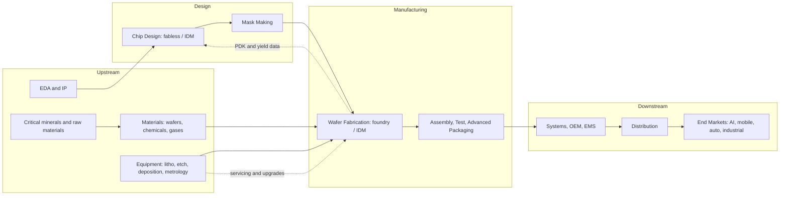

## Global Supply Chain Structure


### Overview and Motivation

The semiconductor supply chain is the most geographically distributed and specialized manufacturing network in existence. A single leading-edge chip may involve design software from one country, intellectual property from another, silicon wafers from a third, lithography equipment from a fourth, fabrication in a fifth, and assembly and test in a sixth, with the finished device crossing international borders dozens of times. No single company or country controls the entire chain.

This structure emerged from decades of specialization: as fab costs escalated (see the fab capital intensity and business-strategy topics), firms concentrated on narrow stages where they could achieve scale, learning, and technological leadership. The result is a network of extreme efficiency and extreme interdependence, with many **single points of failure** at specific choke-point technologies.

**Key Points**

- The chain has roughly six major stages: EDA/IP, chip design, materials and equipment, wafer fabrication, assembly/test/packaging, and end-system integration and distribution.
- Concentration is severe at several nodes: leading-edge lithography, leading-edge logic foundry capacity, advanced memory, EDA, and specialty materials each have very few qualified suppliers.
- Round-trip cycle times (wafer start to shipped product) run from months to over half a year, and the network crosses borders many times, making it sensitive to disruptions, trade policy, and geopolitical risk.
- Resilience, security, and cost now compete as design objectives, driving policy interventions and corporate re-shoring/friend-shoring.

---

### End-to-End Value Chain

#### Stage Map

| Stage | Activity | Representative players (illustrative) | Capital intensity |
| --- | --- | --- | --- |
| 1. EDA and IP | Design tools, cell libraries, processor and interface IP | Synopsys, Cadence, Siemens EDA; Arm, Rambus, Alphawave | Low capital, high R&D |
| 2. Chip design | Architecture, RTL, verification, physical design | Fabless firms (NVIDIA, AMD, Qualcomm, Apple silicon teams), IDMs | Low capital, very high NRE |
| 3. Materials | Silicon wafers, photoresists, gases, chemicals, CMP slurries, masks/blanks | Shin-Etsu, SUMCO, JSR, TOK, Entegris, Linde/Air Liquide | Moderate to high |
| 4. Equipment | Lithography, etch, deposition, metrology, cleans | ASML, Applied Materials, Lam Research, Tokyo Electron, KLA | High R&D, high margin |
| 5. Wafer fabrication | Front-end processing and back-end-of-line metallization | TSMC, Samsung, Intel, SK hynix, Micron, GlobalFoundries, SMIC, UMC | Extremely high |
| 6. Assembly, test, packaging (ATP/OSAT) | Dicing, wire bond/flip-chip, advanced packaging, final test | ASE, Amkor, JCET; foundry-internal packaging | Moderate, rising |
| 7. Systems and distribution | Modules, boards, end products, distribution | ODMs/EMS, OEMs, distributors | Varies |

[Unverified] Company lists are illustrative and market rankings change year to year; verify against current market research and company disclosures.

(svg_diagram) Semiconductor supply chain flow:

<svg xmlns="http://www.w3.org/2000/svg" viewBox="0 0 760 420" width="760" height="420" font-family="sans-serif" font-size="12">
<title>(svg_diagram) Global semiconductor supply chain flow</title>
<text x="380" y="22" text-anchor="middle" font-weight="bold">(svg_diagram) Global Semiconductor Supply Chain Flow</text>

<rect x="20" y="50" width="150" height="50" fill="#e3f2fd" stroke="#333" />
<text x="95" y="72" text-anchor="middle">EDA and IP</text>
<text x="95" y="90" text-anchor="middle" font-size="10">design tools, cores</text>
<rect x="20" y="120" width="150" height="50" fill="#e3f2fd" stroke="#333" />
<text x="95" y="142" text-anchor="middle">Materials</text>
<text x="95" y="160" text-anchor="middle" font-size="10">wafers, chemicals, gases</text>
<rect x="20" y="190" width="150" height="50" fill="#e3f2fd" stroke="#333" />
<text x="95" y="212" text-anchor="middle">Equipment</text>
<text x="95" y="230" text-anchor="middle" font-size="10">litho, etch, deposition</text>

<rect x="230" y="50" width="150" height="50" fill="#c8e6c9" stroke="#333" />
<text x="305" y="72" text-anchor="middle">Chip Design</text>
<text x="305" y="90" text-anchor="middle" font-size="10">fabless / IDM</text>

<rect x="230" y="120" width="150" height="50" fill="#fff9c4" stroke="#333" />
<text x="305" y="142" text-anchor="middle">Mask Making</text>
<text x="305" y="160" text-anchor="middle" font-size="10">photomasks</text>

<rect x="440" y="120" width="150" height="70" fill="#d1c4e9" stroke="#333" />
<text x="515" y="145" text-anchor="middle">Wafer Fab</text>
<text x="515" y="163" text-anchor="middle" font-size="10">foundry / IDM</text>
<text x="515" y="178" text-anchor="middle" font-size="10">front-end + BEOL</text>

<rect x="440" y="230" width="150" height="60" fill="#ffccbc" stroke="#333" />
<text x="515" y="255" text-anchor="middle">Assembly / Test</text>
<text x="515" y="273" text-anchor="middle" font-size="10">OSAT / adv. packaging</text>

<rect x="440" y="330" width="150" height="50" fill="#ffe0b2" stroke="#333" />
<text x="515" y="352" text-anchor="middle">Systems / OEM</text>
<text x="515" y="370" text-anchor="middle" font-size="10">boards, devices, distribution</text>

<line x1="170" y1="75" x2="230" y2="75" stroke="#333" stroke-width="2" />
<line x1="305" y1="100" x2="305" y2="120" stroke="#333" stroke-width="2" />
<line x1="380" y1="145" x2="440" y2="150" stroke="#333" stroke-width="2" />
<line x1="170" y1="145" x2="440" y2="160" stroke="#333" stroke-width="2" stroke-dasharray="4" />
<line x1="170" y1="215" x2="440" y2="175" stroke="#333" stroke-width="2" stroke-dasharray="4" />
<line x1="515" y1="190" x2="515" y2="230" stroke="#333" stroke-width="2" />
<line x1="515" y1="290" x2="515" y2="330" stroke="#333" stroke-width="2" />
<text x="620" y="150" font-size="10">wafers</text>
<text x="620" y="265" font-size="10">packaged chips</text>
</svg>

#### Flow of Materials, Information, and Money

- **Information flow:** Design data (GDSII/OASIS layouts, PDKs, IP) moves from designers to mask shops and foundries. Process design kits (PDKs) flow from foundries to designers. Yield and test data feed back into design and process.
- **Material flow:** Silicon ingots become wafers, which pass through the fab (hundreds of process steps), then to dicing, packaging, and test, then to system assemblers.
- **Financial flow:** Wafer purchase payments, IP royalties, EDA license fees, equipment purchases, and long-term capacity agreements.

---

### Upstream: EDA, IP, and Design

#### EDA (Electronic Design Automation)

EDA tools are indispensable: no modern chip can be designed without them. The market is dominated by three firms (an oligopoly), and their tools must be **certified against each foundry's PDK** for each node. This makes EDA a chokepoint in policy discussions (export controls) and a source of strong lock-in for designers.

Design flow stages supported by EDA:

1. Architecture and RTL design
2. Functional verification and emulation/prototyping
3. Logic synthesis
4. Physical design (floorplan, place-and-route, clock tree synthesis)
5. Timing/power/signal-integrity signoff
6. Design-for-test and design-for-manufacturability checks
7. Tape-out (release of GDSII/OASIS data to the mask shop/foundry)

#### Semiconductor IP

- **Processor IP:** CPU/GPU/NPU cores, licensed through models such as instruction-set licensing and core licensing.
- **Interface and memory IP:** SerDes, DDR/HBM PHYs, PCIe/CXL, UCIe controllers.
- **Foundation IP:** Standard cell libraries, SRAM compilers, I/O cells (often provided by the foundry or third parties).

IP licensing typically involves an up-front license fee plus per-unit royalties. The interplay between IP provider, foundry, and customer requires **IP qualification** on each process node.

#### Design Economics

Advanced-node design costs have escalated into the hundreds of millions of dollars for the most complex system-on-chips (SoCs). [Unverified] Widely cited design-cost estimates vary by source and definition; treat as order-of-magnitude figures. NRE plus mask costs are amortized over unit volume, tying design economics to market scale.

---

### Midstream: Materials

#### Silicon Wafers

- Produced by growing single-crystal ingots (Czochralski method), slicing, lapping, polishing, and cleaning.
- Standard sizes: 200 mm and 300 mm dominate current volume; 150 mm persists for power and specialty devices; 450 mm was explored but not commercialized.
- Wafer supply is concentrated among a handful of firms, and quality specifications (flatness, defect density, oxygen content) are stringent.
- Specialty substrates include SOI (silicon-on-insulator), epitaxial wafers, SiC and GaN-on-Si/SiC wafers for power and RF.

#### Process Chemicals and Gases

| Category | Examples | Notes |
| --- | --- | --- |
| Photoresists and ancillaries | KrF, ArF, EUV resists, anti-reflective coatings | Highly concentrated supply; qualification-intensive |
| Wet chemicals | Hydrofluoric acid, sulfuric acid, hydrogen peroxide | Ultra-high purity required |
| Specialty gases | NF$_3$, WF$_6$, silane, arsine, noble gases (neon, krypton, xenon) | Some gases have geographically concentrated supply |
| CMP slurries and pads | Ceria, silica, alumina slurries | Node-specific |
| Sputtering targets and precursors | Ti, Ta, Cu, Co, Ru; ALD precursors | Purity and consistency critical |

#### Photomasks

Photomasks (reticles) carry the circuit pattern for each lithography layer. A leading-edge product may need dozens of masks; EUV masks are especially complex and costly. Mask writing uses e-beam or multi-beam writers, an additional concentrated equipment category. Mask shops are often captive (owned by foundries/IDMs) or independent (e.g., Photronics, Toppan, DNP).

#### Materials Chokepoints and Sourcing Risks

- Certain ultra-high-purity chemicals and photoresists are supplied predominantly from a small number of countries and companies.
- Critical raw materials (gallium, germanium, rare earths, tungsten, high-purity quartz) depend on mining and refining operations concentrated in specific regions. [Unverified] Geographic concentration percentages vary by source and year.
- Qualification of alternate suppliers takes many months to years because a change in chemistry can shift yield.

---

### Midstream: Semiconductor Equipment

#### Major Equipment Segments

| Segment | Function | Market structure |
| --- | --- | --- |
| Lithography | Pattern transfer (DUV, EUV, High-NA EUV) | EUV: single supplier; DUV: very few |
| Etch | Pattern definition by material removal | Few large suppliers |
| Deposition (CVD, PVD, ALD, epitaxy) | Thin-film formation | Few large suppliers |
| Ion implantation and anneal | Doping and activation | Few suppliers |
| CMP and wet clean | Planarization and cleaning | Few suppliers |
| Metrology and inspection | Process control, defect detection | Few suppliers |
| Test and packaging equipment | Probers, testers, bonders | Distinct supplier base |

#### The Lithography Bottleneck

EUV lithography relies on an extraordinarily complex sub-supply chain:

- EUV light sources (laser-produced tin plasma)
- Ultra-precise multilayer mirrors and optics
- Reticle stages, pellicles, and mask inspection tools
- Vacuum systems and ultra-stable metrology

The dependency on a few specialized suppliers at each sub-tier makes equipment supply inherently rigid: capacity can only expand as fast as the slowest sub-supplier. Lead times for advanced tools can span a year or more.

#### Equipment Ecosystem Dynamics

- **Installed-base servicing:** Equipment vendors earn recurring revenue from spares, upgrades, and service, tying them tightly to fab operations.
- **Co-development:** Equipment makers collaborate with leading fabs and materials suppliers (and research institutes such as imec) to develop each new node.
- **Tool matching and qualification:** New tools must be qualified against existing production tools to preserve yield, which slows supplier switching.

---

### Front-End Manufacturing: Wafer Fabrication

#### Fab Segments by Product

| Product | Leading fab models | Typical wafer sizes |
| --- | --- | --- |
| Leading-edge logic | Foundry and a small number of IDMs | 300 mm |
| Mature/specialty logic | Foundries, IDMs | 200/300 mm |
| DRAM | IDMs | 300 mm |
| 3D NAND | IDMs and joint ventures | 300 mm |
| Analog/power/RF | IDMs, specialty foundries | 150/200/300 mm |
| Compound semiconductors (SiC, GaN, GaAs) | IDMs, specialty foundries | 100–200 mm |

#### Process Flow Overview

A wafer passes through many hundreds of steps, repeated across layers:

1. Front-end-of-line (FEOL): Transistor formation (isolation, gate stack, source/drain).
2. Middle-of-line (MOL): Contacts and local interconnect.
3. Back-end-of-line (BEOL): Multi-level metal interconnect (copper/low-k or emerging alternatives).
4. Wafer-level test (probe) and, increasingly, wafer-level packaging steps.

Total wafer cycle time is typically on the order of weeks to a few months at advanced nodes. [Inference] Exact cycle times vary by node, layer count, and product mix.

#### Geographic Distribution of Fabrication

Manufacturing capacity is geographically clustered:

- **East Asia (Taiwan, South Korea, China, Japan):** Dominant share of leading-edge logic and memory capacity and of overall wafer capacity.
- **United States:** Strong in design, EDA, equipment, and select fabs; expanding domestic capacity under industrial-policy programs.
- **Europe:** Strengths in equipment (lithography), automotive/industrial/power semiconductors, and research; expanding via regional programs.
- **Southeast Asia and elsewhere:** Significant assembly/test and some fab capacity.

[Unverified] Region-level percentage shares change with time and depend on whether measured by capacity, revenue, or node; consult current industry association and analyst data (e.g., SIA, SEMI, TrendForce, IC Insights).

---

### Back-End: Assembly, Test, and Packaging

#### Traditional OSAT Flow

1. **Wafer probe and sort:** Electrical testing of dies on wafer.
2. **Backgrind and dicing:** Thinning and singulation.
3. **Die attach and interconnect:** Wire bonding or flip-chip bumping.
4. **Encapsulation/molding.**
5. **Marking, final test, burn-in, and qualification.**
6. **Shipping to system assemblers.**

#### Advanced Packaging

Advanced packaging technologies move value and capability into the packaging stage:

| Technology | Description | Role |
| --- | --- | --- |
| Flip-chip BGA | Bumps connect die face-down to substrate | Mainstream high-performance packaging |
| Fan-out wafer-level packaging | Redistribution layers extend beyond die edge | Mobile, compact systems |
| 2.5D (interposer-based) | Dies side by side on silicon/organic interposer | GPU + HBM integration |
| 3D stacking (TSV, hybrid bonding) | Dies stacked vertically with dense vertical connections | Memory stacks (HBM), logic-on-logic |
| Chiplet-based systems | Multiple dies integrated in one package | Modular design, yield improvement |

Advanced packaging is increasingly integrated with foundry services, blurring the line between front-end and back-end.

#### Geography of ATP

Assembly, test, and packaging historically concentrated in Taiwan, mainland China, Southeast Asia (Malaysia, Vietnam, Philippines, Singapore), and elsewhere in Asia, driven by lower labor costs and established ecosystems. Advanced packaging capacity is a growing focus of new investment in multiple regions.

---

### Downstream: Systems, Distribution, and End Markets

- **EMS/ODM firms** integrate chips onto boards and into finished products.
- **Distributors and brokers** buffer supply and demand, and the gray market emerges during shortages.
- **End markets** include smartphones, PCs, data centers/AI, automotive, industrial, consumer electronics, communications infrastructure, and aerospace/defense.

#### Demand Structure

| End market | Characteristics |
| --- | --- |
| Data center/AI | High-value, leading-edge logic and HBM demand; rapid growth |
| Smartphones | Volume-driven; annual product cycles; leading-edge logic anchor |
| PCs and servers | Cyclical, leading-edge CPUs/GPUs |
| Automotive | Long qualification cycles; mature nodes; rising content per vehicle |
| Industrial and IoT | Diverse, mature-node and specialty devices |
| Communications | RF, baseband, networking silicon |

**Key Points**

- Different end markets demand different nodes and reliability standards, which fragments capacity planning.
- Automotive and industrial sectors need long product lifetimes and stringent qualification, so they are slow to switch suppliers or nodes and were exposed during recent shortages.

---

### Geographic Concentration and Chokepoints

#### Chokepoint Catalog

| Chokepoint | Nature of concentration | Why it matters |
| --- | --- | --- |
| EUV lithography | One qualified vendor for production EUV tools | Required for the most advanced logic and increasingly DRAM |
| Leading-edge logic foundry | Very few firms capable at the newest nodes, concentrated in a small number of locations | Supplies many fabless companies and end products |
| Advanced memory (DRAM, HBM, NAND) | Small oligopoly of producers | HBM is essential to AI accelerators |
| EDA | Three dominant vendors | Required for all advanced designs |
| Advanced packaging (CoWoS-class 2.5D, HBM stacking) | Limited capacity growth | Can constrain AI chip output |
| High-purity chemicals, photoresists, specialty gases | Concentrated suppliers and geographies | Small volumes but essential |
| Silicon wafers and substrates | A few large suppliers | Universal input |
| Critical minerals (gallium, germanium, rare earths, tungsten) | Concentrated mining/refining | Upstream raw-material risk |

#### Quantifying Concentration: The Herfindahl–Hirschman Index

Market concentration for a supply node can be measured with the Herfindahl–Hirschman Index (HHI):

$$HHI = \sum_{i=1}^{n} s_i^{2}$$

where $s_i$ is the market share of firm (or country) $i$ expressed in percent. HHI ranges from near 0 (highly fragmented) to 10,000 (monopoly). Under commonly used antitrust conventions, values above roughly 2,500 indicate a highly concentrated market. [Inference] Thresholds differ across jurisdictions and have been revised over time.

**Example**

```python
def hhi(shares_percent):
    return sum(s**2 for s in shares_percent)

# Illustrative supply-node share distributions (percent) - hypothetical numbers
nodes = {
    "Node A (single-source tool)":       [100],
    "Node B (three-vendor oligopoly)":   [40, 35, 25],
    "Node C (fragmented, 10 suppliers)": [10]*10,
}

for name, shares in nodes.items():
    print(f"{name:38s} HHI = {hhi(shares):,.0f}")
```

**Output**

For the hypothetical distributions: Node A yields HHI = 10,000; Node B yields $40^2 + 35^2 + 25^2 = 1600 + 1225 + 625 = 3{,}450$; Node C yields $10 \times 10^2 = 1{,}000$. The shares are invented for illustration and do not describe real markets.

#### Geographic Concentration Risk

Country-level concentration can be assessed the same way, treating each location's share of capacity as $s_i$. Risk relates not only to the share but also to hazards at the location: seismic activity, typhoons, power reliability, water availability, and geopolitical tension.

---

### Supply Chain Dynamics

#### Lead Times and the Bullwhip Effect

Fabrication cycle time (roughly 2–4+ months), equipment lead times (up to a year or more for advanced tools), and fab construction times (2–3+ years) create long delays between demand signals and supply response. Small shifts in end-demand amplify upstream, the **bullwhip effect**. A simple amplification measure:

$$BWE = \frac{\mathrm{Var}(\text{orders placed})}{\mathrm{Var}(\text{demand})}$$

Values greater than 1 indicate amplification. Double-ordering during shortages (customers ordering more than needed to secure allocation) exacerbates the effect and leads to inventory corrections when shortages ease.

#### Inventory and Buffering

- Fabs run with high WIP (work-in-process); by Little's Law, $WIP = TH \times CT$.
- Strategic inventory buffers at multiple points (wafer banks, die banks, finished goods) allow short-term smoothing but tie up capital.
- Just-in-time practices in automotive and other sectors reduced buffers, contributing to exposure during the 2020–2022 shortage period. [Inference] The shortage had multiple causes (demand shifts, inventory practices, capacity constraints, and localized disruptions); attributing shares to each is contested.

#### Capacity Allocation and Contracts

- **Long-term agreements (LTAs), prepayments, and take-or-pay contracts** secure capacity for customers and give suppliers demand visibility.
- **Priority allocation:** Larger, longer-committed, and strategically valuable customers often receive priority in shortages.
- **Pricing dynamics:** Wafer prices rise in tight markets, reinforcing the cyclical pattern.

#### Quantifying Supply Risk

A basic expected-loss framework for a node $k$:

$$E[L_k] = p_k \cdot d_k \cdot v_k$$

where $p_k$ is the probability of disruption per period, $d_k$ is the disruption duration (fraction of period lost), and $v_k$ is the value flowing through that node. Mitigation options (dual sourcing, inventory, redundancy) reduce $p_k$, $d_k$, or the exposure.

**Example**

A simple Monte Carlo of a two-node chain (wafer fab and OSAT) with independent disruptions:

```python
import numpy as np

rng = np.random.default_rng(7)
N = 50_000

# Annual disruption probabilities and severity (fraction of annual output lost)
p_fab, p_osat = 0.05, 0.08
sev_fab_mean, sev_osat_mean = 0.25, 0.15

fab_hit  = rng.random(N) < p_fab
osat_hit = rng.random(N) < p_osat

loss_fab  = fab_hit  * rng.beta(2, 6, N) * (sev_fab_mean / (2/(2+6)))
loss_osat = osat_hit * rng.beta(2, 6, N) * (sev_osat_mean / (2/(2+6)))

# Serial chain: output limited by the worse of the two stages
loss_total = np.maximum(loss_fab, loss_osat)
loss_total = np.clip(loss_total, 0, 1)

print(f"Mean annual output loss: {loss_total.mean():.2%}")
print(f"P(loss > 20%):           {(loss_total > 0.20).mean():.2%}")
```

**Output**

The script prints the mean expected output loss from disruptions and the probability that annual loss exceeds 20%. [Inference] With these illustrative probabilities and severities, mean loss is on the order of a percent, with a small tail probability of severe losses; results depend on the assumed parameters and random seed and are not calibrated to real events.

---

### Geopolitics, Trade Policy, and Industrial Policy

#### Export Controls and Trade Restrictions

Governments control the export of advanced semiconductors, manufacturing equipment, EDA software, and related technology. Effects include:

- Constraining access to leading-edge tools and chips for targeted entities.
- Prompting redesign of products for compliance (e.g., reduced-performance variants).
- Driving indigenization efforts and stockpiling in targeted regions.
- Creating compliance burdens and uncertainty for global suppliers.

[Unverified] Specific rules, thresholds, and lists change frequently; consult current regulatory sources (e.g., U.S. Bureau of Industry and Security, EU and national authorities).

#### Subsidy and Localization Programs

| Region | Program type (illustrative) |
| --- | --- |
| United States | CHIPS and Science Act: manufacturing incentives, tax credits, R&D funding |
| European Union | European Chips Act: funding coordination, pilot lines, "first-of-a-kind" facility support |
| Japan | Subsidies for domestic and joint-venture fabs and materials/equipment |
| South Korea | Tax incentives and infrastructure support for domestic clusters |
| Taiwan | Tax incentives and R&D support for domestic industry |
| China | Large state-backed investment funds and localization targets |
| India | Incentive schemes for fabs, packaging, and design |

[Unverified] Program sizes, eligibility rules, and disbursement progress change; verify with official sources.

#### Strategic Concepts

- **Onshoring/reshoring:** Bringing manufacturing back to the home country.
- **Friend-shoring/ally-shoring:** Shifting supply to politically aligned partners.
- **Dual-sourcing and multi-region redundancy:** Qualifying more than one supplier or location.
- **Strategic stockpiles:** Holding critical materials or components.
- **Technology denial vs. openness trade-off:** Restricting adversaries' access while preserving the scale economies that fund innovation.

#### Cost of Resilience

Building redundant capacity in multiple regions raises cost. If a region's fully loaded wafer cost is $C_r$ and baseline is $C_0$, the resilience premium is:

$$\Pi = \frac{C_r - C_0}{C_0}$$

Reported estimates of premiums vary widely. [Unverified] Consult specific studies (e.g., from industry associations or think tanks) and note that assumptions about subsidies, scale, and ecosystem maturity strongly influence the result.

---

### Logistics, Infrastructure, and Physical Risk

- **Transport:** High-value, low-weight wafers and packaged chips travel primarily by air freight; materials, equipment, and bulk chemicals by sea/ground. Air freight disruptions (as during 2020) directly affect chip logistics.
- **Utilities:** Fabs need reliable power and vast quantities of ultrapure water. Drought, grid instability, or outages can halt production.
- **Natural hazards:** Earthquakes, typhoons, floods, wildfires, and freezes can disrupt fabs and material suppliers, and events at even a single specialty chemical plant can ripple across the industry.
- **Cleanroom contamination and single-fab incidents:** A contamination event or power blip can scrap significant wafer inventory.
- **Cyber risk:** Fab automation systems, IP repositories, and supplier networks are attractive targets; a malware incident can halt operations.
- **Intellectual property and counterfeit risk:** Grey-market and counterfeit components enter the supply chain during shortages, raising authentication and traceability needs.

---

### Supply Chain Mapping and Analytics

#### Multi-Tier Mapping

Visibility beyond tier-1 suppliers is often poor: an OEM may know its chip vendor but not the foundry, the substrate supplier, or the chemicals used. Mapping steps:

1. Bill of materials (BOM) decomposition to component level.
2. Identify manufacturer and part-number sourcing for each component.
3. Trace to fab, OSAT, and material/equipment dependencies.
4. Assign geographic locations and risk attributes.
5. Identify single points of failure and concentration.

#### Network Modeling

Represent the chain as a directed graph $G = (V, E)$ where nodes are facilities/companies and edges are material or service flows. Criticality metrics include:

- **Betweenness centrality:** How often a node lies on shortest flow paths.
- **Node removal impact:** Loss in delivered output when a node is removed:


  $$I_k = \frac{Q_{baseline} - Q_{without\ k}}{Q_{baseline}}$$

**Example**

```python
import networkx as nx

G = nx.DiGraph()
edges = [
    ("EDA", "Design"), ("IP", "Design"),
    ("Design", "Mask"), ("Mask", "Fab"),
    ("Wafers", "Fab"), ("Chemicals", "Fab"), ("Litho", "Fab"),
    ("Fab", "OSAT"), ("OSAT", "OEM"),
]
G.add_edges_from(edges)

# Simple criticality: number of downstream nodes reachable
for n in G.nodes:
    downstream = nx.descendants(G, n)
    print(f"{n:10s} downstream reach = {len(downstream)}")

# Betweenness centrality (structural bottlenecks)
bc = nx.betweenness_centrality(G)
print(sorted(bc.items(), key=lambda kv: -kv[1])[:3])
```

**Output**

The script lists each node's downstream reach and the top nodes by betweenness. In this toy graph, "Fab" has the highest structural criticality, as every upstream input funnels through it before reaching OSAT and OEM. [Inference] Real supply chains have far more nodes and parallel paths; the toy graph illustrates the method, not real topology.

#### Resilience Strategies Summary

| Strategy | Mechanism | Trade-off |
| --- | --- | --- |
| Dual/multi-sourcing | Qualify alternate suppliers or fabs | Qualification cost and time; split volumes reduce scale |
| Inventory buffers | Hold safety stock of wafers, die, or finished chips | Working-capital cost; obsolescence |
| Geographic diversification | Multiple fab/ATP regions | Higher cost; ecosystem immaturity |
| Design flexibility | Multi-foundry-compatible design, chiplets, node portability | Extra design/NRE effort |
| Long-term contracts | Secure capacity via LTAs/prepayments | Volume commitments; inflexibility |
| Visibility tools | Multi-tier mapping, early-warning analytics | Data-sharing hurdles |
| Strategic reserves | Stockpile critical materials | Storage cost |

---

### Sustainability and Environmental Dimensions

- **Energy:** Fabs are large electricity consumers, and EUV tools have high power demand; decarbonization of manufacturing and sourcing of renewable energy are growing priorities.
- **Water:** Ultrapure water use is very high; recycling and reclamation are critical in water-stressed regions.
- **Greenhouse gases:** Process gases such as fluorinated compounds (NF$_3$, SF$_6$, PFCs) have high global-warming potential, so abatement is essential.
- **Chemical management and waste:** Regulation and community standards shape permitting and siting.
- **Scope 3 emissions:** Supply-chain emissions (materials, equipment, transport) are increasingly reported and targeted by customers and regulators.
- **Responsible sourcing:** Conflict minerals and labor practices are subject to due-diligence requirements.

---

### Mermaid Overview: Supply Chain Dependency Map



---

### Regional Roles Summary

| Region | Typical strengths | Typical vulnerabilities |
| --- | --- | --- |
| United States | EDA, IP, fabless design, equipment, some leading-edge fabs | Limited leading-edge manufacturing share (improving); reliance on Asian ATP |
| Taiwan | Leading-edge foundry, advanced packaging, OSAT | Geographic/geopolitical concentration; natural hazards; energy/water |
| South Korea | Memory, leading-edge logic, materials/equipment | Concentration in memory; dependence on imported equipment and materials |
| Japan | Materials, equipment, specialty devices, image sensors | Capacity constraints; workforce; natural hazards |
| China | Large-volume mature-node capacity, ATP, huge demand base | Access limits to advanced tools; indigenization challenges |
| Europe | Lithography equipment, power/automotive/industrial chips, research | Limited leading-edge fab capacity; energy costs |
| Southeast Asia | ATP, some fabs, emerging ecosystem | Reliance on imported materials/equipment; infrastructure gaps |
| India | Design talent, emerging fab/ATP programs | Ecosystem still forming |

[Inference] Regional characterizations are broad generalizations and should be refined with current data for any specific analysis.

---

### Challenges and Open Problems

**Key Points**

- **Concentration vs. efficiency:** The features that make the chain efficient (specialization, scale) also concentrate risk; deliberately adding redundancy raises cost.
- **Visibility gaps:** Multi-tier supply-chain transparency is limited, especially for materials and sub-tier equipment components.
- **Long lead times:** Capacity additions take years, so supply cannot respond quickly to demand surges, especially for AI-driven demand.
- **Advanced packaging and HBM bottlenecks:** Capacity growth in these areas is now a gating factor for AI hardware.
- **Talent shortage:** Skilled engineers and technicians are scarce and slow to develop, constraining new-fab ramp.
- **Policy uncertainty:** Rapidly changing export controls, tariffs, and subsidies complicate long-horizon investment decisions.
- **Environmental constraints:** Water, energy, and emissions requirements shape where and how fast capacity can grow.
- **Measurement and data issues:** Market share, capacity, and dependency data are proprietary or inconsistent, which limits rigorous modeling.

---

### Conclusion

The global semiconductor supply chain is a deeply specialized, geographically dispersed, and highly interdependent network in which a small number of firms and locations hold critical chokepoints in EDA, lithography, leading-edge manufacturing, memory, packaging, and specialty materials. Its efficiency stems from decades of specialization and scale, but that same structure creates systemic exposure to natural hazards, geopolitical shocks, and demand-driven bottlenecks. Understanding the chain requires mapping flows of design data, materials, and capital across tiers, quantifying concentration (e.g., HHI), and modeling disruption risk. Strategic responses (diversification, redundancy, contracts, and industrial policy) all involve trade-offs between cost, resilience, and technological leadership, and the industry's future structure will be shaped by how those trade-offs are resolved.

---

### Related Topics

**Next Steps**

- Foundry versus IDM business strategies and how they shape the chain's structure
- Fab capital intensity and cost modeling
- Semiconductor equipment market structure and EUV supply chain
- Advanced packaging and chiplet ecosystems (CoWoS, HBM, hybrid bonding)
- EDA and IP licensing economics
- Export controls, sanctions, and technology-denial policy
- Government industrial policy programs (CHIPS Act, EU Chips Act, regional equivalents)
- Critical minerals and materials supply security (gallium, germanium, rare earths, neon)
- Supply chain risk modeling, network analysis, and resilience metrics
- Memory market structure (DRAM, NAND, HBM) and cyclicality
- Automotive and industrial semiconductor supply and qualification
- Sustainability accounting: energy, water, and emissions in semiconductor manufacturing