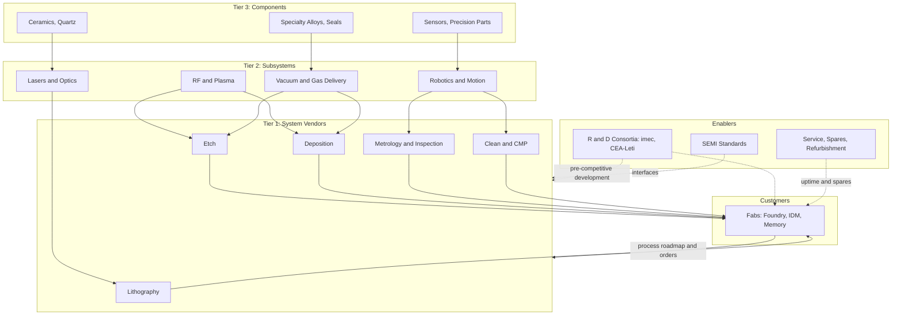

## Equipment Supplier Ecosystem


### Overview and Motivation

Semiconductor manufacturing equipment (SME), often called wafer fab equipment (WFE) when it refers to front-end tools, is the industrial base on which every chip is built. Equipment purchases account for the majority of fab capital expenditure (typically 70-85% of a new fab's investment, per the capital-intensity topic), so the equipment supplier ecosystem determines what can be manufactured, how fast capacity can grow, and at what cost.

The ecosystem is a layered network:

- A small number of **system-level tool vendors** (lithography, etch, deposition, metrology, and so on) sell complete process tools to fabs.
- Beneath them, thousands of **sub-system and component suppliers** provide lasers, optics, RF generators, vacuum pumps, valves, mass-flow controllers, robots, ceramics, and precision mechanical parts.
- Alongside them, **service, spares, and refurbishment** businesses keep the installed base running.
- Around them, **research institutes and consortia** (imec, CEA-Leti, and university programs) co-develop next-generation processes.

**Key Points**

- The equipment market is highly concentrated: a handful of firms account for the large majority of WFE revenue, and several segments (EUV lithography especially) have one qualified supplier.
- The ecosystem is strongly shaped by **co-development** with leading fabs, long qualification cycles, and recurring service revenue from the installed base.
- Equipment demand is more volatile than chip demand, because fab capex swings with utilization, pricing, and technology transitions, and vendors amplify this swing (a bullwhip effect upstream).
- Sub-tier concentration and geopolitical controls make the ecosystem a strategic chokepoint.

---

### Market Structure

#### Segmentation of the Equipment Market

| Segment | Share of WFE (order of magnitude) | Function | Concentration |
| --- | --- | --- | --- |
| Lithography | ~20-25% | Pattern transfer (DUV, EUV, i-line, KrF) | EUV: single vendor; DUV: very few |
| Etch | ~20-25% | Selective material removal, high-aspect-ratio features | Few large vendors |
| Deposition (CVD, PVD, ALD, epitaxy) | ~20-25% | Thin-film formation | Few large vendors |
| Process control (metrology and inspection) | ~10-15% | Measurement, defect detection | Few vendors (KLA dominant) |
| Clean and wet processing | ~5-8% | Particle and residue removal | Few vendors |
| CMP | ~2-4% | Planarization | Very few vendors |
| Ion implantation, anneal, other | ~3-6% | Doping, thermal processing | Few vendors |
| Test (ATE) | Separate market | Electrical test of dies and packages | Few vendors |
| Assembly and packaging equipment | Separate market | Dicing, bonding, molding | Distinct supplier base |

[Unverified] Segment shares shift with node mix, memory versus logic spending, and technology transitions; consult current SEMI, VLSI Research, or company disclosures for exact figures.

#### Notable Vendors by Segment (Illustrative)

| Segment | Representative vendors |
| --- | --- |
| Lithography | ASML (EUV, DUV), Nikon, Canon |
| Etch | Lam Research, Tokyo Electron, Applied Materials, Hitachi High-Tech |
| Deposition | Applied Materials, Lam Research, Tokyo Electron, ASM International, Kokusai Electric |
| Metrology and inspection | KLA, Applied Materials, Hitachi High-Tech, Onto Innovation, Lasertec (EUV mask inspection) |
| Clean | SCREEN, Tokyo Electron, Lam Research, SEMES |
| CMP | Applied Materials, Ebara |
| Ion implant | Applied Materials, Axcelis, Sumitomo Heavy Industries |
| Test | Advantest, Teradyne |
| Packaging | ASMPT, BE Semiconductor (Besi), Disco, Kulicke and Soffa |

[Unverified] Vendor lists are illustrative, and market positions change with mergers, product cycles, and geopolitical developments.

#### Concentration Measurement

Market concentration of a segment can be assessed with the HHI:

$$HHI = \sum_{i=1}^{n} s_i^{2}$$

where $s_i$ is the percent market share of vendor $i$. A single-vendor segment has $HHI = 10{,}000$. Typical antitrust conventions treat markets with $HHI$ above roughly 2,500 as highly concentrated. [Inference] Thresholds differ by jurisdiction and have been revised over time.

**Example**

```python
def hhi(shares):
    return sum(s**2 for s in shares)

# Hypothetical share distributions (percent), for illustration only
segments = {
    "EUV lithography (single vendor)":  [100],
    "Etch (four large vendors)":        [35, 30, 20, 15],
    "Clean (five vendors)":             [30, 25, 20, 15, 10],
    "Components (fragmented)":          [5] * 20,
}

for name, shares in segments.items():
    print(f"{name:34s} HHI = {hhi(shares):>6,.0f}")
```

**Output**

The script prints $HHI = 10{,}000$ for the single-vendor segment, $35^2 + 30^2 + 20^2 + 15^2 = 2{,}750$ for the four-vendor etch segment, $30^2 + 25^2 + 20^2 + 15^2 + 10^2 = 2{,}250$ for the five-vendor clean segment, and $20 \times 5^2 = 500$ for the fragmented component market. The shares are hypothetical and do not represent real markets.

---

### Ecosystem Layers

(svg_diagram) Equipment ecosystem structure:

<svg xmlns="http://www.w3.org/2000/svg" viewBox="0 0 720 420" width="720" height="420" font-family="sans-serif" font-size="12">
<title>(svg_diagram) Equipment supplier ecosystem layers</title>
<text x="360" y="22" text-anchor="middle" font-weight="bold">(svg_diagram) Equipment Supplier Ecosystem Layers</text>

<rect x="180" y="40" width="360" height="50" fill="#ffe0b2" stroke="#333" />
<text x="360" y="62" text-anchor="middle">Fabs: Foundries, IDMs, Memory Makers</text>
<text x="360" y="80" text-anchor="middle" font-size="10">process qualification, tool matching, service contracts</text>

<rect x="80" y="120" width="560" height="60" fill="#d1c4e9" stroke="#333" />
<text x="360" y="142" text-anchor="middle">System-Level Tool Vendors (WFE)</text>
<text x="360" y="162" text-anchor="middle" font-size="10">Litho | Etch | Deposition | Metrology | Clean | CMP | Implant</text>

<rect x="80" y="210" width="560" height="60" fill="#c8e6c9" stroke="#333" />
<text x="360" y="232" text-anchor="middle">Subsystem Suppliers</text>
<text x="360" y="252" text-anchor="middle" font-size="10">Lasers | Optics | RF power | Vacuum | Gas delivery | Robotics | Motion stages</text>

<rect x="80" y="300" width="560" height="50" fill="#bbdefb" stroke="#333" />
<text x="360" y="322" text-anchor="middle">Component and Material Suppliers</text>
<text x="360" y="340" text-anchor="middle" font-size="10">Ceramics | Quartz | Specialty metals | Sensors | Seals | Precision machining</text>

<rect x="10" y="380" width="340" height="30" fill="#fff9c4" stroke="#333" />
<text x="180" y="400" text-anchor="middle" font-size="11">R&amp;D consortia: imec, CEA-Leti, universities</text>
<rect x="370" y="380" width="340" height="30" fill="#ffccbc" stroke="#333" />
<text x="540" y="400" text-anchor="middle" font-size="11">Service, spares, refurbishment, software</text>

<line x1="360" y1="120" x2="360" y2="90" stroke="#333" stroke-width="2" />
<line x1="360" y1="210" x2="360" y2="180" stroke="#333" stroke-width="2" />
<line x1="360" y1="300" x2="360" y2="270" stroke="#333" stroke-width="2" />
</svg>

#### Tier 0: Customers (Fabs)

Foundries, IDMs, and memory makers set demand. Their process roadmaps define the tool requirements, and their capex cycles set the market's rhythm. Fab customers are themselves concentrated, so equipment vendors face **customer concentration** (a handful of fabs account for a large fraction of orders) alongside vendor concentration.

#### Tier 1: System-Level Vendors

Tier-1 vendors design, integrate, and sell complete tools. Their core competencies are:

- Process know-how (recipes, chemistries, integration schemes)
- Systems engineering (integrating optics, vacuum, motion, fluidics, and controls)
- Software and data (recipe management, advanced process control, fleet analytics)
- Global service networks

#### Tier 2: Subsystem Suppliers

| Subsystem | Examples of role | Notes |
| --- | --- | --- |
| Lasers and light sources | DUV excimer lasers, EUV drive lasers (CO$_2$), source modules | Highly specialized; long development cycles |
| Optics | Lenses, multilayer mirrors, projection optics | Extreme precision; very few suppliers (e.g., Zeiss for EUV optics) |
| RF power and plasma | Generators, matching networks | Critical for etch and deposition |
| Vacuum | Turbo/dry pumps, valves, gauges | Supplier concentration; direct effect on tool uptime |
| Gas and liquid delivery | Mass-flow controllers, valves, regulators, fittings | Ultra-high purity requirements |
| Robotics and wafer handling | Transfer robots, end effectors, FOUP loaders | Reliability and cleanliness critical |
| Motion and stages | Nanometer-scale stages, linear motors | Especially for lithography and inspection |
| Power and thermal management | Chillers, temperature controllers, power supplies | Stability critical for process repeatability |
| Sensors and controls | Encoders, interferometers, pressure/temperature sensors | Precision and calibration |

#### Tier 3: Components and Materials

Ceramics (alumina, aluminum nitride, yttria coatings), quartz, silicon carbide parts, specialty alloys, elastomer seals (perfluoroelastomers), and precision-machined parts. Consumable and wear parts, such as edge rings, showerheads, and chamber liners, generate recurring revenue and undergo frequent replacement.

#### Sideways Ecosystem Members

- **Software and automation vendors:** Equipment control software, MES, fab automation, AMHS.
- **Independent service and spare-parts providers (ISPs):** Repair and refurbishment, especially for legacy 200 mm tools.
- **Used-equipment brokers:** A significant market for 200 mm and older 300 mm tools.
- **Research institutes and consortia:** Pre-competitive development of new processes and tool concepts.
- **Standards bodies:** SEMI defines interface, safety, and environmental standards (e.g., SEMI E-series, S-series) that let tools and fab systems interoperate.

---

### The Lithography Sub-Ecosystem (Case Study)

Lithography is the clearest example of ecosystem interdependence.

#### EUV Lithography Structure

EUV scanners integrate contributions from a global network:

| Sub-system | Function | Supply concentration |
| --- | --- | --- |
| EUV source (laser-produced plasma, tin droplets) | Generates 13.5 nm light | Specialized suppliers of drive lasers and source modules |
| Collector and projection optics | Reflect and focus EUV via multilayer mirrors | Extremely limited supplier base |
| Reticle stage and wafer stage | Nanometer-precision motion | Specialized precision motion suppliers |
| Reticle (mask) and mask blanks | Pattern carrier; EUV reflective masks | Few blank and mask-inspection suppliers |
| Pellicles | Protect reticles from particles | Emerging and limited supply |
| Photoresist | Chemically amplified or metal-oxide resists | Concentrated chemistry suppliers |
| Metrology and mask inspection | Verify patterns and defects | Very few vendors |

Because lead times for each sub-system are long and capacity is inflexible, the **slowest sub-supplier limits total tool output**. If tool output is limited by the minimum of the sub-supplier capacities $c_k$:

$$Q_{tools} = \min_k \left(\frac{c_k}{n_k}\right)$$

where $n_k$ is the number of units of component $k$ needed per tool.

#### Roadmap Progression

- **DUV immersion (ArF-i):** Mature, used with multi-patterning for many layers.
- **Low-NA EUV (0.33 NA):** In volume production for leading-edge logic and increasingly DRAM.
- **High-NA EUV (0.55 NA):** Entering early production and development use at leading fabs. [Unverified] Adoption timelines and insertion nodes vary by company and change frequently.

The resolution scaling relation (Rayleigh criterion) explains the path:

$$CD = k_1\,\frac{\lambda}{NA}$$

where $CD$ is the critical dimension, $\lambda$ is wavelength, $NA$ is numerical aperture, and $k_1$ is a process factor. Reducing $\lambda$ (193 nm to 13.5 nm) and increasing $NA$ both reduce achievable $CD$. Depth of focus falls as

$$DOF = k_2\,\frac{\lambda}{NA^{2}}$$

which is why High-NA imposes tight requirements on resist thickness, wafer flatness, and focus control.

**Example**

```python
def cd(k1, wavelength_nm, na):
    return k1 * wavelength_nm / na

def dof(k2, wavelength_nm, na):
    return k2 * wavelength_nm / na**2

cases = {
    "ArF immersion (193 nm, NA 1.35)": (193.0, 1.35),
    "EUV low-NA (13.5 nm, NA 0.33)":   (13.5, 0.33),
    "EUV high-NA (13.5 nm, NA 0.55)":  (13.5, 0.55),
}

k1, k2 = 0.30, 0.50  # illustrative process factors
for name, (lam, na) in cases.items():
    print(f"{name:34s} CD ~ {cd(k1, lam, na):5.1f} nm   DOF ~ {dof(k2, lam, na):5.1f} nm")
```

**Output**

With the illustrative factors $k_1 = 0.30$ and $k_2 = 0.50$, the script prints approximately: ArF immersion CD $\approx 42.9$ nm and DOF $\approx 52.9$ nm; low-NA EUV CD $\approx 12.3$ nm and DOF $\approx 62.0$ nm; high-NA EUV CD $\approx 7.4$ nm and DOF $\approx 22.3$ nm. [Inference] Real values depend on the process; the numbers illustrate the trend that High-NA improves resolution while shrinking depth of focus.

---

### Economics of Equipment Suppliers

#### R&D Intensity and Barriers to Entry

Equipment vendors spend heavily on R&D, commonly in the range of ~10-15% of revenue for the large firms. [Inference] Ratios differ by firm and segment. Barriers to entry include:

- Deep process know-how accumulated over decades
- Patents and trade secrets
- Co-development relationships with leading fabs
- Global service infrastructure
- Qualification cycles that favor incumbents
- Enormous R&D cost per new node

New entrants rarely challenge incumbents in mainstream segments; instead, they enter niches (new materials, advanced packaging, inspection, or specialized processes) and are often acquired.

#### Revenue Model

| Revenue stream | Description | Character |
| --- | --- | --- |
| New tool sales | Systems sold to fabs | Highly cyclical, lumpy |
| Upgrades and conversions | Field upgrades that extend tool capability | Semi-cyclical |
| Spares and consumables | Parts and wear items | Recurring |
| Service contracts and support | Preventive maintenance, uptime guarantees | Recurring, higher margin |
| Software and data services | Fleet analytics, control software | Growing |

The **installed base** creates a recurring stream that partially smooths cyclicality. A vendor's installed-base revenue in year $t$ can be approximated as:

$$R_{service}(t) \approx \sum_{j} N_j(t)\,\bar{s}_j$$

where $N_j(t)$ is the number of installed tools of type $j$ still operating and $\bar{s}_j$ is average annual service and spares revenue per tool.

#### Cyclicality and the Bullwhip Effect

Equipment orders amplify chip-demand swings. A stylized amplification measure:

$$BWE = \frac{\mathrm{Var}(\text{equipment orders})}{\mathrm{Var}(\text{chip demand})}$$

Fabs order tools when utilization is high and prices are strong, and cancel or defer when utilization falls, so equipment vendors face larger swings than chipmakers. Vendors respond by:

- Diversifying across customers and segments
- Growing service and installed-base revenue
- Managing supply-chain commitments with flexible contracts
- Holding cash buffers

#### Cost of Ownership Perspective

A tool's **cost of ownership (COO)** (SEMI E35) compares fixed and variable costs per processed wafer:

$$COO_{wafer} = \frac{C_{tool}\cdot CRF + C_{floor} + C_{consumables} + C_{maint} + C_{labor}}{WPH \cdot H_{yr}\cdot U}$$

where $CRF = \dfrac{r(1+r)^n}{(1+r)^n - 1}$ is the capital recovery factor. Tool vendors compete on throughput ($WPH$), uptime ($U$), consumable cost, and footprint, not only purchase price.

**Example**

Compare two etch tools:

```python
def crf(r, n):
    return r * (1 + r)**n / ((1 + r)**n - 1)

def coo_per_wafer(price, r, n, floor, consumables, maint, labor, wph, hours, util):
    annual_fixed = price * crf(r, n) + floor + maint + labor
    wafers = wph * hours * util
    return annual_fixed / wafers + consumables

# Tool A: cheaper, slower.  Tool B: pricier, faster, higher uptime.
A = coo_per_wafer(price=4.0e6, r=0.10, n=5, floor=1.0e5, consumables=2.0,
                  maint=3.0e5, labor=1.5e5, wph=40, hours=8000, util=0.78)
B = coo_per_wafer(price=5.0e6, r=0.10, n=5, floor=1.0e5, consumables=2.2,
                  maint=3.5e5, labor=1.5e5, wph=55, hours=8000, util=0.86)

print(f"Tool A COO ~ ${A:.2f}/wafer pass")
print(f"Tool B COO ~ ${B:.2f}/wafer pass")
```

**Output**

Tool A prices out near $7.5 per wafer pass and Tool B near $5.2, so the more expensive tool wins on cost per wafer through higher throughput and uptime. [Inference] Illustrative numbers only.

---

### Co-Development, Qualification, and Lock-In

#### Co-Development Model

Leading-edge processes emerge from joint work among fabs, tool vendors, materials suppliers, and research institutes. Vendors embed engineers at customer fabs and research centers (e.g., imec) to develop:

- New process modules (high-aspect-ratio etch, selective deposition, atomic-layer etch)
- Integration schemes for new device architectures (gate-all-around, backside power delivery, 3D memory)
- New materials and chemistries

This produces a **learning-by-doing** dynamic that reinforces incumbent advantages.

#### Qualification and Tool Matching

Each new tool must be **qualified** against process specifications and **matched** to existing tools (chamber-to-chamber matching) so wafers processed on different tools behave identically. This makes switching vendors expensive and slow, since a change requires re-qualifying recipes and possibly re-validating product reliability. Qualification cycles commonly span months to years. [Inference] Duration depends on node maturity and layer criticality.

#### Process-of-Record (POR) Lock-In

Once a tool type is designated the **process of record** for a layer at a given node, it tends to remain in use through the node's life. Second-source qualification is possible but costly. A vendor winning the POR position at a high-volume node secures many years of tool orders, spares, and service.

#### Standards

SEMI standards define:

- **Mechanical and carrier interfaces** (e.g., FOUP, load ports, SEMI E-series standards)
- **Communication and control** (e.g., SECS/GEM, EDA/Interface A) allowing fab hosts to control and collect data from tools
- **Safety and environmental** guidelines (e.g., SEMI S2)
- **Cleanroom and facility interfaces**

[Unverified] Specific standard numbers and revisions change over time; verify against the current SEMI catalog.

---

### Installed Base, Service, and Secondary Markets

#### Installed-Base Dynamics

- Tools often operate for **15-20+ years** physically, cascading from leading-edge to mature-node use.
- **200 mm equipment** is largely legacy; new supply is limited, and refurbished tools are heavily used for analog, power, MEMS, and sensors.
- Equipment vendors run **refurbishment and upgrade programs** to extend the life of older platforms.

#### Service Economics

Service contracts often include uptime guarantees, defined response times, and spares pooling. Vendors invest in predictive maintenance:

$$A = \frac{MTBF}{MTBF + MTTR}$$

where $A$ is availability, $MTBF$ is mean time between failures, and $MTTR$ is mean time to repair. Improving $MTBF$ (through better components and predictive analytics) and reducing $MTTR$ (through spare parts logistics and modular design) both raise availability, which raises fab output and the tool's value.

#### Data and Software

Modern tools generate large sensor datasets used for:

- **Fault detection and classification (FDC)**
- **Run-to-run and advanced process control (APC)**
- **Virtual metrology** (predicting measurements from tool data)
- **Predictive maintenance**

Data ownership and access are sensitive: fabs treat process data as highly confidential, and vendors need access to improve tools and support customers. Contractual and cybersecurity frameworks govern this exchange.

---

### Geography and Regional Structure

| Region | Role in equipment ecosystem |
| --- | --- |
| United States | Etch, deposition, process control, EDA-adjacent software; strong system vendors and R&D |
| Netherlands | Lithography (ASML), plus advanced deposition (ASM) and packaging equipment (Besi) |
| Japan | Broad strengths: coaters/developers, etch, deposition, clean, inspection, test, materials, components |
| Germany | Optics (Zeiss), precision components, lasers, and subsystems |
| South Korea | Growing domestic vendors (e.g., in clean, deposition, and test), supported by large domestic fabs |
| Taiwan | Growing service, components, and packaging equipment; large customer base |
| China | Large domestic demand; expanding domestic vendors in mature-node segments, seeking to localize etch, deposition, clean, and more |
| Europe (others) | Specialized subsystems, research institutes (imec in Belgium, CEA-Leti in France), and some tool vendors |

[Unverified] Regional roles are broad generalizations; company locations and market shares should be verified against current sources.

#### Geographic Interdependence

A single EUV scanner combines components from many countries (optics from Germany, light source technology from the United States, precision motion from multiple regions, and final integration in the Netherlands). This makes the ecosystem sensitive to policy actions in any node of the network.

---

### Geopolitics, Export Controls, and Localization

#### Export Controls

Governments regulate the export of advanced equipment, software, and technology. Typical effects:

- **Restricted access** to leading-edge lithography, advanced etch/deposition, and inspection tools for designated entities or destinations.
- **Compliance burdens** for vendors (licensing, end-use verification, service restrictions).
- **Revenue effects:** Sales to affected regions shift, and vendors' geographic mix changes.
- **Indigenization:** Targeted countries accelerate domestic equipment development and stockpile tools ahead of restrictions.
- **Sub-tier impact:** Controls can extend to components and subsystems, affecting the entire supplier chain.

[Unverified] Specific rules, thresholds, and lists change frequently; consult current regulatory sources (for example, U.S. Bureau of Industry and Security, and national authorities in the Netherlands, Japan, and elsewhere).

#### Localization and Industrial Policy

Subsidy programs increasingly support domestic equipment and materials supply chains alongside fabs, reflecting the recognition that fab sovereignty depends on the upstream ecosystem. Examples include incentives in the United States, EU, Japan, South Korea, and China. [Unverified] Program details evolve; verify with official sources.

#### Strategic Trade-offs

| Consideration | Tension |
| --- | --- |
| Technology denial vs. vendor scale | Restricting sales to large markets can reduce vendor revenue and R&D funding |
| Localization vs. efficiency | Duplicating equipment supply chains regionally is costly and slow |
| Security vs. openness | Data-sharing and service access create security exposure |
| Concentration vs. resilience | A single-vendor segment is efficient but fragile |

---

### Sub-Tier Supply Chain Risks

**Key Points**

- **Single-source components:** Some optical, laser, ceramic, or vacuum components have one or two qualified suppliers, and disruptions there propagate to tool output.
- **Long lead times:** Specialty parts can require 6-18+ months, limiting how quickly vendors can scale output when demand rises.
- **Small supplier resilience:** Many sub-tier suppliers are small, privately held firms with limited capacity and capital, vulnerable to demand swings.
- **Material inputs:** High-purity quartz, specialty alloys, rare earth elements, and critical minerals used in components can be geographically concentrated. [Unverified] Precise concentration figures vary by source.
- **Chip shortages inside tools:** Equipment itself embeds semiconductors (controllers, FPGAs, power devices), so a chip shortage can slow tool production, creating a circular dependency.

#### Risk Quantification

A simple exposure model for tool output vulnerability:

$$E_k = p_k \cdot L_k \cdot w_k$$

where $p_k$ is the disruption probability of supplier $k$, $L_k$ is expected lead-time impact (fraction of period lost), and $w_k$ is the share of tool output dependent on that supplier.

**Example**

```python
import numpy as np

rng = np.random.default_rng(11)
N = 40_000

# Component -> (annual disruption prob, mean loss fraction if disrupted, single-source?)
components = {
    "EUV optics":       (0.02, 0.50, True),
    "Drive laser":      (0.03, 0.40, True),
    "RF generator":     (0.05, 0.25, False),
    "Vacuum pump":      (0.06, 0.20, False),
    "Ceramic parts":    (0.08, 0.15, False),
}

tool_output_loss = np.zeros(N)
for name, (p, mean_loss, single) in components.items():
    hit = rng.random(N) < p
    # Multi-source parts mitigate the loss by half in this toy model
    severity = rng.beta(2, 4, N) * (mean_loss / (2/6))
    if not single:
        severity *= 0.5
    loss = np.clip(hit * severity, 0, 1)
    # Serial dependency: output limited by the worst component
    tool_output_loss = np.maximum(tool_output_loss, loss)

print(f"Mean annual tool-output loss: {tool_output_loss.mean():.2%}")
print(f"P(loss > 25%):               {(tool_output_loss > 0.25).mean():.2%}")
```

**Output**

The script reports mean annual output loss and the tail probability of large losses. [Inference] Under these invented parameters, single-source components dominate the tail risk, illustrating the value of qualifying second sources; results depend on assumptions and random seed and are not calibrated to real data.

---

### Mergers, Acquisitions, and Consolidation

- **Consolidation drivers:** Rising R&D costs per node, scale advantages in service, and the need to offer broader process portfolios push vendors to merge or acquire.
- **Regulatory constraints:** Large deals face antitrust review in multiple jurisdictions, and some have been abandoned or blocked over competition or national-security concerns.
- **Tuck-in acquisitions:** Large vendors routinely buy niche players (inspection, software, materials engineering, packaging) to extend portfolios.
- **Divestitures and spin-offs:** Firms occasionally separate segments (for example, carve-outs of equipment divisions from conglomerates).

[Unverified] Specific transactions and their outcomes are company-specific and time-sensitive; consult primary sources (company announcements, regulatory filings).

---

### Emerging Segments and Technology Shifts

| Trend | Effect on equipment ecosystem |
| --- | --- |
| Gate-all-around (GAA) nanosheet transistors | More selective epitaxy, atomic-layer etch, and deposition steps; higher process complexity |
| Backside power delivery | New wafer-bonding, thinning, and through-silicon via and metallization tooling |
| High-NA EUV | New scanners, masks, resists, and metrology; ecosystem realignment |
| 3D NAND scaling (200+ layers) | High-aspect-ratio etch, conformal deposition, cryogenic etch emphasis |
| DRAM scaling and EUV insertion | Growing lithography and etch demand in memory |
| Advanced packaging (2.5D, 3D, hybrid bonding, chiplets) | Rapid growth of bonding, thinning, inspection, and test equipment; overlap between front-end and back-end vendors |
| Compound semiconductors (SiC, GaN) | Specialized epitaxy, implant, and high-temperature processing tools |
| AI-driven fab automation | Wider use of data analytics, digital twins, and autonomous process control |
| Sustainability | Lower-energy tools, gas abatement, water recycling, and reduced-PFC processes |

**Key Points**

- New device architectures shift spending among tool categories: deposition and etch intensity per wafer generally rises with each node, while the lithography share can vary with EUV adoption.
- Advanced packaging is creating a distinct, fast-growing equipment segment where back-end vendors, front-end vendors, and new entrants compete.

#### Equipment Intensity per Node

A stylized model for how tool count scales with process complexity: let $S$ be the number of process steps, $WPH_k$ the throughput of tool type $k$, and $n_{passes,k}$ the passes per wafer. The tool count is:

$$N_k = \left\lceil \frac{WSPM \cdot n_{passes,k}}{WPH_k \cdot H_{month} \cdot \eta_k}\right\rceil$$

As $n_{passes,k}$ increases with each node (more layers, more multi-patterning steps), the number of tools per unit of wafer capacity grows, which is the equipment-side explanation for rising capex per wafer start.

---

### Financial and Market Metrics

| Metric | Use |
| --- | --- |
| WFE market size and growth | Sizing industry investment cycles |
| Book-to-bill ratio | Ratio of orders to shipments; above 1 signals growing backlog |
| Backlog and lead times | Visibility into near-term revenue |
| Gross margin | Reflects pricing power and mix (service mix typically higher) |
| R&D-to-revenue | Innovation intensity |
| Revenue by region and customer | Concentration and geopolitical exposure |
| Installed-base size | Predicts recurring service revenue |

$$\text{Book-to-bill} = \frac{\text{Orders received}}{\text{Revenue shipped}}$$

[Inference] Book-to-bill and backlog are leading indicators of capex trends but are affected by order cancellations, push-outs, and customer double-ordering during shortages.

---

### Mermaid Overview: Equipment Value and Information Flow



---

### Practical Analysis Workflow

1. **Define scope:** Segment (litho, etch, deposition, packaging), region, and time horizon.
2. **Map the ecosystem:** Identify tier-1 vendors, key subsystems, and sub-tier single-source dependencies.
3. **Quantify concentration:** Compute HHI by segment and by geography.
4. **Model demand:** Link chip demand to fab capex to WFE spending, with cycle and lag structure.
5. **Model supply:** Estimate tool output capacity given sub-supplier constraints ($Q_{tools}$ formula) and lead times.
6. **Assess economics:** COO comparisons, vendor margins, installed-base revenue.
7. **Overlay policy:** Export controls, subsidies, and localization scenarios.
8. **Run risk scenarios:** Disruption simulations (Monte Carlo) and sensitivity analysis.
9. **Calibrate and validate:** Compare against public financial data, SEMI/industry statistics, and vendor disclosures.

---

### Challenges and Open Problems

**Key Points**

- **Scaling limits and cost escalation:** Each new lithography and process generation raises tool prices and R&D costs, pressuring the economics of both vendors and fabs.
- **Sub-tier fragility:** Small, specialized suppliers with single-source positions are vulnerable, and capacity expansion takes years.
- **Geopolitical fragmentation:** Export controls and localization push toward parallel ecosystems, potentially duplicating R&D and reducing scale efficiency.
- **Cyclicality management:** Vendors must invest steadily in R&D while revenue swings sharply.
- **Talent constraints:** Field service engineers, process engineers, and precision-manufacturing skills are scarce.
- **Advanced packaging boundaries:** Blurring lines between front-end and back-end equipment create new competitive and standards questions.
- **Sustainability pressure:** Reducing energy, water, and greenhouse-gas footprints of tools requires redesign and new abatement approaches.
- **Data governance:** Balancing vendor access to process data for improvement against fab confidentiality and cybersecurity.
- **Market data opacity:** Share, capacity, and backlog data are often proprietary, complicating rigorous modeling.

---

### Conclusion

The semiconductor equipment supplier ecosystem is a tightly interlocked, highly concentrated, and technologically intense network that converts fab capital into manufacturing capability. A few system-level vendors dominate each process segment, supported by a deep but fragile tier of subsystem and component suppliers, and reinforced by co-development, qualification lock-in, and recurring service revenue. Its economics are marked by high R&D intensity, cyclical demand amplified through the supply chain, and strong barriers to entry. Because equipment access defines who can manufacture at the leading edge, the ecosystem sits at the center of geopolitical strategy, industrial policy, and supply-chain resilience planning. Analyzing it well requires combining market-structure metrics (HHI), tool-level economics (COO), capacity and bottleneck modeling, and scenario analysis of policy and disruption risk.

---

### Related Topics

**Next Steps**

- Global supply chain structure and chokepoint analysis
- Fab capital intensity and cost modeling (equipment share of capex, depreciation)
- Foundry versus IDM business strategies (equipment purchasing behavior)
- EUV and High-NA EUV lithography technology and its sub-supplier network
- Cost of ownership (SEMI E35) methodology for process tools
- Advanced packaging equipment: hybrid bonding, thinning, and test
- Process control, metrology, and inspection technology trends
- Export controls and technology-denial policy for semiconductor equipment
- Equipment service, spares, and used-equipment markets
- Fab automation, AMHS, and SEMI communication standards (SECS/GEM, EDA)
- Semiconductor materials suppliers and their co-development with equipment vendors
- Semiconductor industry cyclicality and capital-spending forecasting