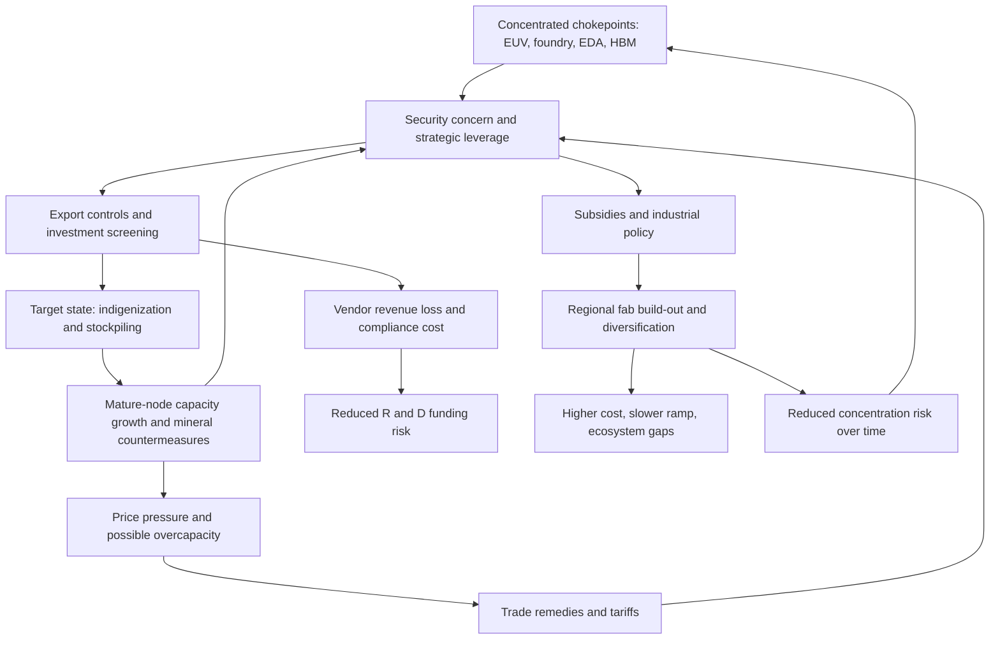

## Geopolitics of Semiconductor Manufacturing


### Overview and Motivation

Semiconductors are a foundational input to nearly every modern economic and military system: computing, telecommunications, energy, transportation, medicine, and weapons platforms all depend on them. Because the manufacturing network is concentrated in a few firms and a few places (see the supply chain and equipment ecosystem topics), control over chips, tools, and know-how has become an instrument of national power. States now treat semiconductor capability as a matter of **economic security** and **national security**, not merely industrial policy.

The geopolitical dynamic has three layers:

1. **Structural concentration:** Leading-edge manufacturing, lithography, EDA, and advanced memory sit in a handful of jurisdictions and companies.
2. **Strategic competition:** The United States and its allies seek to preserve technological leadership and restrict adversary access to advanced capabilities, while China pursues self-sufficiency. Other states and blocs (the EU, Japan, South Korea, Taiwan, India, and Gulf states) pursue their own capacity and resilience goals.
3. **Policy instruments:** Export controls, investment screening, subsidies, tariffs, sanctions, procurement rules, and diplomatic coalitions shape investment and trade flows.

**Key Points**

- Semiconductor geopolitics is dual-use by nature: the same chips serve commercial AI and military modernization, which blurs lines between trade and security policy.
- Chokepoints (EUV lithography, leading-edge foundry, EDA, advanced packaging, specialty materials) define where leverage exists and who holds it.
- Policy choices involve tradeoffs among security, cost, innovation speed, and alliance cohesion, and effects unfold over years because fabs and R&D are slow to build.
- Outcomes remain uncertain; specific rules, program sizes, and market shares change quickly and should be verified against current official and market sources.

---

### Structural Foundations: Why Chips Are Geopolitical

#### Concentration and Chokepoints

| Chokepoint | Nature of concentration | Geopolitical relevance |
| --- | --- | --- |
| Leading-edge logic foundry | Very few firms; capacity clustered in Taiwan and South Korea, with a small number of fabs elsewhere | Supplies advanced AI, mobile, and defense-relevant chips |
| EUV lithography | One qualified vendor (Netherlands), reliant on multi-country sub-suppliers | Essential to leading-edge logic and increasingly DRAM |
| EDA software | Three dominant vendors (US-headquartered or US-linked) | Required for advanced chip design |
| Advanced memory (DRAM, HBM, NAND) | Small oligopoly concentrated in South Korea, the US, and Japan | HBM is critical to AI accelerators |
| Semiconductor equipment (etch, deposition, inspection) | US, Japan, Netherlands, with some Korean/European players | Underpins all fabs |
| Advanced packaging | Concentrated in Taiwan, South Korea, and China, expanding elsewhere | Now a bottleneck for AI hardware |
| Specialty materials and gases | Concentrated suppliers in Japan, the US, Europe, and elsewhere | Small volumes, high criticality |
| Critical minerals (gallium, germanium, rare earths, tungsten) | Mining and refining concentrated in a few countries, notably China for several | Upstream leverage point |

[Unverified] Concentration figures and vendor positions change over time; consult current industry association, government, and analyst sources.

#### Quantifying Concentration and Dependence

Market concentration is measured by the HHI:

$$HHI = \sum_{i=1}^{n} s_i^{2}$$

For geopolitical analysis, the same index applied to **countries** rather than firms indicates geographic concentration. A country's **dependence** on a supplier country $j$ for good $g$ can be expressed as an import-share ratio:

$$D_{ij}^{g} = \frac{M_{ij}^{g}}{M_{i}^{g}}$$

where $M_{ij}^{g}$ is imports of good $g$ by country $i$ from $j$ and $M_i^{g}$ is total imports of $g$ by $i$. High dependence combined with low substitutability creates exposure.

A simple **leverage** measure, in the spirit of "weaponized interdependence," weights dependence by the cost of substitution:

$$\Lambda_{ij}^{g} = D_{ij}^{g} \cdot \frac{T_{sub}^{g}}{T_{tol}}$$

where $T_{sub}^{g}$ is the time required to find or build a substitute and $T_{tol}$ is the time the dependent party can tolerate disruption. [Inference] This is a stylized framework for reasoning, not a standard metric with agreed parameters.

**Example**

```python
def hhi(shares):
    return sum(s**2 for s in shares)

def leverage(dep_share, t_sub_months, t_tol_months):
    return dep_share * (t_sub_months / t_tol_months)

# Hypothetical illustration only
country_shares = {
    "Leading-edge foundry capacity": [65, 20, 10, 5],
    "EUV lithography":               [100],
    "Advanced packaging":            [45, 30, 15, 10],
    "Mature-node foundry":           [30, 25, 20, 15, 10],
}
for k, v in country_shares.items():
    print(f"{k:32s} country HHI = {hhi(v):>6,.0f}")

# Leverage of a supplier over a dependent party (hypothetical parameters)
print("Leverage:", round(leverage(0.80, t_sub_months=48, t_tol_months=6), 1))
```

**Output**

The hypothetical country-level HHI values are 4,750 (leading-edge foundry), 10,000 (EUV), 3,250 (advanced packaging), and 2,250 (mature-node). The leverage example yields $0.80 \times 48/6 = 6.4$, meaning that a supplier holding 80% of an input with a four-year substitution time confronts a dependent party that can only tolerate six months of disruption with substantial coercive potential. All inputs are invented for illustration and do not describe real markets.

#### Time Constants Create Strategic Asymmetry

| Activity | Typical time scale |
| --- | --- |
| Fab construction and ramp | 2-4 years |
| Process node development | 3-5 years per generation |
| Equipment lead times (advanced tools) | 12-18+ months |
| Workforce development (process engineers) | Years to decades |
| Export-control rule to market effect | Months (formal), years (structural) |

Because supply adjusts slowly, policy shocks have durable effects, and stockpiling or front-loading purchases can defer but not erase them.

---

### Historical Arc

#### Cold War Origins

- Semiconductors began as a US-led, defense-funded industry (military and space demand supported early integrated circuits).
- Cold War export-control regimes (e.g., **COCOM**) restricted technology transfers to the Soviet bloc. [Inference] COCOM was succeeded by the Wassenaar Arrangement in the 1990s.

#### The Japan Era (1980s)

- Japanese firms rose to lead in DRAM, prompting US trade tensions and the **1986 US-Japan Semiconductor Agreement**, which included market-access and pricing provisions.
- The US supported the **SEMATECH** consortium (founded 1987) to strengthen domestic manufacturing and equipment suppliers. The episode is a reference case for both industrial policy and trade-conflict management.

#### The Asian Foundry Era (1990s-2010s)

- The pure-play foundry model (TSMC, founded 1987) enabled the fabless ecosystem and shifted leading-edge manufacturing to Taiwan.
- South Korea built memory leadership (Samsung, SK hynix) with state-supported industrial policy.
- The industry globalized: design and tools in the US, materials and equipment in Japan, lithography in Europe, fabrication in East Asia, and assembly/test across Asia.

#### China's Ascent and Concern

- China became the largest consumer of chips, driven by electronics assembly, and pursued domestic capacity via national programs (e.g., "Made in China 2025" and large state-backed investment funds, including the "Big Fund").
- Rising concerns in the US and allies about technology transfer, intellectual property, and military-civil fusion led to targeted restrictions from the late 2010s onward.

#### The Restriction and Reshoring Era (2018-Present)

- Entity-list designations and tighter export rules targeted specific Chinese firms and advanced-computing applications.
- Supply shortages in 2020-2022 exposed fragility and catalyzed subsidy programs in multiple regions.
- **October 2022** and subsequent US rule packages broadened controls on advanced computing chips, semiconductor manufacturing equipment, and related support for advanced-node production in China; allied jurisdictions (e.g., the Netherlands, Japan) adopted related measures. [Unverified] Exact scope, dates, and revisions should be verified against current regulatory texts.
- Countermeasures include Chinese export controls on critical minerals (e.g., gallium, germanium, and graphite-related items) and domestic-substitution drives.

---

### Key Actors and Strategic Postures

| Actor | Strategic posture (broad characterization) |
| --- | --- |
| United States | Preserve design/EDA/equipment leadership; restrict adversary access to advanced technology; subsidize domestic manufacturing via incentives; build alliances |
| China | Pursue self-sufficiency across the stack; expand mature-node capacity; support domestic equipment and materials; adapt to controls |
| Taiwan | Maintain foundry leadership as economic and strategic asset ("silicon shield" argument); manage cross-strait risk; diversify investment abroad |
| South Korea | Sustain memory and logic strength; balance US alliance with China market exposure |
| Japan | Rebuild advanced manufacturing via subsidies and partnerships; leverage materials and equipment strengths |
| Netherlands | Host lithography leadership; implement export-control alignment while protecting commercial interests |
| European Union | Increase share via the EU Chips Act; focus on power, automotive, industrial, and research ecosystems |
| India | Build design, assembly/test, and fab capacity through incentive schemes |
| Gulf and Southeast Asian states | Seek investment, packaging, and supply-chain roles; navigate great-power competition |
| Firms (TSMC, Samsung, Intel, ASML, and others) | Balance commercial interest, compliance, and geopolitical pressure; sometimes act as de facto strategic assets |

[Inference] These summaries are simplified; national strategies are heterogeneous and evolve with political and economic conditions.

(svg_diagram) Geopolitical map of chokepoints and policy flows:

<svg xmlns="http://www.w3.org/2000/svg" viewBox="0 0 760 440" width="760" height="440" font-family="sans-serif" font-size="12">
<title>(svg_diagram) Semiconductor geopolitics: actors, chokepoints, and instruments</title>
<text x="380" y="22" text-anchor="middle" font-weight="bold">(svg_diagram) Semiconductor Geopolitics: Actors, Chokepoints, Instruments</text>

<rect x="20" y="50" width="150" height="50" fill="#bbdefb" stroke="#333" />
<text x="95" y="72" text-anchor="middle">United States</text>
<text x="95" y="90" text-anchor="middle" font-size="10">EDA, IP, tools, design</text>
<rect x="20" y="130" width="150" height="50" fill="#ffcdd2" stroke="#333" />
<text x="95" y="152" text-anchor="middle">China</text>
<text x="95" y="170" text-anchor="middle" font-size="10">demand, mature nodes, minerals</text>
<rect x="20" y="210" width="150" height="50" fill="#c8e6c9" stroke="#333" />
<text x="95" y="232" text-anchor="middle">Taiwan / South Korea</text>
<text x="95" y="250" text-anchor="middle" font-size="10">foundry, memory</text>
<rect x="20" y="290" width="150" height="50" fill="#fff9c4" stroke="#333" />
<text x="95" y="312" text-anchor="middle">Japan / Netherlands</text>
<text x="95" y="330" text-anchor="middle" font-size="10">materials, equipment, litho</text>
<rect x="20" y="370" width="150" height="50" fill="#d1c4e9" stroke="#333" />
<text x="95" y="392" text-anchor="middle">EU / India / others</text>
<text x="95" y="410" text-anchor="middle" font-size="10">diversification, specialty</text>

<rect x="300" y="50" width="170" height="40" fill="#ffe0b2" stroke="#333" />
<text x="385" y="75" text-anchor="middle">EUV lithography</text>
<rect x="300" y="110" width="170" height="40" fill="#ffe0b2" stroke="#333" />
<text x="385" y="135" text-anchor="middle">Leading-edge foundry</text>
<rect x="300" y="170" width="170" height="40" fill="#ffe0b2" stroke="#333" />
<text x="385" y="195" text-anchor="middle">EDA software</text>
<rect x="300" y="230" width="170" height="40" fill="#ffe0b2" stroke="#333" />
<text x="385" y="255" text-anchor="middle">HBM / advanced memory</text>
<rect x="300" y="290" width="170" height="40" fill="#ffe0b2" stroke="#333" />
<text x="385" y="315" text-anchor="middle">Advanced packaging</text>
<rect x="300" y="350" width="170" height="40" fill="#ffe0b2" stroke="#333" />
<text x="385" y="375" text-anchor="middle">Critical minerals, materials</text>

<rect x="570" y="70" width="170" height="40" fill="#f8bbd0" stroke="#333" />
<text x="655" y="95" text-anchor="middle">Export controls</text>
<rect x="570" y="130" width="170" height="40" fill="#f8bbd0" stroke="#333" />
<text x="655" y="155" text-anchor="middle">Subsidies, tax credits</text>
<rect x="570" y="190" width="170" height="40" fill="#f8bbd0" stroke="#333" />
<text x="655" y="215" text-anchor="middle">Investment screening</text>
<rect x="570" y="250" width="170" height="40" fill="#f8bbd0" stroke="#333" />
<text x="655" y="275" text-anchor="middle">Tariffs, sanctions</text>
<rect x="570" y="310" width="170" height="40" fill="#f8bbd0" stroke="#333" />
<text x="655" y="335" text-anchor="middle">Alliances, standards</text>

<line x1="170" y1="75" x2="300" y2="75" stroke="#333" stroke-width="1.5" />
<line x1="170" y1="155" x2="300" y2="135" stroke="#333" stroke-width="1.5" />
<line x1="170" y1="235" x2="300" y2="135" stroke="#333" stroke-width="1.5" />
<line x1="170" y1="315" x2="300" y2="75" stroke="#333" stroke-width="1.5" />
<line x1="170" y1="395" x2="300" y2="315" stroke="#333" stroke-width="1.5" />
<line x1="470" y1="90" x2="570" y2="90" stroke="#333" stroke-width="1.5" stroke-dasharray="4" />
<line x1="470" y1="150" x2="570" y2="150" stroke="#333" stroke-width="1.5" stroke-dasharray="4" />
<line x1="470" y1="250" x2="570" y2="270" stroke="#333" stroke-width="1.5" stroke-dasharray="4" />
<line x1="470" y1="370" x2="570" y2="330" stroke="#333" stroke-width="1.5" stroke-dasharray="4" />
</svg>

---

### Policy Instruments

#### Export Controls

Export controls regulate the transfer of goods, software, and technology across borders.

**Mechanisms**

- **Entity-based controls:** Listing specific firms or institutions (e.g., "Entity List"-style mechanisms) that require licenses for controlled items.
- **Technology/parameter-based controls:** Restrictions on items exceeding performance thresholds (e.g., advanced computing chip performance or interconnect thresholds; equipment capable of producing chips below a given node or layer count).
- **End-use and end-user controls:** Restrictions tied to military, surveillance, or weapons-of-mass-destruction end uses.
- **Foreign direct product rules (FDPR):** Extending jurisdiction to foreign-made products that use controlled US technology or software. [Inference] FDPR is a contested extraterritorial tool because it reaches firms in third countries.
- **Services and personnel restrictions:** Limits on support for advanced fabs and on US persons working with certain entities.
- **Allied coordination:** Multilateral regimes (Wassenaar Arrangement) are slow and consensus-based, so plurilateral or unilateral alignment has become more common.

**Design tradeoffs**

| Consideration | Tension |
| --- | --- |
| Threshold placement | Too low harms commercial sales and R&D funding; too high leaves capability gaps |
| Enforcement | Detecting diversion, smuggling, and cloud-access workarounds is difficult |
| Adaptation | Targets design compliant products near thresholds; rules must be updated repeatedly |
| Allied alignment | Divergent allied policies create leakage and commercial complaints |
| Revenue effect | Lost sales to restricted markets can reduce vendor R&D over time |

**Illustrative logic:** A stylized model of a controlling state's payoff from an export control weighs the delay imposed on an adversary against the cost to domestic firms:

$$W = \alpha\, \Delta t_{adv}\, v_{sec} - \beta\, \Delta R_{dom}\, \tau_{R\&D}$$

where $\Delta t_{adv}$ is the delay imposed on the adversary's capability, $v_{sec}$ is the security value per unit delay, $\Delta R_{dom}$ is lost domestic revenue, and $\tau_{R\&D}$ is the fraction of that revenue that would have funded R&D. [Speculation] The parameters are difficult to estimate; the expression is a conceptual device for discussing tradeoffs, not an empirically validated model.

#### Industrial Policy and Subsidies

| Region | Program (illustrative) | Instruments |
| --- | --- | --- |
| United States | CHIPS and Science Act (2022) | Manufacturing grants, investment tax credit, R&D programs (e.g., NSTC, NAPMP), workforce funding |
| European Union | European Chips Act (2023) | Pilot lines, "first-of-a-kind" facility support, coordination and crisis mechanisms |
| Japan | Multi-year semiconductor subsidies and partnerships | Support for domestic and foreign fabs, Rapidus initiative, materials/equipment support |
| South Korea | Tax incentives, infrastructure support, national strategy | Support for domestic mega-clusters |
| Taiwan | Tax incentives, R&D support | Support for domestic ecosystem and talent |
| China | State-backed funds, local government incentives, procurement preferences | Financing for fabs, equipment, and materials localization |
| India | Semiconductor Mission incentive schemes | Fab, assembly/test, and design incentives |

[Unverified] Program sizes, eligibility rules, disbursement progress, and political durability change; verify with official sources.

**Cost-benefit reasoning:** A subsidy is justified on economic grounds if there are positive externalities (knowledge spillovers, supply-chain resilience, national-security benefits) not captured by private firms. The effective subsidy per fab can be expressed as:

$$s = \frac{G + T_c}{C_{capex}}$$

where $G$ is grant value, $T_c$ is the tax-credit value, and $C_{capex}$ is total capital expenditure. Many programs aim to close the cost gap between a new site and the lowest-cost region. If the cost premium of a new region is $\Pi = (C_r - C_0)/C_0$, then subsidies are effective only when $s$ is comparable to or greater than the capex-driven component of $\Pi$ and when the ecosystem can sustain operations. [Inference] Operating-cost gaps (labor, supplier proximity, utilities) often persist after capex subsidies.

#### Investment Screening and Ownership Controls

- Inbound screening (e.g., CFIUS in the US, comparable mechanisms in the EU and elsewhere) reviews acquisitions of sensitive technology firms.
- Outbound investment restrictions limit financing of advanced technology in designated countries. [Unverified] Scope and status of outbound-investment regimes evolve; verify with official sources.
- Corporate ownership, licensing, and governance conditions accompany subsidies (e.g., limits on expansion in countries of concern for a period).

#### Tariffs, Sanctions, and Trade Remedies

- Tariffs on semiconductors and derived products, and anti-dumping or countervailing duties on mature-node chips, raise costs and reshape sourcing.
- Sanctions can cut firms off from financing, tools, and customers.
- Trade tools interact with export controls, and cumulative effects on the supply chain are complex.

#### Standards, Alliances, and Coalitions

- Plurilateral efforts (e.g., US-Japan-Netherlands coordination on equipment, "Chip 4"-type dialogues, the US-EU Trade and Technology Council, and bilateral agreements) seek alignment on controls and resilience.
- Standards bodies (SEMI, IEEE, UCIe consortium, and others) influence technical ecosystems; participation and exclusion can become political.
- Technology-sharing agreements and joint R&D (e.g., imec partnerships) are instruments of alliance-building.

#### Procurement and Domestic-Substitution Policies

- Government procurement preferences can create protected markets for domestic chips.
- Localization requirements and "security reviews" can constrain foreign firms' market access.
- Standards and certification regimes (e.g., cybersecurity or "trusted supplier" criteria) can function as non-tariff barriers.

---

### The China Dimension

#### Objectives and Constraints

China's goals include reducing dependence on foreign chips, building indigenous capability across design, manufacturing, equipment, and materials, and sustaining electronics-export competitiveness. Constraints include limited access to EUV lithography, restrictions on advanced tools, difficulty recruiting foreign expertise, and yield/learning challenges at advanced nodes.

#### Strategies and Responses

| Strategy | Description |
| --- | --- |
| Mature-node expansion | Large capacity build-out at 28 nm and above, serving automotive, industrial, and consumer markets |
| Multi-patterning with DUV | Attempting more advanced nodes without EUV via multi-patterning, which raises cost and lowers yield [Inference] |
| Domestic equipment and materials | Growing domestic vendors in etch, deposition, clean, and materials, with uneven maturity by segment |
| Stockpiling | Pre-restriction purchases of tools and chips |
| Architecture workarounds | Software optimization, chiplets, and packaging to offset node disadvantages |
| Mineral leverage | Export controls on gallium, germanium, and other critical materials as countermeasures |
| Talent and IP | Recruitment, domestic education expansion, and acquisitions where permitted |

[Unverified] The effectiveness of these strategies is debated; independent verification of technical progress is difficult and claims should be treated cautiously.

#### Effects on Global Markets

- **Mature-node oversupply risk:** Rapid Chinese capacity expansion at mature nodes may pressure global prices and margins. [Inference] The extent depends on demand growth and policy responses (including trade remedies).
- **Bifurcation:** Two partly separate technology ecosystems may emerge, one with access to leading-edge Western tools and IP and another pursuing indigenization, with associated duplication costs.
- **Vendor revenue exposure:** Equipment and EDA vendors derive a sizable share of revenue from China, so controls affect their financials and R&D funding.

---

### The Taiwan Question and Concentration Risk

Taiwan's foundry sector, particularly TSMC's leading-edge fabs, supplies a large share of advanced logic chips used in AI accelerators, smartphones, and other systems. This concentration raises several risks:

- **Geopolitical risk:** Cross-strait tensions, including scenarios of blockade, quarantine, or conflict, could disrupt supply.
- **Natural hazards:** Seismic activity, typhoons, drought (water for fabs), and power reliability affect operations.
- **Economic exposure:** Global downstream industries would face severe shortages in a disruption scenario. [Unverified] Published estimates of economic impact vary widely and depend on assumptions about duration and substitution.

#### Risk Framing

A simple expected-loss model for global economic exposure to a disruption at a single node:

$$E[L] = p_{event}\cdot d \cdot V_{dep}\cdot (1 - m)$$

where $p_{event}$ is the annual probability of the event, $d$ is the disruption duration (fraction of a year), $V_{dep}$ is the value of economic output dependent on the node, and $m$ is the fraction mitigated through inventory, alternate sources, and redesign. [Speculation] $p_{event}$ cannot be estimated reliably, and this framing is only useful for comparing mitigation scenarios.

#### "Silicon Shield" Argument

Some analysts argue that global dependence on Taiwan's fabs deters aggression by raising the cost of conflict. Others contend that dependence may also increase the perceived stakes or encourage diversification that weakens deterrence over time. [Speculation] The argument is contested and cannot be tested empirically.

#### Diversification Responses

- TSMC and other firms have announced or built fabs in the United States, Japan, and Europe, with support from local subsidies. [Unverified] Progress, node levels, and capacity vary; verify current status.
- Advanced-node capacity abroad tends to lag Taiwan's leading edge and may depend on Taiwan-based R&D and supplier ecosystems.
- Customers pursue **dual-sourcing** (e.g., qualifying designs at multiple foundries) where technically feasible, though at leading nodes options are limited.

---

### Alliances and Coordination Among Democracies

**Key Points**

- The US, Japan, the Netherlands, South Korea, Taiwan, and the EU hold complementary pieces of the supply chain; effective controls and resilience depend on coordination.
- Allied interests diverge: allied firms often have substantial China revenue and worry about lost sales and market-share transfer to competitors outside the coalition.
- Extraterritorial measures can cause friction with allies while improving control effectiveness.

#### Coordination Mechanisms

| Mechanism | Description |
| --- | --- |
| Trilateral/plurilateral equipment controls | Aligned national controls on lithography and other advanced tools |
| Dialogues and councils | US-EU Trade and Technology Council, US-Japan cooperation, "Chip 4"-type consultations |
| Joint R&D and pilot lines | Collaborative research (e.g., with imec, Rapidus partnerships, NSTC-linked programs) |
| Supply-chain resilience agreements | Information sharing, crisis coordination, and diversification agreements |
| Investment partnerships | Co-investment in fabs and materials capacity |

#### Frictions

- **Burden sharing:** Who pays for resilience and redundancy?
- **Subsidy competition:** Regions compete for the same fabs and talent.
- **Market access vs. security:** Allied firms weigh revenue against compliance requirements.
- **Legal reach:** Disputes over extraterritorial rules and compliance regimes.

---

### Economic Consequences and Tradeoffs

#### Cost of Fragmentation

Duplicating supply chains across regions raises costs. If a fully duplicated regional ecosystem carries an efficiency penalty $\phi$ relative to a globally optimized one, then the industry-wide cost impact scales as:

$$\Delta C \approx \phi \cdot C_{global}$$

[Unverified] Published estimates of the cost of full decoupling vary widely by study, and assumptions on scale and ecosystem maturity dominate the results.

#### Effects on Innovation

- Restricting market access reduces vendor revenue and R&D investment over the long run, potentially slowing innovation for all parties. [Inference] The size and timing of this effect are debated.
- Conversely, protecting and subsidizing domestic industries may foster new capacity but can also lock in inefficiencies.
- Reduced scientific cooperation (e.g., restrictions on joint research and talent mobility) can slow progress.

#### Effects on Prices, Shortages, and Cycles

- Policy-induced pull-forward of orders creates temporary demand spikes and later corrections.
- Subsidized capacity additions may contribute to future oversupply in some segments, as historically seen with memory and mature nodes. [Inference] Timing and magnitude are uncertain.
- Regional sourcing requirements can raise system costs for downstream industries.

#### Winners and Losers

| Group | Likely effect (broad characterization) |
| --- | --- |
| Domestic equipment/materials vendors in target countries | Gain from localization support |
| Foreign vendors with large exposure to restricted markets | Lose revenue; face compliance costs |
| Fabless firms | Mixed: access to foundries preserved, but supply concentration and controls introduce risk and compliance costs |
| End-product OEMs | Higher costs and sourcing complexity |
| Governments | Gain security and industrial capacity at fiscal cost |
| Consumers | Potentially higher prices; some benefit from resilience |

---

### Military and Dual-Use Dimensions

- **AI and computing:** Advanced AI accelerators enable large-scale model training and inference relevant to intelligence, cyber, and autonomous systems. Export controls on advanced computing chips aim to slow adversary military AI progress.
- **Weapons systems:** Advanced logic, RF, and power semiconductors are used in radars, missiles, communications, electronic warfare, and satellites.
- **Trusted foundry and secure supply:** Governments maintain "trusted" supply programs for sensitive chips (e.g., US Trusted Foundry-type programs), demanding domestic or vetted manufacturing.
- **Supply-chain security:** Concerns about hardware tampering, counterfeits, and backdoors motivate provenance tracking and secure-manufacturing policies.
- **Civil-military fusion:** In some states, commercial and military technology ecosystems overlap, complicating end-use assessments.

**Key Points**

- Most chips are commercial and dual-use, making end-use verification and threshold-based control design difficult.
- Cloud access to controlled compute is a policy gray area, raising questions about controlling services rather than just hardware. [Unverified] Regulatory approaches are still evolving.

---

### Resilience Strategies and Scenario Analysis

#### Strategy Portfolio

| Strategy | Mechanism | Cost/limitation |
| --- | --- | --- |
| Geographic diversification of fabs | Build capacity in multiple regions | High capex; ecosystem immaturity |
| Dual-sourcing and design portability | Qualify designs at multiple foundries and nodes | NRE cost; limited leading-edge alternatives |
| Strategic stockpiles | Hold critical chips, materials, or tools | Storage cost; obsolescence |
| Allied division of labor | Coordinate specialization across trusted partners | Requires trust and burden-sharing |
| Domestic R&D and workforce | Long-run capability building | Slow returns |
| Recycling and substitution | Reduce dependence on critical minerals | Technical and economic feasibility limits |
| Transparency and mapping | Multi-tier supply-chain visibility | Data-sharing barriers |

#### Scenario Planning

Analysts use scenarios to stress-test strategy, for example:

1. **Managed competition:** Controls remain targeted; commerce continues in most segments.
2. **Deepening decoupling:** Broad controls and localization mandates create parallel ecosystems.
3. **Acute disruption:** A major event (conflict, blockade, or natural disaster) interrupts a chokepoint.
4. **Rapid Chinese progress:** Domestic capabilities advance faster than anticipated, eroding the effect of controls.
5. **Détente and partial easing:** Negotiated relaxation of some restrictions in exchange for concessions.

**Example**

```python
import numpy as np

rng = np.random.default_rng(2024)
N = 30_000

# Illustrative scenario probabilities (hypothetical)
scenarios = {
    "Managed competition":   0.45,
    "Deepening decoupling":  0.30,
    "Acute disruption":      0.05,
    "Rapid Chinese progress":0.12,
    "Detente / easing":      0.08,
}
names = list(scenarios)
probs = np.array(list(scenarios.values()))
probs = probs / probs.sum()

# Hypothetical annual cost to a fabless firm (% of revenue) per scenario: (mean, sd)
cost_params = {
    "Managed competition":   (1.0, 0.5),
    "Deepening decoupling":  (4.0, 1.5),
    "Acute disruption":      (25.0, 8.0),
    "Rapid Chinese progress":(3.0, 1.2),
    "Detente / easing":      (0.3, 0.3),
}

draws = rng.choice(len(names), size=N, p=probs)
costs = np.array([
    max(0.0, rng.normal(*cost_params[names[i]])) for i in draws
])

print(f"Expected cost:        {costs.mean():.2f}% of revenue")
print(f"P95 cost:             {np.percentile(costs, 95):.2f}% of revenue")
print(f"P(cost > 10%):        {(costs > 10).mean():.2%}")
```

**Output**

The script prints the expected annual cost, the 95th-percentile cost, and the probability of a severe (>10% of revenue) outcome. [Inference] With these invented probabilities, the expected cost is a low-to-mid single-digit percentage of revenue and the tail is dominated by the low-probability acute-disruption scenario; the numbers are illustrative, are not calibrated to real events, and depend on the assumed probabilities and random seed.

---

### Environmental and Resource Geopolitics

- **Water and energy:** Fabs require large volumes of ultrapure water and stable power. Droughts, grid stress, and energy-price shocks translate into strategic vulnerability in water-stressed regions.
- **Critical minerals:** Gallium, germanium, tungsten, rare earths, high-purity quartz, and other inputs are concentrated in specific countries; export restrictions or price manipulation create leverage.
- **Specialty gases:** Some gases (e.g., neon, historically produced as a byproduct of steel manufacturing in specific regions) showed supply vulnerability during regional conflicts. [Unverified] Supply-chain adaptations since then have changed exposure; verify current status.
- **Climate policy and carbon border measures:** Emissions regulation and carbon-related trade measures may add costs and alter competitiveness.
- **Sustainability as strategic factor:** Customers and governments increasingly require lower-carbon manufacturing, favoring regions with clean-energy availability.

---

### Analytical Frameworks

#### Weaponized Interdependence

Networks with central nodes give the states hosting those nodes the power to surveil (**panopticon effect**) and to restrict access (**chokepoint effect**). Semiconductor supply chains exemplify this: hubs in tools, EDA, and foundry capacity confer leverage on those who control them, including the ability to enforce extraterritorial rules through corporate dependence.

#### Security Dilemma and Technology Competition

Defensive measures by one state (controls, stockpiling, localization) can be perceived as threats by another and provoke countermeasures, potentially spiraling into broader decoupling. [Inference] Whether semiconductor competition follows classic security-dilemma dynamics depends on the interpretation of intentions and the availability of signaling and negotiation channels.

#### Economic Statecraft and Resilience Economics

- **Positive vs. negative statecraft:** Inducements (subsidies, market access) versus coercion (controls, sanctions).
- **Efficiency vs. resilience tradeoff:** A cost-minimizing global optimum differs from a security-maximizing distribution; policy chooses a point on the tradeoff frontier.
- **Real options:** Building flexible or redundant capacity preserves options under uncertainty, at a premium.

#### Game-Theoretic Sketch

A stylized two-player interaction between a controlling state (C) and a target state (T) with strategies {restrict, ease} for C and {comply/adapt, retaliate} for T can be summarized in a payoff matrix:

|  | T: adapt | T: retaliate |
| --- | --- | --- |
| **C: restrict** | Slower target progress; moderate domestic cost | Escalation; mutual costs (e.g., mineral controls, market barriers) |
| **C: ease** | Commercial gains; faster target progress | Rare (retaliation unlikely without prior restriction) |

[Speculation] Real interactions involve many actors, incomplete information, domestic politics, and dynamic adaptation; the matrix illustrates strategic structure only.

---

### Mermaid Overview: Causal Loop of Semiconductor Geopolitics



---

### Practical Analysis Workflow

1. **Define the question:** Chokepoint risk, policy impact, investment siting, or corporate exposure.
2. **Map the network:** Identify nodes (firms, facilities, jurisdictions) and flows (materials, tools, IP, capital, data).
3. **Quantify concentration and dependence:** HHI by firm and country, import-share dependence, substitution time.
4. **Catalog policy instruments:** Current export controls, subsidies, tariffs, and their legal scope and effective dates (verify against primary sources).
5. **Assess exposure:** Revenue by region, single-source inputs, compliance risk, geographic hazards.
6. **Build scenarios:** Include managed competition, decoupling, disruption, and rapid-progress cases with explicit assumptions.
7. **Model economics:** Cost of resilience, subsidy effectiveness, price and utilization effects.
8. **Identify mitigations:** Diversification, dual-sourcing, inventory, contracts, and design flexibility.
9. **Monitor indicators:** Rule changes, capacity announcements, equipment shipment data, mineral prices, diplomatic developments.
10. **Update regularly:** The landscape changes fast; treat conclusions as provisional.

---

### Challenges and Open Problems

**Key Points**

- **Measuring effectiveness:** It is hard to determine how much export controls delay an adversary versus accelerate its indigenization.
- **Enforcement and leakage:** Smuggling, transshipment, remote/cloud access, and stockpiling weaken controls.
- **Ally cohesion:** Divergent commercial interests and legal frameworks strain coordination.
- **Subsidy sustainability:** Fiscal cost, political durability, and risk of oversupply raise questions about long-run efficacy.
- **Ecosystem gaps:** Fabs abroad need supplier clusters, talent, and infrastructure to reach parity with incumbent hubs.
- **Data opacity:** Capacity, yield, and dependency data are proprietary or contested, limiting quantitative rigor.
- **Uncertainty about conflict risk:** Probabilities of severe disruptions are deeply uncertain and politically sensitive.
- **Balancing openness and security:** Excessive restriction can erode the scale economies and research collaboration that drive innovation.
- **Governance of emerging domains:** Rules for AI compute, cloud access, chiplets, and advanced packaging are still developing.

---

### Conclusion

The geopolitics of semiconductor manufacturing arises from a structural fact: the most advanced chips depend on a supply network with a few irreplaceable nodes, located in a few jurisdictions, serving both civilian economies and military power. States respond with export controls, subsidies, investment screening, alliances, and localization drives, each carrying tradeoffs among security, cost, innovation, and alliance cohesion. Because fabs, tools, and expertise develop over years, today's choices shape the competitive landscape for a decade or more, and outcomes remain uncertain. Rigorous analysis combines concentration and dependence metrics, mapping of policy instruments, economic modeling of resilience costs, and scenario planning, all grounded in current, verified primary sources, since rules, programs, and market positions change rapidly.

---

### Related Topics

**Next Steps**

- Global supply chain structure and chokepoint mapping
- Equipment supplier ecosystem and sub-tier dependencies
- Fab capital intensity and cost modeling (subsidy effects on net capex)
- Foundry versus IDM business strategies under geopolitical pressure
- Export control regimes: Wassenaar, US EAR/FDPR, allied equivalents
- Government industrial policy programs: CHIPS Act, EU Chips Act, and regional equivalents
- Critical minerals and materials security (gallium, germanium, rare earths, neon)
- Advanced packaging and HBM as strategic bottlenecks for AI hardware
- China's semiconductor self-sufficiency strategy and mature-node capacity
- Taiwan concentration risk and diversification of leading-edge manufacturing
- Trusted foundry, supply-chain security, and hardware assurance
- Scenario planning and resilience economics for semiconductor supply chains