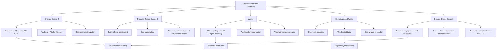

## Sustainability and Environmental Impact in Fabs


### Overview and Motivation

Semiconductor fabs are among the most resource-intensive manufacturing facilities in operation. A single large fab consumes electricity at the scale of a small city, uses millions of gallons of ultrapure water per day, handles hundreds of hazardous chemicals and specialty gases, and emits process gases with very high global-warming potential. At the same time, semiconductors enable energy efficiency, renewable energy, and electrification across the rest of the economy, so the sector's footprint must be judged both in absolute terms and against the enabling value of its products.

Environmental performance has moved from a compliance topic to a strategic one. Customers (Apple, Microsoft, Google, and automotive OEMs) set supplier decarbonization targets, regulators tighten permitting and reporting rules, investors demand disclosure, and local resource constraints (water, power) directly limit where and how fast fabs can be built. Sustainability therefore feeds into siting decisions, capex, operating cost, and competitiveness, connecting directly to the cost-modeling and geopolitics topics in this chapter.

**Key Points**

- The footprint splits into **Scope 1** (direct process emissions, especially fluorinated gases), **Scope 2** (purchased electricity), and **Scope 3** (upstream materials, equipment, transport, and downstream product use).
- Electricity dominates most fabs' total emissions, and process gases (PFCs, HFCs, SF$_6$, NF$_3$, N$_2$O) dominate direct emissions; both trend upward with each node because of rising process complexity (more layers, EUV, more etch and deposition steps).
- Water and chemical management are local, permit-critical constraints, and recycling and reclamation are now standard design targets.
- Absolute emissions can rise even as intensity per wafer or per transistor falls, because volume and complexity grow faster than efficiency gains.

---

### Environmental Footprint Overview

#### Resource and Emission Categories

| Category | Main sources | Primary impact |
| --- | --- | --- |
| Electricity | Process tools, EUV sources, chillers, HVAC/cleanroom air handling, vacuum pumps, abatement | Scope 2 GHG emissions; grid stress |
| Fluorinated gases | Plasma etch and CVD chamber cleaning | Scope 1 GHG emissions (high GWP) |
| Water | Ultrapure water (UPW) for rinsing, CMP, cooling towers | Local water stress; wastewater load |
| Chemicals | Acids, bases, solvents, photoresists, slurries, precursors | Hazardous waste, air/water emissions, worker safety |
| Hazardous and toxic gases | Arsine, phosphine, silane, diborane, chlorine, ammonia | Safety, air emissions |
| Solid and hazardous waste | Spent chemicals, sludges, packaging, consumables | Landfill and treatment burden |
| Land and construction | Cleanroom shell, utilities, embodied carbon in concrete and steel | Scope 3 (construction) emissions |
| Supply chain | Wafers, gases, chemicals, equipment manufacturing | Scope 3 emissions |

#### Emission Scopes (GHG Protocol)

| Scope | Definition | Semiconductor examples |
| --- | --- | --- |
| Scope 1 | Direct emissions from owned/controlled sources | Process gas emissions after abatement, on-site combustion (boilers, backup generators), refrigerants |
| Scope 2 | Indirect emissions from purchased electricity, steam, heating, cooling | Grid electricity consumed by fabs |
| Scope 3 | Other indirect emissions in the value chain | Purchased materials and equipment, capital goods, transport, employee commuting, use of sold products, end-of-life |

Total emissions are the sum:

$$E_{total} = E_{S1} + E_{S2} + E_{S3}$$

**Key Points**

- For many leading manufacturers, Scope 2 is the largest single share of Scope 1+2 emissions, with Scope 1 process gases second. [Inference] The split varies by company, product mix (logic vs. memory), region, and grid carbon intensity.
- Scope 3 is often larger than Scopes 1 and 2 combined once purchased goods, capital equipment, and product use are counted, but data quality is weaker. [Unverified] Consult company sustainability reports for specific ratios.

(svg_diagram) Environmental inputs and outputs of a fab:

<svg xmlns="http://www.w3.org/2000/svg" viewBox="0 0 760 400" width="760" height="400" font-family="sans-serif" font-size="12">
<title>(svg_diagram) Fab resource inputs and environmental outputs</title>
<text x="380" y="22" text-anchor="middle" font-weight="bold">(svg_diagram) Fab Inputs and Environmental Outputs</text>

<text x="100" y="50" text-anchor="middle" font-weight="bold">Inputs</text>
<rect x="20" y="62" width="160" height="42" fill="#bbdefb" stroke="#333" />
<text x="100" y="88" text-anchor="middle">Electricity</text>
<rect x="20" y="114" width="160" height="42" fill="#bbdefb" stroke="#333" />
<text x="100" y="140" text-anchor="middle">Water (UPW, cooling)</text>
<rect x="20" y="166" width="160" height="42" fill="#bbdefb" stroke="#333" />
<text x="100" y="192" text-anchor="middle">Chemicals and Gases</text>
<rect x="20" y="218" width="160" height="42" fill="#bbdefb" stroke="#333" />
<text x="100" y="244" text-anchor="middle">Silicon Wafers, Materials</text>
<rect x="20" y="270" width="160" height="42" fill="#bbdefb" stroke="#333" />
<text x="100" y="296" text-anchor="middle">Land, Construction</text>

<rect x="290" y="100" width="180" height="180" fill="#d1c4e9" stroke="#333" />
<text x="380" y="180" text-anchor="middle" font-weight="bold">Semiconductor Fab</text>
<text x="380" y="200" text-anchor="middle" font-size="10">cleanroom, tools, utilities</text>
<text x="380" y="216" text-anchor="middle" font-size="10">abatement, water treatment</text>

<text x="660" y="50" text-anchor="middle" font-weight="bold">Outputs</text>
<rect x="580" y="62" width="160" height="42" fill="#ffcdd2" stroke="#333" />
<text x="660" y="88" text-anchor="middle">GHG (CO2e): S1, S2</text>
<rect x="580" y="114" width="160" height="42" fill="#ffcdd2" stroke="#333" />
<text x="660" y="140" text-anchor="middle">Wastewater, Sludge</text>
<rect x="580" y="166" width="160" height="42" fill="#ffcdd2" stroke="#333" />
<text x="660" y="192" text-anchor="middle">Air Emissions (VOC, acid)</text>
<rect x="580" y="218" width="160" height="42" fill="#ffcdd2" stroke="#333" />
<text x="660" y="244" text-anchor="middle">Hazardous Waste</text>
<rect x="580" y="270" width="160" height="42" fill="#c8e6c9" stroke="#333" />
<text x="660" y="296" text-anchor="middle">Wafers (product)</text>

<line x1="180" y1="83" x2="290" y2="150" stroke="#333" stroke-width="1.5" />
<line x1="180" y1="135" x2="290" y2="165" stroke="#333" stroke-width="1.5" />
<line x1="180" y1="187" x2="290" y2="190" stroke="#333" stroke-width="1.5" />
<line x1="180" y1="239" x2="290" y2="215" stroke="#333" stroke-width="1.5" />
<line x1="180" y1="291" x2="290" y2="240" stroke="#333" stroke-width="1.5" />
<line x1="470" y1="150" x2="580" y2="83" stroke="#333" stroke-width="1.5" />
<line x1="470" y1="165" x2="580" y2="135" stroke="#333" stroke-width="1.5" />
<line x1="470" y1="190" x2="580" y2="187" stroke="#333" stroke-width="1.5" />
<line x1="470" y1="215" x2="580" y2="239" stroke="#333" stroke-width="1.5" />
<line x1="470" y1="240" x2="580" y2="291" stroke="#333" stroke-width="1.5" />
</svg>

---

### Energy Consumption and Scope 2 Emissions

#### Where the Energy Goes

A fab's electricity demand splits between **process tools** and **facility systems**:

| Category | Typical role | Notes |
| --- | --- | --- |
| Process tools (litho, etch, deposition, CMP, metrology) | Direct wafer processing | Roughly 40-60% of fab energy in many analyses |
| HVAC and cleanroom air handling | Fan and filtration energy, make-up air conditioning, humidity control | Large share; cleanroom air-change rates are high |
| Process cooling and chillers | Remove heat from tools | Substantial and temperature-dependent |
| Vacuum and dry pumps | Chamber evacuation | Significant per tool |
| Abatement and exhaust | Scrubbers, thermal/plasma abatement | Growing with regulation |
| UPW production and wastewater treatment | Water systems | Moderate |
| Compressed dry air, nitrogen, other utilities | Utility generation | Moderate |

[Inference] Percentages vary by fab age, node, and design; treat as indicative ranges from public analyses.

EUV lithography is notably power-hungry: a single EUV scanner's drive laser, tin-plasma source, vacuum, and cooling systems draw on the order of a megawatt-class electrical load in total, and the conversion of input electrical power to delivered EUV power is very low. [Unverified] Specific figures vary by scanner generation and source configuration; consult vendor and academic sources.

#### Energy Intensity Metrics

$$EI_{wafer} = \frac{E_{fab}}{N_{wafers}} \qquad \left[\text{kWh per wafer}\right]$$

More refined normalizations account for complexity:

$$EI_{layer} = \frac{E_{fab}}{N_{wafers}\cdot N_{mask\ layers}} \qquad EI_{area} = \frac{E_{fab}}{A_{Si}}$$

where $A_{Si}$ is processed silicon area. Per-wafer intensity typically rises with each node because of added process steps, even if per-transistor energy falls.

#### Scope 2 Emissions Calculation

Scope 2 emissions depend on electricity use and grid carbon intensity:

$$E_{S2} = \sum_{g} E_{elec,g}\times EF_g$$

where $E_{elec,g}$ is electricity consumed from grid $g$ (kWh) and $EF_g$ is the grid emission factor (kg CO$_2$e per kWh). Two accounting methods are used in the GHG Protocol:

- **Location-based:** Uses average grid emission factors for the region.
- **Market-based:** Reflects contractual instruments (power purchase agreements, renewable energy certificates, green tariffs).

**Example**

A fab consuming 1.2 TWh/year in a grid with $EF = 0.5$ kg CO$_2$e/kWh, versus a fab with a 60% renewable PPA share:

```python
def scope2(kwh, ef_kg_per_kwh, renewable_share=0.0, renewable_ef=0.0):
    grid_kwh = kwh * (1 - renewable_share)
    ren_kwh = kwh * renewable_share
    kg = grid_kwh * ef_kg_per_kwh + ren_kwh * renewable_ef
    return kg / 1e9  # million tonnes CO2e (kg -> Mt)

annual_kwh = 1.2e9  # 1.2 TWh

baseline = scope2(annual_kwh, 0.50)
with_ppa = scope2(annual_kwh, 0.50, renewable_share=0.60, renewable_ef=0.0)

print(f"Baseline Scope 2:     {baseline:.3f} Mt CO2e/yr")
print(f"With 60% renewable:   {with_ppa:.3f} Mt CO2e/yr")
print(f"Reduction:            {(1 - with_ppa/baseline):.0%}")
```

**Output**

The baseline emits $1.2\times10^{9}\ \text{kWh} \times 0.5\ \text{kg/kWh} = 6.0\times10^{8}$ kg = 0.600 Mt CO$_2$e per year; with 60% renewable supply at zero emission factor, 0.240 Mt CO$_2$e per year, a 60% reduction. [Inference] Real reductions depend on the additionality, temporal and geographic matching of the renewable supply, and the accounting method used.

#### Decarbonization Levers for Energy

- **Renewable procurement:** PPAs, on-site solar, green tariffs, and increasingly **24/7 carbon-free energy** matching that aligns supply hourly with demand.
- **Energy efficiency:** Tool idle-mode power reduction, high-efficiency dry pumps, optimized chiller plants, free cooling, heat recovery, variable-speed drives.
- **Cleanroom optimization:** Reduced air-change rates where contamination models permit, mini-environments and FOUP-based isolation, better filtration efficiency, dynamic airflow control.
- **Advanced controls:** Digital twins and machine-learning-based optimization of HVAC and utility plants.
- **Process changes:** Fewer steps, more efficient litho strategies, lower-temperature processes.
- **Electrification and heat recovery:** Replacing gas-fired boilers with heat pumps and capturing waste heat.
- **Onsite generation and storage:** Batteries and backup systems to firm renewable supply.

**Key Points**

- Renewable claims via unbundled certificates are contested; leading corporate targets increasingly emphasize additionality and local grid decarbonization.
- Fabs need very high power reliability (a voltage sag can scrap wafers), so renewable integration requires firming, storage, and grid-quality management.

---

### Process Gases and Scope 1 Emissions

#### Fluorinated and Other High-GWP Gases

Plasma etch and chemical-vapor-deposition chamber cleaning use fluorinated compounds. Common gases and their 100-year global-warming potentials (order of magnitude, IPCC assessment-report dependent):

| Gas | Use | Approx. GWP$_{100}$ |
| --- | --- | --- |
| CF$_4$ | Etch, chamber clean | ~7,000-7,400 |
| C$_2$F$_6$ | Etch, chamber clean | ~11,000-12,000 |
| C$_3$F$_8$, C$_4$F$_8$ | Etch/deposition | ~8,800 / ~10,000 |
| CHF$_3$ (HFC-23) | Etch | ~12,000-14,800 |
| SF$_6$ | Etch | ~22,800-25,200 |
| NF$_3$ | Chamber clean (remote plasma) | ~16,100-17,400 |
| N$_2$O | CVD oxidant | ~265-298 |

[Unverified] GWP values differ between IPCC assessment reports (AR4, AR5, AR6); verify against the reporting standard in use.

Emission in CO$_2$-equivalent terms:

$$E_{CO_2e} = \sum_{i} m_i \times GWP_i$$

where $m_i$ is the mass of gas $i$ emitted (after abatement).

#### Utilization, Abatement, and Emissions

Not all gas fed into a chamber is consumed; some is emitted unchanged (the unconsumed fraction) and some is converted into other high-GWP byproducts (e.g., CF$_4$ formed from C$_2$F$_6$). The IPCC-style emission estimate for a gas $i$ is:

$$E_i = F_i \cdot (1 - U_i)\cdot(1 - a_i\, d_i) + B_i$$

where $F_i$ is gas consumed, $U_i$ is process utilization (fraction destroyed in the chamber), $a_i$ is the fraction of gas flow routed to abatement, $d_i$ is the destruction/removal efficiency (DRE) of the abatement unit, and $B_i$ is byproduct emissions.

**Example**

```python
def emitted_kg(feed_kg, utilization, abated_fraction, dre, byproduct_kg=0.0):
    return feed_kg * (1 - utilization) * (1 - abated_fraction * dre) + byproduct_kg

GWP = {"NF3": 17400, "CF4": 7380, "C2F6": 12400}

# Illustrative annual feeds (kg)
feeds = {"NF3": 40000, "C2F6": 5000}

# Cases: remote-plasma NF3 clean (high utilization), C2F6 (low utilization)
util = {"NF3": 0.98, "C2F6": 0.40}
scenarios = {
    "No abatement":      {"abated": 0.0, "dre": 0.0},
    "95% abated, 95% DRE": {"abated": 0.95, "dre": 0.95},
}

for name, s in scenarios.items():
    total_t = 0.0
    for gas, feed in feeds.items():
        e = emitted_kg(feed, util[gas], s["abated"], s["dre"])
        total_t += e * GWP[gas] / 1000.0
    print(f"{name:22s} -> {total_t:,.0f} t CO2e")
```

**Output**

The script prints total CO$_2$e for the two scenarios. With the illustrative inputs: without abatement, NF$_3$ emits $40{,}000 \times 0.02 = 800$ kg (13,920 t CO$_2$e) and C$_2$F$_6$ emits $5{,}000 \times 0.60 = 3{,}000$ kg (37,200 t CO$_2$e), totaling about 51,120 t CO$_2$e. With 95% of flow abated at 95% DRE, the effective reduction factor is $1 - 0.9025 = 0.0975$, giving about 4,984 t CO$_2$e, a roughly 90% cut. [Inference] Real DRE varies by gas, abatement type, flow conditions, and maintenance, and low-utilization gases like C$_2$F$_6$ dominate emissions unless replaced.

#### Abatement Technologies

| Technology | Mechanism | Strengths and limits |
| --- | --- | --- |
| Thermal (combustion) abatement | High-temperature oxidation with fuel | Effective for many PFCs; uses fuel (adds CO$_2$ and NO$_x$) |
| Plasma abatement | Point-of-use plasma decomposition | High DRE for PFCs; electricity use; footprint |
| Catalytic abatement | Catalyst-assisted decomposition | Lower temperatures; catalyst poisoning risk |
| Wet scrubbers | Water/chemical absorption | Removes acid gases and particulates; not effective for inert PFCs |
| Adsorption/reclamation | Capture and reuse or destruction offsite | Emerging for certain gases |
| Burn-wet and combined systems | Combination for mixed exhaust | Common for mixed streams |

Abatement is subject to **destruction efficiency, uptime, and utilization** limits: units that are offline or bypassed emit their full stream. Reporting standards (e.g., WSC/SIA/EPA-style guidelines, IPCC methodologies) specify how to account for these factors.

#### Reduction Strategies for Process Gases

- **Substitution:** Replace high-GWP cleaning gases with lower-GWP alternatives (e.g., remote plasma NF$_3$ or F$_2$ cleaning instead of C$_2$F$_6$), or with alternatives having lower or zero GWP where process-compatible (e.g., F$_2$ generated on-site, COF$_2$, or other candidate chemistries). [Inference] Substitution requires requalification for each process and can affect yield.
- **Process optimization:** Endpoint detection to stop cleaning when complete, lower flow, recipe optimization.
- **Utilization improvement:** Better plasma conditions and chamber design to increase gas consumption.
- **Point-of-use abatement:** Install and maintain abatement on all applicable tools, monitor DRE.
- **Recovery and recycling:** Capture unreacted gases for reuse or destruction.
- **Monitoring and reporting:** Continuous emissions monitoring (FTIR, mass spectrometry) at exhaust.

**Key Points**

- The industry has voluntary goals through the World Semiconductor Council (WSC) to reduce PFC emissions, and many firms report PFC emissions using standardized methodologies.
- As nodes advance and layer counts increase, gas usage per wafer generally increases, so intensity reductions rely on substitution and abatement rather than usage reduction.

---

### Water Use and Management

#### Water Demand

Fabs use large volumes of water for:

- **Ultrapure water (UPW):** Rinsing wafers after wet processes, CMP, and cleaning; UPW typically has resistivity near 18.2 MΩ·cm and extremely low particle, organic, and ionic content.
- **Cooling towers and process cooling:** Heat rejection for chillers and process tools.
- **Scrubbers and abatement systems.**
- **Facilities and sanitation.**

A leading-edge fab can consume on the order of several to tens of thousands of cubic meters of water per day, and many fabs cite consumption in the range of roughly 10-20+ liters of UPW per square centimeter... [Unverified] The commonly cited figures vary widely by node, complexity, and definition; consult company reports and studies for specific numbers.

**Water intensity metric:**

$$WI = \frac{V_{withdrawn} - V_{returned}}{N_{wafers}} \qquad \left[\text{L per wafer, net consumption}\right]$$

Distinguish **withdrawal** (gross intake), **consumption** (net loss, e.g., evaporation), and **discharge**.

#### UPW Production Chain

Typical UPW system stages:

1. Pretreatment (coagulation, filtration, softening)
2. Reverse osmosis (RO)
3. Electrodeionization (EDI) or ion exchange (mixed-bed polishing)
4. Degasification (removal of dissolved oxygen and CO$_2$)
5. UV treatment (TOC destruction) and ultrafiltration
6. Final polishing and distribution loop with continuous recirculation

Reject streams from RO and regeneration are the primary waste flows; improved recovery reduces net intake.

#### Recycling and Reclamation

| Approach | Description | Notes |
| --- | --- | --- |
| RO reject recovery | Treat and reuse RO concentrate | Raises system recovery to ~90%+ in advanced designs |
| Rinse water reuse | Route lower-contamination rinse streams back to UPW pretreatment | Requires stream segregation and monitoring |
| Cooling-tower blowdown optimization | Increase cycles of concentration, use alternative sources | Trade-off with scaling and corrosion |
| Wastewater reclamation | Advanced treatment (MBR, RO, advanced oxidation) of process wastewater | Enables high overall reuse rates |
| Municipal reclaimed water | Use treated municipal effluent as feed | Reduces freshwater draw; requires additional treatment |
| Rainwater and alternative sources | Harvest and use | Supplemental |

The **overall reuse rate**:

$$R_{reuse} = \frac{V_{recycled}}{V_{total\ use}}$$

Leading fabs report reuse rates well above 80% in stressed regions, though claims differ in definition. [Unverified] Check the definitions used in company disclosures (e.g., reuse vs. reclaim, gross vs. net).

**Example**

```python
def net_intake(total_use_m3_day, reuse_rate):
    return total_use_m3_day * (1 - reuse_rate)

use = 60000  # m3/day total process + cooling demand (illustrative)
for r in (0.50, 0.75, 0.90):
    print(f"Reuse {r:.0%}: fresh intake = {net_intake(use, r):>8,.0f} m3/day")
```

**Output**

At 50% reuse the fresh intake is 30,000 m$^3$/day; at 75%, 15,000 m$^3$/day; at 90%, 6,000 m$^3$/day. Raising reuse from 50% to 90% cuts freshwater withdrawal by 80% in this illustration, a key reason water recycling is a siting and permitting enabler in stressed regions.

#### Water Risk and Siting

- Fabs in water-stressed regions (e.g., parts of Taiwan, the US Southwest, and parts of India and the Middle East) face drought risk, competing agricultural and municipal demand, and permit conditions.
- Water availability now enters site selection alongside power, talent, and subsidies.
- Drought episodes have prompted water hauling by truck, rationing, and investments in reclamation. [Unverified] Specific events and volumes should be verified.

#### Water Quality and Wastewater

- Discharge must meet limits on fluoride, ammonia, heavy metals (copper, arsenic, etc.), pH, total dissolved solids, and organic content.
- Common treatment steps: fluoride precipitation (calcium-based), copper recovery (ion exchange, electrowinning), pH neutralization, biological treatment, and membrane processes.
- CMP slurries and copper-bearing streams require dedicated treatment and can enable metal recovery.

---

### Chemicals, Hazardous Materials, and Air Emissions

#### Chemical Use

Fabs handle hundreds of distinct substances:

| Class | Examples | Hazards |
| --- | --- | --- |
| Acids and bases | HF, H$_2$SO$_4$, HCl, HNO$_3$, NH$_4$OH, TMAH | Corrosive, toxic (HF especially) |
| Solvents | IPA, acetone, NMP, PGMEA | Flammable, VOC emissions |
| Photoresists and developers | Organic polymers, photoacid generators | Toxic components, VOCs |
| Specialty gases | SiH$_4$, PH$_3$, AsH$_3$, B$_2$H$_6$, GeH$_4$, NH$_3$, Cl$_2$ | Pyrophoric and/or highly toxic |
| CMP slurries | Silica, ceria, alumina with additives | Particulates, metals |
| Precursors | Organometallics (e.g., TEOS, metal-organic compounds), ALD precursors | Toxic, reactive |

#### PFAS

Per- and polyfluoroalkyl substances (PFAS) appear in photoresist components (photoacid generators), anti-reflective coatings, surfactants, certain fluoropolymer tubing/seals, and specialty fluids. Regulatory attention to PFAS is rising in the EU, US, and elsewhere, creating a major materials-substitution challenge for the industry, because some PFAS functions (chemical resistance, low surface energy, thermal stability) are difficult to replicate. [Unverified] Regulatory scope, restriction proposals, and exemptions are evolving; verify against current legal texts (e.g., the EU REACH PFAS restriction process and US EPA actions).

#### Air Emissions and Control

- **Volatile organic compounds (VOCs):** Controlled by concentrators and thermal or catalytic oxidizers.
- **Acid and alkali exhaust:** Wet scrubbers.
- **Particulates:** HEPA/ULPA filtration and scrubbers.
- **Hazardous air pollutants (HAPs) and toxic gases:** Point-of-use abatement and centralized treatment.
- **Nitrogen oxides:** From thermal abatement units and boilers.

#### Waste Management

| Waste type | Management options |
| --- | --- |
| Spent acids and solvents | Onsite regeneration, recycling, offsite recovery, or treatment |
| CMP and metal-bearing sludges | Metal recovery, stabilization |
| Photoresist and organic waste | Recycling, fuel blending, incineration |
| Packaging and consumables | Reuse programs (e.g., returnable containers), recycling |
| Electronic and equipment waste | Refurbishment, resale, certified recycling |

Zero-waste-to-landfill targets are common among leading manufacturers, with reporting on waste-diversion rates.

**Key Points**

- **Worker and community safety** (toxic gas handling, HF exposure, chemical spills) is inseparable from environmental management and requires engineered controls, monitoring, and emergency response.
- Cumulative permitting for air and water discharge constrains fab expansion in some jurisdictions.

---

### Life-Cycle Assessment and Embodied Emissions

#### Chip-Level Carbon Footprint

Life-cycle assessment (LCA) for a chip aggregates emissions from materials, wafer fabrication, packaging, and transport. For many devices, especially those used in low-power or short-lifetime products, **manufacturing dominates lifetime emissions** relative to use-phase energy; in high-utilization data-center parts, use-phase energy can dominate over the product's life. [Inference] The balance depends on lifetime, utilization, and grid carbon intensity.

The per-die embodied footprint can be approximated as:

$$CF_{die} = \frac{E_{fab}\cdot EF_{grid} + \sum_i m_i\,GWP_i + CF_{mat} + CF_{equip}}{N_{dpw}\cdot Y}\ \times \frac{1}{N_{wafers}}\ (\text{per wafer basis} \to \text{per die})$$

or, more simply, the footprint per good die:

$$CF_{die} = \frac{CF_{wafer}}{N_{dpw}\cdot Y}$$

where $CF_{wafer}$ is the cradle-to-gate carbon footprint per processed wafer, $N_{dpw}$ is gross dies per wafer, and $Y$ is yield. Low yield increases per-good-die footprint just as it raises cost, so yield improvement is itself a sustainability lever.

**Example**

```python
def cf_die(cf_wafer_kg, dpw, yield_frac):
    return cf_wafer_kg / (dpw * yield_frac)

cf_wafer = 900.0   # kg CO2e per processed wafer (illustrative, advanced node)
dpw = 640

for y in (0.60, 0.80, 0.95):
    print(f"Yield {y:.0%}: {cf_die(cf_wafer, dpw, y)*1000:6.0f} g CO2e per good die")
```

**Output**

At 60% yield: 900 / (640 × 0.60) = 2.34 kg → about 2,344 g CO$_2$e per good die; at 80%: 1,758 g; at 95%: 1,480 g. Raising yield from 60% to 95% cuts per-die embodied emissions by roughly 37% in this illustration. [Inference] The wafer footprint of 900 kg CO$_2$e is a placeholder, not a published figure for any specific node.

#### Embodied Carbon in Fab Construction

Building a fab embeds significant emissions in concrete, steel, cleanroom fit-out, and utility systems. Amortized over fab life, this is typically smaller than operational emissions but not negligible; low-carbon concrete and steel, modular construction, and reuse of existing shells are mitigation options. [Unverified] Published estimates of construction embodied carbon vary widely.

#### Equipment and Materials (Scope 3)

- Equipment manufacturing (steel, aluminum, electronics, specialty components) contributes to capital-goods emissions.
- Silicon wafer production (crystal growth is energy-intensive), specialty gases, chemicals, and photomasks contribute upstream emissions.
- **Supplier engagement:** Programs push suppliers to disclose emissions and adopt renewable energy.

---

### Technology Trends and Their Environmental Implications

| Trend | Environmental effect |
| --- | --- |
| Node scaling (more layers, multi-patterning) | Higher energy, water, chemical, and gas use per wafer |
| EUV lithography | High energy intensity per exposure but fewer multi-patterning steps for some layers; net effect depends on layer mix. [Inference] |
| Gate-all-around, backside power, 3D integration | More deposition/etch cycles, additional bonding and thinning steps |
| 3D NAND (200+ layers) | Deep, high-aspect-ratio etch (heavy fluorocarbon use); increased gas usage; cryogenic etch shows promise for lower-GWP chemistries [Inference] |
| Advanced packaging (2.5D/3D, hybrid bonding) | New process steps and materials; can enable higher-yield chiplet strategies that reduce silicon waste |
| Larger wafers (historical 200→300 mm) | Improved per-die resource efficiency (area utilization) |
| Compound semiconductors (SiC, GaN) | Energy-intensive substrate growth, but products enable efficient power electronics |
| AI-driven demand growth | Rising absolute fab throughput and energy demand; also stronger customer pull for low-carbon supply |

**Key Points**

- Scaling produces a rebound effect: efficiency gains per function are outpaced by volume and complexity growth, so absolute footprints rise unless supply-side decarbonization keeps pace.
- **Enabling effects** (energy-efficient chips, power electronics for renewables and EVs) are large but hard to attribute; LCAs usually exclude them, and claims should be handled carefully.

---

### Metrics, Reporting, and Standards

#### Common Metrics

| Metric | Definition | Use |
| --- | --- | --- |
| kWh per wafer (or per layer, per cm$^2$) | Electricity per production unit | Energy efficiency benchmarking |
| kg CO$_2$e per wafer / per cm$^2$ / per die | Carbon intensity | Product-level carbon footprint |
| L water per wafer (withdrawal and consumption) | Water intensity | Water stewardship |
| Water reuse rate | Recycled volume over total use | Resilience |
| PFC/GHG emissions per wafer or per cm$^2$ | Process-gas intensity | Scope 1 performance |
| Renewable electricity share | Share of renewable supply | Scope 2 strategy |
| Waste diversion rate | Fraction diverted from landfill | Circularity |
| Hazardous waste per wafer | Waste intensity | Compliance and stewardship |

#### Frameworks and Standards

- **GHG Protocol** (Corporate Standard, Scope 2 Guidance, Scope 3 Standard) for accounting.
- **Science Based Targets initiative (SBTi)** for aligning targets with climate scenarios.
- **CDP** disclosure (climate, water, forests), **GRI**, **SASB**, **TCFD/ISSB** for reporting.
- **ISO 14001** (environmental management), **ISO 50001** (energy management), **ISO 14064** (GHG quantification).
- **IPCC guidelines** and **WSC/EPA-style protocols** for fluorinated-gas emission estimation.
- **SEMI standards** (e.g., SEMI S23 on energy, utilities, and materials conservation; SEMI E-series on equipment metrics) and industry consortia such as **Semiconductor Climate Consortium (SCC)**, **imec's Sustainable Semiconductor Technologies and Systems (SSTS)** program, and **SEMI's** sustainability initiatives.
- **Regulatory disclosure:** EU CSRD/ESRS, California climate-disclosure laws, and other regional mandates. [Unverified] Standards and legal requirements evolve; verify current versions.

**Key Points**

- Standardized, comparable, and audited data remain limited; boundary definitions (what is counted as Scope 3 or as "reuse") differ between companies.
- Product-level carbon footprint data increasingly appears in customer procurement requirements.

---

### Economics and Business Implications

#### Cost of Sustainability Measures

| Measure | Economic character |
| --- | --- |
| Energy efficiency (pumps, HVAC, controls) | Often positive payback through lower operating cost |
| Renewable PPAs | Price can be near or below grid; also hedges against energy-price volatility |
| Abatement systems | Capex and operating cost; some fuel/energy penalty; regulatory driver |
| Water recycling | Capex-intensive but reduces intake cost and risk; can be a permit prerequisite |
| Substitution of gases/materials | Requalification cost; potential yield risk |
| Carbon pricing exposure | Adds cost to Scope 1 and 2 emissions in regulated markets |

Incorporating an internal or regulatory carbon price $p_c$ ($/t CO$_2$e) into the cost model adds:

$$C_{carbon/wafer} = \frac{p_c\cdot (E_{S1} + E_{S2})}{N_{wafers}}$$

**Example**

```python
def carbon_cost_per_wafer(price_per_t, s1_t, s2_t, wafers):
    return price_per_t * (s1_t + s2_t) / wafers

wafers = 600_000         # wafers/year
s1, s2 = 60_000, 240_000 # t CO2e/year (illustrative)

for p in (0, 50, 100, 200):
    c = carbon_cost_per_wafer(p, s1, s2, wafers)
    print(f"Carbon price ${p:>3}/t -> ${c:>6.2f} per wafer")
```

**Output**

With 300,000 t CO$_2$e per year over 600,000 wafers (0.5 t per wafer), carbon costs are $0, $25, $50, and $100 per wafer at $0, $50, $100, and $200 per tonne respectively. Against a leading-edge wafer cost in the thousands of dollars, this is a modest fraction at current prices but is significant relative to margins if prices rise or if border carbon adjustments apply. [Inference] Real exposure depends on jurisdiction and regulation.

#### Strategic and Competitive Effects

- **Customer requirements:** Major OEMs require supplier decarbonization and product carbon footprints, so low-carbon supply can be a competitive differentiator and a market-access requirement.
- **Siting and incentives:** Subsidy programs increasingly include environmental conditions; regions with clean grids, abundant water, and streamlined permitting gain advantage.
- **Cost of capital:** Sustainability performance affects ESG-linked financing terms.
- **Operational resilience:** Water and power security reduce production-interruption risk (a link to supply-chain resilience).
- **Regulatory risk:** Carbon border adjustments, PFAS restrictions, and reporting mandates affect long-term cost and product design.

#### Investment Evaluation

Sustainability projects can be evaluated with NPV and marginal abatement cost curves (MACC):

$$MAC = \frac{\text{Annualized cost} - \text{Annual savings}}{\text{Annual emission reduction (t CO}_2\text{e)}}$$

Projects with negative MAC (net savings) are "no-regret" actions; those with positive MAC require policy, customer, or strategic justification.

---

### Circularity and Resource Efficiency

- **Equipment refurbishment and reuse:** Extending tool life (including cascading older tools to mature-node use) reduces embodied emissions per wafer produced.
- **Chemical recycling and reclamation:** On-site distillation and purification of solvents and acids; recovery of gases such as neon, xenon, helium, and krypton.
- **Helium management:** Helium is a finite resource used for cooling and leak detection; recycling systems reduce demand and supply risk.
- **Wafer reclaim and reuse:** Test/monitor wafers can be reclaimed and reused multiple times.
- **Precious and critical materials recovery:** Recovery of copper, gold, and other metals from waste streams.
- **Consumables and parts:** Refurbishing chamber parts (e.g., coatings on components) instead of replacing them.
- **Packaging reduction:** Returnable FOUPs, shippers, and gas cylinders.

---

### Mermaid Overview: Fab Sustainability Levers



---

### Practical Analysis Workflow

1. **Define boundary and functional unit:** Fab-level vs. product-level; per wafer, per cm$^2$, or per good die.
2. **Collect activity data:** Electricity by end use, gas consumption by species, water balance, chemical inventory, waste streams.
3. **Apply emission factors:** Grid factors (location- and market-based), GWPs, and abatement DRE with uptime.
4. **Compute Scope 1, 2, and 3 inventories** with clear boundaries and data-quality notes.
5. **Benchmark:** Compare intensity metrics against internal history and public peer data.
6. **Identify levers:** Build a MACC, ranking projects by cost per tonne and by feasibility.
7. **Integrate into cost models:** Include energy price, carbon price, water cost, and abatement cost in wafer-cost and NPV analysis.
8. **Scenario analysis:** Vary grid decarbonization pace, carbon price, water availability, and regulation (e.g., PFAS, carbon border adjustments).
9. **Set targets and track:** Align with SBTi-style targets; monitor with continuous measurement.
10. **Verify and report:** Third-party assurance and standardized disclosure.

---

### Challenges and Open Problems

**Key Points**

- **Growth vs. decarbonization:** Absolute emissions are pushed up by AI-driven demand, complexity, and new capacity; decarbonizing electricity supply at the necessary speed is uncertain.
- **Grid reliability and renewable firming:** Fabs need extremely stable power, complicating high-renewable supply without storage or firming.
- **Low-GWP process chemistries:** Qualifying alternative gases and cleaning chemistries without yield loss is slow and node-specific.
- **PFAS phase-out:** Finding replacements for critical PFAS-containing materials (resists, fluoropolymers, fluids) is a major technical and supply-chain challenge.
- **Scope 3 data quality:** Supplier data are sparse; methodologies (spend-based vs. activity-based) produce different results.
- **Water stress and siting:** Expansion in water-scarce regions requires high recycling rates, alternative sources, and community engagement.
- **Measurement and standardization:** Inconsistent boundaries and definitions hinder comparability; independent verification of abatement performance remains difficult.
- **Attribution of enabling benefits:** Quantifying the emissions avoided by semiconductors in other sectors is contested and methodologically fragile.
- **Trade-offs:** Measures can conflict (e.g., thermal abatement reduces PFCs but increases fuel use and NO$_x$; water recycling increases energy use).
- **Regulatory divergence:** Different regional rules on carbon, chemicals, and reporting increase compliance complexity for global manufacturers.

---

### Conclusion

Fab sustainability is an engineering, economic, and regulatory challenge grounded in four large flows: electricity, process gases, water, and chemicals, plus the upstream supply chain. Electricity and fluorinated gases drive most direct and indirect greenhouse emissions; water and chemical management drive local permit-ability and community license to operate. Each new node tends to raise per-wafer resource use, so improvement depends on renewable and firmed power, abatement and gas substitution, high-recovery water systems, materials substitution (including PFAS), and yield and circularity gains. Rigorous analysis combines standardized inventories (GHG Protocol, LCA), intensity metrics, marginal abatement cost curves, and scenario models, and links directly to cost modeling, siting, supply-chain resilience, and geopolitics, since environmental performance now shapes where fabs are built, who will buy from them, and what they cost to run.

---

### Related Topics

**Next Steps**

- Fab capital intensity and cost modeling (including energy, water, and carbon cost components)
- Global supply chain structure and Scope 3 supplier emissions
- Geopolitics of semiconductor manufacturing (energy and water security, critical minerals)
- Fluorinated gas abatement technology and low-GWP process chemistry
- Ultrapure water systems and industrial water reclamation
- Cleanroom design, contamination control, and HVAC optimization
- Life-cycle assessment methodology for integrated circuits and packaged devices
- PFAS regulation and materials substitution in lithography and equipment
- Renewable energy procurement strategies: PPAs, 24/7 carbon-free energy, on-site generation and storage
- Process safety, toxic gas handling, and hazardous-materials management
- Circular economy: equipment refurbishment, wafer reclaim, helium and rare-gas recovery
- Sustainability reporting standards and frameworks: GHG Protocol, SBTi, CDP, CSRD, ISO 14064