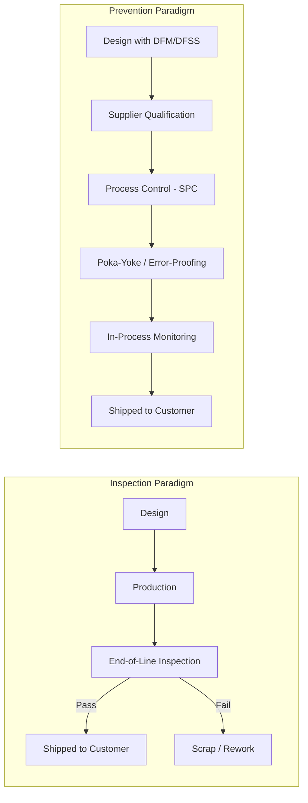

## The Shift from Inspection to Prevention in Quality Management

### Overview

Quality management evolved through a fundamental philosophical realignment: from detecting defects after production (inspection) to eliminating the causes of defects before they occur (prevention). This shift underlies the economic logic of the Cost of Quality (CoQ) framework and the 1-10-100 Rule, both of which quantify why prevention is economically superior to detection.

### Historical Trajectory

**Key Points**

- **Pre-1920s (Craft Era):** Quality was ensured through individual craftsmanship and skill; no formal system existed. Defects were caught by the maker or the end customer.
- **1920s–1940s (Inspection Era):** Mass production (Taylorism, Fordism) separated production from quality checking. Dedicated inspectors sorted "good" from "bad" units at the end of the line. Walter Shewhart introduced statistical control charts (1924, Bell Labs) as an early bridge toward process-based thinking.
- **1950s–1970s (Statistical Quality Control / Prevention Era):** W. Edwards Deming and Joseph Juran, working in postwar Japan, promoted statistical process control (SPC) and organization-wide quality responsibility. The focus moved upstream: control the process, not just the output.
- **1980s–Present (Total Quality Management / Continuous Improvement):** Philip Crosby's "Zero Defects" and "Quality is Free" concepts, ISO 9000 standards, Six Sigma, and Lean methodologies institutionalized prevention as a system-wide, cross-functional discipline embedded in design and process engineering.

### Inspection vs. Prevention: Conceptual Comparison

| Dimension | Inspection-Based Approach | Prevention-Based Approach |
| --- | --- | --- |
| Timing | After production (end-of-line) | Before/during production (design & process) |
| Focus | Detecting defective units | Eliminating root causes of defects |
| Responsibility | Dedicated QC/inspection department | Every employee, especially process owners |
| Cost driver | Appraisal + failure costs | Prevention costs (training, process design, poka-yoke) |
| Data use | Pass/fail sorting | Statistical process control, trend analysis |
| Customer impact | Some defects still escape | Defects designed out before reaching customer |
| Philosophy | "Inspect quality in" | "Build quality in" |

### Why Inspection Alone Fails

- **Inspection is not 100% reliable.** Human and even automated inspection have inherent detection error rates; some defective units always pass, and some good units are incorrectly rejected (false positives/negatives).
- **Inspection adds cost without adding value.** It does not improve the product — it only sorts what has already been (potentially incorrectly) made, meaning defective work has already consumed material, labor, and machine time.
- **Inspection is reactive.** It cannot correct a flawed process; the same defect will recur at the same rate until the root cause is addressed.
- **Inspection delays feedback.** The longer the interval between defect creation and defect detection, the harder and more expensive root-cause analysis becomes.

### Theoretical Foundations Driving the Shift

- **Deming's 14 Points** (notably Point 3: "Cease dependence on inspection to achieve quality" and Point 5: "Improve constantly and forever the system of production and service") explicitly reject end-of-line inspection as a quality strategy.
- **Juran's Trilogy** (Quality Planning, Quality Control, Quality Improvement) frames prevention as embedded in the *planning* phase, before control or inspection ever occurs.
- **Crosby's Absolutes of Quality Management** assert that quality means "conformance to requirements," achieved through prevention, with the performance standard being "Zero Defects" — not an "acceptable quality level" derived from sampling inspection.

### Connection to the Cost of Quality (CoQ) Framework

The CoQ model categorizes quality-related costs into four buckets, which map directly onto this historical shift:

1. **Prevention Costs** — training, process design, quality planning, supplier qualification (proactive, upstream)
2. **Appraisal Costs** — inspection, testing, auditing (the "detection" layer)
3. **Internal Failure Costs** — scrap, rework, re-testing (defects caught before shipment)
4. **Internal Failure Costs vs Prevention Costs** — spending more on category 1 systematically reduces spending in categories 2–4

**Key Points**

- Organizations anchored in the Inspection Era over-invest in Appraisal Costs relative to Prevention Costs.
- As an organization matures toward Prevention, total CoQ typically declines even though Prevention spending rises, because failure costs fall by a larger margin.

$$CoQ_{total} = C_{prevention} + C_{appraisal} + C_{internal\ failure} + C_{external\ failure}$$

### Connection to the 1-10-100 Rule

The 1-10-100 Rule quantifies the economic penalty of delaying defect detection, directly reinforcing why prevention is prioritized over inspection:

- **$1** — cost to prevent a defect at the design/planning stage
- **$10** — cost to correct the same defect during production (appraisal/internal failure stage)
- **$100** — cost to correct the same defect after it reaches the customer (external failure stage)

This exponential cost escalation is the quantitative justification for the philosophical shift: every stage a defect travels through un-caught multiplies the eventual cost of resolution.

(svg_diagram)

<svg xmlns="http://www.w3.org/2000/svg" viewBox="0 0 720 320">
<text x="360" y="30" font-size="18" font-weight="bold" text-anchor="middle" fill="#1a1a1a">Cost Escalation: Inspection vs Prevention Timing (svg_diagram)</text>
<line x1="60" y1="270" x2="680" y2="270" stroke="#333" stroke-width="2" />
<line x1="60" y1="270" x2="60" y2="60" stroke="#333" stroke-width="2" />

<text x="360" y="305" font-size="13" text-anchor="middle" fill="#333">Stage Defect is Caught</text>

<text x="25" y="165" font-size="13" text-anchor="middle" fill="#333" transform="rotate(-90 25,165)">Relative Cost</text>

<rect x="130" y="255" width="90" height="15" fill="#4caf50" />
<text x="175" y="290" font-size="12" text-anchor="middle" fill="#1a1a1a">Design Stage</text>
<text x="175" y="248" font-size="14" font-weight="bold" text-anchor="middle" fill="#2e7d32">$1</text>
<rect x="330" y="200" width="90" height="70" fill="#ff9800" />
<text x="375" y="290" font-size="12" text-anchor="middle" fill="#1a1a1a">Production / Inspection</text>
<text x="375" y="193" font-size="14" font-weight="bold" text-anchor="middle" fill="#e65100">$10</text>
<rect x="530" y="70" width="90" height="200" fill="#f44336" />
<text x="575" y="290" font-size="12" text-anchor="middle" fill="#1a1a1a">Customer / Field</text>
<text x="575" y="63" font-size="14" font-weight="bold" text-anchor="middle" fill="#b71c1c">$100</text>

<text x="175" y="235" font-size="11" text-anchor="middle" fill="`#2e7d32`">Prevention</text>

<text x="375" y="170" font-size="11" text-anchor="middle" fill="`#e65100`">Appraisal</text>

<text x="575" y="40" font-size="11" text-anchor="middle" fill="`#b71c1c`">External Failure</text>

</svg>

### Process Flow: Inspection Paradigm vs Prevention Paradigm

### Practical Mechanisms of the Shift

- **Statistical Process Control (SPC):** Control charts monitor process variation in real time, flagging drift before out-of-spec units are produced.
- **Poka-Yoke (Error-Proofing):** Physical or procedural design changes that make defects physically impossible or immediately self-evident (e.g., asymmetric connectors that cannot be inserted incorrectly).
- **Design for Manufacturability/Six Sigma (DFM/DFSS):** Quality characteristics are engineered into the product specification itself, before tooling or production begins.
- **Supplier Quality Management:** Qualifying and auditing suppliers upstream prevents defective inputs from ever entering the process.
- **Root Cause Analysis (RCA) / 5 Whys / Fishbone Diagrams:** Used proactively during process design, not merely reactively after failure.

**Example**

A PCB assembly line historically relied on final visual inspection, catching ~85% of solder defects (with 15% escaping to customers — an appraisal-stage cost of correcting each defect estimated at $10). After introducing automated optical inspection (AOI) *between* process steps and redesigning the reflow oven's thermal profile (a prevention-stage intervention costing roughly $1 per unit in process engineering time), defect creation itself dropped by 70%, and the remaining defects were caught before final assembly rather than after shipment — avoiding $100-per-unit field failure costs.

### Common Misconceptions

- **[Inference]** Prevention does not mean eliminating inspection entirely; appraisal activities (in-process monitoring, final audits) remain part of a mature quality system, but their role shifts from being the *primary* quality mechanism to a *verification* mechanism.
- Zero Defects is a performance standard and management philosophy, not a literal claim that defects can be mathematically reduced to exactly zero in all processes. [Inference]

### Related Topics

- Cost of Quality (CoQ) Categories: Prevention, Appraisal, Internal Failure, External Failure
- The 1-10-100 Rule: Quantitative Models and Industry Benchmarks
- Statistical Process Control (SPC) and Control Chart Fundamentals
- Poka-Yoke and Error-Proofing Techniques
- Deming's 14 Points for Management
- Juran's Quality Trilogy
- Crosby's Zero Defects Philosophy
- Design for Six Sigma (DFSS)
- Total Quality Management (TQM) Origins