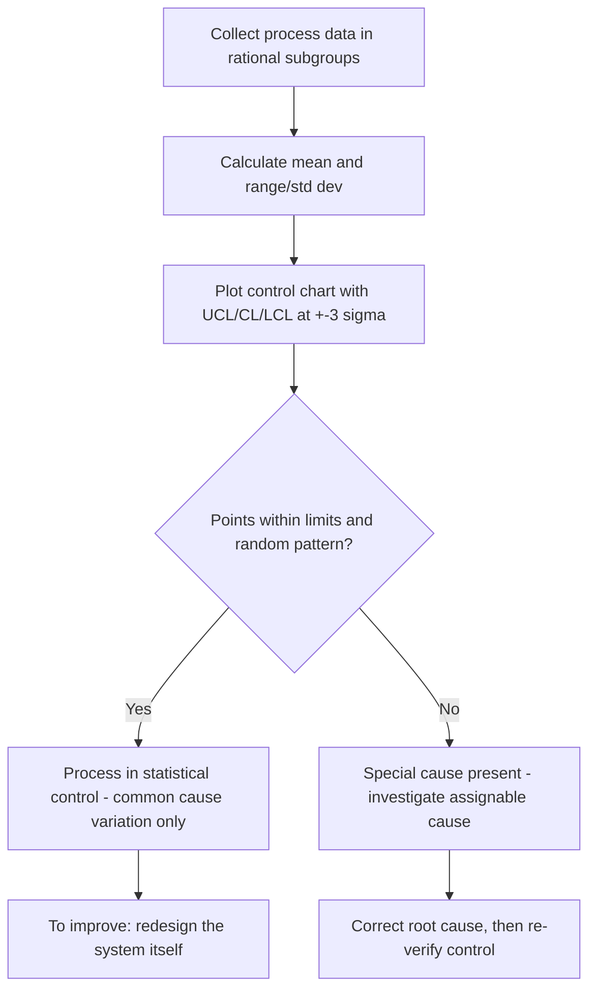

## Walter Shewhart and Statistical Quality Control

### Overview

Walter A. Shewhart (1891–1967), a physicist and engineer at Bell Telephone Laboratories, is widely credited as the founder of statistical quality control (SQC). His central contribution was applying probability theory to manufacturing process monitoring, distinguishing between normal process variation and abnormal variation signaling a problem requiring intervention. This distinction underpins the modern prevention-oriented quality paradigm and the economic logic of the Cost of Quality (CoQ) and 1-10-100 Rule frameworks.

### Historical Context

- **1924:** While working at Bell Labs' Hawthorne Works (then part of Western Electric), Shewhart introduced the first control chart in an internal memorandum, addressing inconsistent quality in telephone equipment manufacturing.
- **1931:** Published *Economic Control of Quality of Manufactured Product*, the foundational text of statistical process control (SPC), formalizing control charts and the concept of "assignable causes" vs. "chance causes" of variation.
- **1939:** Published *Statistical Method from the Viewpoint of Quality Control*, extending the philosophical and epistemological basis of SQC.
- Shewhart mentored W. Edwards Deming at Bell Labs; Deming later carried Shewhart's methods to postwar Japan, embedding them into the broader Total Quality Management movement.

### Core Conceptual Contribution: Two Types of Variation

**Key Points**

- **Common Cause (Chance Cause) Variation:** Inherent, random variation built into a process by its own design — the natural "noise" of any system. A process exhibiting only common cause variation is said to be in a **state of statistical control**.
- **Special Cause (Assignable Cause) Variation:** Variation arising from specific, identifiable, external events — a tool wearing out, an operator error, a raw material batch change. This variation is not part of the process's natural behavior and signals that investigation and correction are needed.

This distinction is the theoretical basis for prevention: a process in statistical control cannot be improved by chasing individual data points (which produces "tampering" and increases variation); it can only be improved by fundamentally redesigning the system. A process exhibiting special cause variation, conversely, requires root-cause investigation of the specific disturbance.

### The Control Chart

The control chart is Shewhart's primary tool: a time-ordered plot of a process characteristic (e.g., diameter, weight, defect rate) with three reference lines:

$$UCL = \bar{x} + 3\sigma$$

$$CL = \bar{x}$$

$$LCL = \bar{x} - 3\sigma$$

Where $\bar{x}$ is the process mean, $\sigma$ is the process standard deviation, $UCL$ is the upper control limit, $LCL$ is the lower control limit, and $CL$ is the centerline.

**Key Points**

- The ±3σ limits are not specification limits (customer requirements); they are statistically derived from the process's own natural variability.
- A point falling outside the control limits, or a non-random pattern within them (e.g., a run of points trending upward), indicates a special cause is present.
- Common chart types: $\bar{x}$-R charts (subgroup mean and range, for variable data), p-charts (proportion defective, for attribute data), c-charts (count of defects), and np-charts (number defective).

(svg_diagram)

<svg xmlns="http://www.w3.org/2000/svg" viewBox="0 0 720 340">
<text x="360" y="28" font-size="18" font-weight="bold" text-anchor="middle" fill="#1a1a1a">Shewhart Control Chart Structure (svg_diagram)</text>
<line x1="70" y1="290" x2="670" y2="290" stroke="#333" stroke-width="2" />
<line x1="70" y1="290" x2="70" y2="60" stroke="#333" stroke-width="2" />
<text x="370" y="320" font-size="13" text-anchor="middle" fill="#333">Sample / Time Order</text>
<text x="30" y="175" font-size="13" text-anchor="middle" fill="#333" transform="rotate(-90 30,175)">Measured Value</text>
<line x1="70" y1="100" x2="670" y2="100" stroke="#f44336" stroke-width="2" stroke-dasharray="6,4" />
<text x="640" y="93" font-size="12" fill="#f44336">UCL (+3σ)</text>
<line x1="70" y1="180" x2="670" y2="180" stroke="#2196f3" stroke-width="2" />
<text x="640" y="173" font-size="12" fill="#2196f3">CL (x̄)</text>
<line x1="70" y1="260" x2="670" y2="260" stroke="#f44336" stroke-width="2" stroke-dasharray="6,4" />
<text x="640" y="277" font-size="12" fill="#f44336">LCL (-3σ)</text>

<polyline points="100,190 140,175 180,200 220,165 260,185 300,190 340,150 380,178 420,195 460,88 500,182 540,175 580,200 620,170" fill="none" stroke="#333" stroke-width="2" />

<circle cx="100" cy="190" r="4" fill="#4caf50" />
<circle cx="140" cy="175" r="4" fill="#4caf50" />
<circle cx="180" cy="200" r="4" fill="#4caf50" />
<circle cx="220" cy="165" r="4" fill="#4caf50" />
<circle cx="260" cy="185" r="4" fill="#4caf50" />
<circle cx="300" cy="190" r="4" fill="#4caf50" />
<circle cx="340" cy="150" r="4" fill="#4caf50" />
<circle cx="380" cy="178" r="4" fill="#4caf50" />
<circle cx="420" cy="195" r="4" fill="#4caf50" />
<circle cx="460" cy="88" r="6" fill="#f44336" />
<text x="460" y="75" font-size="11" text-anchor="middle" fill="#f44336">special cause</text>
<circle cx="500" cy="182" r="4" fill="#4caf50" />
<circle cx="540" cy="175" r="4" fill="#4caf50" />
<circle cx="580" cy="200" r="4" fill="#4caf50" />
<circle cx="620" cy="170" r="4" fill="#4caf50" />
</svg>

### Process Flow: Applying Shewhart's Method

### The Economic Dimension: Shewhart's Link to CoQ

Shewhart's 1931 book was explicitly titled *Economic Control of Quality*, framing statistical control as a cost-minimization problem: over-controlling a stable process (reacting to normal variation as if it were a special cause) wastes resources and can *increase* variation (a phenomenon Deming later called "tampering"), while under-controlling (ignoring true special causes) allows defects to propagate downstream.

**Key Points**

- Shewhart's framework is the statistical machinery behind the "Prevention" and "Appraisal" categories of CoQ: control charts function as a low-cost, continuous appraisal mechanism that *feeds back* into process correction (prevention), rather than merely sorting finished output.
- By catching special causes during production, control charts intercept defects at the $1–$10 stage of the 1-10-100 Rule, before they reach the customer ($100 stage).

### Distinction from Inspection-Based Acceptance Sampling

| Aspect | Shewhart's SQC | Traditional Acceptance Sampling |
| --- | --- | --- |
| Timing | Continuous, during production | After a batch is completed |
| Purpose | Detect process drift in real time | Decide accept/reject a finished lot |
| Data used | Ongoing subgroup statistics | Sample from finished lot |
| Outcome | Process correction | Lot disposition (accept/reject/sort) |
| Philosophical stance | Prevent defects from being produced | Sort defective from non-defective output |

### Legacy and Influence

- **W. Edwards Deming** directly extended Shewhart's work into the **Plan-Do-Study-Act (PDSA) cycle**, originally called the "Shewhart Cycle" in Deming's own writings, and carried SQC to Japanese industry in the 1950s.
- **Joseph Juran** incorporated Shewhart's statistical rigor into the broader Quality Trilogy (Planning, Control, Improvement).
- Shewhart's distinction between common and special cause variation remains the theoretical foundation of modern **Statistical Process Control (SPC)**, **Six Sigma's** DMAIC methodology, and control-chart-based **Lean manufacturing** practices.

### Common Misconceptions

- **[Inference]** Control limits (±3σ) are sometimes mistaken for specification limits or customer tolerances; they are statistically derived from the process's own behavior and are conceptually independent of customer requirements.
- A process "in control" is not necessarily a process that meets customer specifications — it means the process is *predictable and stable*, which is a prerequisite for capability analysis, not proof of capability itself. [Inference]

### Related Topics

- W. Edwards Deming and the PDSA Cycle
- Statistical Process Control (SPC): Control Chart Types and Selection
- Common Cause vs. Special Cause Variation: Root Cause Analysis Techniques
- Process Capability Analysis (Cp, Cpk) vs. Statistical Control
- Rational Subgrouping in Control Chart Design
- Six Sigma DMAIC Methodology
- The 1-10-100 Rule: Quantitative Models and Industry Benchmarks