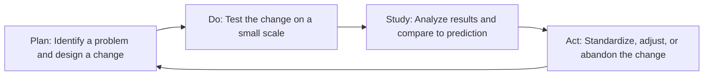

## W. Edwards Deming's Quality Philosophy and the 14 Points

### Overview

William Edwards Deming (1900–1993), a statistician mentored by Walter Shewhart at Bell Labs, extended statistical quality control into a comprehensive management philosophy. Deming argued that quality is fundamentally a *management* responsibility, not a worker or inspection responsibility — roughly 94% of quality problems, in his estimation, stem from the system itself, which only management controls. His 14 Points, System of Profound Knowledge, and PDSA Cycle form the philosophical backbone of Total Quality Management (TQM) and directly justify the economic logic of prevention-based Cost of Quality (CoQ) reduction.

### Historical Context

- **1927–1930s:** Worked with Shewhart at Bell Labs, absorbing statistical process control concepts.
- **1950:** Invited to Japan by the Union of Japanese Scientists and Engineers (JUSE) to teach statistical methods to industrial leaders, in the context of postwar industrial reconstruction.
- **1950s–1960s:** Japanese industry's adoption of Deming's methods is widely credited with contributing to Japan's rise in manufacturing quality (automobiles, electronics), a period later studied intensively by Western industry.
- **1980:** NBC documentary *"If Japan Can... Why Can't We?"* brought Deming's ideas to mainstream American management attention.
- **1982:** Published *Out of the Crisis*, containing the formal statement of the 14 Points.
- **1993:** Published *The New Economics*, introducing the System of Profound Knowledge.
- The **Deming Prize**, established by JUSE in 1951, remains one of the highest honors in quality management, awarded annually in Japan.

### The 14 Points for Management

**Key Points**

1. **Create constancy of purpose** toward improvement of product and service, with the aim of becoming competitive, staying in business, and providing jobs.
2. **Adopt the new philosophy.** Management must awaken to the challenge, learn responsibilities, and lead change rather than tolerate defects as normal.
3. **Cease dependence on mass inspection.** Build quality into the product in the first place rather than relying on inspection to catch defects.
4. **End the practice of awarding business on price alone.** Instead, minimize total cost by building long-term relationships of loyalty and trust with a single supplier for any one item.
5. **Improve constantly and forever** the system of production and service, to improve quality and productivity and thus constantly decrease costs.
6. **Institute training on the job** for all employees, including management.
7. **Institute leadership.** The aim of supervision should be to help people, machines, and gadgets do a better job; supervision of management is in need of overhaul.
8. **Drive out fear**, so that everyone may work effectively for the company.
9. **Break down barriers between departments.** People in research, design, sales, and production must work as a team.
10. **Eliminate slogans, exhortations, and targets** for the workforce that demand zero defects or new productivity levels without providing methods.
11. **Eliminate numerical quotas** for the workforce and numerical goals for management; substitute leadership.
12. **Remove barriers that rob people of pride of workmanship** — including abolishing the annual merit rating and management by objective.
13. **Institute a vigorous program of education and self-improvement** for everyone.
14. **Put everybody in the company to work** to accomplish the transformation; it is everyone's job.

### The System of Profound Knowledge

Deming's later, deeper theoretical framework, consisting of four interrelated components:

| Component | Core Idea |
| --- | --- |
| **Appreciation for a System** | An organization is a network of interdependent components working toward a common aim; optimizing one part in isolation can harm the whole. |
| **Knowledge of Variation** | Directly derived from Shewhart: distinguishing common cause from special cause variation; understanding that all processes exhibit variation. |
| **Theory of Knowledge** | Management decisions require theory, not just data; prediction requires a rational basis, not mere extrapolation of past data. |
| **Psychology** | Understanding human motivation — Deming argued that intrinsic motivation (pride, cooperation) is undermined by extrinsic control systems like merit pay and quotas. |

### The PDSA Cycle (Plan-Do-Study-Act)

Deming's operationalization of continuous improvement, originally termed the "Shewhart Cycle" in his own writings before evolving into PDSA:

**Key Points**

- PDSA is inherently iterative — improvement is treated as a continuous cycle, not a one-time project.
- The "Study" phase (Deming later changed "Check" to "Study" to emphasize learning, not mere verification) is central: prediction vs. actual outcome comparison builds organizational theory.

### The 7 Deadly Diseases of Management

Deming also identified organizational practices that obstruct transformation:

1. Lack of constancy of purpose
2. Emphasis on short-term profits
3. Evaluation by performance review, merit rating, or annual review of individuals
4. Mobility of management (job-hopping)
5. Running a company on visible figures alone
6. Excessive medical costs
7. Excessive costs of liability, driven up by lawyers working on contingency fees

### Deming's Red Bead Experiment

A widely cited pedagogical demonstration: workers draw beads (mostly white, some red) from a mixed container using a fixed-hole paddle, simulating "production." Despite worker effort, the proportion of red beads (defects) is entirely determined by the composition of the system (the ratio of beads in the container), not individual worker performance.

**Example**

Even the most motivated "worker" cannot avoid drawing red beads if the paddle and bead mixture are fixed — illustrating Deming's core claim that most variation in output is attributable to the system design, which only management can change, not to individual worker effort. Punishing or rewarding workers based on the bead count they happen to draw is, in Deming's framework, a management error rooted in misunderstanding variation.

### Connection to Cost of Quality (CoQ) and the 1-10-100 Rule

**Key Points**

- Point 3 ("Cease dependence on mass inspection") directly rejects the Appraisal-heavy, Inspection-Era model, arguing resources should shift toward Prevention.
- Point 5 ("Improve constantly and forever") institutionalizes continuous reduction of Internal and External Failure costs via ongoing process refinement (PDSA).
- Point 4 (ending price-only supplier selection) reduces failure costs arising from poor-quality inputs, which — per the 1-10-100 Rule — are dramatically cheaper to prevent via supplier qualification than to correct after receipt or after reaching the customer.
- Deming explicitly argued that quality improvement *reduces* total cost — the "Deming Chain Reaction": improve quality → costs decrease (less rework, fewer mistakes, fewer delays) → productivity improves → capture market with better quality/lower price → stay in business → provide jobs.

(svg_diagram)

<svg xmlns="http://www.w3.org/2000/svg" viewBox="0 0 720 260">
<text x="360" y="26" font-size="18" font-weight="bold" text-anchor="middle" fill="#1a1a1a">Deming Chain Reaction (svg_diagram)</text>
<rect x="20" y="100" width="110" height="60" rx="6" fill="#e3f2fd" stroke="#1976d2" stroke-width="1.5" />
<text x="75" y="125" font-size="11" text-anchor="middle" fill="#1a1a1a">Improve</text>
<text x="75" y="140" font-size="11" text-anchor="middle" fill="#1a1a1a">Quality</text>
<path d="M130 130 L165 130" stroke="#333" stroke-width="2" marker-end="url(#arrow)" />
<rect x="170" y="100" width="110" height="60" rx="6" fill="#e8f5e9" stroke="#388e3c" stroke-width="1.5" />
<text x="225" y="120" font-size="11" text-anchor="middle" fill="#1a1a1a">Costs Decrease</text>
<text x="225" y="135" font-size="10" text-anchor="middle" fill="#1a1a1a">(less rework,</text>
<text x="225" y="148" font-size="10" text-anchor="middle" fill="#1a1a1a">fewer delays)</text>
<path d="M280 130 L315 130" stroke="#333" stroke-width="2" marker-end="url(#arrow)" />
<rect x="320" y="100" width="110" height="60" rx="6" fill="#fff3e0" stroke="#f57c00" stroke-width="1.5" />
<text x="375" y="130" font-size="11" text-anchor="middle" fill="#1a1a1a">Productivity</text>
<text x="375" y="145" font-size="11" text-anchor="middle" fill="#1a1a1a">Improves</text>
<path d="M430 130 L465 130" stroke="#333" stroke-width="2" marker-end="url(#arrow)" />
<rect x="470" y="100" width="110" height="60" rx="6" fill="#f3e5f5" stroke="#7b1fa2" stroke-width="1.5" />
<text x="525" y="120" font-size="10" text-anchor="middle" fill="#1a1a1a">Capture Market</text>
<text x="525" y="135" font-size="10" text-anchor="middle" fill="#1a1a1a">Better Quality</text>
<text x="525" y="148" font-size="10" text-anchor="middle" fill="#1a1a1a">Lower Price</text>
<path d="M580 130 L615 130" stroke="#333" stroke-width="2" marker-end="url(#arrow)" />
<rect x="620" y="100" width="90" height="60" rx="6" fill="#ffebee" stroke="#c62828" stroke-width="1.5" />
<text x="665" y="125" font-size="10" text-anchor="middle" fill="#1a1a1a">Stay in</text>
<text x="665" y="140" font-size="10" text-anchor="middle" fill="#1a1a1a">Business</text>
</svg>

### Deming vs. Juran vs. Crosby: Comparative Positioning

| Dimension | Deming | Juran | Crosby |
| --- | --- | --- | --- |
| Primary emphasis | Statistical thinking, systemic/psychological transformation | Managerial planning trilogy | Zero Defects, conformance to requirements |
| Responsibility locus | Management (system owns ~94% of problems) | Management, with structured project-based improvement | Management commitment + prevention |
| Signature framework | 14 Points, PDSA, System of Profound Knowledge | Quality Trilogy (Plan/Control/Improve) | 14 Steps, Quality Vaccine, "Quality is Free" |
| View of quotas/targets | Rejects numerical quotas as counterproductive | Uses structured, project-based goal setting | Uses Zero Defects as an absolute standard |

### Common Misconceptions

- **[Inference]** Deming's "94% system, 6% special cause" figure is often cited as a precise empirical statistic; it functioned primarily as a heuristic to redirect management attention toward systemic causes rather than as a rigorously derived universal constant.
- Deming did not oppose measurement or data — he opposed the *misuse* of numerical targets divorced from methods and understanding of variation (Point 10, Point 11). [Inference]

### Related Topics

- Walter Shewhart and Statistical Quality Control
- Joseph Juran and the Quality Trilogy
- Philip Crosby and Zero Defects Philosophy
- The System of Profound Knowledge in Depth
- PDSA vs. PDCA: Origins and Distinctions
- Total Quality Management (TQM) Institutionalization
- The Deming Prize and Global Quality Award Systems