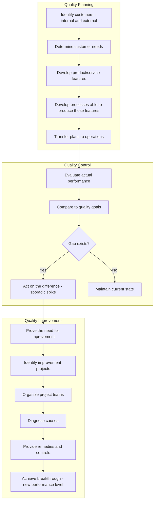

## Joseph Juran and the Quality Trilogy

### Overview

Joseph M. Juran (1904–2008), a Romanian-American engineer and management consultant, was a foundational figure in quality management alongside Shewhart and Deming. His central contribution, the **Quality Trilogy**, reframed quality management as three interrelated managerial processes — Quality Planning, Quality Control, and Quality Improvement — borrowing structurally from financial management's own trilogy of budgeting, cost control, and cost reduction. Juran also introduced the **Pareto Principle** to quality management and the concept of the **"cost of poor quality"** as a lever for executive attention, both of which are direct antecedents of the modern Cost of Quality (CoQ) and 1-10-100 Rule frameworks.

### Historical Context

- **1924:** Joined Western Electric's Hawthorne Works (the same organization where Shewhart was developing control charts), working initially as an engineer.
- **1951:** Published the first edition of the *Quality Control Handbook*, which became a standard reference and established Juran as a leading authority.
- **1954:** Invited to Japan by JUSE (as Deming had been), where he taught quality management to Japanese executives, emphasizing the *managerial* — not purely statistical — dimensions of quality.
- **1979:** Founded the Juran Institute to promote training and consulting based on his methods.
- **1986:** Formally articulated the **Quality Trilogy** in a paper presented to the American Society for Quality (ASQ), synthesizing decades of prior work into a unified framework.
- Juran's approach is often contrasted with Deming's more statistical/philosophical emphasis: Juran focused on quality as a *managerial and organizational* discipline, requiring specific, project-based execution.

### The Quality Trilogy: Three Managerial Processes

#### 1. Quality Planning

The process of designing a product, service, or process capable of meeting customer needs from the outset — a distinctly upstream, prevention-oriented activity.

**Key Points**

- **Identify customers:** Both external (end users) and internal (downstream departments/processes).
- **Determine customer needs:** Translate stated and unstated needs into technical language.
- **Develop product features:** Design features that respond to customer needs and meet organizational/competitive needs.
- **Develop process features:** Design the production process itself to be capable of producing those features under operating conditions.
- **Establish process controls and transfer to operations:** Hand off the completed plan, with controls built in, to the operational teams who will run it.

#### 2. Quality Control

The ongoing, operational process of maintaining a stable process at its planned performance level — analogous in structure to Shewhart's statistical control concept, but framed managerially.

**Key Points**

- Involves evaluating actual performance against quality goals and acting on the difference.
- Addresses **sporadic spikes** — sudden, identifiable deviations from the norm (comparable to Shewhart's "special cause" variation).
- Quality Control is fundamentally a *feedback loop*: measure, compare, act.

#### 3. Quality Improvement

The deliberate, project-based effort to elevate performance beyond the current planned level — addressing **chronic waste**, the persistent, systemic level of poor quality built into the process by its own design (comparable to Shewhart's "common cause" variation, but treated as an opportunity for breakthrough rather than mere acceptance).

**Key Points**

- Juran argued chronic waste is often invisible to management because it has become "normal" — part of the accepted cost structure — and therefore requires deliberate diagnostic projects to surface and address.
- Organized around discrete, resourced **improvement projects**, each following a structured sequence: prove the need, identify projects, diagnose causes, establish remedies, hold the gains.
- This is the most explicitly *breakthrough-oriented* of the three processes — it does not merely maintain the status quo (Control) or design a new state (Planning), but actively raises the performance baseline.

### Sporadic Spike vs. Chronic Waste

| Dimension | Sporadic Spike | Chronic Waste |
| --- | --- | --- |
| Nature | Sudden, unexpected deviation | Persistent, built into the process |
| Visibility | Highly visible, triggers alarm | Often invisible/accepted as "normal" |
| Analogy (Shewhart) | Special cause variation | Common cause variation |
| Response | Quality Control (restore to standard) | Quality Improvement (raise the standard) |
| Owner | Operations/control systems | Improvement project teams |

### The Pareto Principle in Quality Management

Juran adapted economist Vilfredo Pareto's observation on wealth distribution into what he termed the **"vital few and trivial many"** (later softened to "useful many"), applying it to quality defects.

**Key Points**

- Empirically, a small proportion of defect *causes* (often approximated as ~20%) account for the large majority of defect *occurrences or costs* (often approximated as ~80%).
- This principle directs limited improvement resources toward the highest-leverage causes rather than spreading effort evenly across all identified problems.
- Foundational to prioritization tools such as **Pareto charts**, widely used in Six Sigma's DMAIC "Analyze" phase.

**Example**

A manufacturer identifies 15 distinct defect types across a product line. A Pareto analysis of defect frequency reveals that just 3 of the 15 defect types account for roughly 78% of total defects and 82% of associated failure costs — directing the improvement team to focus root-cause diagnosis on those three "vital few" categories rather than distributing effort evenly across all fifteen.

### Juran's "Cost of Poor Quality" and Link to CoQ / 1-10-100

Juran is widely credited with popularizing the economic argument for quality among senior executives by translating quality problems into financial terms — the direct conceptual ancestor of the formal Cost of Quality (CoQ) taxonomy (Prevention, Appraisal, Internal Failure, External Failure).

**Key Points**

- Juran argued that the **"cost of poor quality" (COPQ)** — scrap, rework, warranty claims, lost customers — is often a hidden, unmeasured, and substantial fraction of a company's operating costs ("gold in the mine").
- By quantifying COPQ in financial terms rather than technical/statistical terms, Juran made the case for quality investment legible to executives who controlled budgets — a critical step in shifting quality from an engineering afterthought to a boardroom priority.
- This financial framing underlies the logic of the **1-10-100 Rule**: Quality Planning (prevention) intercepts defects at the $1 stage; Quality Control (appraisal/correction) catches them at the $10 stage; failure to plan or control adequately allows chronic and sporadic defects to reach the customer at the $100 stage.

$$COPQ_{total} = C_{internal\ failure} + C_{external\ failure} + C_{appraisal}$$

(svg_diagram)

<svg xmlns="http://www.w3.org/2000/svg" viewBox="0 0 700 320">
<text x="350" y="26" font-size="18" font-weight="bold" text-anchor="middle" fill="#1a1a1a">Pareto Chart: Defect Causes (svg_diagram)</text>
<line x1="60" y1="260" x2="620" y2="260" stroke="#333" stroke-width="2" />
<line x1="60" y1="260" x2="60" y2="50" stroke="#333" stroke-width="2" />
<line x1="620" y1="260" x2="620" y2="50" stroke="#333" stroke-width="1" />

<text x="330" y="295" font-size="12" text-anchor="middle" fill="#333">Defect Category</text>

<text x="25" y="155" font-size="12" text-anchor="middle" fill="#333" transform="rotate(-90 25,155)">Frequency</text>

<text x="655" y="155" font-size="12" text-anchor="middle" fill="#333" transform="rotate(90 655,155)">Cumulative %</text>

<rect x="80" y="80" width="55" height="180" fill="#1976d2" />
<text x="107" y="272" font-size="10" text-anchor="middle">Cause A</text>
<rect x="150" y="120" width="55" height="140" fill="#1976d2" />
<text x="177" y="272" font-size="10" text-anchor="middle">Cause B</text>
<rect x="220" y="160" width="55" height="100" fill="#1976d2" />
<text x="247" y="272" font-size="10" text-anchor="middle">Cause C</text>
<rect x="290" y="210" width="55" height="50" fill="#90caf9" />
<text x="317" y="272" font-size="10" text-anchor="middle">Cause D</text>
<rect x="360" y="225" width="55" height="35" fill="#90caf9" />
<text x="387" y="272" font-size="10" text-anchor="middle">Cause E</text>
<rect x="430" y="240" width="55" height="20" fill="#90caf9" />
<text x="457" y="272" font-size="10" text-anchor="middle">Other</text>
<polyline points="107,80 177,58 247,42 317,35 387,32 457,30" fill="none" stroke="#f57c00" stroke-width="2" />
<circle cx="107" cy="80" r="3" fill="#f57c00" />
<circle cx="177" cy="58" r="3" fill="#f57c00" />
<circle cx="247" cy="42" r="3" fill="#f57c00" />
<circle cx="317" cy="35" r="3" fill="#f57c00" />
<circle cx="387" cy="32" r="3" fill="#f57c00" />
<circle cx="457" cy="30" r="3" fill="#f57c00" />
<text x="247" y="25" font-size="10" fill="#f57c00" text-anchor="middle">cumulative % line</text>
<line x1="277" y1="260" x2="277" y2="50" stroke="#c62828" stroke-width="1.5" stroke-dasharray="4,3" />
<text x="277" y="43" font-size="10" fill="#c62828" text-anchor="middle">~80% cumulative</text>
</svg>

### Juran vs. Deming: Comparative Positioning

| Dimension | Juran | Deming |
| --- | --- | --- |
| Core framework | Quality Trilogy (Plan/Control/Improve) | 14 Points, System of Profound Knowledge |
| Orientation | Managerial, project-based, financially framed | Statistical, philosophical, systemic |
| View of quality responsibility | Cross-functional management, with structured projects | Predominantly top management (system ownership) |
| View of goals/targets | Supports structured, project-based goals | Skeptical of numerical quotas divorced from method |
| Signature analytical tool | Pareto analysis | Control charts / PDSA |

### Common Misconceptions

- **[Inference]** The "80/20" figures in the Pareto Principle are heuristic approximations, not a fixed mathematical law; actual ratios vary by dataset and are typically confirmed empirically via Pareto chart analysis rather than assumed a priori.
- Quality Control, in Juran's trilogy, is not synonymous with inspection alone — it is the broader feedback loop of evaluating performance against goals and acting on deviations, of which inspection/appraisal is only one component. [Inference]

### Related Topics

- Walter Shewhart and Statistical Quality Control
- W. Edwards Deming's Quality Philosophy and the 14 Points
- Pareto Analysis and Pareto Charts in Root Cause Prioritization
- Cost of Poor Quality (COPQ) Measurement Methodologies
- Six Sigma DMAIC and the Analyze Phase
- Structured Improvement Project Methodologies (A3, DMAIC, PDCA)