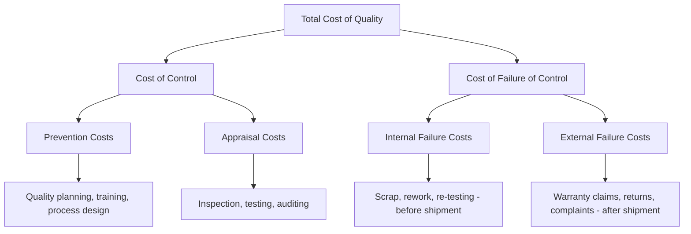

## Armand Feigenbaum and Total Quality Control

### Overview

Armand V. Feigenbaum (1920–2014) was an American quality control expert who introduced the concept of **Total Quality Control (TQC)** — the first framework to explicitly position quality as a company-wide, cross-functional management system rather than the responsibility of a single department. Feigenbaum is also directly credited with formalizing the categorical structure now known as the **Cost of Quality (CoQ)**, making his work the most immediate historical antecedent of the CoQ and 1-10-100 Rule content covered in this course.

### Historical Context

- **1944:** Joined General Electric (GE) as a quality manager while still a graduate student, eventually becoming GE's worldwide director of manufacturing and quality control.
- **1951:** Published *Quality Control: Principles, Practice, and Administration*, later retitled *Total Quality Control*, introducing the TQC concept and, critically, one of the first formal breakdowns of quality-related costs into distinct categories.
- **1956:** Published the influential *Harvard Business Review* article "Total Quality Control," which articulated the idea that quality is "everybody's job" across every function — not merely the domain of the inspection department.
- **1961:** Founded General Systems Company, a management consulting firm, and continued developing and disseminating TQC principles internationally.
- Feigenbaum's work directly influenced the Japanese quality movement (alongside Deming and Juran) and is considered foundational to the later emergence of Total Quality Management (TQM) as a broader organizational philosophy.

### Total Quality Control: Core Definition

Feigenbaum defined Total Quality Control as:

> An effective system for integrating the quality development, quality maintenance, and quality improvement efforts of the various groups in an organization so as to enable production and service at the most economical levels which allow full customer satisfaction. [Paraphrased]

**Key Points**

- Quality is **everyone's responsibility**, not solely that of a dedicated quality control department — a direct forerunner of the "everybody's job" principle later echoed in Deming's 14th Point.
- Quality must be **built into the product across its entire lifecycle** — design, procurement, production, and field service — not verified only at the end of the production line.
- Quality is explicitly framed as an **economic** consideration: the goal is customer satisfaction at the *most economical* level, not quality maximization without regard to cost.
- TQC requires **cross-functional integration**: marketing, design engineering, purchasing, manufacturing, and field service must coordinate their quality-related activities as a single system, rather than operating quality as departmental silos.

### Feigenbaum's Four Steps to Quality (Foundational Principles)

1. **Set quality standards.**
2. **Appraise conformance** to those standards.
3. **Act when standards are not met** — correct the process/root cause.
4. **Plan for improvement** in the standards themselves — continuous upgrading, not static conformance.

### Feigenbaum's Original Cost of Quality Categorization

Feigenbaum's most enduring and directly relevant contribution to this course is his original three-way (later expanded to four-way) breakdown of quality costs — the direct conceptual ancestor of the modern CoQ model used throughout this curriculum.

**Key Points**

- **Cost of Control** (Feigenbaum's original higher-order grouping): the sum of Prevention and Appraisal costs — money spent proactively to *ensure* conformance.
- **Cost of Failure of Control**: the sum of Internal and External Failure costs — money spent *because* conformance failed.
- This binary Control/Failure structure is Feigenbaum's key theoretical insight: quality cost is not a single undifferentiated number but a balance between investment in *prevention/appraisal* versus the *penalty* of failure — the same balance later quantified more sharply by the 1-10-100 Rule.
- Feigenbaum argued that increased investment in the "Cost of Control" categories (particularly Prevention) systematically and disproportionately reduces "Cost of Failure of Control," producing a net reduction in Total Cost of Quality — the same empirical claim later reflected in modern CoQ curves and the 1-10-100 Rule's exponential cost-escalation logic.

(svg_diagram)

<svg xmlns="http://www.w3.org/2000/svg" viewBox="0 0 700 300">
<text x="350" y="26" font-size="18" font-weight="bold" text-anchor="middle" fill="#1a1a1a">Feigenbaum's Cost of Quality Structure (svg_diagram)</text>
<rect x="260" y="45" width="180" height="45" rx="6" fill="#263238" />
<text x="350" y="72" font-size="13" text-anchor="middle" fill="#fff">Total Cost of Quality</text>
<path d="M320 90 L180 130" stroke="#333" stroke-width="2" />
<path d="M380 90 L520 130" stroke="#333" stroke-width="2" />
<rect x="80" y="130" width="200" height="45" rx="6" fill="#1565c0" />
<text x="180" y="158" font-size="12" text-anchor="middle" fill="#fff">Cost of Control</text>
<rect x="420" y="130" width="200" height="45" rx="6" fill="#c62828" />
<text x="520" y="158" font-size="12" text-anchor="middle" fill="#fff">Cost of Failure of Control</text>
<path d="M140 175 L100 220" stroke="#333" stroke-width="1.5" />
<path d="M220 175 L260 220" stroke="#333" stroke-width="1.5" />
<path d="M470 175 L430 220" stroke="#333" stroke-width="1.5" />
<path d="M570 175 L610 220" stroke="#333" stroke-width="1.5" />
<rect x="30" y="220" width="140" height="50" rx="5" fill="#90caf9" />
<text x="100" y="242" font-size="11" text-anchor="middle" fill="#1a1a1a">Prevention</text>
<text x="100" y="257" font-size="10" text-anchor="middle" fill="#1a1a1a">planning, training</text>
<rect x="190" y="220" width="140" height="50" rx="5" fill="#90caf9" />
<text x="260" y="242" font-size="11" text-anchor="middle" fill="#1a1a1a">Appraisal</text>
<text x="260" y="257" font-size="10" text-anchor="middle" fill="#1a1a1a">inspection, testing</text>
<rect x="360" y="220" width="140" height="50" rx="5" fill="#ef9a9a" />
<text x="430" y="242" font-size="11" text-anchor="middle" fill="#1a1a1a">Internal Failure</text>
<text x="430" y="257" font-size="10" text-anchor="middle" fill="#1a1a1a">scrap, rework</text>
<rect x="540" y="220" width="140" height="50" rx="5" fill="#ef9a9a" />
<text x="610" y="242" font-size="11" text-anchor="middle" fill="#1a1a1a">External Failure</text>
<text x="610" y="257" font-size="10" text-anchor="middle" fill="#1a1a1a">warranty, returns</text>
</svg>

### The "Hidden Plant" Concept

Feigenbaum introduced the metaphor of the **"hidden plant"** — the portion of a factory's total capacity (typically 15–40% in his estimation, industry-dependent) that exists solely to rework and correct defects rather than produce first-pass, sellable output.

**Key Points**

- The hidden plant is invisible in conventional cost accounting because rework, scrap, and re-inspection labor are typically absorbed into general manufacturing overhead rather than isolated as a distinct, trackable cost category.
- Surfacing the hidden plant's true cost — a direct precursor to modern CoQ reporting — was intended to give executives a financial reason to prioritize quality investment, similar to Juran's "gold in the mine" framing.
- **[Inference]** The specific percentage figures Feigenbaum cited for hidden-plant capacity varied by industry and publication and should be treated as illustrative benchmarks rather than universal constants.

### Connection to the 1-10-100 Rule

Feigenbaum's Control vs. Failure-of-Control dichotomy maps directly onto the escalating-cost logic later crystallized as the 1-10-100 Rule:

| 1-10-100 Stage | Feigenbaum Category | Cost Driver |
| --- | --- | --- |
| $1 (Design/Planning) | Prevention (Cost of Control) | Quality planning, process design, training |
| $10 (Production/Detection) | Appraisal (Cost of Control) + Internal Failure (Cost of Failure of Control) | Inspection, testing, scrap, rework |
| $100 (Customer/Field) | External Failure (Cost of Failure of Control) | Warranty, returns, complaint handling, reputational damage |

### Feigenbaum vs. Deming vs. Juran: Comparative Positioning

| Dimension | Feigenbaum | Deming | Juran |
| --- | --- | --- | --- |
| Signature framework | Total Quality Control (TQC); CoQ categorization | 14 Points; System of Profound Knowledge | Quality Trilogy |
| Primary emphasis | Cross-functional, company-wide system integration | Statistical/psychological/systemic transformation | Managerial planning and project execution |
| Cost framing | Explicit Cost of Control vs. Cost of Failure of Control | Deming Chain Reaction (quality → lower cost) | Cost of Poor Quality (COPQ) |
| Organizational scope | All departments (design, purchasing, manufacturing, service) | Predominantly top management systems | Cross-functional, project-based teams |

### Example: Hidden Plant Identification

**Example**

A mid-sized electronics manufacturer's standard cost accounting shows manufacturing overhead at 22% of production cost, with no separate line item for quality-related activity. A Feigenbaum-style CoQ audit reclassifies a portion of that overhead — rework stations, re-testing labor, expedited shipping to replace late/defective units — and finds that roughly 18% of total plant capacity is effectively dedicated to correcting first-pass defects rather than producing sellable output: the "hidden plant." Making this cost visible as a distinct reporting category, rather than burying it in overhead, is what allows management to justify increased Prevention investment.

### Common Misconceptions

- **[Inference]** "Total Quality Control" (Feigenbaum's term) is sometimes conflated with "Total Quality Management" (TQM); TQC specifically emphasizes system-wide *control* integration and cost accounting, while TQM (a later, broader movement incorporating Deming, Juran, Crosby, and Feigenbaum's ideas) emphasizes organizational culture and continuous improvement more broadly.
- Feigenbaum's "everyone's job" principle predates and directly parallels Deming's 14th Point, though the two were developed somewhat independently within overlapping professional circles (GE and the broader postwar American quality movement). [Inference]

### Related Topics

- Walter Shewhart and Statistical Quality Control
- W. Edwards Deming's Quality Philosophy and the 14 Points
- Joseph Juran and the Quality Trilogy
- Cost of Quality (CoQ) Categories: Prevention, Appraisal, Internal Failure, External Failure
- The Hidden Plant / Hidden Factory Concept in Cost Accounting
- Total Quality Management (TQM): Synthesis and Institutionalization
- The 1-10-100 Rule: Quantitative Models and Industry Benchmarks